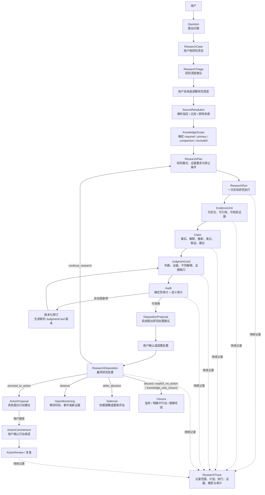
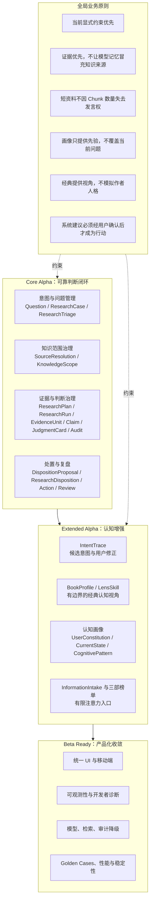

# MetaOS Alpha 业务架构

状态：阶段0业务架构冻结版修订

实现状态：本文档描述目标业务架构，不代表相关能力已经实现

权威范围：产品目标、核心主线、业务闭环、交付分层、业务原则、用户控制点与业务指标

文档边界：本文档允许列出对象名称、业务分类、业务关系、不变量和用户控制点；不维护完整字段、枚举值、必填约束、数据类型和状态转换。这些内容以 `docs/DOMAIN_MODEL.md` 为唯一权威来源。

任务标识：`A0-DOC-001-R1`

## 1. 业务定位

MetaOS Alpha 是个人意图操作系统，不是通用知识库、聊天机器人或新闻聚合器。

它服务的核心问题是：

```text
用户主动提出问题或遇到信息线索后，
MetaOS 如何帮助他约束注意力、明确知识范围、收集证据、
形成可审计判断，并转化为行动、明确不行动或知识型关闭。
```

系统不追求回答更多内容，而是让每一次研究都能回答：

- 当前问题应进入什么研究深度。
- 应该从哪些知识来源中寻找证据。
- 应该采用什么研究方式。
- 哪些证据真正支持判断。
- 哪些结论只是推断、类比、争议观点或个人反思。
- 当前结果应该继续研究、观察、延后、放弃、明确不行动、理解完成，还是进入行动建议。

## 2. 目标用户与核心场景

Alpha 阶段目标用户是拥有个人知识库、需要长期研究和决策的知识工作者。

首要用户是产品创建者本人。Alpha 的设计应优先服务真实个人知识库、真实研究问题和真实行动复盘，而不是面向泛化用户画像做抽象优化。

首要场景：

- 指定一本或多本资料研究问题。
- 在全知识库中形成有证据的判断。
- 比较不同经典或知识来源。
- 将判断转化为行动、明确不行动或知识型关闭。
- 回看过去判断为何形成、后来是否成立。

非首要场景：

- 面向所有用户的通用知识问答。
- 无限新闻流或高频资讯消费。
- 自动替用户决定长期目标。
- 用经典作者人格化地陪聊。

## 3. 产品价值与可靠判断

Core Alpha 的核心价值不是给出绝对正确答案，而是形成可靠、可审计、可修订的判断。

MetaOS 所称的可靠判断并不保证结论绝对正确，而是满足：

- 使用了明确的知识范围。
- 核心 Claim 有可定位证据。
- 原文事实、解释、推断、类比、争议观点和个人反思被区分。
- 关键反证和证据缺口没有被隐藏。
- 显式来源约束没有被违反。
- 判断形成过程可以回溯。
- 新证据出现时可以被修订。

判断复核语义：

- 原始证据变化、定位失效或关键证据删除后，历史判断不得继续显示为当前有效判断。
- 出现强反证、新版本材料或重大研究策略升级后，应保留原判断，但提示重新审计。
- 普通索引重建、Embedding 升级或 Prompt 版本变化，如果没有重新执行研究，也不应自动使历史判断失效。
- 具体状态名称、转换条件和持久化字段以 `docs/DOMAIN_MODEL.md` 为准。

## 4. Alpha 交付分层

### 4.1 Core Alpha

Core Alpha 验证唯一核心命题：

```text
用户主动提出问题后，
MetaOS 能否帮助他形成可靠、可审计、可处置的判断。
```

Core Alpha 主链冻结为：

```text
Question
-> ResearchCase
-> ResearchTriage
-> 用户采用或调整研究深度
-> SourceResolution
-> KnowledgeScope
-> ResearchPlan
-> ResearchRun
-> EvidenceUnit
-> Claim
-> JudgmentCard
-> Audit
-> DispositionProposal
-> 用户确认或调整
-> ResearchDisposition
```

`ResearchRun` 表示一次实际研究执行。`ResearchTrace` 表示该次执行发生了什么。ResearchRun 及其后续环节应持续记录到 ResearchTrace。

Core Alpha 完成后，系统应已经可以作为独立产品持续使用，不依赖 IntentTrace、认知画像、三部榜单或 LensSkill。

完成条件：

- 用户可以从工作台输入问题并形成 ResearchCase。
- 用户可以采用或调整系统给出的研究深度建议。
- 用户可以指定、比较或排除知识来源。
- 显式来源约束不会被长文档或模型记忆覆盖。
- 系统能生成可定位的 EvidenceUnit。
- 系统能输出 Claim 级 JudgmentCard。
- 核心 Claim 必须有证据状态和可审计引用。
- 审计能区分确定性问题和语义问题。
- 审计阻断后能进入版本化修订。
- 系统只能生成 DispositionProposal，最终 ResearchDisposition 必须经用户确认或调整。
- 只有用户确认后，系统建议才成为 ActionCommitment。
- 理解型问题可以 knowledge_only_closure，不强制生成行动。

### 4.2 Extended Alpha

Extended Alpha 在 Core Alpha 稳定的前提下增加认知增强能力：

- IntentTrace：显化候选意图，并允许用户修正。
- BookProfile 与 LensSkill：让经典提供有边界的认知视角。
- Cognitive Profile：记录用户长期原则、当前状态和认知模式，但只作为先验。
- ProfileUpdateCandidate：复盘后生成画像更新候选，而不是自动修改画像。
- InformationIntake：摄入有限来源。
- 三部有限榜单：通过认知部、商业部、技术部提供有限注意力入口。
- AttentionJustification：说明一条信息为什么值得或不值得占用注意力。

Extended Alpha 中任何模块失败，不得破坏 Core Alpha 闭环。

### 4.3 Beta Ready

Beta Ready 不再扩张新的核心业务概念，只处理产品化收敛：

- UI 视觉统一与移动端适配。
- 性能、成本和 Token 预算约束。
- 模型、检索、审计的失败降级。
- ResearchTrace、Token、索引和审计的开发者可观测性。
- Golden Cases 回归评测。
- 开发者层与普通用户工作台隔离。

## 5. Core Alpha 用户旅程图



这张图强调：

- ResearchCase 是用户能理解的研究项目。
- ResearchRun 是一次实际研究执行。
- ResearchTrace 是执行轨迹，不等同于 ResearchCase。
- ResearchDisposition 必须经过用户确认或调整。
- continue_research、observe、defer_decision 和 Closure 是不同处置路径。

## 6. 业务能力地图



## 7. Core Alpha 业务对象职责

本章只说明对象为什么存在、解决什么业务问题、与上下游对象的关系，以及不可违反的业务规则。完整字段、枚举、状态机和持久化约束不在本文档维护。

### 7.1 ResearchCase

ResearchCase 是用户侧长期研究聚合对象，表示用户正在研究的一个问题、主题或判断链。

它解决的问题是：同一个问题可能被连续追问、重新检索、修订判断和复盘行动。用户需要看到“这是同一个研究项目的演化”，而不是只能看到多条孤立 Trace。

业务关系：

- 一个 ResearchCase 可以包含原始问题和后续追问。
- 一个 ResearchCase 可以包含当前 KnowledgeScope。
- 一个 ResearchCase 可以包含多次 ResearchRun。
- 一个 ResearchCase 可以包含多个 JudgmentCard 版本。
- 一个 ResearchCase 可以关联当前 ResearchDisposition、Action 与 Review。

业务规则：

- ResearchCase 不是聊天会话。
- ResearchCase 不是 ResearchTrace 的别名。
- 一次失败或重新研究不应自动创建新的 ResearchCase。
- 用户可以主动拆分、合并、归档或重新打开 ResearchCase。

### 7.2 ResearchTriage

ResearchTriage 是研究深度建议机制，不是注意力守门人。

它解决的问题是：同一个问题可能只需要已有证据直接回答，也可能需要快速检索、标准研究、深度研究或先澄清歧义。

Triage 建议包括：

- 直接回答：使用当前已存在的可靠证据，不启动广泛检索。
- 快速检索：小候选池、较低预算。
- 标准研究：正常来源路由、检索、判断和审计。
- 深度研究：多轮候选、反证和更高预算。
- 需要先澄清：提醒问题存在关键歧义，用户仍可覆盖。

业务规则：

- ResearchTriage 只决定研究深度、预算和执行策略。
- ResearchTriage 不决定是否保留溯源与证据约束。
- 用户可以覆盖系统建议。
- 系统不能因为判断“价值低”而拒绝用户研究。
- 当前显式选择高于 Triage 推荐。
- 进入 Core Alpha 工作台的正式回答均应关联 ResearchCase 和 ResearchTrace。
- 直接回答不能允许模型参数记忆冒充指定来源。

### 7.3 SourceResolution

SourceResolution 解析用户在问题中指定、比较或排除的知识来源。

它解决的问题是：用户说“鬼谷子”“理想国”或“不要引用理想国”时，系统必须先解析这些锚点，再决定检索范围。

业务规则：

- 显式来源解析失败时，不得静默回退到全库检索。
- 显式来源存在歧义时，应进入澄清、默认版本策略或错误状态，而不是随机选择。
- 被排除来源不得进入候选、上下文、最终引用或隐式推断。

### 7.4 KnowledgeScope

KnowledgeScope 决定一次研究允许使用哪些知识来源。

核心业务分类：

- `required_sources`：必须进入检索候选的来源。
- `primary_sources`：决定回答主结构的来源。
- `comparison_sources`：用于比较和对照的来源。
- `excluded_sources`：禁止进入候选、上下文和最终引用的来源。

业务规则：

- 同一来源不得同时出现在 required 与 excluded。
- required 来源必须被检索，但不保证一定形成支持 Claim。
- required 来源没有证据时，应报告该来源证据不足，不能找其他来源代答。
- comparison 来源只能用于对照，不能替代 primary 或 required 来源。
- Core Alpha 默认采用 `evidence_only`，模型参数知识不能伪装成指定来源内容。

### 7.5 ResearchPlan

ResearchPlan 回答“怎样研究”，避免从范围直接跳到一次 Top-K 检索。

它解决的问题是：事实查询、概念解释、多来源比较和枚举型研究需要不同执行策略。

Core Alpha 最小研究模式包括：

- `fact_lookup`：局部事实检索。
- `source_interpretation`：原文概念和上下文解释。
- `compare_sources`：来源独立取证后按统一维度比较。
- `enumerate_pattern`：候选生成、条件验证、反证检索、EvidenceMatrix 和排除理由。

业务规则：

- 研究模式不得只是标签，必须影响检索计划和证据组织方式。
- 显式来源锚点应作为范围约束，不应重复污染书内语义查询。
- 枚举型研究不能退化为一次 Top-K 检索。

### 7.6 ResearchRun 与 ResearchTrace

ResearchRun 是一次实际研究执行。ResearchTrace 是该次执行的审计轨迹。

它们解决的问题不同：

- ResearchRun 承载执行过程。
- ResearchTrace 承载可回溯记录。

业务规则：

- 一个 ResearchCase 可以包含多次 ResearchRun。
- 每次 ResearchRun 应形成独立 ResearchTrace 或 Trace Attempt。
- ResearchTrace 采用不可变事实记录加当前状态摘要。
- 重试产生新的 attempt，不覆盖旧失败。
- 同一输入、索引、策略和 Prompt 版本下，检索计划、来源约束和关键证据应可比较。
- 最终自然语言无需逐字一致，但核心 Claim 变化时必须能解释变化来源。

### 7.7 RetrievalRun 与 EvidenceUnit

RetrievalRun 执行来源感知检索。EvidenceUnit 是 Claim 可以引用的最小证据单元，不应只等同于 Chunk。

它们共同解决的问题是：系统不能只说“某个 Chunk 支持结论”，而必须让用户知道哪段证据、来自哪个来源、如何支持或反驳判断。

业务规则：

- 有显式来源时，先进入指定来源内部检索，再跨指定来源融合。
- 无显式来源时，先进行来源级路由，再在候选来源内分别检索。
- 禁止让全库所有 Chunk 直接竞争唯一候选池后再做来源均衡。
- 来源评分不得按命中 Chunk 总分累加。
- 短资料可以全书参与候选排序，但不代表把全书所有 Chunk 发给模型。
- 最终上下文必须同时受 Chunk 数量和 Token 预算约束。
- 核心 Claim 必须引用可定位 EvidenceUnit。
- 相邻或重叠 Chunk 不能虚增证据数量。

### 7.8 Claim 与 JudgmentCard

Claim 是判断的基本单位。JudgmentCard 是一次研究面向用户的综合出口。

它们解决的问题是：判断不能只是一段流畅回答，而要拆成可审计、可接受、可拒绝、可修订的主张。

业务规则：

- Claim 必须区分事实、解释、推断、类比、假设、建议等认识性质。
- Claim 必须表达证据支持状态和重要性，但具体枚举以 `docs/DOMAIN_MODEL.md` 为准。
- 核心 Claim 无支持证据必须阻断。
- 类比必须标记为模型推演，不能写成原文事实。
- 有争议的判断不得被包装成确定结论。
- JudgmentCard 修订必须形成新版本，不得覆盖旧版本。

### 7.9 Audit

Audit 判断一次研究是否可采纳。

它解决的问题是：系统不能把“语言上像答案”的内容直接交给用户，而必须检查来源、引用、证据支持和推断越界。

审计分为两类：

- 确定性审计：引用是否存在、来源是否越界、required 来源是否进入候选、excluded 来源是否被使用。
- 语义审计：证据是否真正支持 Claim、是否省略反证、是否把相关性写成因果、是否存在确认偏误。

业务规则：

- 审计结果不能只有通过或失败，必须能表达问题、严重性、影响范围和建议修订方向。
- 阻断问题必须阻止 JudgmentCard 被显示为可采纳判断。
- 审计阻断后进入有上限的版本化修订循环。
- 达到修订上限后，研究应转入 awaiting_user 或 failed，而不是假装得到可靠答案。

### 7.10 DispositionProposal、ResearchDisposition 与 Action

DispositionProposal 是系统提出的研究处置建议。ResearchDisposition 是用户确认或调整后的最终处置。

它们解决的问题是：系统不能替用户决定“放弃这个问题”“不行动”或“理解完成”。

业务规则：

- Audit 之后先生成 DispositionProposal。
- 用户确认或调整后，才形成 ResearchDisposition。
- `continue_research` 回到 ResearchPlan。
- `observe` 进入 OpenMonitoring，等待时间、事件或新证据。
- `defer_decision` 进入 Deferred，到期提醒或重新评估。
- `discard`、`explicit_no_action`、`knowledge_only_closure` 进入 Closure。
- 只有 `proceed_to_action` 才进入 ActionProposal。
- 系统只能提出 ActionProposal，用户接受后才形成 ActionCommitment。
- 复盘主要针对用户确认过的 ActionCommitment。

## 8. 用户控制点

MetaOS 的可靠性不只来自系统审计，也来自用户能参与判断形成。

Core Alpha 至少应保留以下用户控制点：

- 创建、拆分、合并、归档或重新打开 ResearchCase。
- 采用或调整 ResearchTriage 给出的研究深度。
- 指定、比较或排除知识来源。
- 修正 KnowledgeScope。
- 标记“证据不支持此判断”。
- 标记“这只是推断”。
- 标记“缺少反证”。
- 要求降低结论强度。
- 要求继续查证。
- 接受或拒绝 Claim。
- 确认或调整 DispositionProposal。
- 接受、拒绝或调整 ActionProposal。

没有用户操作不能被默认为接受。系统应区分“用户明确接受”“用户拒绝”“用户尚未处理”。

## 9. Extended Alpha 业务增强

### 9.1 IntentTrace

IntentTrace 显化用户可能真正关心的问题。

业务规则：

- 当前问题权重最高。
- 当前对话上下文和用户反馈权重很高。
- 用户画像只能作为先验。
- 没有画像时，Core Alpha 闭环仍必须完整运行。
- 用户否定候选意图后，不得继续强化该方向。

### 9.2 BookProfile 与 LensSkill

经典不是人格 Agent。经典通过 BookProfile 和 LensSkill 提供有边界的认知视角。

业务规则：

- Alpha 当前以 BookProfile 为经典视角的主要载体。
- LensSkill 必须区分解释经典自身内容和使用经典视角解释现代对象。
- 解释经典自身内容时，核心判断必须由原文支持。
- 使用经典视角解释现代对象时，必须区分原文观点、现代类比和模型推演。
- 不模拟经典作者人格。
- 不把现代类比写成“原文认为”。
- LensSkill 失败不得破坏 Core Alpha 判断闭环。
- 长期可将认知视角扩展到书籍之外的专家框架、方法论或理论体系；该方向不属于当前 Alpha 承诺。

### 9.3 认知画像

认知画像不直接输出意图，只提供先验。

业务规则：

- 画像至少区分用户明确声明的长期原则、当前状态和系统根据行为推断的认知模式。
- 用户可以查看、修改、删除或关闭画像。
- 单次行为不得直接修改长期画像。
- 复盘只产生 ProfileUpdateCandidate。
- ProfileUpdateCandidate 需要用户确认或规则审核后才可合并。
- CurrentState 必须具有过期时间和衰减策略。

### 9.4 InformationIntake 与三部有限榜单

InformationIntake 负责接收候选资料，三部有限榜单负责有限注意力分配。

三部包括：

- 认知部。
- 商业部。
- 技术部。

Alpha 规则：

- 每部最多 3 条。
- 总榜单最多 5 条。
- 没有足够价值的信息时返回“今日无事上奏”。
- 禁止为了填满配额而推荐弱内容。

业务规则：

- 三部不是无限新闻流。
- 每部可以有候选池，但最终展示必须有限。
- 榜单必须说明值得看与不值得看的理由。
- 用户阅读、停留、跳过、收藏、关闭等互动可以进入 CognitiveEvent。
- CognitiveEvent 只能辅助画像候选，不得直接覆盖当前问题。

## 10. 用户工作台

Streamlit 当前界面在 Alpha 中逐步收敛为个人认知工作台。

建议主导航：

- 工作台：提出问题、管理 ResearchCase、指定范围、查看判断卡和处置。
- 知识：查看作品、版本、结构、引用记录和来源解析。
- 复盘：查看 ResearchDisposition、ActionReview 和画像更新候选。
- 开发者：查看索引、Chunk、队列、Token、Trace、审计和失败原因。

业务规则：

- 默认用户界面不暴露 RAG 和索引实现细节。
- 开发者层保留诊断能力。
- 判断应区分草稿、审计中、可采纳。
- 审计阻断时，UI 可以展示草稿和问题，但不能以最终结论样式呈现。
- 用户可以查看系统发送给外部模型的材料范围。

## 11. 业务指标

业务指标用于发现问题，不直接作为优化目标。不能为了提高研究完成率而降低审计标准，也不能为了提高行动接受率而增加激进建议。

### 11.1 Core Alpha 指标

| 指标 | 定义 | 计算口径 | 观测周期 | 期望方向 | 不能单独说明什么 |
| --- | --- | --- | --- | --- | --- |
| 研究完成率 | ResearchCase 形成可采纳 JudgmentCard 或明确处置的比例 | 完成研究数 / 新建 ResearchCase 数 | 周 / 月 | 稳定提高 | 不能证明判断质量高 |
| 首次可靠判断时间 | 从提交 ResearchCase 到首个 ready JudgmentCard 的时间 | 中位数与 P95 | 周 / 月 | 下降 | 不能为了更快牺牲审计 |
| 范围修正率 | 用户修改系统初始 KnowledgeScope 的 ResearchCase 占比 | 被修正范围的 ResearchCase 数 / 有初始范围的 ResearchCase 数 | 周 / 月 | 逐步下降但不追求 0 | 高可能代表系统选错，也可能代表用户积极治理 |
| Claim 采纳率 | 用户明确接受的核心 Claim 占比 | 明确接受核心 Claim 数 / 已呈现核心 Claim 数 | 周 / 月 | 稳定提高 | 没有操作不能视为接受 |
| 审计修订率 | 草稿因审计被有效修订的比例 | 修订后通过的 JudgmentCard 数 / 审计阻断 JudgmentCard 数 | 周 / 月 | 适中 | 过高可能说明生成质量低，过低可能说明审计无效 |
| 处置明确率 | 研究最终形成明确 ResearchDisposition 的比例 | 有最终处置的 ResearchCase 数 / 可处置 ResearchCase 数 | 周 / 月 | 提高 | 不能说明处置一定正确 |
| 行动接受率 | 用户接受 ActionProposal 并形成 ActionCommitment 的比例 | ActionCommitment 数 / ActionProposal 数 | 周 / 月 | 合理稳定 | 不是越高越好，MetaOS 也应帮助用户明确不行动 |
| 复盘闭环率 | 已确认行动完成 ActionReview 的比例 | 有 Review 的 ActionCommitment 数 / 到期 ActionCommitment 数 | 周 / 月 | 提高 | 不能说明行动收益高 |
| 判断修正率 | 后续新证据促使用户调整判断的比例 | 被修订 JudgmentCard 数 / 可复核 JudgmentCard 数 | 月 / 季度 | 可观测 | 高不一定坏，可能说明系统真的支持修正认知 |

### 11.2 Extended Alpha 后续观测

Extended Alpha 再观测：

- 候选意图修正率。
- 榜单有效关注率。
- 画像更新接受率。

这些指标不进入 Core Alpha 完成条件。

## 12. 全局业务原则

### 12.1 上下文优先级

所有检索、推荐、意图推断、行动建议都必须遵守：

```text
1. 用户当前显式约束
2. 当前问题和当前会话上下文
3. 用户当前状态
4. UserConstitution 中的长期原则
5. 历史 CognitivePattern
6. 系统通用默认值
```

任何下层信息不得覆盖上层显式要求。

### 12.2 证据原则

- 证据优先于模型自由发挥。
- 模型参数知识不能伪装成指定知识来源。
- 检索不能让 Chunk 数量决定发言权。
- 短资料不因篇幅短而失去被引用机会。
- 证据不足、来源歧义和检索失败必须明确区分。
- 原文事实、模型推断、争议观点和个人反思必须区分。

### 12.3 用户主权原则

- 画像只提供先验，不覆盖当前问题。
- Triage 只提供建议，不阻止用户研究。
- 系统只能提出 DispositionProposal，最终 ResearchDisposition 由用户确认或调整。
- 系统建议必须经用户确认后才成为行动。
- 用户可以拒绝、调整或关闭画像更新。
- 不行动、延后、继续研究、观察和理解完成都是合法处置。

### 12.4 知识边界原则

- 用户私有资料默认不得外泄。
- 不同知识库或工作空间之间不得串库。
- 被排除来源不仅不得引用，也不得参与隐式推断。
- ResearchTrace 默认保存必要的定位、Hash 和摘要；是否保存完整原文，应由资料敏感级别与本地 / 外部模型策略决定。
- 用户可以删除研究记录及其衍生画像候选。
- 外部模型调用时，应明确发给哪个 Provider、发送哪些片段、是否包含用户画像、是否可关闭。

### 12.5 经典视角原则

- 经典是知识来源和认知视角，不是人格化 Agent。
- 书籍是来源，BookProfile 描述其思想结构，LensSkill 提供受边界约束的使用方式。
- 原文观点、现代类比和模型推演必须分开标记。
- Alpha 不承诺把所有方法论、专家理论或组织管理体系都建成 LensSkill。

## 13. 与其他文档的关系

本文档只维护业务目标、核心主线、业务闭环、用户控制点和业务指标。

其他权威文档：

- 技术模块、Worker、存储、模型适配：`docs/TECHNICAL_ARCHITECTURE.md`
- 对象字段、状态机、领域关系：`docs/DOMAIN_MODEL.md`
- API 请求与响应契约：`docs/API_CONTRACTS.md`
- 阶段顺序和里程碑：`docs/ROADMAP.md`
- 具体任务拆分：`docs/TASK_INDEX.md`
- 检索算法与来源治理：`docs/RAG_RETRIEVAL_STRATEGY.md`
- Alpha 总览和关键决策：`docs/METAOS_ALPHA_UNIFIED_PLAN.md`

`A0-DOC-001-R1` 先用于本次修订执行和提交记录；其任务状态、依赖和完成结果由后续 `A0-DOC-005` 或独立任务统一回填至 `docs/TASK_INDEX.md`。
