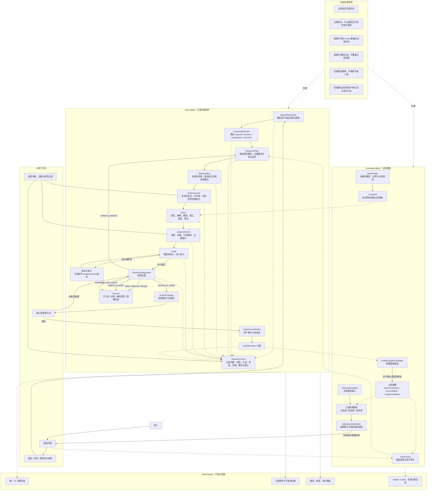

# MetaOS Alpha 业务架构

状态：阶段0业务架构设计

实现状态：本文档描述目标业务架构，不代表相关能力已经实现

权威范围：产品目标、核心主线、业务闭环、交付分层与业务原则

## 1. 业务定位

MetaOS Alpha 是个人意图操作系统，不是通用知识库、聊天机器人或新闻聚合器。

它服务的核心问题是：

```text
用户主动提出问题或遇到信息线索后，
MetaOS 如何帮助他约束注意力、明确知识范围、收集证据、
形成可审计判断，并转化为行动、明确不行动或知识型关闭。
```

系统不追求回答更多内容，而是让每一次研究都能回答：

- 这个问题是否值得进入研究。
- 应该从哪些知识来源中寻找证据。
- 应该采用什么研究方式。
- 哪些证据真正支持判断。
- 哪些结论只是推断、类比、争议观点或个人反思。
- 当前结果应该进入行动、继续研究、延后、观察、放弃，还是理解完成。

## 2. Alpha 交付分层

### 2.1 Core Alpha

Core Alpha 验证唯一核心命题：

```text
用户主动提出问题后，
MetaOS 能否帮助他形成可靠、可审计、可处置的判断。
```

Core Alpha 主链冻结为：

```text
Question
-> SourceResolution
-> KnowledgeScope
-> ResearchPlan
-> RetrievalRun
-> EvidenceUnit
-> Claim
-> JudgmentCard
-> Audit
-> ResearchDisposition
-> ActionProposal / Closure
```

Core Alpha 完成后，系统应已经可以作为独立产品持续使用，不依赖 IntentTrace、认知画像、三部榜单或 LensSkill。

完成条件：

- 用户可以从工作台输入问题。
- 用户可以指定、比较或排除知识来源。
- 显式来源约束不会被长文档或模型记忆覆盖。
- 系统能生成可定位的 EvidenceUnit。
- 系统能输出 Claim 级 JudgmentCard。
- 核心 Claim 必须有证据状态和可审计引用。
- 审计能区分确定性问题和语义问题。
- 审计阻断后能进入版本化修订。
- 研究可以形成 ResearchDisposition。
- 只有用户确认后，系统建议才成为 ActionCommitment。
- 理解型问题可以 knowledge_only_closure，不强制生成行动。

### 2.2 Extended Alpha

Extended Alpha 在 Core Alpha 稳定的前提下增加认知增强能力：

- IntentTrace：显化候选意图，并允许用户修正。
- BookProfile 与 LensSkill：让经典提供有边界的认知视角。
- Cognitive Profile：记录用户长期原则、当前状态和认知模式，但只作为先验。
- ProfileUpdateCandidate：复盘后生成画像更新候选，而不是自动修改画像。
- InformationIntake：摄入有限来源。
- 三部有限榜单：通过认知部、商业部、技术部提供有限注意力入口。
- AttentionJustification：说明一条信息为什么值得或不值得占用注意力。

Extended Alpha 中任何模块失败，不得破坏 Core Alpha 闭环。

### 2.3 Beta Ready

Beta Ready 不再扩张新的核心业务概念，只处理产品化收敛：

- UI 视觉统一与移动端适配。
- 性能、成本和 Token 预算约束。
- 模型、检索、审计的失败降级。
- ResearchTrace、Token、索引和审计的开发者可观测性。
- Golden Cases 回归评测。
- 开发者层与普通用户工作台隔离。

## 3. 业务架构图



这张图强调两条闭环：

- Core Alpha 闭环：问题最终进入判断、审计、处置和复盘。
- Extended Alpha 闭环：复盘产生画像更新候选，有限榜单再产生新的问题线索。

## 4. Core Alpha 业务对象职责

### 4.1 SourceResolution

SourceResolution 解析用户在问题中指定、比较或排除的知识来源。

它必须回答：

- 用户原始锚点是什么。
- 锚点最终匹配哪个 KnowledgeItem。
- 使用哪个 KnowledgeItemVersion。
- 匹配是标题、别名、作者、版本还是人工指定。
- 是否存在歧义或未找到。

业务规则：

- 显式来源解析失败时，不得静默回退到全库检索。
- 显式来源存在歧义时，应进入澄清、默认版本策略或错误状态，而不是随机选择。
- 被排除来源不得进入候选、上下文和最终引用。

### 4.2 KnowledgeScope

KnowledgeScope 决定一次研究允许使用哪些知识来源。

核心分类：

- `required_sources`：必须进入检索候选的来源。
- `primary_sources`：决定回答主结构的来源。
- `comparison_sources`：用于比较和对照的来源。
- `excluded_sources`：禁止进入候选、上下文和最终引用的来源。

业务规则：

- 同一来源不得同时出现在 required 与 excluded。
- required 来源必须被检索，但不保证一定形成支持 Claim。
- required 来源没有证据时，应报告该来源证据不足，不能找其他来源代答。
- comparison 来源只能用于对照，不能替代 primary 或 required 来源。
- Core Alpha 默认采用 `evidence_only`，模型参数知识不能伪装成指定来源内容。

### 4.3 ResearchPlan

ResearchPlan 回答“怎样研究”，避免从范围直接跳到一次 Top-K 检索。

它至少要决定：

- 研究模式。
- 规范化问题。
- 去除来源锚点后的书内检索问题。
- 证据要求。
- 查询变体。
- 候选策略。
- 是否需要反证。
- 停止条件。
- Chunk 与 Token 预算。

Core Alpha 最小研究模式：

- `fact_lookup`：局部事实检索。
- `source_interpretation`：原文概念和上下文解释。
- `compare_sources`：来源独立取证后按统一维度比较。
- `enumerate_pattern`：候选生成、条件验证、反证检索、EvidenceMatrix 和排除理由。

### 4.4 RetrievalRun

RetrievalRun 执行来源感知检索。

有显式来源时：

```text
SourceResolution
-> 指定来源内检索
-> 跨指定来源融合
```

无显式来源时：

```text
KnowledgeItemProfile 来源级路由
-> 选出候选来源
-> 每个来源独立检索
-> 跨来源融合
```

业务规则：

- 禁止让全库所有 Chunk 直接竞争唯一候选池后再做来源均衡。
- 来源评分不得按命中 Chunk 总分累加。
- 短资料可以全书参与候选排序，但不代表把全书所有 Chunk 发给模型。
- 最终上下文必须同时受 Chunk 数量和 Token 预算约束。
- ResearchTrace 必须记录候选来源分布、最终来源分布和被预算丢弃的内容。

### 4.5 EvidenceUnit

EvidenceUnit 是 Claim 可以引用的最小证据单元，不应只等同于 Chunk。

它必须能回答：

- 证据来自哪个作品和具体版本。
- 证据位于哪个 Chunk、章节、页码、段落或字符范围。
- 哪段文本被用作证据。
- 证据是支持、反证、上下文、定义还是背景。
- 证据强度如何。
- 证据来自哪一次 RetrievalRun。

业务规则：

- 核心 Claim 必须引用 EvidenceUnit。
- 引用必须能回链到原文或可定位文本。
- 相邻或重叠 Chunk 不能虚增证据数量。

### 4.6 Claim 与 JudgmentCard

Claim 是判断的基本单位。JudgmentCard 是一次研究面向用户的综合出口。

Claim 应区分：

- 认识性质：事实、解释、推断、类比、假设、反思、建议。
- 证据状态：支持、部分支持、存在争议、不支持、不适用。
- 内容领域：原文、历史、技术、商业、个人或其他。
- 重要性：核心、辅助、上下文。
- 置信度等级和置信依据。
- 生命周期：提出、审计中、可采纳、已接受、已拒绝、被替代、归档。

JudgmentCard 应包含：

- 核心判断。
- 直接证据。
- 不同解释。
- 证据缺口。
- 后续处置建议。
- 关联 ResearchTrace。

业务规则：

- 核心 Claim 无支持证据必须阻断。
- 类比必须标记为模型推演，不能写成原文事实。
- 有争议的判断不得被包装成确定结论。
- JudgmentCard 修订必须形成新版本，不得覆盖旧版本。

### 4.7 Audit

Audit 判断一次研究是否可采纳。

审计分为两类：

- 确定性审计：引用是否存在、来源是否越界、required 来源是否进入候选、excluded 来源是否被使用。
- 语义审计：证据是否真正支持 Claim、是否省略反证、是否把相关性写成因果、是否存在确认偏误。

业务规则：

- 审计结果不能只有通过或失败，必须输出结构化 AuditFinding。
- critical 或 blocking 问题必须阻断 JudgmentCard。
- 审计阻断后进入有上限的版本化修订循环。
- 达到修订上限后，研究应转入 awaiting_user 或 failed，而不是假装得到可靠答案。

### 4.8 ResearchDisposition 与 Action

ResearchDisposition 是一次研究的处置结果，不等同于行动任务。

可选处置：

- `proceed_to_action`
- `continue_research`
- `defer_decision`
- `observe`
- `discard`
- `explicit_no_action`
- `knowledge_only_closure`

只有 `proceed_to_action` 才进入：

```text
ActionProposal
-> 用户确认
-> ActionCommitment
-> ActionReview
```

业务规则：

- 系统只能提出 ActionProposal，不能替用户形成 ActionCommitment。
- 用户拒绝或调整建议时，应回到 ResearchDisposition。
- 知识型问题可以以 knowledge_only_closure 合法结束。
- 复盘主要针对用户确认过的 ActionCommitment。

### 4.9 ResearchTrace

ResearchTrace 是每次研究的全链路溯源载体。

它记录：

- 原始问题。
- SourceResolution。
- KnowledgeScope。
- ResearchPlan。
- RetrievalRun。
- EvidenceUnit。
- Claim 与 JudgmentCard。
- AuditFinding。
- ResearchDisposition。
- Action 与 Review。
- 模型、Prompt、策略和 attempt 信息。

业务规则：

- ResearchTrace 采用不可变事实记录加当前状态摘要。
- 重试产生新的 attempt，不覆盖旧失败。
- 同一输入、索引、策略和 Prompt 版本下，检索计划、来源约束和关键证据应可比较。
- 最终自然语言无需逐字一致，但核心 Claim 变化时必须能解释变化来源。

## 5. Extended Alpha 业务增强

### 5.1 IntentTrace

IntentTrace 显化用户可能真正关心的问题。

业务规则：

- 当前问题权重最高。
- 当前对话上下文和用户反馈权重很高。
- 用户画像只能作为先验。
- 没有画像时，Core Alpha 闭环仍必须完整运行。
- 用户否定候选意图后，不得继续强化该方向。

### 5.2 BookProfile 与 LensSkill

经典不是人格 Agent。经典通过 BookProfile 和 LensSkill 提供有边界的认知视角。

BookProfile 描述经典的：

- 核心概念。
- 思想结构。
- 解释边界。
- 典型命题。
- 适用范围和不适用范围。

LensSkill 至少区分两种模式：

- `source_interpretation`：解释经典自身内容，核心判断必须由原文支持。
- `lens_application`：用经典视角解释现代对象，必须区分原文观点、现代类比和模型推演。

业务规则：

- 不模拟经典作者人格。
- 不把现代类比写成“原文认为”。
- LensSkill 失败不得破坏 Core Alpha 判断闭环。

### 5.3 认知画像

认知画像不直接输出意图，只提供先验。

画像至少区分：

- 用户明确声明的长期原则。
- 当前状态。
- 系统根据行为推断的认知模式。

业务规则：

- 用户可以查看、修改、删除或关闭画像。
- 单次行为不得直接修改长期画像。
- 复盘只产生 ProfileUpdateCandidate。
- ProfileUpdateCandidate 需要用户确认或规则审核后才可合并。
- CurrentState 必须具有过期时间和衰减策略。

### 5.4 InformationIntake 与三部有限榜单

InformationIntake 负责接收候选资料，三部有限榜单负责有限注意力分配。

三部包括：

- 认知部。
- 商业部。
- 技术部。

业务规则：

- 三部不是无限新闻流。
- 每部可以有候选池，但最终展示必须有限。
- 榜单必须说明值得看与不值得看的理由。
- 用户阅读、停留、跳过、收藏、关闭等互动可以进入 CognitiveEvent。
- CognitiveEvent 只能辅助画像候选，不得直接覆盖当前问题。

## 6. 用户工作台

Streamlit 当前界面在 Alpha 中逐步收敛为个人认知工作台。

建议主导航：

- 工作台：提出问题、指定范围、查看判断卡和处置。
- 知识：查看作品、版本、结构、引用记录和来源解析。
- 复盘：查看 ResearchDisposition、ActionReview 和画像更新候选。
- 开发者：查看索引、Chunk、队列、Token、Trace、审计和失败原因。

业务规则：

- 默认用户界面不暴露 RAG 和索引实现细节。
- 开发者层保留诊断能力。
- 判断应区分草稿、审计中、可采纳。
- 审计阻断时，UI 可以展示草稿和问题，但不能以最终结论样式呈现。

## 7. 全局业务原则

### 7.1 上下文优先级

所有检索、推荐、意图推断、行动建议都必须遵守：

```text
1. 用户当前显式约束
2. 当前问题和当前会话上下文
3. 用户当前状态
4. UserConstitution 中的长期原则
5. 历史 CognitivePattern
6. 系统通用默认值
```

任何下层信息不得覆盖上层显式要求。

### 7.2 证据原则

- 证据优先于模型自由发挥。
- 模型参数知识不能伪装成指定知识来源。
- 检索不能让 Chunk 数量决定发言权。
- 短资料不因篇幅短而失去被引用机会。
- 证据不足、来源歧义和检索失败必须明确区分。

### 7.3 用户主权原则

- 画像只提供先验，不覆盖当前问题。
- 系统建议必须经用户确认后才成为行动。
- 用户可以拒绝、调整或关闭画像更新。
- 不行动、延后、继续研究和理解完成都是合法处置。

### 7.4 经典视角原则

- 经典是知识来源和认知视角，不是人格化 Agent。
- 书籍是来源，BookProfile 描述其思想结构，LensSkill 提供受边界约束的使用方式。
- 原文观点、现代类比和模型推演必须分开标记。

## 8. 与其他文档的关系

本文档只维护业务目标、核心主线和业务闭环。

其他权威文档：

- 技术模块、Worker、存储、模型适配：`TECHNICAL_ARCHITECTURE.md`
- 对象字段、状态机、领域关系：`DOMAIN_MODEL.md`
- API 请求与响应契约：`API_CONTRACTS.md`
- 阶段顺序和里程碑：`ROADMAP.md`
- 具体任务拆分：`TASK_INDEX.md`
- 检索算法与来源治理：`docs/RAG_RETRIEVAL_STRATEGY.md`
- Alpha 总览和关键决策：`docs/METAOS_ALPHA_UNIFIED_PLAN.md`
