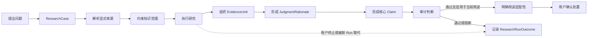
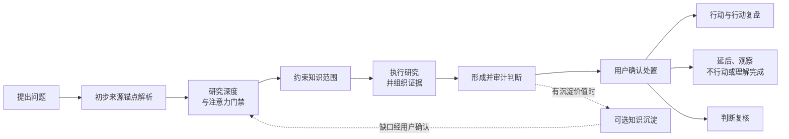
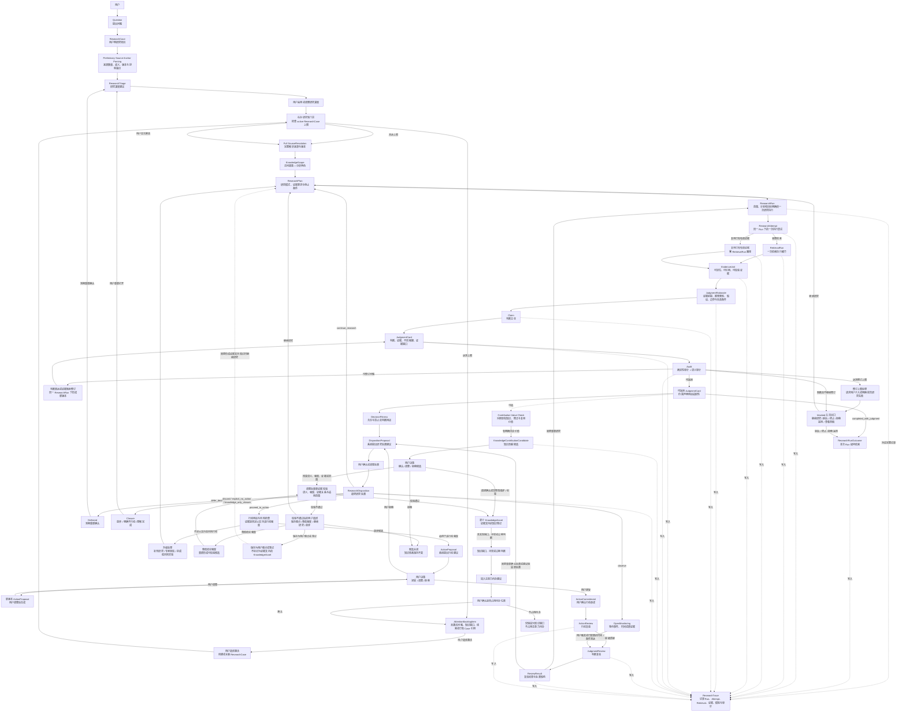
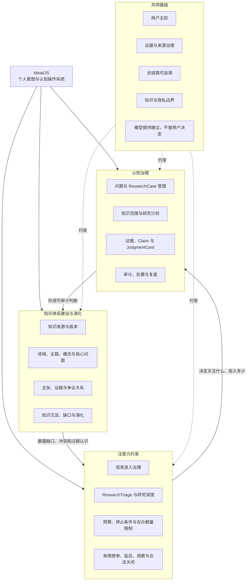
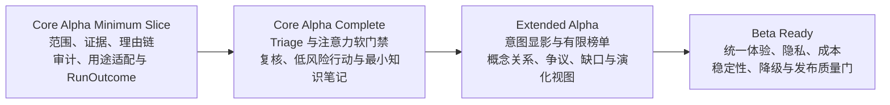

# MetaOS Alpha 业务架构

状态：Core Alpha 业务架构冻结候选

实现状态：本文档描述目标业务架构，不代表相关能力已经实现

权威范围：长期愿景、Alpha 产品形态、Core Alpha 业务主链、业务对象职责、用户控制点、业务指标与冻结验收场景

文档边界：本文档允许列出对象名称、业务分类、业务关系、不变量和用户控制点；不维护完整字段、枚举值、必填约束、数据类型和状态转换。这些内容以 `docs/DOMAIN_MODEL.md` 为唯一权威来源。检索算法、来源评分、候选融合和工程策略以 `docs/RAG_RETRIEVAL_STRATEGY.md` 和 `docs/TECHNICAL_ARCHITECTURE.md` 为准。

任务标识：`A0-DOC-001-R7.1`

关联一致性修订：`A0-DOC-002-R2`

## 1. 业务定位

MetaOS 的长期愿景、Alpha 产品形态和 Core Alpha 切入口必须分开理解。

长期愿景：

```text
MetaOS 是个人意图操作系统。
```

Alpha 产品形态：

```text
MetaOS Alpha 是面向个人知识库的研究与判断工作台。
```

Core Alpha 核心切入口：

```text
帮助用户围绕一个明确问题，
形成有范围、有证据、可审计、可修订、可处置的判断。
```

MetaOS Alpha 不是通用知识库、聊天机器人或新闻聚合器。它不追求回答更多内容，而是让每一次研究都能回答：

MetaOS 也不是通用 Agent 框架、Agent 编排平台或 Skill 市场。它可以复用这些基础能力，但核心价值是治理问题、证据、判断、用途、行动和复核，而不是拥有更多 Agent 或 Skill。

- 当前问题应进入什么研究深度。
- 应该从哪些知识来源中寻找证据。
- 应该采用什么研究方式。
- 哪些证据真正支持判断。
- 哪些结论只是事实、解释、推断、类比、争议观点或个人反思。
- 当前结果应该继续研究、观察、延后、放弃、明确不行动、理解完成，还是进入行动建议。
- 这个判断日后如何被复核、修订或失效。

### 1.1 MetaOS 的三项核心作用

MetaOS 的长期产品价值由三项相互关联的一级业务能力构成。它们不是三个开发阶段、独立 Agent 或微服务。

#### 认知治理

MetaOS 帮助用户治理从问题、知识范围、证据、Claim 到判断、处置和复核的全过程。

认知治理不承诺替用户给出绝对正确答案，而是帮助用户区分事实、解释、推断、类比和争议，暴露反证与知识缺口，使判断可审计、可修订，并在时间中接受复盘。

#### 注意力约束

MetaOS 帮助用户治理信息和问题对注意力的占用。

注意力约束覆盖信息进入、研究投入和退出处置，包括有限信息入口、研究深度建议、在办研究数量限制、时间与成本预算、停止条件、延后、观察、明确不行动和知识型关闭。目标不是让用户处理更多信息，而是让有限注意力优先服务当前最重要的问题。

#### 知识体系建设与演化

MetaOS 帮助用户将分散资料和单次研究结果沉淀为持续演化的个人知识体系。

知识体系不仅包含书籍、文档和索引，还包含领域、主题、概念、问题、Claim、EvidenceUnit、争议、关系、知识缺口和判断演化。每次研究都应能说明它是否为现有知识体系带来值得沉淀的新增、修订、否定或知识缺口。

三项能力形成持续循环：

```text
注意力约束
-> 认知治理
-> 知识体系沉淀
-> 暴露知识缺口、冲突和过期判断
-> 重新调整注意力
```

系统只能提出 KnowledgeContributionCandidate。长期知识资产的创建、修订、标记复核、撤回或删除必须保留用户确认与回退能力。

## 2. 目标用户与核心场景

Alpha 阶段目标用户是拥有个人知识库、需要长期研究和决策的知识工作者。

首要用户是产品创建者本人。Alpha 的设计应优先服务真实个人知识库、真实研究问题和真实行动复盘，而不是面向泛化用户画像做抽象优化。

首要场景：

- 指定一本或多本资料研究问题。
- 在全知识库中形成有证据的判断。
- 比较不同经典或知识来源。
- 将判断转化为行动、明确不行动或知识型关闭。
- 回看过去判断为何形成、后来是否成立。

非首要场景：

- 面向所有用户的通用知识问答。
- 无限新闻流或高频资讯消费。
- 自动替用户决定长期目标。
- 用经典作者人格化地陪聊。

## 3. 产品价值与可靠判断

Core Alpha 的核心价值不是给出绝对正确答案，而是形成可靠、可审计、可修订的判断。

MetaOS 所称的可靠判断并不保证结论绝对正确，而是满足：

- 使用了明确的知识范围。
- 核心 Claim 有可定位证据。
- 原文事实、解释、推断、类比、争议观点和个人反思被区分。
- 关键反证和证据缺口没有被隐藏。
- 显式来源约束没有被违反。
- 判断明确说明适用用途和不适用的行动强度。
- 判断形成过程可以回溯。
- 新证据出现时可以被复核和修订。

判断生命周期原则：

- 单纯的技术实现、模型、Prompt、索引或检索策略升级不自动影响历史判断；但如果确认某个历史版本存在会影响证据解析、Claim 支持关系、来源约束或审计结果的缺陷，受影响判断必须进入复核。
- 判断需要失效、降级或重新复核的典型原因包括：证据内容或身份变化、证据定位失效、Claim—Evidence 支持关系被重新判定、发现历史解析错误、发现来源越界、发现关键审计规则缺失或错误、已接受的非阻断风险条件实际发生，以及重新研究产生重要新结果。
- 判断复核由 `JudgmentReview` 承载。具体状态名称、转换条件和持久化字段以 `docs/DOMAIN_MODEL.md` 为准。

## 4. Alpha 交付分层

### 4.1 Core Alpha

Core Alpha 验证唯一核心命题：

```text
用户主动提出问题后，
MetaOS 能否帮助他形成可靠、可审计、可处置、可复核的判断。
```

Core Alpha 是冻结候选。其核心判断闭环和业务不变量不应被 Extended Alpha 或 Beta Ready 破坏。

#### 4.1.1 Core Alpha Minimum Slice

首先交付可独立运行的最小纵向切片：

```text
Question
-> ResearchCase
-> SourceResolution
-> KnowledgeScope
-> ResearchPlan
-> ResearchRun
-> EvidenceUnit
-> JudgmentRationale
-> Claim
-> JudgmentCard
-> Audit
-> 判断用途适配性
-> 用户确认 ResearchDisposition
```

Minimum Slice 只优先验证：

1. 是否能正确执行来源约束。
2. 是否能形成可定位证据。
3. 是否能将回答拆成少量、可审计的核心 Claim 和推理链。
4. 是否能阻断无依据、无推理链或过度确定的核心判断。
5. 用户是否认为该判断比普通 RAG 回答更能支撑其被允许的下一步用途。

每个 ResearchRun 无论成功、失败、被用户终止或被新 Run 取代，都必须形成 ResearchRunOutcome。只有通过审计且满足当前用途约束的判断，才可以形成 DispositionProposal；ResearchRunOutcome 不等于 ResearchDisposition。

#### 4.1.2 Core Alpha Complete

Minimum Slice 经过真实使用验证后，Core Alpha Complete 再增加：

- ResearchTriage、研究预算和停止条件。
- 在办 ResearchCase 软门禁和 AttentionBacklogItem。
- JudgmentReview 和人工复核。
- 低成本、可逆、可验证的 ActionProposal。
- 可选 KnowledgeContributionCandidate，以及用户确认后的最小“证据支持的知识笔记”。

Core Alpha Complete 不承诺全局知识合并、复杂修订传播、自动依赖分析、多版本知识资产图、删除级联策略全集、知识图谱或复杂关系编辑器。

### 4.2 Extended Alpha

Extended Alpha 是方向性设计，允许验证后调整。

它在 Core Alpha 稳定的前提下探索：

- IntentTrace：显化候选意图，并允许用户修正。
- BookProfile 与 CognitiveLens：让经典提供有边界的认知视角。
- Cognitive Profile：记录用户长期原则、当前状态和认知模式，但只作为先验。
- ProfileUpdateCandidate：复盘后生成画像更新候选，而不是自动修改画像。
- InformationIntake：摄入有限来源。
- 三部有限榜单：通过认知部、商业部、技术部提供有限注意力入口。
- AttentionJustification：说明一条信息为什么值得或不值得占用注意力。
- 知识体系结构化：探索领域、主题、概念、争议关系、知识缺口和判断演化视图。

Extended Alpha 中任何模块失败，不得破坏 Core Alpha 闭环。

### 4.3 Beta Ready

Beta Ready 不改变 Core Alpha 的核心判断闭环和业务不变量。

Beta Ready 允许增加账号、权限、工作空间、配额、分享、视觉统一、移动端适配、开发者诊断、降级策略和发布质量门等产品化支撑概念，并让认知治理、注意力约束和知识体系演化在隐私、成本、性能和降级条件下稳定运行。

## 5. 业务主链与对象链

### 5.1 高层业务主链

业务主链解释价值如何产生：

```text
提出问题
-> 初步解析显式来源锚点
-> 确定研究深度
-> 经过在办研究软门禁
-> 完整解析来源并约束知识范围
-> 执行研究并组织证据
-> 形成并审计判断
-> 明确判断适用与不适用的用途

已审计且满足用途约束的判断
├-> 用户决定如何处置 -> 后续复核或行动复盘
└-> 在有沉淀价值时产生可选 KnowledgeContributionCandidate
```

这是 Core Alpha Complete 的高层主链；Minimum Slice 不要求 ResearchTriage、在办软门禁、JudgmentReview、ActionProposal 或知识沉淀出口。

### 5.2 领域对象链

领域对象链说明业务主链由哪些对象承载：

```text
Question
-> ResearchCase
-> Preliminary Source Anchor Parsing
-> ResearchTriage
-> 用户采用或调整研究深度
-> Full SourceResolution
-> KnowledgeScope
-> ResearchPlan
-> ResearchRun
-> ResearchAttempt
-> RetrievalRun / 复用已有有效证据
-> EvidenceUnit
-> JudgmentRationale
-> Claim
-> JudgmentCard
-> Audit
-> DecisionFitness

可采纳且满足用途约束的 JudgmentCard
├-> DispositionProposal -> 用户确认或调整 -> ResearchDisposition
└-> 可选 KnowledgeContributionCandidate -> 用户确认、调整或拒绝 -> 最小 KnowledgeAsset

每个 ResearchRun
└-> ResearchRunOutcome
```

`RetrievalRun` 属于执行细节，不进入高层业务主链，但必须能被 ResearchTrace 记录。

## 6. Core Alpha 用户旅程与业务全景

### 6.1 Core Alpha Minimum Slice 业务图



Minimum Slice 只承诺范围、证据、理由链、Claim、审计、用途适配性、运行结果和用户处置。图中未出现的 Triage、在办软门禁、判断复核、行动建议和知识沉淀均不属于 Minimum Slice 发布前置条件。

### 6.2 Core Alpha Complete 简化用户旅程图



### 6.3 Core Alpha Complete 业务对象与闭环全景图



这张图强调：

- ResearchCase 是用户能理解的研究项目。
- Preliminary Source Anchor Parsing 只为 Triage 提供来源数量、歧义、版本和排除锚点，不执行完整检索；用户确认研究深度后再完成 Full SourceResolution。
- ResearchRun 是一次范围、计划和核心目标已确定的研究执行。
- ResearchAttempt 是同一 ResearchRun 下的一次执行尝试。
- RetrievalRun 是 ResearchAttempt 内部的检索执行细节。
- 零 RetrievalRun 不等于无证据回答，只表示本次 ResearchAttempt 复用了已经存在且重新校验有效的 EvidenceUnit。
- ResearchTrace 是 ResearchRun 的完整审计记录。
- 每个 ResearchRun 都形成 ResearchRunOutcome；运行失败、用户终止或被新 Run 取代不等于形成 ResearchDisposition。
- 可采纳不是无限用途许可；DecisionFitness 必须说明判断可用于什么，以及不足以支持什么强度的行动。
- JudgmentReview 复核“判断是否仍成立”。
- ActionReview 复核“行动是否有效”。
- ResearchDisposition 必须经过用户确认或调整。
- “需要复核”是判断生命周期触发条件，不是最终 ResearchDisposition；复核结果必须重新形成 DispositionProposal，再由用户确认或调整。
- blocked 判断不能进入行动路径，但用户仍可继续研究、延后、终止、拒绝采用或查看草稿。
- 在办 ResearchCase 达到上限后，新问题会进入注意力待办；系统不自动关闭旧 Case，用户可显式覆盖软门禁。
- 可采纳 JudgmentCard 只是生成 KnowledgeContributionCandidate 的资格条件，不要求每次研究都产生候选。
- DispositionProposal 与 KnowledgeContributionCandidate 都来源于已审计的 JudgmentCard，二者并行且互不依赖。
- 未确认的知识贡献候选不会改变长期知识体系，其生成或处理失败也不阻断判断与处置闭环。
- 调整后的知识贡献候选校验不通过时，由用户选择保存为个人观点、降低强度后重试、继续研究或放弃，不会自动生成证据支持的知识资产。
- 知识缺口只能提出“加入待办”建议；用户确认后才能占用注意力待办位置。
- OpenMonitoring、Deferred 和 Closure 都可以在用户触发或已配置的时间 / 条件到达时回到复核或研究。

## 7. 业务能力与交付阶段视图

业务能力图回答“MetaOS 长期为用户创造什么价值”；交付阶段图回答“这些能力何时以什么深度交付”。两者不能相互替代。

### 7.1 业务能力图



### 7.2 交付阶段图



## 8. Core Alpha 业务对象职责

本章只说明对象为什么存在、解决什么业务问题、与上下游对象的关系，以及不可违反的业务规则。完整字段、枚举、状态机和持久化约束不在本文档维护。

业务对象名称不代表都应成为用户直接操作对象或独立技术 Service：

| 层次 | 对象 | 主要用途 |
| --- | --- | --- |
| 用户业务对象 | ResearchCase、KnowledgeScope、JudgmentCard、ResearchDisposition、ActionProposal、KnowledgeContributionCandidate、JudgmentReview | 用户需要理解、查看或确认的核心产品对象 |
| 领域内部对象 | Claim、EvidenceUnit、JudgmentRationale、ResearchPlan、ResearchRun、Audit、KnowledgeAsset | 保持业务严谨性，用户可以查看其重要结果，但不一定直接编辑底层结构 |
| 业务结果与执行记录 | DecisionFitness、ResearchRunOutcome、ReviewResult、ResearchAttempt、RetrievalRun、ResearchTrace、SourceResolution 结果、模型调用记录 | 前三项需要向用户解释用途、运行终局或复核影响；其余内容服务于执行、诊断、回放和开发者审计，默认不占用用户主工作台 |

阶段边界：Minimum Slice 只要求 ResearchCase、SourceResolution、KnowledgeScope、ResearchPlan、ResearchRun / Outcome、EvidenceUnit、JudgmentRationale、Claim、JudgmentCard、Audit / DecisionFitness、DispositionProposal 和用户确认的 ResearchDisposition。ResearchTriage、AttentionBacklogItem、JudgmentReview、ActionProposal、KnowledgeContributionCandidate 与 KnowledgeAsset 属于 Core Alpha Complete。

### 8.1 ResearchCase

ResearchCase 是用户侧长期研究聚合对象，表示用户正在研究的一个问题、主题或判断链。

它解决的问题是：同一个问题可能被连续追问、重新检索、修订判断和复核行动前提。用户需要看到“这是同一个研究项目的演化”，而不是只能看到多条孤立执行记录。

Active ResearchCase 是用户明确选择当前投入注意力，并且存在待执行研究步骤、待处理判断或近期复核任务的 ResearchCase。

以下 ResearchCase 不应占用 active 名额：

- 仅保存但未启动的问题。
- 已进入长期观察且没有近期触发条件的 Case。
- 已延后到未来时间的 Case。
- 已完成但尚未归档的 Case。
- 仅用作历史知识参考的 Case。

业务关系：

- 一个 ResearchCase 可以包含原始问题和后续追问。
- 一个 ResearchCase 可以包含当前 KnowledgeScope。
- 一个 ResearchCase 可以拥有多个 ResearchRun。
- 一个 ResearchCase 可以包含多个 JudgmentCard 版本。
- 一个 ResearchCase 可以关联 ResearchDisposition、JudgmentReview、ActionProposal、ActionCommitment 和 ActionReview。

业务规则：

- ResearchCase 不是聊天会话。
- ResearchCase 不是 ResearchTrace 的别名。
- 一次失败或重新研究不应自动创建新的 ResearchCase。
- Core Alpha 支持创建、归档、重新打开 ResearchCase。
- 用户可以保存多个 ResearchCase，但同时处于 active 的在办 ResearchCase 必须有限。
- 在办上限由用户配置或采用系统默认值，本文档不固定具体数量。
- 达到上限时，新问题应先进入注意力待办，而不是自动激活或拒绝保存。
- 用户可以暂停或结束旧 Case，也可显式覆盖软门禁；覆盖行为必须可追溯。
- 系统不得自动选择要暂停或关闭的 ResearchCase。
- 注意力待办必须支持容量管理、主动放弃和归档；本文档不固定具体容量。
- 知识缺口或冲突不得自动创建或激活 ResearchCase。
- AttentionBacklogItem 是注意力待办中的业务条目，不等同于 ResearchCase，也不要求 Core Alpha 将其实现成独立复杂实体。
- AttentionBacklogItem 可来源于尚未激活的 ResearchCase、用户保存的问题、知识缺口、JudgmentReview 建议或外部信息线索。
- 用户主动激活 AttentionBacklogItem 后，系统才创建或关联 ResearchCase，并重新经过在办软门禁。
- 用户可以从现有 ResearchCase 的某个问题或判断派生新的 ResearchCase；原 ResearchCase、ResearchRun、JudgmentCard 和 ResearchTrace 保持不变，新 Case 保留来源关联。
- ResearchCase 合并和移动历史记录式拆分不进入 Core Alpha。

### 8.2 ResearchTriage

ResearchTriage 是研究深度建议机制，不是注意力守门人。

它解决的问题是：同一个问题可能只需要已有证据直接回答，也可能需要快速检索、标准研究、深度研究或先澄清歧义。

Triage 建议包括：

- 直接回答：使用当前已存在的可靠证据，不启动广泛检索。
- 快速检索：小候选池、较低预算。
- 标准研究：正常来源路由、检索、判断和审计。
- 深度研究：多轮候选、反证和更高预算。
- 需要先澄清：提醒问题存在关键歧义，用户仍可覆盖。

业务规则：

- ResearchTriage 只决定研究深度、预算和执行策略。
- ResearchTriage 之前必须先完成轻量来源锚点解析，以识别显式来源数量、明显歧义、版本要求和 excluded 锚点；该步骤不执行完整检索。
- ResearchTriage 应给出预计注意力成本和是否建议现在激活该 Case，但不替用户决定。
- ResearchTriage 与在办软门禁共同决定问题是进入 active 研究还是注意力待办。
- ResearchTriage 不决定是否保留溯源与证据约束。
- 用户可以覆盖系统建议。
- 系统不能因为判断“价值低”而拒绝用户研究。
- 当前显式选择高于 Triage 推荐。
- 进入 Core Alpha 工作台的正式回答均应关联 ResearchCase 和 ResearchTrace。
- 直接回答不能允许模型参数知识冒充指定来源。

### 8.3 SourceResolution

SourceResolution 分为初步来源锚点解析和完整来源解析，两者属于同一业务职责，不要求实现为两个独立服务。

它解决的问题是：用户说“鬼谷子”“理想国”或“不要引用理想国”时，系统必须先解析这些锚点，再决定检索范围。

业务规则：

- 初步来源锚点解析发生在 ResearchTriage 之前，只识别是否存在显式来源、来源数量、明显歧义、版本指定和 excluded 锚点。
- 完整来源解析发生在用户采用或调整研究深度之后，形成 KnowledgeScope 所需的明确来源与版本结果。
- SourceResolution 不仅解析作品身份，也应在必要时解析版本、译本、载体和内容版本。
- 系统采用的作品版本、译本、载体或内容版本必须对用户可见。
- 存在多个可用版本时，用户可以进行选择或切换。
- 用户指定的版本当前不可用时，系统必须明确报告不可用，不得静默替换成其他版本。
- 显式来源解析失败时，不得静默回退到全库检索。
- 显式来源存在歧义时，应进入澄清、默认版本策略或错误状态，而不是随机选择。
- excluded 来源的内容不得进入模型上下文、检索候选、证据处理输入、引用、EvidenceUnit 或判断证据链；其标识可以仅作为排除条件和审计记录进入工具调用。

### 8.4 KnowledgeScope

KnowledgeScope 决定一次研究允许使用哪些知识来源，以及每个来源在分析中承担什么角色。这是两个正交维度。

访问政策：

- `required`：必须进入独立取证和结果报告。
- `allowed`：允许使用，但不保证一定进入最终证据链。
- `excluded`：禁止其内容进入候选、模型上下文、证据处理输入、引用和证据链；来源标识可作为排除条件与审计记录。

分析角色：

- `primary`：决定回答主结构。
- `comparison`：用于比较和对照。
- `background`：只提供必要背景，不得替代 primary 或 required 来源。

业务规则：

- 每个已解析来源只能具有一个访问政策，并可同时具有一个分析角色。
- `required` 与 `excluded` 互斥；`primary` 不自动等于 `required`，`comparison` 也可以是 `required` 或 `allowed`。
- 未显式列出的来源采用什么访问政策必须由当前 KnowledgeScope 明确，不得在执行时临时猜测。
- required 来源必须被独立处理，并报告支持、反驳、无证据或不可用等结果。
- required 来源没有证据时，应报告该来源证据不足，不能找其他来源代答。
- comparison 来源只能用于对照，不能替代 primary 来源或其他 required 来源的独立报告。
- Core Alpha 默认采用 `evidence_only`，模型参数知识不能伪装成指定来源内容。

### 8.5 ResearchPlan

ResearchPlan 回答“怎样研究”，避免不同问题都走同一种研究动作。

它解决的问题是：事实查询、概念解释、多来源比较和枚举型研究需要不同执行策略。

Core Alpha 研究模式包括：

- `fact_lookup`：局部事实检索。
- `source_interpretation`：原文概念和上下文解释。
- `compare_sources`：来源独立取证后按统一维度比较。
- `enumerate_pattern`：候选生成、条件验证、反证检索、证据矩阵和排除理由。
- `claim_evaluation`：提出候选 Claim，分解前提，分别取证，寻找竞争性解释和反证，再形成带边界的判断。

业务规则：

- 研究模式不得只是标签，必须影响证据组织方式。
- 显式来源锚点应作为范围约束，不应重复污染来源内语义查询。
- 枚举型研究不能退化为一次普通检索。

### 8.6 ResearchRun、ResearchAttempt、RetrievalRun、ResearchRunOutcome 与 ResearchTrace

ResearchRun 是一次范围、计划和核心目标已确定的研究执行。ResearchTrace 是该 ResearchRun 的完整审计记录。

ResearchAttempt 是同一 ResearchRun 下的一次执行尝试。RetrievalRun 是 ResearchAttempt 内部的一次检索执行细节。

业务规则：

- 一个 ResearchCase 可以拥有多个 ResearchRun。
- 每个 ResearchRun 对应一个完整 ResearchTrace。
- 一个 ResearchRun 可以发生多个 ResearchAttempt。
- 每个 ResearchAttempt 可以包含零个或多个 RetrievalRun。
- 不包含 RetrievalRun 的 ResearchAttempt 只能复用已有且重新校验有效的 EvidenceUnit，不得使用模型参数知识代替证据。
- 复用 KnowledgeAsset 可以辅助问题路由、概念定位和历史判断召回，但来源型 Claim 仍必须回溯到底层 EvidenceUnit。
- ResearchTrace 汇总并记录全部 ResearchAttempt、RetrievalRun 和复用证据关系。
- 失败 ResearchAttempt 不得被后续 ResearchAttempt 覆盖。
- 只有在 KnowledgeScope、ResearchPlan 和核心研究目标保持不变时，重试才可以作为同一 ResearchRun 的新 ResearchAttempt。
- 范围、研究模式、核心证据要求或研究目标发生实质变化时，必须创建新的 ResearchRun。
- RetrievalRun 属于执行细节，不进入高层业务主链。

ResearchRunOutcome 只说明一次 ResearchRun 如何结束，不表达用户如何处置研究问题。它至少必须能够表达：形成可采纳判断、证据不足、审计阻断、用户终止、在判断形成前延后，以及被新 ResearchRun 取代等业务含义；具体状态名称由 `docs/DOMAIN_MODEL.md` 定义。

- 每个结束的 ResearchRun 都必须形成 ResearchRunOutcome。
- ResearchRunOutcome 可以存在而 ResearchDisposition 不存在，例如审计阻断或用户主动终止。
- ResearchDisposition 只能建立在满足其用途约束的可采纳判断和用户确认之上。
- ResearchRunOutcome 不得被用来伪造“用户已经明确处置”的产品状态。

修订边界：

- 仅修订判断表达或证据映射，例如降低结论强度、补充引用、修正 Claim 分类，应在同一 ResearchRun 下产生新的 JudgmentCard 版本。
- 重新检索、改变 KnowledgeScope、改变研究模式或改变核心证据要求，应创建新的 ResearchRun，并形成新的 ResearchTrace 和新的 JudgmentCard 版本。

### 8.7 EvidenceUnit

EvidenceUnit 是 Claim 可以引用的最小证据单元，不应只等同于一段文本切片。

它解决的问题是：系统不能只说“某段材料支持结论”，而必须让用户知道哪段证据、来自哪个来源、如何支持或反驳判断。

业务规则：

- 核心 Claim 必须引用可定位、可校验的 EvidenceUnit。
- EvidenceUnit 必须能回到具体来源、版本和定位。
- KnowledgeAsset 是由判断派生的知识条目，不得被计算为新的独立原始证据。
- 多个 KnowledgeAsset 若回溯到相同 EvidenceUnit，不得虚增证据数量。
- 用户反思、原则和经验性认识可以作为用户立场或先验，但不能伪装成外部事实证据。
- 来源篇幅不得决定来源权重。
- 相邻或重叠文本不得被计算为多份独立证据。
- 检索失败、证据不足和来源不存在必须被区分。

### 8.8 JudgmentRationale

JudgmentRationale 是 EvidenceUnit 与 Claim 之间的结构化推理桥梁。它可以作为 Claim—Evidence 关系的一部分，不要求实现为独立复杂实体或单独数据表。

它解决的问题是：证据不会自动产生结论，系统必须暴露“为什么这些证据允许得出该 Claim”。

JudgmentRationale 应按 Claim 类型裁剪，不能机械要求所有 Claim 填写同一套字段：

- 事实型：来源、定位、事实映射和版本限制。
- 解释型：原文、上下文、解释路径和替代解释。
- 推断与假设型：证据前提、推理方式、关键假设、适用边界、反证和失效条件。
- 建议型：判断依据、目标、成本、风险、可逆性和停止条件。

业务规则：

- 核心事实型和来源解释型 Claim 必须具备直接证据。
- 核心推断、假设和建议型 Claim 必须具备可追溯的证据前提、明确推理链、关键假设、适用边界和风险说明。
- 没有依据、没有推理链，却包装成确定结论的核心 Claim 必须被阻断。
- 置信度标签不得替代 JudgmentRationale。

### 8.9 Claim 与 JudgmentCard

Claim 是判断的基本单位。JudgmentCard 是一次研究面向用户的综合出口。

它们解决的问题是：判断不能只是一段流畅回答，而要拆成可审计、可接受、可拒绝、可修订的主张。

业务规则：

- Claim 必须区分认识性质和表达角色。
- 认识性质至少包括事实、解释、推断、类比、假设。
- 表达角色至少包括核心判断、补充说明、反证、建议、待验证问题、用户反思。
- 表达角色为“建议”的 Claim 仍然只是 JudgmentCard 中的一项判断表达，不会自动成为 ActionProposal，更不会自动形成 ActionCommitment。
- Claim 必须表达证据支持状态和重要性，但具体字段和枚举以 `docs/DOMAIN_MODEL.md` 为准。
- 用户接受 Claim 只表达用户态度，不会将“不支持”、“部分支持”或“存在争议”的证据状态改为“已充分支持”。
- 核心 Claim 必须满足与其认识性质相匹配的证据和 JudgmentRationale 要求。
- 类比必须标记为模型推演，不能写成原文事实。
- 有争议的判断不得被包装成确定结论。
- JudgmentCard 采用版本化管理；每次修订产生新的 JudgmentCard 版本。是否存在独立版本实体，由 `docs/DOMAIN_MODEL.md` 决定。

### 8.10 Audit 与 DecisionFitness

Audit 判断一次研究是否可采纳。

它解决的问题是：系统不能把“语言上像答案”的内容直接交给用户，而必须检查来源、引用、证据支持和推断越界。

审计分为两类：

- 确定性审计：引用是否存在、来源是否越界、required 来源是否被独立处理、excluded 来源是否被使用。
- 语义审计：证据是否真正支持 Claim、JudgmentRationale 是否完整、假设与边界是否被暴露、是否省略反证、是否把相关性写成因果、是否存在确认偏误。

业务规则：

- 审计结果不能只有通过或失败，必须能表达问题、严重性、影响范围和建议修订方向。
- 非阻断性审计警告可以由用户知情确认、接受风险或要求修订，确认后可以继续处置或行动。
- 被用户知情接受的非阻断性警告必须继续附着在 JudgmentCard、DispositionProposal、ActionProposal 和 KnowledgeContributionCandidate 上，不得在下游流程中消失。
- 带警告的知识贡献在沉淀后必须保留警告内容、用户接受语义、当时证据状态和后续复核条件。
- 阻断性审计问题必须阻止 JudgmentCard 被显示为可采纳判断。
- 用户不能通过接受操作，将 blocked Claim 改为可采纳的系统可靠判断。
- 阻断性审计问题不得进入 `proceed_to_action`，也不能通过用户接受变为可靠判断。
- 阻断后，用户只能拒绝采用该草稿、终止本次研究、延后处理、继续研究或查看草稿；这些操作不表示形成可靠判断。
- 审计阻断后进入有上限的版本化修订循环。
- 达到修订上限后，研究应请求用户介入或明确报告研究失败，而不是假装得到可靠答案。

Audit 还必须形成用途适配性结果 DecisionFitness。它不是对“真或假”的第二次投票，而是说明当前证据与判断强度足以支持哪些用途。

DecisionFitness 可以作为 JudgmentCard 或 Audit 的结构化业务结果；是否实现为独立持久化实体由 `docs/DOMAIN_MODEL.md` 决定。

DecisionFitness 至少应区分：

- 可用于理解问题、规划后续研究或继续观察。
- 可用于低成本验证或常规可逆行动。
- 不足以支持高成本投入、长期承诺、不可逆行动或重大外部影响。

业务规则：

- “可采纳”不等于可以支持任意强度的行动。
- 审计可以表达暂时可采纳或带条件可采纳；具体认识论状态名称由 `docs/DOMAIN_MODEL.md` 定义。
- DispositionProposal 和 ActionProposal 必须遵守 DecisionFitness，不得把理解型判断升级为高风险行动依据。
- 当用户请求的用途超过当前适配范围时，系统必须建议补充研究、专家审核，或拆解为低风险、可逆实验。

### 8.11 DispositionProposal、ResearchDisposition 与 Action

DispositionProposal 是系统提出的研究处置建议。ResearchDisposition 是用户确认或调整后的最终处置。

它们解决的问题是：系统不能替用户决定“放弃这个问题”“不行动”或“理解完成”。

处置语义：

- `proceed_to_action`：当前可采纳判断足以进入具体行动建议阶段；它只授权系统形成 ActionProposal，不代表用户已经承诺执行。
- `continue_research`：现有证据不足，立即继续研究。
- `observe`：当前不继续研究，等待外部事件、时间或新证据。
- `defer_decision`：已有一定判断，但用户选择在明确时间点重新决策。
- `discard`：问题已经失去价值或不再值得继续研究。
- `explicit_no_action`：研究已经形成判断，结论是当前不应采取行动。
- `knowledge_only_closure`：理解目标已经完成，该问题本身不要求行动。

业务规则：

- Audit 之后先生成 DispositionProposal。
- 用户确认或调整后，才形成 ResearchDisposition。
- 只有存在满足当前用途约束的可采纳 JudgmentCard 时，才形成 ResearchDisposition。
- blocked、证据不足或用户提前终止时，“继续研究”“延后”“终止”只是对下一步执行的选择；当前 ResearchRun 以 ResearchRunOutcome 结束，不强制生成 ResearchDisposition。
- `observe` 是事件或条件驱动。
- `defer_decision` 是时间或用户决策驱动。
- 只有 `proceed_to_action` 才进入 ActionProposal。
- “需要复核”不是 ResearchDisposition；它是 JudgmentReview 的触发条件或判断状态提示。
- 系统只能提出 ActionProposal，用户接受后才形成 ActionCommitment。
- ActionProposal 被用户调整时，应产生新版本建议。
- ActionProposal 被用户拒绝时，应回到处置确认，而不是直接静默关闭。
- ActionProposal 至少应说明目标、与 JudgmentCard 的关系、预期收益、注意力与资源成本、可逆性、最大可接受损失、关键假设、停止条件和复盘时点。
- Core Alpha 优先支持低成本、可逆、可验证的小步行动；行动风险越高，所需证据、用户确认强度和复盘要求越高。
- Core Alpha 不承诺生成高风险行动方案；当请求超出 DecisionFitness 时，系统应拒绝越级，转为补充研究、专家审核或低风险实验。

### 8.12 JudgmentReview 与 ActionReview

JudgmentReview 是业务对象，记录一次判断复核及其结果。ActionReview 记录一次行动复盘及其结果。

两者不应混用：

- JudgmentReview 复核“认知是否仍成立”。
- ActionReview 复核“行动是否有效”。

Core Alpha 最小能力：

- 用户可以主动发起 JudgmentReview。
- 用户重新打开 ResearchCase 时可以发起 JudgmentReview。
- 系统发现已引用证据被删除、定位失效或内容变化时，必须提示原判断不再有效或需要复核。
- 系统确认历史解析器、Prompt、模型行为、来源边界执行或审计规则存在会影响判断的缺陷时，必须识别受影响判断并提示复核。
- 用户曾接受的非阻断风险条件实际发生时，相关判断必须进入复核。
- OpenMonitoring、Deferred 到期后，允许用户手动恢复研究或发起复核。

后续增强能力：

- 自动发现新证据影响了哪些历史判断。
- 自动定期复核。
- 自动监控外部事件。
- 自动发送提醒。

业务规则：

- JudgmentReview 至少必须能够表达判断仍然成立、可信度降低、需要重新研究、被新版本取代、因证据失效不可继续使用等业务含义。
- 具体状态名称、枚举和转换规则由 `docs/DOMAIN_MODEL.md` 定义。
- JudgmentReview 先形成 ReviewResult；ReviewResult 可以建议重新研究、保留原处置或改变处置，但不得直接覆盖 ResearchDisposition。
- ReviewResult 是否实现为独立持久化实体由 `docs/DOMAIN_MODEL.md` 决定；业务架构只要求复核结论与其处置影响可见、可追溯。
- 需要重新确认处置时，系统必须根据 ReviewResult 生成新的 DispositionProposal，并再次由用户确认或调整。
- ActionReview 如果发现行动前提错误，应进入 JudgmentReview；必要时启动新的 ResearchRun。

### 8.13 KnowledgeContributionCandidate

KnowledgeContributionCandidate 是已审计 JudgmentCard 在满足沉淀价值条件时，对个人知识体系提出的可选贡献候选。它不依赖 ResearchDisposition，也不由 DispositionProposal 产生。

它解决的问题是：JudgmentCard 不应作为孤立回答留在 ResearchCase 中，而应说明本次研究可以为已有知识体系新增、修订、否定或暴露什么。

Core Alpha 只承诺三类最小贡献：

- ClaimContribution：新增、修订或否定一个有证据的主张。
- EvidenceContribution：为已有主张增加支持证据或反证。
- GapContribution：标记知识缺口、争议或需要复核的判断。

“新增概念”和“建立关系”可以作为候选中的自然语言建议，但 Core Alpha 不承诺完成全局概念合并、复杂关系建模、因果图谱或领域本体维护。

业务规则：

- 候选来源于已审计 JudgmentCard、现有 KnowledgeAsset 对照和贡献价值检查，不来源于 DispositionProposal 或 ResearchDisposition。
- 通过阻断门的可采纳 JudgmentCard 只是生成知识贡献候选的资格条件，不要求每次研究都生成候选。
- “本次研究没有值得沉淀的新知识”是合法结果。
- 生成候选至少应满足：存在明显新信息、修正旧主张、增加关键证据或反证、暴露重要缺口，或对后续研究具有明确复用价值之一。
- 候选必须绑定具体 JudgmentCard 版本和支撑它的 EvidenceUnit。
- 原始 JudgmentCard 或 EvidenceUnit 失效时，相关候选或已沉淀知识必须能够进入复核。
- 用户可以确认、调整或拒绝候选。
- 用户确认只表示接受沉淀，不会自动提高 Claim 的证据状态、结论强度或置信度。
- 仅修改标题、措辞或标签，且不改变语义和证据关系时，可以直接确认。
- 修改 Claim 含义、结论强度、证据关系或适用范围时，必须重新进行证据校验。
- 调整后无法通过校验时，系统必须让用户选择：保存为用户观点或笔记、降低结论强度后重新校验、继续研究，或放弃候选。
- 系统不得自动把校验失败的候选保存为用户观点，也不得把它标记为证据支持的 KnowledgeAsset。
- 未确认候选不得改变长期知识体系，没有用户操作不能被默认为接受。
- blocked JudgmentCard 不得沉淀为可靠知识资产。
- 候选生成、确认或写入失败不得破坏判断、处置和行动闭环。
- 具体字段、枚举、合并规则和回退方式以 `docs/DOMAIN_MODEL.md` 为准。

### 8.14 KnowledgeAsset

KnowledgeAsset 是用户明确确认、具有来源和判断版本依据、能够被后续检索和复核的个人知识体系条目。

KnowledgeAsset 可以表达有证据的主张、证据关系、知识缺口或复核要求，但它不等于绝对真理，也不等于原始资料。

Core Alpha Complete 对 KnowledgeAsset 的最小承诺是“证据支持的知识笔记”：能够绑定 JudgmentCard 版本与 EvidenceUnit、保留审计警告、被用户查看和撤回，并明确不作为新的原始证据。这个名称只表示来源、证据关系和审计过程可追溯，不承诺知识在绝对意义上为真。Core Alpha Minimum Slice 不依赖 KnowledgeAsset 才能成立。

```text
KnowledgeItem
原始知识来源或逻辑作品

KnowledgeContributionCandidate
系统建议如何更新知识体系

KnowledgeAsset
用户确认后形成的派生知识条目
```

业务规则：

- Core Alpha Complete 只承诺创建最小知识笔记、查看其依据、保留警告和撤回使用，不要求实现完整知识资产生命周期。
- KnowledgeAsset 可用于问题路由、概念定位、历史判断召回和研究线索。
- 来源型 Claim 仍必须回溯到底层 EvidenceUnit，KnowledgeAsset 不得替代原始证据。
- 复用 KnowledgeAsset 时，必须检查其 JudgmentCard 版本、EvidenceUnit 和审计警告是否仍有效。
- 多个 KnowledgeAsset 来自同一 EvidenceUnit 时，不得作为多份独立证据计算。
- KnowledgeAsset 必须保留其生成时的非阻断性警告、用户接受语义、证据状态和复核条件。
- 修订传播、多版本依赖图、自动合并、复杂关系编辑、级联复核和完整删除策略属于 Extended Alpha 或 Beta 后的独立设计；长期实现仍不得静默覆盖历史依据。

### 8.15 个人知识体系边界

MetaOS 中的个人知识体系至少包含五层：

```text
来源与版本层
书籍、文章、PDF、网页、译本和内容版本

概念与主题层
领域、主题、概念和核心问题

主张与证据层
Claim、EvidenceUnit 和 JudgmentCard

关系与争议层
支持、反驳、冲突、类比、因果和包含关系

缺口与演化层
未知问题、薄弱证据、过期判断和认知变化
```

Core Alpha 只承诺通过 KnowledgeContributionCandidate 建立最小沉淀出口；复杂关系建模、全局概念编辑和演化视图属于 Extended Alpha。

## 9. 用户控制点

MetaOS 的可靠性不只来自系统审计，也来自用户能参与判断形成。控制点必须按交付层级实现，不能用 Core Alpha Complete 的完整清单反向扩大 Minimum Slice。

### 9.1 Minimum Slice 必须控制点

- 创建 ResearchCase。
- 指定、比较或排除知识来源，并修正 KnowledgeScope。
- 查看采用的来源版本与 EvidenceUnit 定位。
- 标记“证据不支持此判断”“这只是推断”或“缺少反证”。
- 要求降低结论强度或继续查证。
- 接受或拒绝 Claim；用户接受不改变证据状态。
- 确认非阻断性审计警告或要求修订。
- 查看判断的 DecisionFitness，知道它适用与不适用的用途。
- 查看 ResearchRunOutcome；在存在满足用途约束的可采纳判断时，确认或调整 DispositionProposal。

### 9.2 Core Alpha Complete 新增控制点

- 归档、重新打开或从现有 ResearchCase 派生新 Case。
- 设置在办 ResearchCase 上限，在触发门禁时暂停旧 Case、保留新问题为待办或显式覆盖。
- 采用或调整 ResearchTriage 给出的研究深度。
- 接受、拒绝或调整低风险 ActionProposal。
- 发起 JudgmentReview。
- 查看、确认、调整或拒绝 KnowledgeContributionCandidate 及其 JudgmentCard 版本和 EvidenceUnit 依据。
- 决定知识缺口是否进入注意力待办，或只保留在知识体系中。
- 从注意力待办中激活、放弃或归档 AttentionBacklogItem。
- 要求已沉淀知识进入复核或撤回使用。

### 9.3 Extended Alpha 新增控制点

- 修正 IntentTrace 候选意图。
- 查看、修改、删除或关闭认知画像及其更新候选。
- 调整有限榜单和主动信息摄入的偏好与边界。
- 管理更丰富的概念关系、争议和知识演化视图。

没有用户操作不能被默认为接受。系统应区分“用户明确接受”“用户拒绝”“用户尚未处理”。

## 10. Extended Alpha 业务增强

Extended Alpha 是方向性设计，不与 Core Alpha 使用同一冻结强度。

### 10.1 IntentTrace

IntentTrace 显化用户可能真正关心的问题。

业务规则：

- 当前问题权重最高。
- 当前对话上下文和用户反馈权重很高。
- 用户画像只能作为先验。
- 没有画像时，Core Alpha 闭环仍必须完整运行。
- 用户否定候选意图后，不得继续强化该方向。

### 10.2 BookProfile 与 CognitiveLens

经典不是人格 Agent。经典通过 BookProfile 和 CognitiveLens 提供有边界的认知视角。

BookProfile 描述作品的思想结构、核心概念和来源边界；CognitiveLens 描述如何在这些边界内使用某部经典或理论框架观察问题。CognitiveLens 是业务层认知视角，不等同于 Agent Runtime 加载的程序性 Skill。

业务规则：

- Alpha 当前以 BookProfile 为经典视角的主要载体。
- CognitiveLens 必须区分解释经典自身内容和使用经典视角解释现代对象。
- 解释经典自身内容时，核心判断必须由原文支持。
- 使用经典视角解释现代对象时，必须区分原文观点、现代类比和模型推演。
- 不模拟经典作者人格。
- 不把现代类比写成“原文认为”。
- CognitiveLens 失败不得破坏 Core Alpha 判断闭环。
- 长期可将认知视角扩展到书籍之外的专家框架、方法论或理论体系；该方向不属于当前 Alpha 承诺。

### 10.3 认知画像

认知画像不直接输出意图，只提供先验。

业务规则：

- 画像至少区分用户明确声明的长期原则、当前状态和系统根据行为推断的认知模式。
- 用户可以查看、修改、删除或关闭画像。
- 单次行为不得直接修改长期画像。
- 复盘只产生 ProfileUpdateCandidate。
- ProfileUpdateCandidate 需要用户确认或规则审核后才可合并。
- CurrentState 必须具有过期时间和衰减策略。

### 10.4 InformationIntake 与三部有限榜单

InformationIntake 负责接收候选资料，三部有限榜单负责有限注意力分配。

三部包括：

- 认知部。
- 商业部。
- 技术部。

Alpha 规则：

- 每部最多 3 条。
- 总榜单最多 5 条。
- 没有足够价值的信息时返回“今日无事上奏”。
- 禁止为了填满配额而推荐弱内容。

业务规则：

- 三部不是无限新闻流。
- 每部可以有候选池，但最终展示必须有限。
- 榜单必须说明值得看与不值得看的理由。
- 用户阅读、停留、跳过、收藏、关闭等互动可以进入 CognitiveEvent。
- CognitiveEvent 只能辅助画像候选，不得直接覆盖当前问题。

### 10.5 知识体系结构化与演化

Extended Alpha 在 KnowledgeContributionCandidate 的最小沉淀出口之上，探索：

- 领域、主题、概念和核心问题的结构化视图。
- 主张之间的支持、反驳、冲突、类比和因果关系。
- 知识缺口、证据薄弱区和过期判断视图。
- 同一主张随时间、证据和 JudgmentReview 变化的演化记录。

这些能力不得自动重写用户已确认的长期知识资产，也不要求 Core Alpha 引入图数据库。

## 11. 用户工作台

Streamlit 当前界面在 Alpha 中逐步收敛为个人认知工作台。

建议主导航：

- 工作台：提出问题，区分 active ResearchCase 与注意力待办，查看研究深度、在办软门禁、判断卡、处置建议和行动建议。
- 知识：查看作品、版本、结构、引用记录、KnowledgeContributionCandidate 和已确认知识资产。
- 复盘：查看 ResearchDisposition、JudgmentReview、ActionReview、画像更新候选和知识贡献复核。
- 开发者：查看研究轨迹、证据链、审计问题、失败原因、外部模型材料范围和执行成本。

业务规则：

- 默认用户界面不暴露底层检索实现细节。
- 开发者层保留诊断能力。
- 判断应区分草稿、审计中、可采纳、需复核和不可继续使用。
- 可采纳判断必须同时展示 DecisionFitness，明确“可用于什么”和“不足以支持什么”。
- ResearchRunOutcome 与 ResearchDisposition 必须分别展示，不能把运行失败或用户终止伪装成判断处置。
- 审计阻断时，UI 可以展示草稿和问题，但不能以最终结论样式呈现。
- 用户可以查看系统发送给外部模型的材料范围。

## 12. 业务指标

指标用于发现问题和验证价值，不直接成为单调优化目标。不能为了提高完成率而降低审计标准，也不能为了提高行动或知识贡献接受率而增加激进建议。完成率采用成熟队列，例如启动后 7 天和 30 天，不把统计周期末刚启动的对象直接计为失败。

首批 10～20 个真实 ResearchCase 采用逐案例评审，检查来源约束、核心 Claim 依据、理由链透明度、用户修正点、用途适配性、处置支撑力，以及相对普通 RAG 的新增价值。比例指标在积累约 20～30 个真实 Case 后才用于观察趋势；样本不足时不得据此判定产品成败。

### 12.1 Alpha 核心价值指标

| 指标 | 定义 | 计算口径 | 观测周期 | 期望方向 | 不能单独说明什么 |
| --- | --- | --- | --- | --- | --- |
| 判断充分率 | 用户认为当前 JudgmentCard 已足以支持下一步处置的比例 | 用户明确选择“判断已充分”的可采纳 JudgmentCard 数 / 已呈现可采纳 JudgmentCard 数 | 周 / 月 | 稳定提高 | 不能说明判断绝对正确，也不能替代审计 |
| 判断修正价值 | MetaOS 帮助用户发现问题表述、前提、范围、证据缺口或结论强度需要修正的比例 | 用户确认有实质修正价值的 ResearchCase 数 / 达到观察期限的已激活 ResearchCase 数 | 激活后 7 天 / 30 天 | 可观测 | 过高可能说明系统有价值，也可能说明输入或初始建议质量低 |
| ResearchRun 可靠完成率 | 一次研究执行在观察期内产生可采纳 JudgmentCard 的比例 | 产生可采纳 JudgmentCard 的 ResearchRun 数 / 达到观察期限的 ResearchRun 数 | 启动后 7 天 / 30 天 | 稳定提高 | 不能说明用户问题已解决或行动正确 |
| ResearchCase 阶段性解决率 | 已激活问题形成可采纳判断或用户确认 ResearchDisposition 的比例 | 已形成可采纳判断或确认处置的 ResearchCase 数 / 达到观察期限的已激活 ResearchCase 数 | 激活后 7 天 / 30 天 | 稳定提高 | 不能说明每个 ResearchRun 都成功，也不代表问题永久解决 |
| 复用价值 | 既有判断、证据、知识笔记或研究方法在后续任务中被用户实际采用的比例 | 发生有效复用的资产数 / 出现合理复用机会的资产数 | 月 / 季度 | 可观测 | 低复用可能只是尚未出现相关问题，高复用也不代表原判断永远有效 |

### 12.2 冻结与发布门禁

| 指标 | 定义 | 计算口径 | 观测周期 | 期望方向 | 不能单独说明什么 |
| --- | --- | --- | --- | --- | --- |
| 来源边界违规率 | excluded 来源内容进入候选、模型上下文、证据处理、引用或证据链的比例 | 违规研究数 / 涉及 excluded 来源的研究数 | 每次发布 / 周 | 目标为 0 | 来源标识作为排除参数不构成违规 |
| 核心 Claim 依据与推理覆盖率 | 可采纳核心 Claim 具有有效 EvidenceUnit；推断型 Claim 同时具有 JudgmentRationale 的比例 | 满足相应依据要求的可采纳核心 Claim 数 / 所有可采纳核心 Claim 数 | 每次发布 / 周 | 目标为 100% | 不能说明推理结论必然正确 |
| 引用定位有效率 | EvidenceUnit 能回到有效来源和定位的比例 | 有效定位 EvidenceUnit 数 / 被引用 EvidenceUnit 数 | 每次发布 / 周 | 目标为 100% | 不能说明引用一定支持 Claim |
| required source 独立报告覆盖率 | 成功解析的 required source 均有独立结果说明的比例 | 有独立结果说明的 required source 数 / 成功解析的 required source 数 | 每次发布 / 周 | 目标为 100% | 来源解析失败必须另行报告 |
| 判断用途越级放行率 | JudgmentCard 被用于超出 DecisionFitness 的处置或行动的比例 | 越级放行次数 / 涉及用途限制的判断次数 | 每次发布 / 周 | 目标为 0 | 不能说明被允许的行动本身一定正确 |
| 审计阻断误显示率 | 被阻断内容误显示为可采纳判断的比例 | 误显示 JudgmentCard 数 / 被阻断 JudgmentCard 数 | 每次发布 / 周 | 目标为 0 | 不能说明非阻断内容都高质量 |
| 失效判断误显示率 | 已知失效判断仍显示为当前有效的比例 | 误显示失效判断数 / 已知失效判断数 | 每次发布 / 月 | 目标为 0 | 不能说明未失效判断都正确 |
| Golden Cases 审计逃逸率 | 固定冻结场景中的违规行为未被阻断的比例 | 发生逃逸的 Golden Case 数 / 应被阻断的 Golden Case 数 | 每次发布 | 目标为 0 | 不能覆盖所有现实输入 |

### 12.3 诊断指标

| 指标 | 定义 | 计算口径 | 观测周期 | 期望方向 | 不能单独说明什么 |
| --- | --- | --- | --- | --- | --- |
| 单个可靠判断平均执行成本 | 形成可采纳 JudgmentCard 的平均资源成本 | 总执行成本 / 可采纳 JudgmentCard 数 | 周 / 月 | 可控 | 不能为了降成本牺牲证据 |
| 平均研究耗时 | 从进入正式研究到可采纳判断或明确处置的时间 | 中位数与 P95 | 周 / 月 | 可观测 | 更快不一定更可靠 |
| 平均修订轮数与达到上限比例 | 判断从草稿到结束所需修订及触顶情况 | 修订次数均值；触顶 JudgmentCard 数 / 进入审计数 | 周 / 月 | 可观测 | 过低可能意味着审计不足 |
| 检索失败后有效降级率 | 检索失败后正确报告能力缺失或给出合法替代处置的比例 | 有效降级次数 / 检索失败次数 | 周 / 月 | 提高 | 不能说明检索本身质量高 |
| 未确认处置被视为已接受比例 | 未经用户确认便形成最终处置的违规比例 | 违规处置数 / 待确认处置数 | 周 / 月 | 目标为 0 | 不能说明确认后的处置正确 |
| 系统建议被用户调整比例 | 用户调整 Triage、DispositionProposal 或 ActionProposal 的比例 | 被调整建议数 / 已呈现建议数 | 周 / 月 | 可观测 | 高可能是系统不准，也可能是用户积极治理 |
| 在办超限覆盖率与待办滞留时间 | 用户覆盖软门禁及待办停留情况 | 覆盖次数 / 触发门禁次数；滞留中位数与 P95 | 周 / 月 | 可观测 | 不应据此拒绝有价值研究 |
| 知识贡献候选处理分布 | 用户确认、调整、拒绝和未处理候选的分布 | 各类处理数 / 已呈现候选数 | 周 / 月 | 可观测 | 确认率高不证明知识质量高 |

### 12.4 后续观察指标

判断复核完成率、行动复盘闭环率、已确认知识贡献复用率、用户处理非阻断警告的方式、外部模型材料范围查看情况等，在相应能力实际进入产品后再观测。它们不作为 Core Alpha Minimum Slice 的发布前置条件。

### 12.5 Alpha 首批仪表盘

首批只实现不超过八项：判断充分率、判断修正价值、ResearchRun 可靠完成率、ResearchCase 阶段性解决率、来源边界违规率、核心 Claim 依据与推理覆盖率、判断用途越级放行率、审计阻断误显示率。其他指标先保留定义，待相应业务能力出现后再接入。

## 13. Core Alpha 冻结验收场景

这些场景是业务架构冻结验收场景，不是完整自动化测试用例。具体测试输入、Fixture 和断言由后续评测文档维护。

| 场景 | 适用阶段 | 输入条件 | 用户显式约束 | 系统必须行为 | 系统禁止行为 | 最终可观察结果 | 关联业务不变量 |
| --- | --- | --- | --- | --- | --- | --- | --- |
| 指定单一来源解释 | Minimum Slice | 用户要求解释某概念 | 只允许《鬼谷子》 | 只在指定来源中取证；证据不足时说明不足 | 用全库其他资料代答 | JudgmentCard 只引用允许来源，或返回该来源证据不足 | 显式来源约束优先 |
| 双来源比较 | Minimum Slice | 用户比较《鬼谷子》和《理想国》 | 两个来源都必须覆盖 | 两边分别取证，再按统一维度比较 | 只取证一方后推断另一方 | 比较结论显示双方 EvidenceUnit 和差异 | 来源访问政策与分析角色正交 |
| required 来源无证据 | Minimum Slice | required 来源已解析但无相关证据 | 该来源必须独立报告 | 报告 no_evidence，并记录 ResearchRunOutcome | 找其他来源代答或伪造 ResearchDisposition | Run 以证据不足结束，用户可选择是否启动新 Run | 无证据不得代答；RunOutcome 不等于处置 |
| excluded 来源污染 | Minimum Slice | excluded 来源存在且相关 | 排除其内容 | 仅将标识作为排除参数，内容不得进入候选、上下文、证据或引用 | 用 excluded 内容支撑 Claim | Trace 有排除记录，证据链无其内容 | 来源边界可审计 |
| 短资料公平性 | Minimum Slice | 长短资料都可能相关 | 无显式偏好 | 给短资料独立取证和报告机会 | 因篇幅短使其失去候选机会 | 来源报告说明支持、反驳、无证据或不可用 | 篇幅不得决定来源权重 |
| 推断 Claim 缺少理由链 | Minimum Slice | EvidenceUnit 存在但核心 Claim 属于推断 | 用户希望采纳 | 展示前提、推理、假设、边界和反证；缺失时阻断 | 仅凭引用存在就判为可靠 | Claim 与 JudgmentRationale 可追溯 | 证据存在不等于推断成立 |
| 事实型理由链裁剪 | Minimum Slice | Claim 是简单来源事实 | 无 | 只要求来源、定位、事实映射和版本限制 | 强迫生成无意义的假设和竞争解释 | 理由链与 Claim 类型相称 | 审计不应退化为机械填表 |
| 用户接受不改变证据状态 | Minimum Slice | Claim 部分支持或存在争议 | 用户选择接受 | 记录用户态度并保留证据状态和警告 | 将接受解释成充分支持 | 用户态度与证据状态分别可见 | 用户主权不覆盖认识论约束 |
| 判断用途越级 | Minimum Slice | 判断足以理解问题但不足以支持高成本行动 | 用户希望直接行动 | 显示 DecisionFitness 并限制用途 | 用统一“可采纳”标签放行任意行动 | 判断可用于理解或研究规划，但明确不可用于高风险行动 | 可采纳不等于无限用途许可 |
| 审计阻断与运行结束 | Minimum Slice | 核心 Claim 无证据且用户终止 | 用户不继续修订 | 记录 blocked JudgmentCard 和 ResearchRunOutcome | 生成可靠判断或普通 ResearchDisposition | Run 真实结束，Case 可保留或日后重启 | RunOutcome 与 ResearchDisposition 分离 |
| 在办软门禁 | Core Alpha Complete | active Case 已达上限 | 用户提交新问题 | 保存到待办并允许暂停旧 Case 或显式覆盖 | 自动关闭旧 Case或拒绝保存 | 覆盖可追溯 | 注意力约束不覆盖用户主权 |
| 判断失效与复核 | Core Alpha Complete | 关键证据删除或确认历史缺陷 | 用户查看旧判断 | 提示失效并允许 JudgmentReview | 无提示地继续显示为当前有效 | 复核入口与影响范围可见 | 判断随依据与已知缺陷复核 |
| JudgmentReview 二次确认 | Core Alpha Complete | 复核建议改变原处置 | 用户查看 ReviewResult | 生成新 DispositionProposal 并再次确认 | 直接覆盖 ResearchDisposition | 新旧处置和确认过程可追溯 | 复核不能替用户决定处置 |
| 高风险行动升级测试 | Core Alpha Complete | 用户请求高成本、长期或不可逆行动 | 当前判断只适合低风险验证 | 识别用途越级，建议补充研究、专家审核或拆成低风险实验 | 直接生成可执行的高风险承诺 | 不形成越级 ActionCommitment | Core Alpha 具备拒绝越级能力，不承诺治理所有高风险决策 |
| 知识贡献证据绑定 | Core Alpha Complete | 可采纳判断具有沉淀价值 | 用户查看候选 | 展示 JudgmentCard 版本和 EvidenceUnit | 产生无法追溯的知识 | 用户可据此确认或调整 | 知识沉淀继承证据链 |
| 知识贡献拒绝 | Core Alpha Complete | 已生成候选 | 用户拒绝 | 保留拒绝记录且知识体系不变 | 将未确认候选写入长期知识 | 候选关闭 | 没有操作不能默认为接受 |
| blocked 判断禁止沉淀 | Core Alpha Complete | JudgmentCard 被阻断 | 用户查看草稿 | 不生成可采纳知识贡献 | 沉淀为系统知识 | 无可确认候选 | 审计门同时约束知识沉淀 |
| 无新增知识 | Core Alpha Complete | 判断可采纳但无明显新信息 | 用户完成研究 | 允许不生成候选 | 为填流程制造候选 | 判断与处置正常完成 | 知识价值高于流程配额 |
| 用户调整候选导致失配 | Core Alpha Complete | 用户增强候选强度或加入新主张 | 用户希望确认 | 重新校验；失败后提供保存观点、降强度、继续研究或放弃 | 自动认定为证据支持知识 | 失败去向由用户选择 | 用户确认不提升证据状态 |
| 派生知识不循环举证 | Core Alpha Complete | 后续研究召回 KnowledgeAsset | 需要支持来源型 Claim | 回溯底层 EvidenceUnit | 将派生知识算作新原始证据 | 证据数不因派生重复增加 | 派生知识可导航但不替代原始证据 |
| 知识缺口注意力门禁 | Core Alpha Complete | 知识笔记暴露新缺口 | 用户未确认追加研究 | 只提出加入待办建议 | 自动激活 ResearchCase | 缺口留在知识体系 | 知识体系不得劫持注意力 |

## 14. 全局业务原则

### 14.1 上下文优先级

所有检索、推荐、意图推断、行动建议都必须遵守：

```text
1. 用户当前显式约束
2. 当前问题和当前会话上下文
3. 用户当前状态
4. UserConstitution 中的长期原则
5. 历史 CognitivePattern
6. 系统通用默认值
```

任何下层信息不得覆盖上层显式要求。

UserConstitution、CurrentState 和 CognitivePattern 只有在对象实际存在、仍在有效期内、未被用户关闭且用户允许用于当前任务时，才可以作为可选先验。缺少这些对象时，Core Alpha 的范围、证据、判断、审计和处置闭环仍必须完整运行。

### 14.2 证据原则

- 证据优先于模型自由发挥。
- 模型参数知识不能伪装成指定知识来源。
- 来源篇幅不得决定来源权重。
- 短资料不因篇幅短而失去被引用机会。
- 证据不足、来源歧义和检索失败必须明确区分。
- 原文事实、模型推断、争议观点和个人反思必须区分。

### 14.3 用户主权原则

- 画像只提供先验，不覆盖当前问题。
- Triage 只提供建议，不阻止用户研究。
- 系统只能提出 DispositionProposal，最终 ResearchDisposition 由用户确认或调整。
- 系统建议必须经用户确认后才成为行动。
- 用户可以拒绝、调整或关闭画像更新。
- 不行动、延后、继续研究、观察、复核和理解完成都是合法处置。

### 14.4 知识边界原则

- 用户私有资料默认不得外泄。
- 不同知识库或工作空间之间不得串库。
- excluded 来源的内容不得进入模型上下文、检索候选、证据处理输入、引用、EvidenceUnit 或判断证据链；其标识可仅作为排除条件和审计记录进入工具调用。
- 由于无法证明模型权重中不存在某一来源的潜在知识，系统不承诺在参数层消除该知识；系统只承诺它不能成为可采纳判断的证据，也不能被伪装成允许来源内容。
- ResearchTrace 默认保存必要的定位、Hash 和摘要；是否保存完整原文，应由资料敏感级别与本地 / 外部模型策略决定。
- 用户可以删除研究记录及其衍生画像候选。
- 用户删除上游 JudgmentCard 或 EvidenceUnit 前，系统必须提示会受影响的最小知识笔记、Action 和 JudgmentReview。
- Core Alpha 不得因删除上游记录而静默留下仍被显示为证据支持知识的孤立笔记；至少应撤回其使用资格或明确提示依据失效。
- 完整依赖传播、级联删除、逻辑删除、物理删除和脱敏机制属于后续独立设计，以 `docs/DOMAIN_MODEL.md` 与 `docs/TECHNICAL_ARCHITECTURE.md` 为准。
- 外部模型调用时，应明确发给哪个 Provider、发送哪些片段、是否包含用户画像、是否可关闭。

### 14.5 经典视角原则

- 经典是知识来源和认知视角，不是人格化 Agent。
- 书籍是来源，BookProfile 描述其思想结构，CognitiveLens 提供受边界约束的观察方式。
- 原文观点、现代类比和模型推演必须分开标记。
- Alpha 不承诺把所有方法论、专家理论或组织管理体系都建成 CognitiveLens。

### 14.6 注意力与知识演化原则

- 在办数量是用户可治理的软门禁，不是系统拒绝保存问题的理由。
- 新问题进入待办不代表问题无价值，只表示当前不占用 active 研究位。
- 可靠判断可以生成知识贡献候选，但不会自动改变长期知识体系。
- 已确认知识资产必须可追溯到它所依据的 JudgmentCard 版本与 EvidenceUnit。
- 知识缺口、冲突和过期判断可以进入注意力待办，但不得自动抢占当前优先级。

### 14.7 行动风险原则

- ActionProposal 必须说明预期收益、成本、可逆性、关键假设、最大可接受损失、停止条件和复盘时点。
- Core Alpha 优先将判断转化为低成本、可逆、可验证的小步行动，不以“推动更多行动”为目标。
- 行动的潜在损失、不可逆性或外部影响越高，所需证据覆盖、用户确认强度和复盘要求越高。
- 当现有 DecisionFitness 不足以支持高风险行动时，Core Alpha 必须拒绝越级，并建议补充研究、专家审核或拆成低风险实验。
- 用户接受行动建议不改变相关 Claim 的证据状态，也不能绕过阻断性审计问题。

### 14.8 能力实现可替换原则

- 检索、比较、反证搜索、Claim 提取、JudgmentRationale 生成和审计可以由 Skill、模型、算法或工作流实现。
- Skill 是业务能力的可替换实现，不是新的一级业务链、人格化 Agent 或绕过领域规则的入口。
- Skill 不拥有 ResearchCase、KnowledgeScope、EvidenceUnit、JudgmentCard、Audit、DecisionFitness 或 ResearchDisposition 的权威状态；它只接收受控输入并返回候选结果，最终状态由领域规则验证、业务状态机确认并持久化。
- Skill 执行成功只表示某项程序性能力完成，不表示 ResearchRun 成功、判断可采纳或可以进入行动；业务成功仍由 EvidenceUnit、JudgmentRationale、Audit、DecisionFitness 和用户确认共同决定。
- 更换实现不得改变业务对象语义，不得伪造 EvidenceUnit、覆盖 ResearchTrace、跳过审计或用户确认，也不得绕过行动风险门槛。
- 新实现是否进入主路径必须由固定验收场景和质量指标驱动。

## 15. 与其他文档的关系

本文档只维护业务目标、业务主链、业务闭环、用户控制点、业务指标和冻结验收场景。

本次 R7.1 在 R7 语义收敛基础上，只消除 CognitiveLens 与程序性 Skill 的术语冲突，并补强 Skill 不拥有权威业务状态、执行成功不等于业务成功的边界。后续文档按以下权威边界分别承接：

- `docs/DOMAIN_MODEL.md`：定义 DecisionFitness、ResearchRunOutcome、KnowledgeScope 二维语义、KnowledgeContributionCandidate、最小 KnowledgeAsset、JudgmentCard / EvidenceUnit 依赖、AttentionBacklogItem / active 语义，以及用户观点与证据支持知识的边界。
- `docs/TECHNICAL_ARCHITECTURE.md`：定义两阶段来源解析、用途门禁、RunOutcome 写入、知识体系能力模块或 Port、候选确认路径、证据有效性检查和 Extended Alpha 隔离，不将其拆成独立微服务。
- `docs/API_CONTRACTS.md`：定义候选查看、确认、调整、拒绝，以及删除影响确认契约。
- `docs/METAOS_ALPHA_UNIFIED_PLAN.md`、`docs/ROADMAP.md` 和 `docs/TASK_INDEX.md`：同步阶段顺序、任务依赖和验收条件。

字段、枚举、数据库表、API 路径、合并算法和图数据库选型不在本文档定义。

其他权威文档：

- 技术模块、Worker、存储、模型适配：`docs/TECHNICAL_ARCHITECTURE.md`
- 对象字段、状态机、领域关系：`docs/DOMAIN_MODEL.md`
- API 请求与响应契约：`docs/API_CONTRACTS.md`
- 阶段顺序和里程碑：`docs/ROADMAP.md`
- 具体任务拆分：`docs/TASK_INDEX.md`
- 检索算法与来源治理：`docs/RAG_RETRIEVAL_STRATEGY.md`
- Alpha 总览和关键决策：`docs/METAOS_ALPHA_UNIFIED_PLAN.md`
