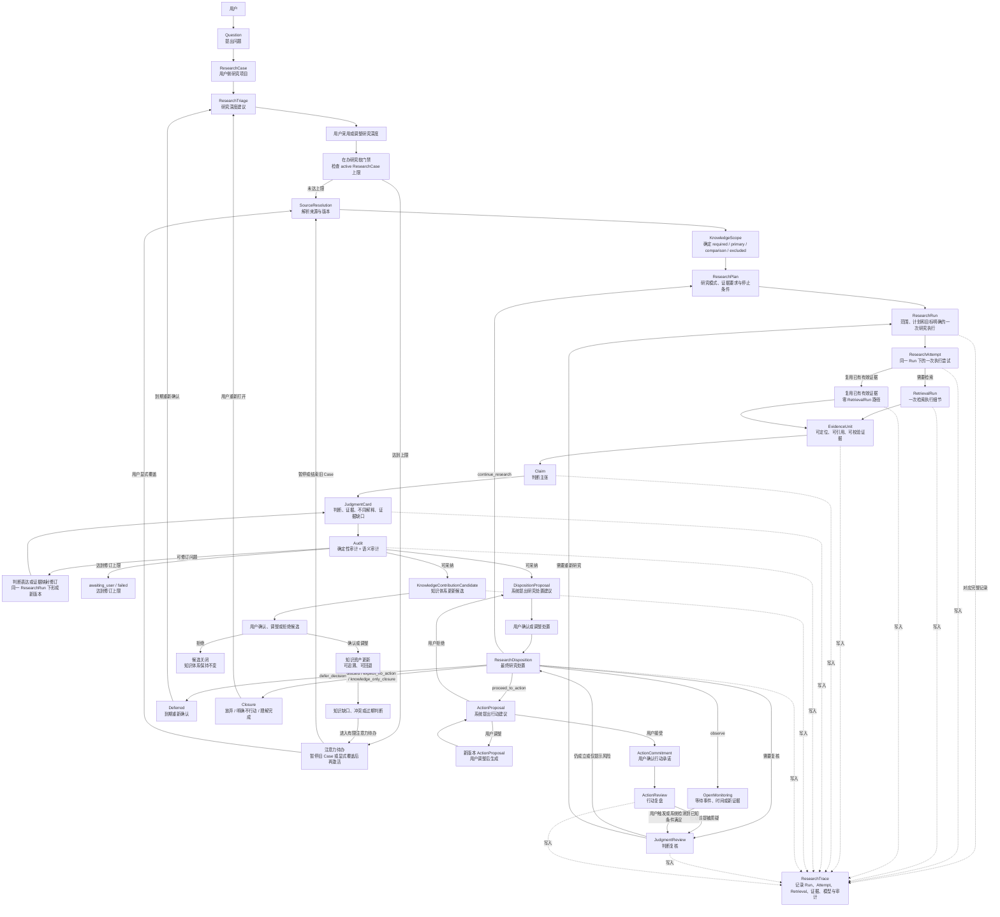
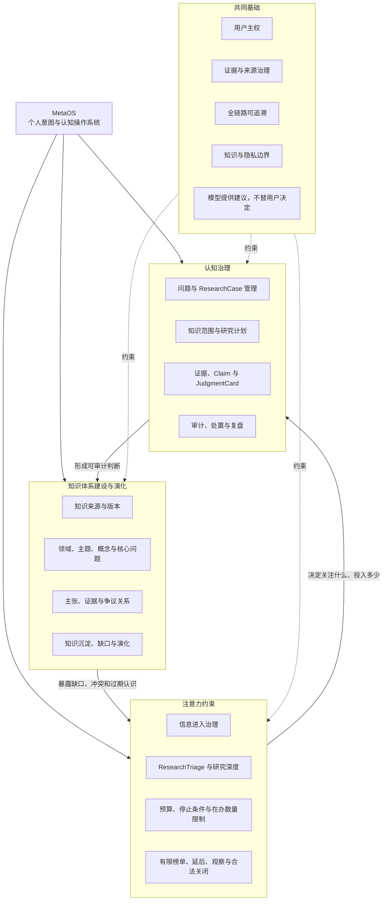
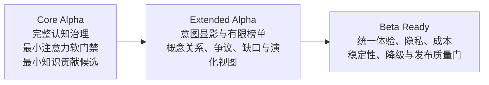

# MetaOS Alpha 业务架构

状态：Core Alpha 业务架构冻结候选

实现状态：本文档描述目标业务架构，不代表相关能力已经实现

权威范围：长期愿景、Alpha 产品形态、Core Alpha 业务主链、业务对象职责、用户控制点、业务指标与冻结验收场景

文档边界：本文档允许列出对象名称、业务分类、业务关系、不变量和用户控制点；不维护完整字段、枚举值、必填约束、数据类型和状态转换。这些内容以 `docs/DOMAIN_MODEL.md` 为唯一权威来源。检索算法、来源评分、候选融合和工程策略以 `docs/RAG_RETRIEVAL_STRATEGY.md` 和 `docs/TECHNICAL_ARCHITECTURE.md` 为准。

任务标识：`A0-DOC-001-R3`

关联一致性修订：`A0-DOC-002-R2`

## 1. 业务定位

MetaOS 的长期愿景、Alpha 产品形态和 Core Alpha 切入口必须分开理解。

长期愿景：

```text
MetaOS 是个人意图操作系统。
```

Alpha 产品形态：

```text
MetaOS Alpha 是面向个人知识库的研究与判断工作台。
```

Core Alpha 核心切入口：

```text
帮助用户围绕一个明确问题，
形成有范围、有证据、可审计、可修订、可处置的判断。
```

MetaOS Alpha 不是通用知识库、聊天机器人或新闻聚合器。它不追求回答更多内容，而是让每一次研究都能回答：

- 当前问题应进入什么研究深度。
- 应该从哪些知识来源中寻找证据。
- 应该采用什么研究方式。
- 哪些证据真正支持判断。
- 哪些结论只是事实、解释、推断、类比、争议观点或个人反思。
- 当前结果应该继续研究、观察、延后、放弃、明确不行动、理解完成，还是进入行动建议。
- 这个判断日后如何被复核、修订或失效。

### 1.1 MetaOS 的三项核心作用

MetaOS 的长期产品价值由三项相互关联的一级业务能力构成。它们不是三个开发阶段、独立 Agent 或微服务。

#### 认知治理

MetaOS 帮助用户治理从问题、知识范围、证据、Claim 到判断、处置和复核的全过程。

认知治理不承诺替用户给出绝对正确答案，而是帮助用户区分事实、解释、推断、类比和争议，暴露反证与知识缺口，使判断可审计、可修订，并在时间中接受复盘。

#### 注意力约束

MetaOS 帮助用户治理信息和问题对注意力的占用。

注意力约束覆盖信息进入、研究投入和退出处置，包括有限信息入口、研究深度建议、在办研究数量限制、时间与成本预算、停止条件、延后、观察、明确不行动和知识型关闭。目标不是让用户处理更多信息，而是让有限注意力优先服务当前最重要的问题。

#### 知识体系建设与演化

MetaOS 帮助用户将分散资料和单次研究结果沉淀为持续演化的个人知识体系。

知识体系不仅包含书籍、文档和索引，还包含领域、主题、概念、问题、Claim、EvidenceUnit、争议、关系、知识缺口和判断演化。每次研究都应能说明它为现有知识体系新增、修订、否定或暴露了什么。

三项能力形成持续循环：

```text
注意力约束
-> 认知治理
-> 知识体系沉淀
-> 暴露知识缺口、冲突和过期判断
-> 重新调整注意力
```

系统只能提出知识体系更新候选。长期知识资产的新增、修改、合并和删除必须保留用户确认与回退能力。

## 2. 目标用户与核心场景

Alpha 阶段目标用户是拥有个人知识库、需要长期研究和决策的知识工作者。

首要用户是产品创建者本人。Alpha 的设计应优先服务真实个人知识库、真实研究问题和真实行动复盘，而不是面向泛化用户画像做抽象优化。

首要场景：

- 指定一本或多本资料研究问题。
- 在全知识库中形成有证据的判断。
- 比较不同经典或知识来源。
- 将判断转化为行动、明确不行动或知识型关闭。
- 回看过去判断为何形成、后来是否成立。

非首要场景：

- 面向所有用户的通用知识问答。
- 无限新闻流或高频资讯消费。
- 自动替用户决定长期目标。
- 用经典作者人格化地陪聊。

## 3. 产品价值与可靠判断

Core Alpha 的核心价值不是给出绝对正确答案，而是形成可靠、可审计、可修订的判断。

MetaOS 所称的可靠判断并不保证结论绝对正确，而是满足：

- 使用了明确的知识范围。
- 核心 Claim 有可定位证据。
- 原文事实、解释、推断、类比、争议观点和个人反思被区分。
- 关键反证和证据缺口没有被隐藏。
- 显式来源约束没有被违反。
- 判断形成过程可以回溯。
- 新证据出现时可以被复核和修订。

判断生命周期原则：

- 单纯的技术实现、模型或检索策略变化，不应自动改变已经形成的历史判断状态。
- 只有原始证据身份、内容、可定位性或支持关系发生变化，或者重新执行研究产生新结果时，历史判断才需要失效、降级或重新复核。
- 判断复核由 `JudgmentReview` 承载。具体状态名称、转换条件和持久化字段以 `docs/DOMAIN_MODEL.md` 为准。

## 4. Alpha 交付分层

### 4.1 Core Alpha

Core Alpha 验证唯一核心命题：

```text
用户主动提出问题后，
MetaOS 能否帮助他形成可靠、可审计、可处置、可复核的判断。
```

Core Alpha 是冻结候选。其核心判断闭环和业务不变量不应被 Extended Alpha 或 Beta Ready 破坏。

Core Alpha 对三项核心能力的最小承诺：

- 认知治理：完整实现可靠判断、审计、处置和复核闭环。
- 注意力约束：实现 ResearchTriage、研究预算、停止条件、合法退出和在办 ResearchCase 软门禁。
- 知识体系建设：将可采纳判断转化为可由用户确认的 KnowledgeContributionCandidate。

Core Alpha 不实现知识图谱、自动合并知识、复杂关系编辑器或自动重写长期知识体系。

### 4.2 Extended Alpha

Extended Alpha 是方向性设计，允许验证后调整。

它在 Core Alpha 稳定的前提下探索：

- IntentTrace：显化候选意图，并允许用户修正。
- BookProfile 与 LensSkill：让经典提供有边界的认知视角。
- Cognitive Profile：记录用户长期原则、当前状态和认知模式，但只作为先验。
- ProfileUpdateCandidate：复盘后生成画像更新候选，而不是自动修改画像。
- InformationIntake：摄入有限来源。
- 三部有限榜单：通过认知部、商业部、技术部提供有限注意力入口。
- AttentionJustification：说明一条信息为什么值得或不值得占用注意力。
- 知识体系结构化：探索领域、主题、概念、争议关系、知识缺口和判断演化视图。

Extended Alpha 中任何模块失败，不得破坏 Core Alpha 闭环。

### 4.3 Beta Ready

Beta Ready 不改变 Core Alpha 的核心判断闭环和业务不变量。

Beta Ready 允许增加账号、权限、工作空间、配额、分享、视觉统一、移动端适配、开发者诊断、降级策略和发布质量门等产品化支撑概念，并让认知治理、注意力约束和知识体系演化在隐私、成本、性能和降级条件下稳定运行。

## 5. 业务主链与对象链

### 5.1 高层业务主链

业务主链解释价值如何产生：

```text
提出问题
-> 确定研究深度
-> 经过在办研究软门禁
-> 约束知识范围
-> 执行研究并组织证据
-> 形成并审计判断
-> 用户决定如何处置
-> 产生并确认知识体系更新候选
-> 后续复核或行动复盘
```

### 5.2 领域对象链

领域对象链说明业务主链由哪些对象承载：

```text
Question
-> ResearchCase
-> ResearchTriage
-> 用户采用或调整研究深度
-> SourceResolution
-> KnowledgeScope
-> ResearchPlan
-> ResearchRun
-> ResearchAttempt
-> RetrievalRun / 复用已有有效证据
-> EvidenceUnit
-> Claim
-> JudgmentCard
-> Audit
-> DispositionProposal / KnowledgeContributionCandidate
-> 用户分别确认、调整或拒绝
-> ResearchDisposition / 知识资产更新
-> JudgmentReview / ActionProposal / Closure / 知识缺口与冲突
```

`RetrievalRun` 属于执行细节，不进入高层业务主链，但必须能被 ResearchTrace 记录。

## 6. Core Alpha 用户旅程图



这张图强调：

- ResearchCase 是用户能理解的研究项目。
- ResearchRun 是一次范围、计划和核心目标已确定的研究执行。
- ResearchAttempt 是同一 ResearchRun 下的一次执行尝试。
- RetrievalRun 是 ResearchAttempt 内部的检索执行细节。
- 零 RetrievalRun 不等于无证据回答，只表示本次 ResearchAttempt 复用了已经存在且重新校验有效的 EvidenceUnit。
- ResearchTrace 是 ResearchRun 的完整审计记录。
- JudgmentReview 复核“判断是否仍成立”。
- ActionReview 复核“行动是否有效”。
- ResearchDisposition 必须经过用户确认或调整。
- 在办 ResearchCase 达到上限后，新问题会进入注意力待办；系统不自动关闭旧 Case，用户可显式覆盖软门禁。
- 只有可采纳 JudgmentCard 才能产生 KnowledgeContributionCandidate。
- 未确认的知识贡献候选不会改变长期知识体系，其生成或处理失败也不阻断判断与处置闭环。
- OpenMonitoring、Deferred 和 Closure 都可以在用户触发或已知条件满足时回到复核或研究。

## 7. 业务能力与交付阶段视图

业务能力图回答“MetaOS 长期为用户创造什么价值”；交付阶段图回答“这些能力何时以什么深度交付”。两者不能相互替代。

### 7.1 业务能力图



### 7.2 交付阶段图



## 8. Core Alpha 业务对象职责

本章只说明对象为什么存在、解决什么业务问题、与上下游对象的关系，以及不可违反的业务规则。完整字段、枚举、状态机和持久化约束不在本文档维护。

### 8.1 ResearchCase

ResearchCase 是用户侧长期研究聚合对象，表示用户正在研究的一个问题、主题或判断链。

它解决的问题是：同一个问题可能被连续追问、重新检索、修订判断和复核行动前提。用户需要看到“这是同一个研究项目的演化”，而不是只能看到多条孤立执行记录。

业务关系：

- 一个 ResearchCase 可以包含原始问题和后续追问。
- 一个 ResearchCase 可以包含当前 KnowledgeScope。
- 一个 ResearchCase 可以拥有多个 ResearchRun。
- 一个 ResearchCase 可以包含多个 JudgmentCard 版本。
- 一个 ResearchCase 可以关联 ResearchDisposition、JudgmentReview、ActionProposal、ActionCommitment 和 ActionReview。

业务规则：

- ResearchCase 不是聊天会话。
- ResearchCase 不是 ResearchTrace 的别名。
- 一次失败或重新研究不应自动创建新的 ResearchCase。
- Core Alpha 支持创建、归档、重新打开 ResearchCase。
- 用户可以保存多个 ResearchCase，但同时处于 active 的在办 ResearchCase 必须有限。
- 在办上限由用户配置或采用系统默认值，本文档不固定具体数量。
- 达到上限时，新问题应先进入注意力待办，而不是自动激活或拒绝保存。
- 用户可以暂停或结束旧 Case，也可显式覆盖软门禁；覆盖行为必须可追溯。
- 系统不得自动选择要暂停或关闭的 ResearchCase。
- 用户可以从现有 ResearchCase 的某个问题或判断派生新的 ResearchCase；原 ResearchCase、ResearchRun、JudgmentCard 和 ResearchTrace 保持不变，新 Case 保留来源关联。
- ResearchCase 合并和移动历史记录式拆分不进入 Core Alpha。

### 8.2 ResearchTriage

ResearchTriage 是研究深度建议机制，不是注意力守门人。

它解决的问题是：同一个问题可能只需要已有证据直接回答，也可能需要快速检索、标准研究、深度研究或先澄清歧义。

Triage 建议包括：

- 直接回答：使用当前已存在的可靠证据，不启动广泛检索。
- 快速检索：小候选池、较低预算。
- 标准研究：正常来源路由、检索、判断和审计。
- 深度研究：多轮候选、反证和更高预算。
- 需要先澄清：提醒问题存在关键歧义，用户仍可覆盖。

业务规则：

- ResearchTriage 只决定研究深度、预算和执行策略。
- ResearchTriage 应给出预计注意力成本和是否建议现在激活该 Case，但不替用户决定。
- ResearchTriage 与在办软门禁共同决定问题是进入 active 研究还是注意力待办。
- ResearchTriage 不决定是否保留溯源与证据约束。
- 用户可以覆盖系统建议。
- 系统不能因为判断“价值低”而拒绝用户研究。
- 当前显式选择高于 Triage 推荐。
- 进入 Core Alpha 工作台的正式回答均应关联 ResearchCase 和 ResearchTrace。
- 直接回答不能允许模型参数知识冒充指定来源。

### 8.3 SourceResolution

SourceResolution 解析用户在问题中指定、比较或排除的知识来源。

它解决的问题是：用户说“鬼谷子”“理想国”或“不要引用理想国”时，系统必须先解析这些锚点，再决定检索范围。

业务规则：

- SourceResolution 不仅解析作品身份，也应在必要时解析版本、译本、载体和内容版本。
- 系统采用的作品版本、译本、载体或内容版本必须对用户可见。
- 存在多个可用版本时，用户可以进行选择或切换。
- 用户指定的版本当前不可用时，系统必须明确报告不可用，不得静默替换成其他版本。
- 显式来源解析失败时，不得静默回退到全库检索。
- 显式来源存在歧义时，应进入澄清、默认版本策略或错误状态，而不是随机选择。
- excluded 来源不得进入检索候选、上下文、工具调用输入、引用、EvidenceUnit 和判断证据链。

### 8.4 KnowledgeScope

KnowledgeScope 决定一次研究允许使用哪些知识来源。

核心业务分类：

- `required_sources`：必须进入独立取证和结果报告的来源。
- `primary_sources`：决定回答主结构的来源。
- `comparison_sources`：用于比较和对照的来源。
- `excluded_sources`：禁止进入候选、上下文、工具输入、引用和证据链的来源。

业务规则：

- 同一来源不得同时出现在 required 与 excluded。
- required 来源必须被独立处理，并报告支持、反驳、无证据或不可用等结果。
- required 来源没有证据时，应报告该来源证据不足，不能找其他来源代答。
- comparison 来源只能用于对照，不能替代 primary 或 required 来源。
- Core Alpha 默认采用 `evidence_only`，模型参数知识不能伪装成指定来源内容。

### 8.5 ResearchPlan

ResearchPlan 回答“怎样研究”，避免不同问题都走同一种研究动作。

它解决的问题是：事实查询、概念解释、多来源比较和枚举型研究需要不同执行策略。

Core Alpha 最小研究模式包括：

- `fact_lookup`：局部事实检索。
- `source_interpretation`：原文概念和上下文解释。
- `compare_sources`：来源独立取证后按统一维度比较。
- `enumerate_pattern`：候选生成、条件验证、反证检索、证据矩阵和排除理由。

业务规则：

- 研究模式不得只是标签，必须影响证据组织方式。
- 显式来源锚点应作为范围约束，不应重复污染来源内语义查询。
- 枚举型研究不能退化为一次普通检索。

### 8.6 ResearchRun、ResearchAttempt、RetrievalRun 与 ResearchTrace

ResearchRun 是一次范围、计划和核心目标已确定的研究执行。ResearchTrace 是该 ResearchRun 的完整审计记录。

ResearchAttempt 是同一 ResearchRun 下的一次执行尝试。RetrievalRun 是 ResearchAttempt 内部的一次检索执行细节。

业务规则：

- 一个 ResearchCase 可以拥有多个 ResearchRun。
- 每个 ResearchRun 对应一个完整 ResearchTrace。
- 一个 ResearchRun 可以发生多个 ResearchAttempt。
- 每个 ResearchAttempt 可以包含零个或多个 RetrievalRun。
- 不包含 RetrievalRun 的 ResearchAttempt 只能复用已有且重新校验有效的 EvidenceUnit，不得使用模型参数知识代替证据。
- ResearchTrace 汇总并记录全部 ResearchAttempt、RetrievalRun 和复用证据关系。
- 失败 ResearchAttempt 不得被后续 ResearchAttempt 覆盖。
- 只有在 KnowledgeScope、ResearchPlan 和核心研究目标保持不变时，重试才可以作为同一 ResearchRun 的新 ResearchAttempt。
- 范围、研究模式、核心证据要求或研究目标发生实质变化时，必须创建新的 ResearchRun。
- RetrievalRun 属于执行细节，不进入高层业务主链。

修订边界：

- 仅修订判断表达或证据映射，例如降低结论强度、补充引用、修正 Claim 分类，应在同一 ResearchRun 下产生新的 JudgmentCard 版本。
- 重新检索、改变 KnowledgeScope、改变研究模式或改变核心证据要求，应创建新的 ResearchRun，并形成新的 ResearchTrace 和新的 JudgmentCard 版本。

### 8.7 EvidenceUnit

EvidenceUnit 是 Claim 可以引用的最小证据单元，不应只等同于一段文本切片。

它解决的问题是：系统不能只说“某段材料支持结论”，而必须让用户知道哪段证据、来自哪个来源、如何支持或反驳判断。

业务规则：

- 核心 Claim 必须引用可定位、可校验的 EvidenceUnit。
- EvidenceUnit 必须能回到具体来源、版本和定位。
- 来源篇幅不得决定来源权重。
- 相邻或重叠文本不得被计算为多份独立证据。
- 检索失败、证据不足和来源不存在必须被区分。

### 8.8 Claim 与 JudgmentCard

Claim 是判断的基本单位。JudgmentCard 是一次研究面向用户的综合出口。

它们解决的问题是：判断不能只是一段流畅回答，而要拆成可审计、可接受、可拒绝、可修订的主张。

业务规则：

- Claim 必须区分认识性质和表达角色。
- 认识性质至少包括事实、解释、推断、类比、假设。
- 表达角色至少包括核心判断、补充说明、反证、建议、待验证问题、用户反思。
- 表达角色为“建议”的 Claim 仍然只是 JudgmentCard 中的一项判断表达，不会自动成为 ActionProposal，更不会自动形成 ActionCommitment。
- Claim 必须表达证据支持状态和重要性，但具体字段和枚举以 `docs/DOMAIN_MODEL.md` 为准。
- 核心 Claim 无支持证据必须阻断。
- 类比必须标记为模型推演，不能写成原文事实。
- 有争议的判断不得被包装成确定结论。
- JudgmentCard 采用版本化管理；每次修订产生新的 JudgmentCard 版本。是否存在独立版本实体，由 `docs/DOMAIN_MODEL.md` 决定。

### 8.9 Audit

Audit 判断一次研究是否可采纳。

它解决的问题是：系统不能把“语言上像答案”的内容直接交给用户，而必须检查来源、引用、证据支持和推断越界。

审计分为两类：

- 确定性审计：引用是否存在、来源是否越界、required 来源是否被独立处理、excluded 来源是否被使用。
- 语义审计：证据是否真正支持 Claim、是否省略反证、是否把相关性写成因果、是否存在确认偏误。

业务规则：

- 审计结果不能只有通过或失败，必须能表达问题、严重性、影响范围和建议修订方向。
- 非阻断性审计警告可以由用户知情确认、接受风险或要求修订，确认后可以继续处置或行动。
- 阻断性审计问题必须阻止 JudgmentCard 被显示为可采纳判断。
- 用户不能通过接受操作，将 blocked Claim 改为 ready。
- 阻断性审计问题不得进入 `proceed_to_action`，也不能通过用户接受变为可靠判断。
- 阻断后，用户只能拒绝采用该草稿、终止本次研究、延后处理、继续研究或查看草稿；这些操作不表示形成可靠判断。
- 审计阻断后进入有上限的版本化修订循环。
- 达到修订上限后，研究应转入 awaiting_user 或 failed，而不是假装得到可靠答案。

### 8.10 DispositionProposal、ResearchDisposition 与 Action

DispositionProposal 是系统提出的研究处置建议。ResearchDisposition 是用户确认或调整后的最终处置。

它们解决的问题是：系统不能替用户决定“放弃这个问题”“不行动”或“理解完成”。

处置语义：

- `continue_research`：现有证据不足，立即继续研究。
- `observe`：当前不继续研究，等待外部事件、时间或新证据。
- `defer_decision`：已有一定判断，但用户选择在明确时间点重新决策。
- `discard`：问题已经失去价值或不再值得继续研究。
- `explicit_no_action`：研究已经形成判断，结论是当前不应采取行动。
- `knowledge_only_closure`：理解目标已经完成，该问题本身不要求行动。

业务规则：

- Audit 之后先生成 DispositionProposal。
- 用户确认或调整后，才形成 ResearchDisposition。
- `observe` 是事件或条件驱动。
- `defer_decision` 是时间或用户决策驱动。
- 只有 `proceed_to_action` 才进入 ActionProposal。
- 系统只能提出 ActionProposal，用户接受后才形成 ActionCommitment。
- ActionProposal 被用户调整时，应产生新版本建议。
- ActionProposal 被用户拒绝时，应回到处置确认，而不是直接静默关闭。

### 8.11 JudgmentReview 与 ActionReview

JudgmentReview 是业务对象，记录一次判断复核及其结果。ActionReview 记录一次行动复盘及其结果。

两者不应混用：

- JudgmentReview 复核“认知是否仍成立”。
- ActionReview 复核“行动是否有效”。

Core Alpha 最小能力：

- 用户可以主动发起 JudgmentReview。
- 用户重新打开 ResearchCase 时可以发起 JudgmentReview。
- 系统发现已引用证据被删除、定位失效或内容变化时，必须提示原判断不再有效或需要复核。
- OpenMonitoring、Deferred 到期后，允许用户手动恢复研究或发起复核。

后续增强能力：

- 自动发现新证据影响了哪些历史判断。
- 自动定期复核。
- 自动监控外部事件。
- 自动发送提醒。

业务规则：

- JudgmentReview 至少必须能够表达判断仍然成立、可信度降低、需要重新研究、被新版本取代、因证据失效不可继续使用等业务含义。
- 具体状态名称、枚举和转换规则由 `docs/DOMAIN_MODEL.md` 定义。
- ActionReview 如果发现行动前提错误，应进入 JudgmentReview；必要时启动新的 ResearchRun。

### 8.12 KnowledgeContributionCandidate

KnowledgeContributionCandidate 是一次可采纳研究对个人知识体系的更新候选。

它解决的问题是：JudgmentCard 不应作为孤立回答留在 ResearchCase 中，而应说明本次研究可以为已有知识体系新增、修订、否定或暴露什么。

候选至少应能表达以下业务含义：

- 新增一个概念或有证据的主张。
- 修订或否定已有主张。
- 增加支持证据或反证。
- 建立两个概念或主张之间的关系。
- 标记知识缺口、争议或需要复核的旧判断。

业务规则：

- 只有通过阻断门的可采纳 JudgmentCard 才能产生可采纳的知识贡献候选。
- 候选必须绑定具体 JudgmentCard 版本和支撑它的 EvidenceUnit。
- 原始 JudgmentCard 或 EvidenceUnit 失效时，相关候选或已沉淀知识必须能够进入复核。
- 用户可以确认、调整或拒绝候选。
- 未确认候选不得改变长期知识体系，没有用户操作不能被默认为接受。
- blocked JudgmentCard 不得沉淀为可靠知识资产。
- 候选生成、确认或写入失败不得破坏判断、处置和行动闭环。
- 具体字段、枚举、合并规则和回退方式以 `docs/DOMAIN_MODEL.md` 为准。

### 8.13 个人知识体系边界

MetaOS 中的个人知识体系至少包含五层：

```text
来源与版本层
书籍、文章、PDF、网页、译本和内容版本

概念与主题层
领域、主题、概念和核心问题

主张与证据层
Claim、EvidenceUnit 和 JudgmentCard

关系与争议层
支持、反驳、冲突、类比、因果和包含关系

缺口与演化层
未知问题、薄弱证据、过期判断和认知变化
```

Core Alpha 只承诺通过 KnowledgeContributionCandidate 建立最小沉淀出口；复杂关系建模、全局概念编辑和演化视图属于 Extended Alpha。

## 9. 用户控制点

MetaOS 的可靠性不只来自系统审计，也来自用户能参与判断形成。

Core Alpha 至少应保留以下用户控制点：

- 创建、归档或重新打开 ResearchCase。
- 从现有 ResearchCase 派生新的 ResearchCase。
- 设置在办 ResearchCase 上限。
- 在达到上限时暂停旧 Case、保留新问题为待办，或显式覆盖软门禁。
- 采用或调整 ResearchTriage 给出的研究深度。
- 指定、比较或排除知识来源。
- 指定或切换可用来源版本。
- 修正 KnowledgeScope。
- 标记“证据不支持此判断”。
- 标记“这只是推断”。
- 标记“缺少反证”。
- 要求降低结论强度。
- 要求继续查证。
- 接受或拒绝 Claim。
- 确认非阻断性审计警告或要求修订。
- 确认或调整 DispositionProposal。
- 接受、拒绝或调整 ActionProposal。
- 发起 JudgmentReview。
- 查看 KnowledgeContributionCandidate 及其 JudgmentCard 版本和 EvidenceUnit 依据。
- 确认、调整或拒绝 KnowledgeContributionCandidate。
- 要求已沉淀知识进入复核，或在后续契约允许时回退更新。

没有用户操作不能被默认为接受。系统应区分“用户明确接受”“用户拒绝”“用户尚未处理”。

## 10. Extended Alpha 业务增强

Extended Alpha 是方向性设计，不与 Core Alpha 使用同一冻结强度。

### 10.1 IntentTrace

IntentTrace 显化用户可能真正关心的问题。

业务规则：

- 当前问题权重最高。
- 当前对话上下文和用户反馈权重很高。
- 用户画像只能作为先验。
- 没有画像时，Core Alpha 闭环仍必须完整运行。
- 用户否定候选意图后，不得继续强化该方向。

### 10.2 BookProfile 与 LensSkill

经典不是人格 Agent。经典通过 BookProfile 和 LensSkill 提供有边界的认知视角。

业务规则：

- Alpha 当前以 BookProfile 为经典视角的主要载体。
- LensSkill 必须区分解释经典自身内容和使用经典视角解释现代对象。
- 解释经典自身内容时，核心判断必须由原文支持。
- 使用经典视角解释现代对象时，必须区分原文观点、现代类比和模型推演。
- 不模拟经典作者人格。
- 不把现代类比写成“原文认为”。
- LensSkill 失败不得破坏 Core Alpha 判断闭环。
- 长期可将认知视角扩展到书籍之外的专家框架、方法论或理论体系；该方向不属于当前 Alpha 承诺。

### 10.3 认知画像

认知画像不直接输出意图，只提供先验。

业务规则：

- 画像至少区分用户明确声明的长期原则、当前状态和系统根据行为推断的认知模式。
- 用户可以查看、修改、删除或关闭画像。
- 单次行为不得直接修改长期画像。
- 复盘只产生 ProfileUpdateCandidate。
- ProfileUpdateCandidate 需要用户确认或规则审核后才可合并。
- CurrentState 必须具有过期时间和衰减策略。

### 10.4 InformationIntake 与三部有限榜单

InformationIntake 负责接收候选资料，三部有限榜单负责有限注意力分配。

三部包括：

- 认知部。
- 商业部。
- 技术部。

Alpha 规则：

- 每部最多 3 条。
- 总榜单最多 5 条。
- 没有足够价值的信息时返回“今日无事上奏”。
- 禁止为了填满配额而推荐弱内容。

业务规则：

- 三部不是无限新闻流。
- 每部可以有候选池，但最终展示必须有限。
- 榜单必须说明值得看与不值得看的理由。
- 用户阅读、停留、跳过、收藏、关闭等互动可以进入 CognitiveEvent。
- CognitiveEvent 只能辅助画像候选，不得直接覆盖当前问题。

### 10.5 知识体系结构化与演化

Extended Alpha 在 KnowledgeContributionCandidate 的最小沉淀出口之上，探索：

- 领域、主题、概念和核心问题的结构化视图。
- 主张之间的支持、反驳、冲突、类比和因果关系。
- 知识缺口、证据薄弱区和过期判断视图。
- 同一主张随时间、证据和 JudgmentReview 变化的演化记录。

这些能力不得自动重写用户已确认的长期知识资产，也不要求 Core Alpha 引入图数据库。

## 11. 用户工作台

Streamlit 当前界面在 Alpha 中逐步收敛为个人认知工作台。

建议主导航：

- 工作台：提出问题，区分 active ResearchCase 与注意力待办，查看研究深度、在办软门禁、判断卡、处置建议和行动建议。
- 知识：查看作品、版本、结构、引用记录、KnowledgeContributionCandidate 和已确认知识资产。
- 复盘：查看 ResearchDisposition、JudgmentReview、ActionReview、画像更新候选和知识贡献复核。
- 开发者：查看研究轨迹、证据链、审计问题、失败原因、外部模型材料范围和执行成本。

业务规则：

- 默认用户界面不暴露底层检索实现细节。
- 开发者层保留诊断能力。
- 判断应区分草稿、审计中、可采纳、需复核和不可继续使用。
- 审计阻断时，UI 可以展示草稿和问题，但不能以最终结论样式呈现。
- 用户可以查看系统发送给外部模型的材料范围。

## 12. 业务指标

业务指标用于发现问题，不直接作为优化目标。不能为了提高完成率而降低审计标准，也不能为了提高行动接受率而增加激进建议。

### 12.1 业务结果指标

| 指标 | 定义 | 计算口径 | 观测周期 | 期望方向 | 不能单独说明什么 |
| --- | --- | --- | --- | --- | --- |
| 可靠判断完成率 | 进入正式研究后形成 ready JudgmentCard 的比例 | ready JudgmentCard 所属 ResearchCase 数 / 进入正式研究的 ResearchCase 数 | 周 / 月 | 稳定提高 | 不能证明行动一定正确 |
| 处置完成率 | 形成最终 ResearchDisposition 的比例 | 有最终 ResearchDisposition 的 ResearchCase 数 / 已具备处置条件的 ResearchCase 数 | 周 / 月 | 提高 | 不能说明处置一定正确 |
| 判断复核完成率 | 到期或满足复核条件后完成 JudgmentReview 的比例 | 已完成 JudgmentReview 的判断数 / 已到期或满足复核条件的判断数 | 月 / 季度 | 提高 | 不能说明原判断质量高 |
| 行动复盘闭环率 | 已确认行动完成 ActionReview 的比例 | 有 ActionReview 的 ActionCommitment 数 / 到期 ActionCommitment 数 | 周 / 月 | 提高 | 不能说明行动收益高 |

### 12.2 业务可靠性护栏

| 指标 | 定义 | 计算口径 | 观测周期 | 期望方向 | 不能单独说明什么 |
| --- | --- | --- | --- | --- | --- |
| 来源边界违规率 | excluded 来源进入候选、上下文、工具输入、引用或证据链的比例 | 违规研究数 / 涉及 excluded 来源的研究数 | 周 / 月 | 目标为 0 | 不能说明未排除来源都合适 |
| 核心 Claim 证据覆盖率 | ready 核心 Claim 具有有效支持证据的比例 | 具有有效支持证据的 ready 核心 Claim 数 / 所有 ready 核心 Claim 数 | 周 / 月 | 目标为 100% | 不能说明证据解释一定充分 |
| 引用定位有效率 | EvidenceUnit 能回到有效来源和定位的比例 | 有效定位 EvidenceUnit 数 / 被引用 EvidenceUnit 数 | 周 / 月 | 提高 | 不能说明引用一定支持 Claim |
| required source 独立检索报告覆盖率 | required source 均有独立结果说明的比例 | 有独立结果说明的 required source 数 / 成功解析的 required source 数 | 周 / 月 | 目标为 100% | 来源解析失败应另行观察 |
| 审计阻断误显示率 | 被阻断内容误显示为最终结论的比例 | 误显示 JudgmentCard 数 / 被阻断 JudgmentCard 数 | 周 / 月 | 目标为 0 | 不能说明非阻断内容都高质量 |
| 失效判断误显示率 | 已不应继续使用的判断仍显示为当前有效的比例 | 误显示失效判断数 / 已知失效判断数 | 月 / 季度 | 目标为 0 | 不能说明所有未失效判断都正确 |

### 12.3 运营与技术观察项

| 指标 | 定义 | 计算口径 | 观测周期 | 期望方向 | 不能单独说明什么 |
| --- | --- | --- | --- | --- | --- |
| 单个可靠判断平均执行成本 | 形成 ready JudgmentCard 的平均资源成本 | 总执行成本 / ready JudgmentCard 数 | 周 / 月 | 可控 | 不能为了降成本牺牲证据 |
| 平均研究耗时 | 从进入正式研究到 ready JudgmentCard 或明确处置的时间 | 中位数与 P95 | 周 / 月 | 下降 | 不能为了更快牺牲审计 |
| 平均修订轮数 | JudgmentCard 从草稿到可采纳的平均修订次数 | 修订次数 / ready JudgmentCard 数 | 周 / 月 | 可观测 | 过低不一定好，可能审计不足 |
| 达到修订上限比例 | 审计修订达到上限的比例 | 达到上限 JudgmentCard 数 / 进入审计 JudgmentCard 数 | 周 / 月 | 下降 | 不能说明未达上限都可靠 |
| 检索失败后有效降级率 | 检索失败后系统给出正确失败说明或替代处置的比例 | 有效降级次数 / 检索失败次数 | 周 / 月 | 提高 | 不能说明检索本身质量高 |

### 12.4 用户主权指标

| 指标 | 定义 | 计算口径 | 观测周期 | 期望方向 | 不能单独说明什么 |
| --- | --- | --- | --- | --- | --- |
| 未确认处置被视为已接受比例 | 系统将未确认处置当成最终处置的比例 | 违规处置数 / 待确认处置数 | 周 / 月 | 目标为 0 | 不能说明确认后的处置正确 |
| 系统建议被用户调整比例 | 用户调整 Triage、DispositionProposal 或 ActionProposal 的比例 | 被调整建议数 / 已呈现建议数 | 周 / 月 | 可观测 | 高可能是系统不准，也可能是用户积极治理 |
| 用户确认或覆盖非阻断性审计警告比例 | 用户知情处理非阻断警告的比例 | 被确认或覆盖的非阻断警告数 / 已呈现非阻断警告数 | 周 / 月 | 可观测 | 不代表阻断问题可被覆盖 |
| 用户查看外部模型材料范围比例 | 用户查看外部模型发送材料范围的比例 | 查看次数 / 外部模型调用展示次数 | 月 / 季度 | 可观测 | 低不一定代表用户不关心隐私 |

### 12.5 注意力与知识体系专项观察项

| 指标 | 定义 | 计算口径 | 观测周期 | 期望方向 | 不能单独说明什么 |
| --- | --- | --- | --- | --- | --- |
| 在办 ResearchCase 超限与显式覆盖率 | 用户超过在办上限并显式覆盖软门禁的情况 | 超限覆盖次数 / 触发软门禁次数 | 周 / 月 | 可观测 | 高可能表示上限不合适，也可能是短期必要并行 |
| 注意力待办滞留时间 | 问题进入待办后到激活、放弃或关闭的时间 | 中位数与 P95 | 周 / 月 | 可观测 | 时间长不一定代表问题无价值 |
| 知识贡献候选处理分布 | 用户对 KnowledgeContributionCandidate 的确认、调整、拒绝和未处理分布 | 各类处理数 / 已呈现候选数 | 周 / 月 | 可观测 | 确认率高不证明候选质量或知识体系质量高 |
| 已确认知识贡献复用率 | 已沉淀知识在后续研究中被实际引用的比例 | 被后续 ResearchCase 使用的已确认知识贡献数 / 可复用的已确认知识贡献数 | 月 / 季度 | 可观测 | 低复用不一定表示贡献无价值，可能尚未出现相关问题 |

上述指标用于发现注意力分配和知识沉淀中的问题，不应为了降低在办数量而拒绝有价值的研究，也不应为了提高候选确认率而弱化用户审查。

### 12.6 冻结与发布质量门

Golden Cases 审计逃逸率作为冻结与发布质量门，不作为日常业务指标。目标为 0。

## 13. Core Alpha 冻结验收场景

这些场景是业务架构冻结验收场景，不是完整自动化测试用例。具体测试输入、Fixture 和断言由后续评测文档维护。

| 场景 | 输入条件 | 用户显式约束 | 系统必须行为 | 系统禁止行为 | 最终可观察结果 | 关联业务不变量 |
| --- | --- | --- | --- | --- | --- | --- |
| 指定单一来源解释 | 用户要求解释某概念 | 只允许《鬼谷子》 | 只在指定来源中取证；证据不足时说明不足 | 用全库其他资料代答 | JudgmentCard 只引用允许来源，或返回该来源证据不足 | 显式来源约束优先；模型参数知识不能伪装成指定来源 |
| 双来源比较 | 用户比较《鬼谷子》和《理想国》 | 两个来源都必须覆盖 | 两边分别取证，再按统一维度比较 | 只取证一方后推断另一方 | 比较结论显示双方 EvidenceUnit 和差异 | comparison 来源必须独立取证 |
| required 来源无证据 | 用户指定某来源必须参与 | required 来源已解析但无相关证据 | 报告该来源 no_evidence | 找其他来源填补 required 来源结论 | ResearchDisposition 可建议继续研究或证据不足关闭 | required 来源必须独立报告；无证据不得代答 |
| excluded 来源污染测试 | 用户明确排除某来源 | excluded 来源存在且相关 | 排除该来源进入候选、上下文、工具输入、引用和证据链 | 引用或用该来源支撑核心 Claim | Trace 和 JudgmentCard 不含 excluded 来源证据 | excluded 来源边界可审计 |
| 短资料公平性测试 | 短资料与长资料都可能相关 | 无显式偏好 | 短资料获得独立被检索和报告机会 | 因篇幅短而完全失去候选机会 | 来源报告显示短资料 supporting / contradicting / no_evidence / unavailable 之一 | 来源篇幅不得决定来源权重 |
| 审计阻断测试 | 核心 Claim 无证据 | 用户仍想看结论 | 阻止其显示为可采纳判断，可展示草稿和问题 | 把 blocked Claim 标为 ready | UI 显示审计问题，不能作为可靠判断处置 | 审计状态与用户接受状态独立 |
| 判断失效测试 | 关键证据删除或版本变化 | 用户查看旧判断 | 提示旧判断不可继续作为当前有效判断 | 继续显示为 ready 且无风险提示 | JudgmentReview 或失效提示可见 | 判断必须随证据变化被复核或失效 |
| 在办软门禁 | active ResearchCase 已达用户上限 | 用户提交新问题 | 保存问题并进入注意力待办，提供暂停旧 Case 或显式覆盖的选择 | 自动关闭旧 Case、拒绝保存新问题或静默超限 | 新 Case 处于待办，覆盖操作可追溯 | 注意力约束不覆盖用户主权 |
| 知识贡献证据绑定 | JudgmentCard 已通过审计 | 用户查看候选贡献 | 展示候选所绑定的 JudgmentCard 版本和 EvidenceUnit | 产生无法追溯的长期知识 | 用户可基于具体证据确认或调整 | 知识沉淀必须继承判断证据链 |
| 知识贡献拒绝 | 系统已生成 KnowledgeContributionCandidate | 用户拒绝候选 | 保留拒绝记录，知识体系保持不变 | 将未确认候选写入长期知识 | 候选关闭，后续研究不引用其为已确认知识 | 没有用户操作不能默认为接受 |
| blocked 判断禁止沉淀 | JudgmentCard 存在阻断性审计问题 | 用户查看草稿 | 允许查看草稿与审计问题，不生成可采纳知识贡献 | 将 blocked Claim 沉淀为可靠知识资产 | 无可确认 KnowledgeContributionCandidate | 认知治理的审计门同样约束知识沉淀 |

## 14. 全局业务原则

### 14.1 上下文优先级

所有检索、推荐、意图推断、行动建议都必须遵守：

```text
1. 用户当前显式约束
2. 当前问题和当前会话上下文
3. 用户当前状态
4. UserConstitution 中的长期原则
5. 历史 CognitivePattern
6. 系统通用默认值
```

任何下层信息不得覆盖上层显式要求。

### 14.2 证据原则

- 证据优先于模型自由发挥。
- 模型参数知识不能伪装成指定知识来源。
- 来源篇幅不得决定来源权重。
- 短资料不因篇幅短而失去被引用机会。
- 证据不足、来源歧义和检索失败必须明确区分。
- 原文事实、模型推断、争议观点和个人反思必须区分。

### 14.3 用户主权原则

- 画像只提供先验，不覆盖当前问题。
- Triage 只提供建议，不阻止用户研究。
- 系统只能提出 DispositionProposal，最终 ResearchDisposition 由用户确认或调整。
- 系统建议必须经用户确认后才成为行动。
- 用户可以拒绝、调整或关闭画像更新。
- 不行动、延后、继续研究、观察、复核和理解完成都是合法处置。

### 14.4 知识边界原则

- 用户私有资料默认不得外泄。
- 不同知识库或工作空间之间不得串库。
- excluded 来源不得进入检索候选、上下文、工具调用输入、引用、EvidenceUnit 和判断证据链。
- 由于无法证明模型权重中不存在某一来源的潜在知识，系统不承诺在参数层消除该知识；系统只承诺它不能成为可采纳判断的证据，也不能被伪装成允许来源内容。
- ResearchTrace 默认保存必要的定位、Hash 和摘要；是否保存完整原文，应由资料敏感级别与本地 / 外部模型策略决定。
- 用户可以删除研究记录及其衍生画像候选。
- 外部模型调用时，应明确发给哪个 Provider、发送哪些片段、是否包含用户画像、是否可关闭。

### 14.5 经典视角原则

- 经典是知识来源和认知视角，不是人格化 Agent。
- 书籍是来源，BookProfile 描述其思想结构，LensSkill 提供受边界约束的使用方式。
- 原文观点、现代类比和模型推演必须分开标记。
- Alpha 不承诺把所有方法论、专家理论或组织管理体系都建成 LensSkill。

### 14.6 注意力与知识演化原则

- 在办数量是用户可治理的软门禁，不是系统拒绝保存问题的理由。
- 新问题进入待办不代表问题无价值，只表示当前不占用 active 研究位。
- 可靠判断可以生成知识贡献候选，但不会自动改变长期知识体系。
- 已确认知识资产必须可追溯到它所依据的 JudgmentCard 版本与 EvidenceUnit。
- 知识缺口、冲突和过期判断可以进入注意力待办，但不得自动抢占当前优先级。

## 15. 与其他文档的关系

本文档只维护业务目标、业务主链、业务闭环、用户控制点、业务指标和冻结验收场景。

本次 R3 只冻结三项一级业务能力、在办软门禁和 KnowledgeContributionCandidate 的业务语义。后续文档按以下权威边界分别承接：

- `docs/DOMAIN_MODEL.md`：定义 KnowledgeContributionCandidate、知识贡献与 JudgmentCard / EvidenceUnit 的关系，以及 active / backlog 的状态语义。
- `docs/TECHNICAL_ARCHITECTURE.md`：定义知识体系能力的模块或 Port、候选确认写入路径和 Extended Alpha 隔离，不将其拆成独立微服务。
- `docs/API_CONTRACTS.md`：定义候选查看、确认、调整和拒绝契约。
- `docs/METAOS_ALPHA_UNIFIED_PLAN.md`、`docs/ROADMAP.md` 和 `docs/TASK_INDEX.md`：同步阶段顺序、任务依赖和验收条件。

字段、枚举、数据库表、API 路径、合并算法和图数据库选型不在本文档定义。

其他权威文档：

- 技术模块、Worker、存储、模型适配：`docs/TECHNICAL_ARCHITECTURE.md`
- 对象字段、状态机、领域关系：`docs/DOMAIN_MODEL.md`
- API 请求与响应契约：`docs/API_CONTRACTS.md`
- 阶段顺序和里程碑：`docs/ROADMAP.md`
- 具体任务拆分：`docs/TASK_INDEX.md`
- 检索算法与来源治理：`docs/RAG_RETRIEVAL_STRATEGY.md`
- Alpha 总览和关键决策：`docs/METAOS_ALPHA_UNIFIED_PLAN.md`
