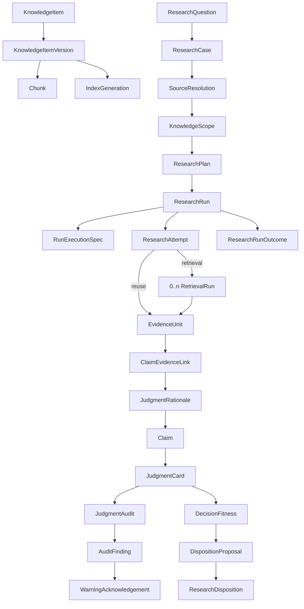
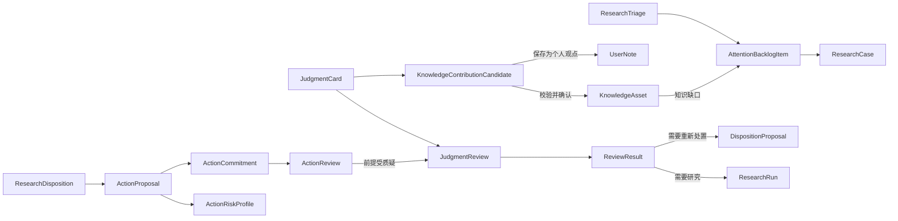
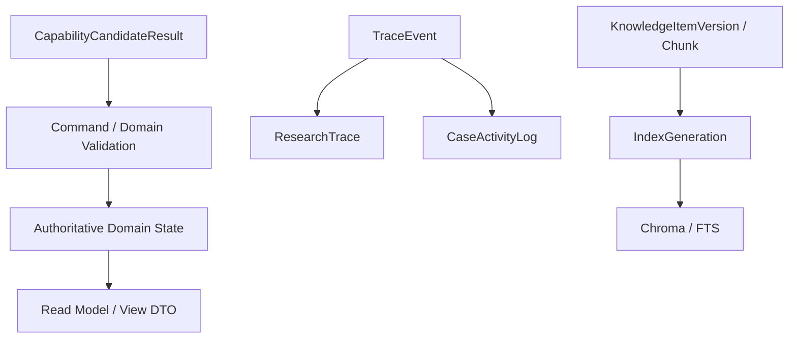
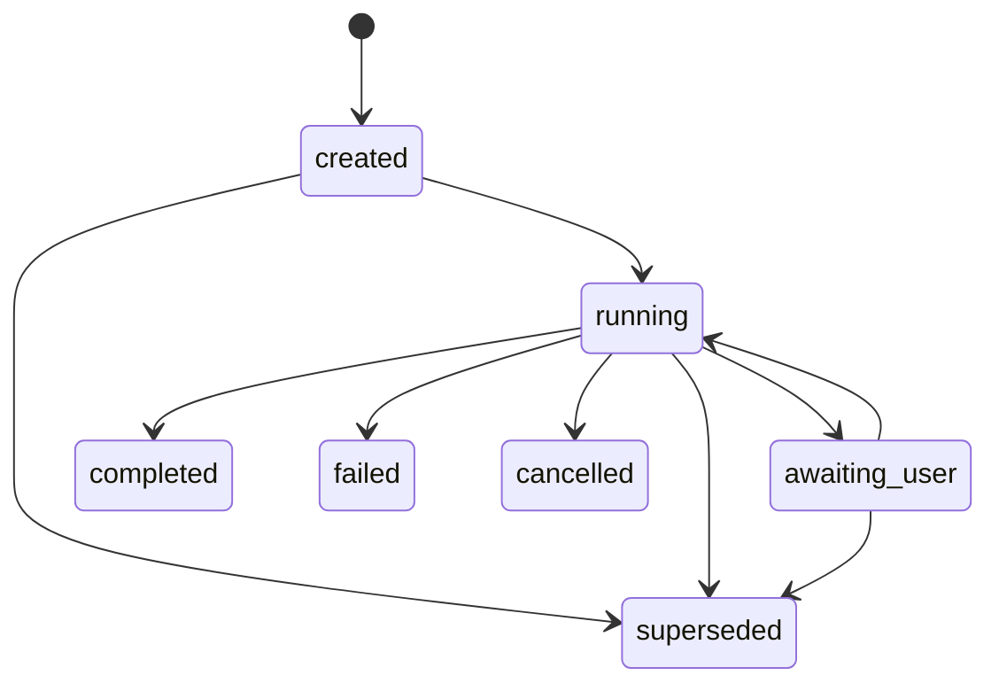

# MetaOS Alpha 领域模型

状态：Core Alpha 领域模型冻结候选

权威范围：Core Alpha 对象、字段语义、聚合边界、关系、枚举、版本语义、状态转换与全局领域不变量

文档性质：本文描述目标领域契约，不表示相关能力已经可运行。阶段 0 允许代码与本文暂时不一致。

任务标识：`A0-DOC-003-R1`

依赖：业务架构 `A0-DOC-001-R7.1`，技术架构 `A0-DOC-002-R4.1`

## 1. 权威边界与非目标

本文是 MetaOS Core Alpha 领域语义的唯一权威来源。业务目标与用户价值以 `docs/BUSINESS_ARCHITECTURE.md` 为准；模块、适配器、存储归属和执行机制以 `docs/TECHNICAL_ARCHITECTURE.md` 为准；请求响应以 `docs/API_CONTRACTS.md` 为准；检索算法以 `docs/RAG_RETRIEVAL_STRATEGY.md` 为准。

本文冻结：

- 对象名称、存在目的和所属交付层级；
- 字段语义与必填性；
- 枚举和值域；
- 聚合、实体、值对象、不可变记录、技术记录和投影的边界；
- 业务版本、乐观并发和状态转换语义；
- 对象关系、原子事务规则与领域不变量。

本文不冻结：

- 数据库表名、SQL 类型、ORM 和迁移顺序；
- Pydantic 类名、Repository 方法和 API 载荷；
- Prompt 内容、检索参数和索引物理结构；
- Worker 队列拓扑、模型供应商和 UI 展示模型；
- 旧对象到目标对象的兼容映射。

Core Alpha 分为两个交付层级：

- **Minimum Slice**：问题、范围、研究执行、证据、判断、审计、用途与处置的最小可靠闭环。
- **Core Alpha Complete**：在 Minimum Slice 上增加注意力待办、判断复核、行动与知识沉淀。

Extended Alpha 只定义方向性边界，不冻结完整字段和状态机。

## 2. 通用建模约定

### 2.1 ID、引用与时间

- 主键和引用使用语义明确的 `*_id`，例如 `research_case_id`、`research_run_id` 和 `judgment_card_id`。
- 不使用无语义的通用 `id`、`source_id` 或 `object_id`。不可避免的多态引用必须同时保存 `object_type` 和 `object_id`。
- 所有时间以 UTC 保存，并使用 `created_at`、`started_at`、`completed_at`、`confirmed_at` 等明确名称。
- 到期、观察和复核条件分别建模，不共用无语义的时间字段。

### 2.2 并发版本与业务版本

- `revision` 是可变聚合根的乐观并发令牌，每次权威状态变化递增。
- `version` 是对象的语义版本号。
- `previous_version_id` 或 `supersedes_id` 表达历史关系。
- 同一字段不得同时承担并发控制与业务版本语义。
- 修改已发布的版本化内容必须产生新版本，不得覆盖历史版本。

### 2.3 状态维度分离

生命周期、执行状态、审计结果、证据支持程度、内容有效性、校验状态、用户态度和用户决定必须分别建模。禁止用一个通用 `status` 同时表达多个维度。

例如：

```text
Claim
- evidence_status
- lifecycle_status
- user_attitude

JudgmentCard
- audit_status
- validity_status
- lifecycle_status
```

### 2.4 用户确认

用户确认记录必须指向具体对象及版本，并保存确认者、决定、时间和所依据的判断、用途或警告版本。没有用户操作不得默认为接受。新决定替代旧决定时必须保留二者关系。

### 2.5 权威状态

只有经过 Application Command、领域规则和聚合不变量校验并持久化的对象才是权威领域状态。以下内容不是权威领域状态：

- 模型候选和 Capability 输出；
- Read Model、View DTO 和 UI 临时状态；
- ResearchTrace 与 CaseActivityLog 投影；
- 向量或全文检索结果；
- Worker 内存状态和 Prompt 自由文本。

不可变值对象和纯记录不机械增加状态字段。此类对象在各节明确为“不可变，不拥有独立生命周期状态”。

## 3. 对象注册与聚合边界

### 3.1 对象注册表

| 对象 | 交付层级 | 类别 | 聚合根或归属 | 权威状态 | 版本化 |
| --- | --- | --- | --- | --- | --- |
| KnowledgeItem | Minimum Slice | Aggregate Root | Knowledge Catalog | 是 | 并发修订 |
| KnowledgeItemVersion | Minimum Slice | Immutable Record | KnowledgeItem | 是 | 是 |
| Chunk | Minimum Slice | Immutable Record | KnowledgeItem | 是 | 随来源版本 |
| IndexGeneration | Minimum Slice | Technical Record | Knowledge Catalog | 否，派生记录 | 是 |
| SourceResolution | Minimum Slice | Immutable Record | ResearchCase | 是 | 以记录追加 |
| KnowledgeScope | Minimum Slice | Versioned Entity | ResearchCase | 是 | 是 |
| ResearchQuestion | Minimum Slice | Immutable Record | ResearchCase | 是 | 以记录追加 |
| ResearchCase | Minimum Slice | Aggregate Root | ResearchCase | 是 | 并发修订 |
| EvidenceRequirement | Minimum Slice | Value Object | ResearchPlan | 是 | 随计划版本 |
| ResearchPlan | Minimum Slice | Versioned Entity | ResearchCase | 是 | 是 |
| ResearchRun | Minimum Slice | Aggregate Root | ResearchRun | 是 | 并发修订 |
| ResearchAttempt | Minimum Slice | Entity | ResearchRun | 是 | 以记录追加 |
| RetrievalRun | Minimum Slice | Entity | ResearchRun | 是 | 以记录追加 |
| ResearchRunOutcome | Minimum Slice | Immutable Record | ResearchRun | 是 | 否 |
| EvidenceUnit | Minimum Slice | Immutable Record | Evidence Catalog | 是 | 内容不可变 |
| ClaimEvidenceLink | Minimum Slice | Entity | JudgmentCard | 是 | 随判断版本 |
| JudgmentRationale | Minimum Slice | Immutable Record | JudgmentCard | 是 | 随 Claim 版本 |
| Claim | Minimum Slice | Versioned Entity | JudgmentCard | 是 | 是 |
| JudgmentCard | Minimum Slice | Aggregate Root | Judgment | 是 | 是 |
| JudgmentAudit | Minimum Slice | Entity | JudgmentCard | 是 | 以审计追加 |
| AuditFinding | Minimum Slice | Immutable Record | JudgmentCard | 是 | 否 |
| WarningAcknowledgement | Minimum Slice | Immutable Record | JudgmentCard | 是 | 否 |
| DecisionFitness | Minimum Slice | Immutable Record | JudgmentCard | 是 | 以策略版本绑定 |
| DispositionProposal | Minimum Slice | Aggregate Root | Decision | 是 | 是 |
| ResearchDisposition | Minimum Slice | Immutable Record | Decision | 是 | 以记录追加 |
| ResearchTriage | Core Complete | Entity | ResearchCase | 是 | 以建议追加 |
| AttentionBacklogItem | Core Complete | Aggregate Root | Attention | 是 | 并发修订 |
| JudgmentReview | Core Complete | Aggregate Root | Judgment Review | 是 | 并发修订 |
| ReviewResult | Core Complete | Immutable Record | JudgmentReview | 是 | 否 |
| ActionProposal | Core Complete | Aggregate Root | Action | 是 | 是 |
| ActionRiskProfile | Core Complete | Immutable Record | ActionProposal | 是 | 随提案版本 |
| ActionCommitment | Core Complete | Entity | ActionProposal | 是 | 并发修订 |
| ActionReview | Core Complete | Immutable Record | ActionProposal | 是 | 以记录追加 |
| KnowledgeContributionCandidate | Core Complete | Aggregate Root | Knowledge Contribution | 是 | 是 |
| KnowledgeAsset | Core Complete | Entity | Knowledge Contribution | 是 | 以来源候选追踪 |
| UserNote | Core Complete | Entity | Knowledge Contribution | 是 | 并发修订 |
| RunExecutionSpec | Minimum Slice | Immutable Technical Record | ResearchRun | 否，执行快照 | 否 |
| TraceEvent | Minimum Slice | Immutable Technical Record | Event Store | 否，审计事实 | 以追加保存 |
| ResearchTrace | Minimum Slice | Projection | ResearchRun | 否 | 可重建 |
| CaseActivityLog | Minimum Slice | Projection | ResearchCase | 否 | 可重建 |
| MaterialManifest | Minimum Slice | Immutable Technical Record | Invocation | 否，出站审计 | 否 |
| CapabilityInvocationContext | Minimum Slice | Immutable Value Object | Invocation | 否 | 否 |
| CapabilityCandidateResult | Minimum Slice | Immutable Technical Record | Invocation | 否 | 否 |

### 3.2 聚合边界

**Knowledge Catalog Aggregate** 以 `KnowledgeItem` 为根，管理逻辑来源、不可变内容版本和定位单元。`IndexGeneration` 是可重建派生记录，不是内容权威。

**ResearchCase Aggregate** 以 `ResearchCase` 为根，关联问题、当前范围、研究执行、当前判断和当前处置。它不拥有 ResearchTrace 的事实内容。

**ResearchRun Aggregate** 以 `ResearchRun` 为根，包含执行快照、Attempt、Retrieval、Checkpoint、预算记录和 Outcome。Run 进入终态与 Outcome 创建是同一事务不变量。

**Judgment Aggregate** 以 `JudgmentCard` 为根，管理 Claim、推理链、Claim 与证据关系、审计、警告确认和用途适配。`EvidenceUnit` 是可复用证据，不复制为判断内部文本副本。

**Decision Aggregate** 以 `DispositionProposal` 为根；`ResearchDisposition` 是用户确认后追加的不可变事实。

**Action Aggregate** 以 `ActionProposal` 为根，管理风险、承诺和复盘。

**Knowledge Contribution Aggregate** 以 `KnowledgeContributionCandidate` 为根，用户确认后可形成 `KnowledgeAsset` 或 `UserNote`。

## 4. Core Alpha Minimum Slice 精确模型

### 4.1 知识来源与版本

#### KnowledgeItem

- 类别：Aggregate Root；所属聚合：Knowledge Catalog。
- 目的：表示逻辑作品或原始知识来源，不等于某个文件版本。
- 必填：`knowledge_item_id`、`title`、`item_type`、`language`、`owner_scope`、`lifecycle_status`、`revision`、`created_at`、`updated_at`。
- 可选：`current_version_id`。
- 不变量：current version 必须属于该 Item 且当前可用；归档、删除和内容版本变化分别表达。

#### KnowledgeItemVersion

- 类别：Immutable Record；所属聚合：KnowledgeItem。
- 目的：固定可寻址、可检索、可引用的内容身份。
- 必填：`knowledge_item_version_id`、`knowledge_item_id`、`version`、`storage_ref`、`content_hash`、`structure_hash`、`parser_version`、`language`、`availability_status`、`created_at`。
- 可选：`previous_version_id`。
- 不变量：发布后内容、Hash、版本身份和存储引用不可原地修改；OCR 修正、文件替换、译本变化、文本校订或重新解析必须产生新版本；指定版本不可用时不得静默替换。
- 本对象不可变，不拥有独立生命周期状态；availability 只表达可用性，不改写历史内容。

#### Chunk

- 类别：Immutable Record；所属聚合：KnowledgeItem。
- 目的：提供来源版本内可校验的结构和定位单元。
- 必填：`chunk_id`、`knowledge_item_version_id`、`position`、`content_hash`、`chunker_version`、`created_at`。
- 可选：`parent_chunk_id`、`previous_chunk_id`、`next_chunk_id`、`section_path`、`page`、`timestamp_seconds`、`start_offset`、`end_offset`、`token_count`。
- 不变量：不得脱离确定版本存在；定位与 Hash 必须可校验；相邻或重叠 Chunk 不自动成为多份独立证据。
- 本对象不可变，不拥有独立生命周期状态。

#### IndexGeneration

- 类别：Technical Record；所属：Knowledge Catalog。
- 目的：记录可重建索引的一次完整 generation。
- 必填：`index_generation_id`、`index_type`、`knowledge_item_version_id`、`chunk_strategy_version`、`index_strategy_version`、`status`、`expected_item_count`、`actual_item_count`、`validation_summary`、`created_at`。
- 可选：`embedding_model`、`embedding_dimension`、`previous_generation_id`、`ready_at`、`invalidated_at`。
- 状态：`pending / building / ready / failed / superseded / invalid`。
- 不变量：只有 `ready` generation 可进入新的 RunExecutionSpec；generation 切换不改变已启动 Run 的快照；索引不是原始内容权威。

### 4.2 来源解析与范围

#### SourceResolution

- 类别：Immutable Record；所属聚合：ResearchCase。
- 目的：解析用户锚点、版本要求和请求的访问政策。
- 必填：`source_resolution_id`、`research_question_id`、`resolution_stage`、`raw_anchor`、`requested_access_policy`、`resolution_status`、`candidate_knowledge_item_ids`、`created_at`。
- 可选：`requested_version_hint`、`resolved_knowledge_item_id`、`resolved_knowledge_item_version_id`、`ambiguity_reason`、`failure_reason`。
- `resolution_stage`：`preliminary / full`。
- `resolution_status`：`resolved / ambiguous / not_found / unavailable`。
- 不变量：`excluded` 是访问政策而非解析状态；preliminary 仅识别锚点、歧义、版本要求和排除意图，full 才能固定版本；显式锚点失败不得静默回退全库；被排除锚点可以解析身份，但内容不得进入检索与证据链。
- 本对象不可变，不拥有独立生命周期状态。

#### KnowledgeScope

- 类别：Versioned Entity；所属聚合：ResearchCase。
- 目的：固定一次研究可访问的来源与分析角色。
- 必填：`knowledge_scope_id`、`research_case_id`、`version`、`scope_mode`、`default_access_policy`、`source_bindings`、`created_by`、`created_at`。
- 可选：`previous_version_id`。
- `scope_mode`：Minimum Slice 固定支持 `evidence_only`。
- `KnowledgeScopeSourceBinding` 必填：`source_resolution_id`、`knowledge_item_id`、`knowledge_item_version_id`、`access_policy`；可选：`analysis_role`。
- `access_policy`：`required / allowed / excluded`。
- `analysis_role`：`primary / comparison / background`。
- 不变量：同一版本绑定只有一个访问政策；required 与 excluded 互斥；analysis role 不覆盖访问政策；excluded 不得设置分析角色；primary 不自动等于 required；未声明来源由 default policy 决定；Run 绑定确定的 Scope 版本；用户修正产生新版本。

### 4.3 问题与研究项目

#### ResearchQuestion

- 类别：Immutable Record；所属聚合：ResearchCase。
- 目的：保存原始问题或追问的语义身份。
- 必填：`research_question_id`、`research_case_id`、`question_text`、`question_role`、`created_by`、`created_at`。
- 可选：`parent_question_id`。
- 不变量：原始问题与追问分别保存；改变问题语义产生新记录；它不是聊天消息。
- 本对象不可变，不拥有独立生命周期状态。

#### ResearchCase

- 类别：Aggregate Root。
- 目的：聚合一个可长期继续、复核和派生的研究问题。
- 必填：`research_case_id`、`title`、`root_question_id`、`current_question_id`、`lifecycle_status`、`attention_status`、`revision`、`created_at`、`updated_at`。
- 可选：`current_knowledge_scope_id`、`current_judgment_card_id`、`current_research_disposition_id`、`parent_research_case_id`、`archived_at`。
- `lifecycle_status`：`open / archived`。
- `attention_status`：`saved / active / paused / observing / deferred / closed`。
- 不变量：attention 状态与待处理工作共同决定是否占用在办名额；失败 Run 不创建新 Case；派生 Case 不移动或覆盖原历史；Case 不是 Run，也不是聊天会话。

### 4.4 研究计划

#### EvidenceRequirement

- 类别：Value Object；所属：ResearchPlan。
- 目的：描述计划必须收集和验证的证据，而非检索实现参数。
- 必填：`evidence_requirement_id`、`requirement_type`、`description`、`required_source_binding_ids`、`counterevidence_required`、`alternative_interpretation_required`、`completion_condition`。
- 可选：`minimum_count`。
- 本对象不可变，不拥有独立生命周期状态。

#### ResearchPlan

- 类别：Versioned Entity；所属聚合：ResearchCase。
- 目的：把问题、范围、研究模式、证据要求和停止条件固化为可执行计划。
- 必填：`research_plan_id`、`research_case_id`、`knowledge_scope_id`、`version`、`research_mode`、`primary_objective`、`evidence_requirements`、`stop_conditions`、`research_budget`、`created_at`。
- 可选：`previous_version_id`。
- `research_mode`：`fact_lookup / source_interpretation / compare_sources / enumerate_pattern / claim_evaluation`。
- 不变量：模式必须改变证据组织方式；改变模式、核心目标、Scope 或核心证据要求产生新计划和新 Run；Prompt 版本属于 RunExecutionSpec。

### 4.5 研究执行

#### ResearchRun

- 类别：Aggregate Root。
- 目的：表示范围、计划和核心目标已确定的一次研究执行。
- 必填：`research_run_id`、`research_case_id`、`research_question_id`、`knowledge_scope_id`、`research_plan_id`、`run_execution_spec_id`、`status`、`revision`。
- 可选：`started_at`、`ended_at`、`superseded_by_run_id`。
- 状态：`created / running / awaiting_user / completed / failed / cancelled / superseded`。
- 不变量：`completed / failed / cancelled / superseded` 为终态；进入终态必须原子创建唯一 Outcome 并追加事件；`awaiting_user` 不是终态。

#### ResearchAttempt

- 类别：Entity；所属聚合：ResearchRun。
- 目的：记录业务层决定的一次执行尝试，与基础设施重投区分。
- 必填：`research_attempt_id`、`research_run_id`、`attempt_number`、`attempt_mode`、`status`、`started_at`。
- 可选：`previous_attempt_id`、`ended_at`、`failure_category`、`failure_reason`。
- `attempt_mode`：`retrieval / reuse_existing_evidence`。
- 状态：`created / running / completed / failed / cancelled / stale`。
- 不变量：基础设施重投不是新 Attempt；失败 Attempt 不被覆盖；reuse 模式必须记录实际复用证据，不得以模型参数知识代替。

#### RetrievalRun

- 类别：Entity；所属聚合：ResearchRun。
- 目的：记录 Attempt 中一次来源或通道级检索。
- 必填：`retrieval_run_id`、`research_attempt_id`、`source_binding_id`、`retrieval_channel`、`query_ref`、`status`、`retrieval_outcome`、`started_at`。
- 可选：`index_generation_id`、`ended_at`、`failure_reason`。
- `retrieval_outcome`：`completed_with_candidates / no_evidence / source_unavailable / failed / cancelled`。
- 不变量：一个 Attempt 可有零个或多个 RetrievalRun；required source 必须有独立检索或等价独立结果；RetrievalRun 不是证据。

#### ResearchRunOutcome

- 类别：Immutable Record；所属聚合：ResearchRun。
- 目的：说明一次 Run 如何结束，不表达用户最终处置。
- 必填：`research_run_outcome_id`、`research_run_id`、`outcome_type`、`reason_code`、`reason_summary`、`created_at`。
- 可选：`judgment_card_id`。
- `outcome_type`：`completed_with_judgment / insufficient_evidence / audit_blocked / execution_failed / cancelled_by_user / deferred_before_judgment / superseded_by_new_run`。
- 不变量：每个终态 Run 恰好一个 Outcome；Outcome 可以存在而 ResearchDisposition 不存在；证据不足、阻断或用户终止不得伪装为处置。
- 本对象不可变，不拥有独立生命周期状态。

### 4.6 证据、Claim 与推理链

#### EvidenceUnit

- 类别：Immutable Record；归属：Evidence Catalog。
- 目的：保存可定位、可验证、可复用的证据内容和来源身份。
- 必填：`evidence_unit_id`、`knowledge_item_id`、`knowledge_item_version_id`、`location`、`excerpt`、`content_hash`、`origin_type`、`validity_status`、`created_at`。
- 可选：`chunk_id`、`origin_retrieval_run_id`。
- `validity_status`：`valid / needs_review / invalid`。
- 不变量：必须回到具体版本和定位；相同内容与定位不重复创建；模型参数知识不能形成 EvidenceUnit；KnowledgeAsset 不能成为新的独立原始证据；EvidenceUnit 本身不永久承担支持或反驳角色。
- 产生关系记录最初提取路径；使用关系由 ClaimEvidenceLink 和 Run 引用表达。

#### ClaimEvidenceLink

- 类别：Entity；所属聚合：JudgmentCard。
- 目的：表达 EvidenceUnit 对特定 Claim 的作用。
- 必填：`claim_evidence_link_id`、`claim_id`、`evidence_unit_id`、`evidence_role`、`support_strength`、`created_at`。
- 可选：`scope_note`。
- `evidence_role`：`supports / contradicts / defines / context / background`。
- 不变量：同一 EvidenceUnit 可支持一个 Claim 并反驳另一个；角色属于关系而非证据永久属性；相同底层证据不得虚增证据数量。

#### JudgmentRationale

- 类别：Immutable Record；所属聚合：JudgmentCard。
- 目的：在 Claim 与证据关系之间保存结构化推理桥梁。
- 必填：`judgment_rationale_id`、`claim_id`、`rationale_profile`、`evidence_link_ids`、`reasoning_summary`、`created_at`。
- 类型化内容：事实记录来源、定位、事实映射和版本限制；解释记录原文、上下文、解释路径和替代解释；推断或假设记录前提、推理方式、关键假设、适用边界、反证和失效条件；建议记录依据、目标、成本、风险、可逆性和停止条件。
- 不变量：建议型 rationale 由 Claim 的表达角色触发，不把 recommendation 混入认识性质。
- 本对象不可变，不拥有独立生命周期状态。

#### Claim

- 类别：Versioned Entity；所属聚合：JudgmentCard。
- 目的：表达判断卡中的一个可独立审计主张。
- 必填：`claim_id`、`judgment_card_id`、`claim_text`、`epistemic_type`、`expression_role`、`evidence_status`、`importance`、`confidence_level`、`lifecycle_status`、`user_attitude`、`judgment_rationale_id`、`version`、`created_at`。
- 可选：`previous_version_id`。
- `epistemic_type`：`fact / interpretation / inference / analogy / hypothesis`。
- `expression_role`：`core_judgment / supplement / counterargument / recommendation / open_question / user_reflection`。
- `evidence_status`：`unassessed / supported / partially_supported / mixed / contradicted / insufficient / not_applicable`。
- `importance`：`core / supporting`。
- `confidence_level`：`unknown / low / medium / high`。
- `lifecycle_status`：`draft / current / superseded / archived`。
- `user_attitude`：`unreviewed / accepted / rejected / needs_revision`。
- 不变量：用户接受不改变 evidence_status；confidence 不替代证据与推理链；analogy 必须标为模型推演；user reflection 不伪装成事实；核心 Claim 缺少类型匹配的证据或理由链必须阻断。

### 4.7 JudgmentCard 与审计

#### JudgmentCard

- 类别：Aggregate Root。
- 目的：汇总可版本化、可审计、可复核的判断。
- 必填：`judgment_card_id`、`research_case_id`、`research_run_id`、`version`、`claim_ids`、`summary`、`uncertainties`、`evidence_gaps`、`audit_status`、`validity_status`、`lifecycle_status`、`created_at`。
- 可选：`previous_version_id`、`current_judgment_audit_id`、`decision_fitness_id`。
- `audit_status`：`pending / auditing / provisionally_acceptable / acceptable / blocked`。
- `validity_status`：`valid / needs_review / invalid`。
- `lifecycle_status`：`draft / current / superseded / archived`。
- 不变量：current 只表示当前版本；blocked + current 合法但不得展示为可靠判断；实质修订产生新版本；重新检索或改变 Scope/Plan 必须属于新 Run。

#### JudgmentAudit

- 类别：Entity；所属聚合：JudgmentCard。
- 目的：承载一个判断版本的一次具体审计过程。
- 必填：`judgment_audit_id`、`judgment_card_id`、`judgment_card_version`、`audit_policy_version`、`audit_run_status`、`finding_ids`、`started_at`。
- 可选：`gate_result`、`completed_at`。
- `audit_run_status`：`pending / running / completed / failed`。
- 不变量：一个判断版本可有多次审计；最新完成且被领域规则接纳的审计决定 audit status；模型可以生成 Finding 候选，但不能单独将判断标为 acceptable。

#### AuditFinding

- 类别：Immutable Record；所属聚合：JudgmentCard。
- 必填：`audit_finding_id`、`judgment_audit_id`、`affected_claim_ids`、`finding_type`、`severity`、`description`、`supporting_reason`、`policy_version`、`created_at`。
- 可选：`recommended_revision`、`risk_trigger_condition`。
- `severity`：`warning / blocking`。
- 不变量：blocking 不可由用户确认放行；warning 可被知情确认或要求修订；Finding 必须保留对具体审计和版本的追踪。
- 本对象不可变，不拥有独立生命周期状态。

#### WarningAcknowledgement

- 类别：Immutable Record；所属聚合：JudgmentCard。
- 必填：`warning_acknowledgement_id`、`audit_finding_id`、`judgment_card_id`、`judgment_card_version`、`acknowledged_by`、`acknowledged_at`。
- 可选：`acknowledgement_note`。
- 不变量：只能引用 warning；新判断版本必须重新校验其有效性；下游 Proposal 只能引用仍有效的确认。
- 本对象不可变，不拥有独立生命周期状态。

#### DecisionFitness

- 类别：Immutable Record；所属聚合：JudgmentCard。
- 目的：限定判断允许支持的用途与风险上限。
- 必填：`decision_fitness_id`、`judgment_card_id`、`judgment_card_version`、`policy_version`、`allowed_uses`、`forbidden_uses`、`required_conditions`、`risk_ceiling`、`escalation_triggers`、`created_at`。
- `allowed_uses` 至少支持：`understanding / research_planning / observation / low_risk_experiment / reversible_action`。
- 不变量：绑定具体判断与策略版本；可采纳不代表允许任意用途；禁止用途不得被处置或行动越过；证据失效或确认的历史策略缺陷可触发重新评估。
- 本对象不可变，不拥有独立生命周期状态。

### 4.8 处置

#### DispositionProposal

- 类别：Aggregate Root。
- 目的：提出用户如何处理当前可靠判断，但不替用户作决定。
- 必填：`disposition_proposal_id`、`research_case_id`、`judgment_card_id`、`judgment_card_version`、`decision_fitness_id`、`proposed_disposition_type`、`reason`、`user_decision_status`、`lifecycle_status`、`version`、`created_at`。
- 可选：`warning_acknowledgement_ids`、`previous_version_id`。
- `user_decision_status`：`pending / accepted / adjusted / rejected`。
- `lifecycle_status`：`current / superseded / expired / withdrawn`。
- `proposed_disposition_type`：`proceed_to_action / continue_research / defer_decision / observe / discard / explicit_no_action / knowledge_only_closure`。
- 不变量：仅当前可采纳且用途匹配的判断可生成 Proposal；有效 warning 未确认时不得进入相应下游；blocked、证据不足和提前终止不强制产生 Proposal。

#### ResearchDisposition

- 类别：Immutable Record；所属聚合：Decision。
- 目的：记录用户对可靠判断的最终处置事实。
- 必填：`research_disposition_id`、`research_case_id`、`source_disposition_proposal_id`、`judgment_card_id`、`judgment_card_version`、`decision_fitness_id`、`disposition_type`、`confirmed_by`、`confirmed_at`。
- 可选：`supersedes_disposition_id`、`defer_until`、`observation_condition`。
- 不变量：未确认 Proposal 不得成为 Disposition；ReviewResult 不直接覆盖处置；改变处置产生新 Proposal 和新记录；defer 时间与 observe 事件条件分开表达；blocked、证据不足或提前终止后的操作不伪造为普通处置。
- 本对象不可变，不拥有独立生命周期状态。

## 5. Core Alpha Complete 精确模型

### 5.1 ResearchTriage

- 类别：Entity；所属聚合：ResearchCase。
- 目的：提供研究深度、注意力成本和激活建议，并保留用户覆盖权。
- 必填：`research_triage_id`、`research_case_id`、`preliminary_source_resolution_ids`、`recommended_depth`、`estimated_attention_cost`、`estimated_resource_budget`、`activation_recommendation`、`reason`、`user_decision`、`created_at`。
- 可选：`adjusted_depth`、`decided_at`。
- 建议类型：`direct_answer / quick_research / standard_research / deep_research / clarification_required`。
- 不变量：Triage 只建议深度、预算和策略，不取消证据与 Trace 约束，也不替用户决定是否研究。

### 5.2 AttentionBacklogItem

- 类别：Aggregate Root。
- 目的：统一承载尚未激活的问题、Case、知识缺口、复核建议或外部线索。
- 必填：`attention_backlog_item_id`、`source_type`、`source_ref_id`、`title`、`reason`、`status`、`created_at`。
- 可选：`estimated_attention_cost`、`activated_research_case_id`、`resolved_at`。
- `source_type`：`saved_question / inactive_case / knowledge_gap / review_suggestion / external_lead`。
- 状态：`pending / activated / discarded / archived`。
- 不变量：激活前不自动创建 active Case；知识缺口不自动占用在办名额；用户覆盖软门禁必须可追踪。

### 5.3 JudgmentReview 与 ReviewResult

#### JudgmentReview

- 类别：Aggregate Root。
- 必填：`judgment_review_id`、`research_case_id`、`judgment_card_id`、`judgment_card_version`、`trigger_type`、`status`、`created_at`。
- 可选：`trigger_ref_id`、`completed_at`。
- 状态：`requested / in_progress / completed / cancelled`。
- 目的：承载用户主动复核、重新打开 Case、证据失效或已知系统缺陷触发的一次判断复核。

#### ReviewResult

- 类别：Immutable Record；所属聚合：JudgmentReview。
- 必填：`review_result_id`、`judgment_review_id`、`result_type`、`reason`、`affected_claim_ids`、`recommended_next_step`、`created_at`。
- 可选：`new_research_run_id`。
- `result_type`：`still_valid / confidence_reduced / research_required / superseded / invalid`。
- 不变量：不直接覆盖 ResearchDisposition；需要改变处置时产生新 Proposal；证据失效可改变判断有效性但不覆盖历史版本。
- 本对象不可变，不拥有独立生命周期状态。

### 5.4 行动

#### ActionProposal

- 类别：Aggregate Root。
- 必填：`action_proposal_id`、`research_case_id`、`research_disposition_id`、`judgment_card_id`、`judgment_card_version`、`decision_fitness_id`、`goal`、`proposed_steps`、`expected_benefit`、`stop_conditions`、`action_risk_profile_id`、`user_decision_status`、`lifecycle_status`、`version`、`created_at`。
- 可选：`review_at`、`previous_version_id`。
- `user_decision_status`：`pending / accepted / rejected`。
- `lifecycle_status`：`current / superseded / expired / withdrawn`。
- 不变量：用户调整产生新版本，并重新计算风险、校验 DecisionFitness 和 warning，不沿用旧放行结果。

#### ActionRiskProfile

- 类别：Immutable Record；所属聚合：ActionProposal。
- 必填：`action_risk_profile_id`、`action_proposal_id`、`cost_level`、`reversibility`、`time_commitment`、`external_impact`、`maximum_acceptable_loss`、`dependency_uncertainty`、`expert_review_required`、`risk_level`、`created_at`。
- 本对象不可变，不拥有独立生命周期状态。

#### ActionCommitment

- 类别：Entity；所属聚合：ActionProposal。
- 必填：`action_commitment_id`、`action_proposal_id`、`status`、`committed_by`、`committed_at`、`revision`。
- 可选：`started_at`、`completed_at`、`deferred_until`。
- 状态：`planned / in_progress / blocked / completed / cancelled / deferred`。
- 不变量：只有用户接受当前 Proposal 后形成；Proposal 不等于 Commitment；行动状态不改变 Claim 的 evidence status。

#### ActionReview

- 类别：Immutable Record；所属聚合：ActionProposal。
- 必填：`action_review_id`、`action_commitment_id`、`reviewed_at`、`expected_result`、`actual_result`、`assumption_failures`、`stop_condition_triggered`、`judgment_review_required`、`created_at`。
- 不变量：行动前提被质疑时进入 JudgmentReview。
- 本对象不可变，不拥有独立生命周期状态。

### 5.5 KnowledgeContributionCandidate

- 类别：Aggregate Root。
- 目的：承载从可靠判断产生、等待校验和用户决定的知识贡献。
- 必填：`knowledge_contribution_candidate_id`、`research_case_id`、`judgment_card_id`、`judgment_card_version`、`contribution_type`、`proposed_content`、`evidence_unit_ids`、`validation_status`、`user_decision_status`、`lifecycle_status`、`version`、`created_at`。
- 可选：`target_knowledge_asset_id`、`audit_finding_ids`、`warning_acknowledgement_ids`、`previous_version_id`。
- `contribution_type`：`claim / evidence / gap`。
- `validation_status`：`not_required / pending / passed / failed`。
- `user_decision_status`：`pending / accepted / rejected`。
- `lifecycle_status`：`current / superseded / closed`。
- 不变量：与 DispositionProposal 并行且互不依赖；没有候选是合法结果；blocked 判断不得产生可确认候选；用户改变结论强度、语义、证据关系或范围时必须重新校验；校验失败不得写入 KnowledgeAsset；用户确认不提升 Claim 证据状态。

### 5.6 KnowledgeAsset

- 类别：Entity；所属聚合：Knowledge Contribution。
- 目的：表示由已确认候选形成的证据支持知识笔记。
- 必填：`knowledge_asset_id`、`source_candidate_id`、`asset_type`、`title`、`content`、`judgment_card_id`、`judgment_card_version`、`evidence_unit_ids`、`validity_status`、`lifecycle_status`、`created_by`、`created_at`。
- 可选：`audit_finding_ids`、`warning_acknowledgement_ids`、`withdrawn_at`。
- `asset_type`：`claim_note / evidence_note / knowledge_gap`。
- `validity_status`：`valid / needs_review / invalid`。
- `lifecycle_status`：`active / withdrawn / archived`。
- 不变量：它是派生知识而非原始资料；不得成为新的独立原始证据；来源型 Claim 继续回溯 EvidenceUnit；上游失效时进入复核或无效；withdrawn 不等于 invalid；多个资产不得虚增同一底层证据计数。

### 5.7 UserNote

- 类别：Entity；所属聚合：Knowledge Contribution。
- 目的：为未通过证据校验但用户希望保留的观点或普通笔记提供合法出口。
- 必填：`user_note_id`、`source_candidate_id`、`research_case_id`、`title`、`content`、`note_type`、`lifecycle_status`、`created_by`、`created_at`。
- `note_type`：`personal_note / user_viewpoint`。
- 不变量：不得标记为 evidence-backed、参与 EvidenceUnit 计数或显示为系统验证知识；升级为 KnowledgeAsset 必须重新研究、校验和审计。

### 5.8 非独立对象

Core Alpha 不单独建立 OpenMonitoring、Deferred 或 Closure 实体。它们由 ResearchDisposition 表达：

- `observe` 配合 `observation_condition`；
- `defer_decision` 配合 `defer_until`；
- `discard / explicit_no_action / knowledge_only_closure` 表达关闭语义。

## 6. 技术支撑值对象与执行记录

本章对象必须精确定义，但不得自行改变权威业务状态。

### 6.1 RunExecutionSpec

不可变技术快照，必含 `run_execution_spec_id`、`research_run_id`、Scope/SourceResolution/Plan 版本、source version set、各版本对应的 IndexGeneration、检索与上下文策略版本、embedding 与 reranker 契约、Capability 契约、允许实现与降级政策、Prompt 和输出 Schema 版本、审计与用途政策版本、出站政策版本、预算快照和 `created_at`。

Attempt 不得修改该快照；索引切换不影响已启动 Run；超出允许降级的变化创建新 Run；实际调用结果进入 Trace。

### 6.2 ExecutionCheckpoint

必填：`execution_checkpoint_id`、`research_run_id`、`research_attempt_id`、`checkpoint_type`、`input_revision`、`completed_at`、`result_ref_id`、`idempotency_key`。

`checkpoint_type` 至少包含：`run_started / retrieval_completed / evidence_assembled / judgment_candidate_generated / deterministic_precheck_completed / semantic_audit_completed / decision_gate_completed / outcome_committed`。

### 6.3 BudgetSnapshot 与 BudgetConsumptionRecord

预算快照记录 Run 启动预算、Retrieval 与模型调用上限、成本和时长上限及修订轮次上限；消费记录逐次记录消耗和剩余预算。预算只决定是否继续自动消费，不决定判断是否可采纳。

### 6.4 TraceEvent

不可变事件信封，必填：`trace_event_id`、`event_type`、`occurred_at`、`actor_type`、`correlation_id`、`causation_id`、`research_case_id`、`aggregate_revision`、`payload_ref`、`payload_hash`、`schema_version`；可选：`actor_id`、`research_run_id`、`research_attempt_id`。

### 6.5 ResearchTrace 与 CaseActivityLog

- `ResearchTrace` 是由 TraceEvent 形成的 Run 级查询投影，可查询输入快照、范围、计划、执行、检索、证据、推理、判断、审计、用途、出站材料、Outcome、降级和失败。
- `CaseActivityLog` 是由同一组事件形成的 Case 级长期活动投影，不另写第二套事实日志。
- 二者均不是领域状态权威；默认保存对象引用、Hash、版本和脱敏摘要，不复制完整私有原文或完整 Prompt。

### 6.6 MaterialManifest

不可变出站审计记录，必填：`material_manifest_id`、`research_run_id`、`capability_invocation_id`、数据对象引用、来源版本、Hash、定位、长度、敏感级别、provider、purpose、出站政策版本、判定、原因、是否包含画像数据和 `created_at`；可选：EvidenceUnit/Chunk 引用。

默认不保存完整原文、完整 Prompt、画像全文、API Key 或认证 Header。

### 6.7 CapabilityInvocationContext

不可变值对象，包含 capability 名称、实现版本、操作类型、输入输出 Schema 版本、Case/Run/Attempt、RunExecutionSpec、Scope 快照、allowed/excluded 来源 ID、允许工具和外部 provider、预算、幂等键、相关与因果 ID、Trace 要求。

### 6.8 CapabilityCandidateResult

不可变技术记录，包含 `capability_candidate_result_id`、invocation 引用、技术执行状态、候选载荷引用、输出 Schema 与实际实现版本、provider、资源消耗、幂等身份、降级路径、质量影响、warnings、失败类别和 `created_at`。

Schema 合法不等于领域合法。CandidateResult 必须经 Internal Result Adapter、Command 和 Domain Module 才可能形成权威状态；stale、越界或生命周期不匹配结果不得更新 current 状态。

### 6.9 Tombstone 与 LifecycleGeneration

最小技术记录只保存对象身份、生命周期代数、删除或取消时间、原因和幂等信息，不保存问题全文、原文、EvidenceUnit 文本或完整 Prompt。它用于迟到结果防复活，不代表领域内容仍然存在。

### 6.10 明确排除

Read Model、View DTO、Outbox Record、RQ Job、Chroma document、FTS row 和 Worker 内存上下文不进入领域权威对象，也不在本文设计业务状态机。

## 7. Extended Alpha 暂定对象

Extended Alpha 只冻结存在目的、依赖方向和最低边界：

| 对象 | 存在目的 | 最低边界 |
| --- | --- | --- |
| IntentTrace | 记录候选意图及用户修正 | 当前问题与显式约束始终优先 |
| UserConstitution | 保存用户明确声明的长期原则 | 不由单次行为自动覆盖 |
| CurrentState | 保存有有效期的当前状态 | 必须衰减或过期 |
| CognitivePattern | 保存长期认知模式候选 | 系统推断不等于用户事实 |
| CognitiveEvent | 记录可供画像候选使用的行为事件 | 不直接修改长期画像 |
| ProfileUpdateCandidate | 提出画像更新 | 未确认不得合并 |
| BookProfile | 描述经典概念、结构和适用边界 | 不模拟作者人格 |
| CognitiveLens | 提供受证据边界约束的认知视角 | 不是 Runtime Skill |
| SourceItem | 表示尚未摄入的外部资料候选 | 不等于 KnowledgeItem |
| InformationIntake | 管理有限资料摄入 | 失败不影响 Core |
| AttentionJustification | 结构化解释注意力价值与成本 | 不以生成文案替代证据 |
| LimitedAttentionList | 表达认知、商业、技术有限榜单 | 不恢复旧部门式对象链 |

Extended 对象只通过可选 Port 提供先验；缺失、关闭或失败时，Core Alpha 以空先验继续运行。画像不得覆盖当前问题，Lens 不得绕过来源范围，所有长期画像更新必须经过用户确认。

## 8. 对象依赖图

### 8.1 Minimum Slice



### 8.2 Core Alpha Complete



### 8.3 权威与非权威边界



## 9. 状态转换与原子事务规则

### 9.1 ResearchRun



进入 `completed / failed / cancelled / superseded` 时，必须在同一事务中创建唯一 ResearchRunOutcome、追加 TraceEvent 并更新聚合 revision。事务失败则三者都不生效。

### 9.2 JudgmentCard

三套状态独立转换：

- audit：`pending -> auditing -> provisionally_acceptable / acceptable / blocked`；审计失败保留在可重试状态，不伪装为 blocked 业务结论。
- validity：`valid -> needs_review -> valid / invalid`；`invalid` 不通过原地修改恢复，应由复核或新版本承载。
- lifecycle：`draft -> current -> superseded -> archived`。

`audit_status=blocked` 与 `lifecycle_status=current` 是合法组合，但 UI 和下游必须显示为不可采纳草稿。`acceptable` 仍必须通过 DecisionFitness 限定用途。

### 9.3 Proposal 与用户确认

```text
DispositionProposal
-> 用户接受 -> ResearchDisposition
-> 用户调整 -> 新版本 DispositionProposal
-> 用户拒绝 -> 保留拒绝事实，不产生 ResearchDisposition

ActionProposal
-> 用户接受 -> ActionCommitment
-> 用户修改 -> 新版本 Proposal + 新风险评估 + 新用途校验

KnowledgeContributionCandidate
-> 必要校验 -> 用户确认 -> KnowledgeAsset
-> 校验失败但用户希望保留 -> UserNote
-> 用户拒绝 -> closed
```

### 9.4 判断复核

```text
JudgmentReview
-> ReviewResult
-> 新 ResearchRun
或
-> 新 DispositionProposal
```

ReviewResult 不得直接覆盖旧 ResearchDisposition。上游证据或确定的历史系统缺陷影响判断时，先改变 validity 或发起新 Run，再由用户重新处置。

## 10. 全局领域不变量

### 来源与范围

1. 显式来源约束高于默认策略。
2. excluded 来源内容不得进入检索候选、模型上下文、证据处理输入、引用或判断证据链；来源标识可以仅作为排除条件和审计记录进入工具调用。
3. required 来源必须独立报告结果；无证据不能由其他来源代答。
4. 来源版本不可静默替换。
5. 未声明来源必须由 default access policy 处理。

### 研究执行

6. 一个 ResearchAttempt 可以包含零个 RetrievalRun。
7. 零 RetrievalRun 只能复用已存在且重新校验版本、定位、Hash、Scope 和有效性的 EvidenceUnit。
8. 模型参数知识不能成为 EvidenceUnit。
9. 基础设施重投不是新 ResearchAttempt。
10. Scope、Plan、核心证据要求或研究目标实质变化必须创建新 ResearchRun。
11. Run 终态、Outcome 与事件必须原子提交。
12. RunOutcome 不等于 ResearchDisposition。

### 证据与判断

13. EvidenceUnit 不天然支持或反驳；角色属于 ClaimEvidenceLink。
14. 核心 Claim 必须具有类型匹配的 EvidenceUnit 和 JudgmentRationale。
15. 用户接受不改变 evidence_status。
16. confidence 不能替代证据和推理链。
17. JudgmentCard 版本不得原地覆盖。
18. blocked 判断不得显示为可靠判断。
19. EvidenceUnit 失效必须传播到 JudgmentCard 和相关 KnowledgeAsset 的 validity。

### 审计与用途

20. blocking AuditFinding 不可由用户确认放行。
21. WarningAcknowledgement 只能确认非阻断 Finding。
22. 非阻断警告必须传播到允许的下游对象。
23. 可采纳不等于允许任意行动用途。
24. DecisionFitness 必须绑定具体 JudgmentCard 和 policy 版本。
25. 超出 DecisionFitness 的请求必须升级研究、请求专家审核或拆成低风险可逆实验。

### 用户主权

26. 未确认的 DispositionProposal 不得形成 ResearchDisposition。
27. 未接受的 ActionProposal 不得形成 ActionCommitment。
28. ReviewResult 不得直接覆盖 ResearchDisposition。
29. 没有用户操作不得默认为接受。
30. 用户调整 Proposal 后必须重新校验相关风险、用途和警告。

### 知识沉淀

31. KnowledgeContributionCandidate 与 DispositionProposal 并行且互不依赖。
32. blocked 判断不得形成证据支持的 KnowledgeAsset。
33. Candidate 校验失败不得自动保存为 KnowledgeAsset。
34. UserNote 不得伪装成证据支持知识。
35. KnowledgeAsset 不得成为新的独立原始证据。
36. 多个派生资产回溯同一 EvidenceUnit 时不得虚增证据数量。
37. 上游证据失效必须使相关 KnowledgeAsset 进入 needs_review 或 invalid。

### 技术边界

38. Capability、模型、Worker 和可插拔实现不拥有权威领域状态。
39. Schema 合法不等于领域状态合法。
40. Trace、Read Model 和 View DTO 不得反向覆盖领域状态。
41. Chroma 和 FTS 不得决定内容版本、删除状态或当前判断。
42. stale CandidateResult 不得更新 current 状态。
43. Extended Alpha 缺失或失败不得破坏 Core Alpha 闭环。

## 11. 与其他权威文档的关系

| 内容 | 唯一权威文档 |
| --- | --- |
| 产品目标、业务主链、用户控制点 | `docs/BUSINESS_ARCHITECTURE.md` |
| 对象、字段、状态、聚合与不变量 | `docs/DOMAIN_MODEL.md` |
| 模块、适配器、事务、Worker 与持久化归属 | `docs/TECHNICAL_ARCHITECTURE.md` |
| API 请求响应、并发令牌和错误语义 | `docs/API_CONTRACTS.md` |
| 来源路由、召回、融合和上下文策略 | `docs/RAG_RETRIEVAL_STRATEGY.md` |
| 阶段顺序与任务依赖 | `docs/ROADMAP.md`、`docs/TASK_INDEX.md` |

跨文档出现冲突时，先按内容所有权确定权威来源，不在多个文档中重复维护完整定义。本文冻结后，下一项契约任务是 `A0-DOC-004`：依据本领域模型同步目标 API 契约。
