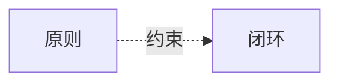

# MetaOS Alpha 统一母计划

状态：阶段0设计总纲  
适用范围：产品架构、技术架构、领域契约、API 契约、任务拆分与评测设计  
实现状态：本文档是目标设计，不代表已经实现

## 1. 计划目的

本文档用于收束 MetaOS Alpha 当前阶段的统一设计，避免“知识库软件”“聊天机器人”“新闻流产品”“传统用户画像系统”四种方向继续混杂。

MetaOS Alpha 的目标不是让系统回答更多内容，而是帮助用户：

- 约束注意力。
- 显化意图。
- 明确知识范围。
- 收集可审计证据。
- 形成 Claim 级判断。
- 通过审计识别证据缺口与推断越界。
- 形成行动、明确不行动，或完成知识型关闭。
- 通过复盘沉淀可修正的认知画像候选。

当前阶段仍是阶段0。阶段0只允许：

- 仓库审计。
- 架构文档。
- 公共 Schema、数据库模型、API 契约的设计说明。
- 后续任务拆分。

阶段0禁止：

- 业务实现。
- 重构。
- 迁移。
- 依赖升级。
- 运行态数据改造。
- 修改 `library/` 数据。
- 修改 `AGENTS.md`。

## 2. Alpha 交付分层

MetaOS Alpha 分为三个交付层级。

### 2.1 Core Alpha

Core Alpha 验证唯一核心命题：

```text
用户主动提出问题后，
MetaOS 能否帮助他形成可靠、可审计、可处置的判断。
```

Core Alpha 主链冻结为：

```text
Question
-> SourceResolution
-> KnowledgeScope
-> ResearchPlan
-> RetrievalRun
-> EvidenceUnit
-> Claim
-> JudgmentCard
-> Audit
-> ResearchDisposition
-> ActionProposal / Closure
```

Core Alpha 完成后，系统应已经可以作为独立产品持续使用，不依赖 IntentTrace、认知画像、三部榜单或 LensSkill。

### 2.2 Extended Alpha

Extended Alpha 在 Core Alpha 稳定的前提下增加：

- IntentTrace 意图显影。
- BookProfile 与 LensSkill。
- 认知画像、用户主权与状态衰减。
- InformationIntake 与三部有限榜单。

Extended Alpha 中任何模块失败，不得破坏 Core Alpha 闭环。

### 2.3 Beta Ready

Beta Ready 不再扩张新的核心业务概念，只处理：

- UI 视觉统一。
- 移动端适配。
- 性能与成本约束。
- 降级策略。
- 可观测性。
- Golden Cases 回归。
- 开发者层隔离。

## 3. 全局优先级

所有检索、推荐、意图推断、行动建议都必须遵守以下上下文优先级：

```text
1. 用户当前显式约束
   例如：只看《鬼谷子》、不要引用《理想国》

2. 当前问题和当前会话上下文

3. 用户当前状态
   例如：当前项目、近期目标、时间限制

4. UserConstitution 中的长期原则

5. 历史 CognitivePattern

6. 系统通用默认值
```

任何下层信息不得覆盖上层显式要求。

例如：

```text
历史画像认为用户关注《理想国》
```

不能覆盖：

```text
当前问题要求只从《鬼谷子》回答
```

## 4. 全局原则

- 无画像也必须可用；画像只是先验，不直接输出意图。
- 当前问题和当前线索权重高于系统对用户的历史判断。
- 显式来源约束必须高于模型自由发挥。
- 检索不能让 Chunk 数量决定发言权。
- 短资料不能因篇幅短而失去被引用机会。
- 榜单不是新闻流，而是有限注意力入口。
- 三部不是爬虫本身，而是注意力守门人。
- 统一搜集层提供候选内容，三部负责有限评分与解释。
- 经典不是人格 Agent；经典通过 BookProfile 和 LensSkill 提供有边界的认知视角。
- 每次研究只有一个最终综合出口。
- 系统建议必须经用户确认后才成为行动承诺。
- 模型参数知识不能伪装成指定知识来源中的内容。

## 5. 文档所有权矩阵

为避免同一概念在多份文档中漂移，后续文档落地遵守以下所有权：

| 内容 | 唯一权威文档 |
| --- | --- |
| 产品目标、核心主线、业务闭环 | `BUSINESS_ARCHITECTURE.md` |
| 模块边界、技术组件、Worker、存储、模型适配 | `TECHNICAL_ARCHITECTURE.md` |
| 对象字段、状态机、领域关系 | `DOMAIN_MODEL.md` |
| API 请求与响应契约 | `API_CONTRACTS.md` |
| 阶段顺序和里程碑 | `ROADMAP.md` |
| 具体任务拆分 | `TASK_INDEX.md` |
| 检索算法与来源治理 | `docs/RAG_RETRIEVAL_STRATEGY.md` |
| Alpha 总览、关键决策和链接 | `docs/METAOS_ALPHA_UNIFIED_PLAN.md` |
| 术语定义 | `docs/GLOSSARY.md` |
| 架构决策记录 | `docs/adr/` |

本文档只作为统一母计划，不重复维护完整 Schema 字段定义。字段和状态后续以 `DOMAIN_MODEL.md` 为准。

## 6. 架构图落点

业务架构图应落地到：

```text
BUSINESS_ARCHITECTURE.md
```

技术架构图应落地到：

```text
TECHNICAL_ARCHITECTURE.md
```

本文档只保留架构图索引，不重复维护完整 Mermaid 图，避免图和权威文档发生漂移。

Mermaid 中文边标签应使用兼容写法：



## 7. Core Alpha 阶段计划

### 7.1 Phase 0：文档、契约与评测设计

目标：

```text
冻结 Core Alpha / Extended Alpha / Beta Ready 边界，
定义关键对象依赖，
定义 Golden Cases，
输出后续任务 DAG 与阶段门。
```

主要交付：

- `docs/METAOS_ALPHA_UNIFIED_PLAN.md`。
- `docs/GLOSSARY.md`。
- `docs/adr/`。
- 文档所有权矩阵。
- 领域对象依赖图。
- 实施任务 DAG 与阶段门。
- Golden Cases 与核心指标。

Non-Goals：

- 不改代码。
- 不改公共 Schema 实现。
- 不改 API 实现。
- 不改 Streamlit。
- 不改 `library/`。
- 不改 `AGENTS.md`。

退出条件：

- Core Alpha、Extended Alpha、Beta Ready 边界写清。
- 关键对象的依赖顺序写清。
- 关键对象状态机进入领域模型草案。
- 10-20 个 Golden Cases 定义完成。
- 后续任务均符合 `AGENTS.md` 的必填任务说明。

### 7.2 Phase 1：最小工作台与 ResearchTrace

目标：

```text
让每次研究都有可追溯载体，
并让 Streamlit 从技术控制台逐步转为认知工作台骨架。
```

UI 规划：

```text
工作台 / 知识 / 复盘 / 开发者
```

开发者层继续保留：

- 上传。
- 索引。
- Chunk 健康检查。
- 队列。
- Worker。
- Token。
- 检索测试。
- Trace。
- 审计轨迹。

ResearchTrace 骨架字段：

- `trace_schema_version`
- `strategy_version`
- `prompt_version`
- `trace_status`
- `current_stage`
- `attempts`
- `intent_trace_id?`
- `knowledge_scope_snapshot?`
- `judgment_card_id?`
- `audit_result_id?`

`trace_status`：

- `created`
- `planning`
- `retrieving`
- `synthesizing`
- `auditing`
- `awaiting_user`
- `completed`
- `failed`
- `cancelled`

Trace 规则：

- 采用不可变事实记录 + 当前状态摘要。
- 已发生的检索、模型调用、证据选择不得被覆盖。
- 重试产生新的 attempt。
- 新 attempt 不得抹掉上一次失败。

退出条件：

- 每次研究都有 trace。
- 草稿、审计中、可采纳状态在 UI 上可区分。
- 旧技术控制台仍可访问。

### 7.3 Phase 2：KnowledgeScope、ResearchPlan 与来源感知检索

目标：

```text
同时回答“从哪里找”和“怎样找”，
避免显式来源被忽略，
避免无锚点查询时短书在候选阶段被长书淹没。
```

主链补充为：

```text
Question
-> SourceResolution
-> KnowledgeScope
-> ResearchPlan
-> RetrievalRun
-> EvidenceUnit
```

#### SourceResolution

字段至少包括：

- `raw_anchor`
- `normalized_anchor`
- `resolution_status`
- `match_type`
- `confidence`
- `knowledge_item_id`
- `knowledge_item_version_ids`
- `ambiguity_candidates`

`resolution_status`：

- `resolved`
- `ambiguous`
- `not_found`
- `excluded`

规则：

```text
用户明确指定来源但解析失败或存在歧义时，
不得静默回退到全知识库检索。
```

#### KnowledgeScope 不变量

- 同一来源不得同时属于 `required_sources` 和 `excluded_sources`。
- `required_sources` 必须进入候选检索。
- `primary_sources` 决定回答主结构。
- `comparison_sources` 只能用于对照，不能替代主来源。
- `excluded_sources` 不能进入候选、上下文和最终引用。
- 显式来源解析失败时，不得回退全库。
- 必需来源没有证据时，应报告该来源证据不足，而不是找其他书代答。

Core Alpha 默认生成策略：

```text
knowledge_policy = evidence_only
```

含义：

```text
最终 Claim 必须由 EvidenceUnit 支持。
模型参数知识不能伪装成指定来源中的内容。
```

#### ResearchPlan

字段至少包括：

- `research_mode`
- `normalized_query`
- `evidence_query`
- `evidence_requirements`
- `query_variants`
- `candidate_strategy`
- `counter_evidence_required`
- `stop_conditions`
- `budget`

规则：

- `normalized_query` 保存规范化后的完整问题。
- `evidence_query` 必须移除已经解析的来源锚点。
- 来源锚点只作为检索约束，不重复作为书内语义查询词。
- `stop_conditions` 决定何时认为检索充分，不得默认一次 Top-K 后结束所有研究。

#### 两条检索流程

有显式来源：

```text
SourceResolution
-> 指定来源内检索
-> 跨指定来源融合
```

无显式来源：

```text
KnowledgeItemProfile 来源级路由
-> 选出候选来源
-> 每个来源独立检索
-> 跨来源融合
```

无显式来源时，禁止让全库所有 Chunk 直接竞争唯一候选池后才进行来源均衡。

来源评分不得按命中 Chunk 总分累加，应主要使用：

- 标题和别名匹配。
- 主题相关性。
- 来源最高相关块。
- 来源前 N 块平均分。

#### Core Alpha 最小研究模式

Core Alpha 至少支持四种研究模式：

1. `fact_lookup`

   ```text
   局部事实问题
   -> 精确/混合检索
   -> 少量直接证据
   ```

2. `source_interpretation`

   ```text
   原文概念
   -> 章节或主题定位
   -> 上下文证据
   -> 解释型 Claim
   ```

3. `compare_sources`

   ```text
   每个来源独立检索
   -> 每个来源最低证据覆盖
   -> 对齐比较维度
   -> 共识与差异 Claim
   ```

4. `enumerate_pattern`

   ```text
   拆分判定条件
   -> 生成候选
   -> 按候选逐项验证
   -> 搜索反证
   -> EvidenceMatrix
   -> 纳入或排除
   ```

`enumerate_pattern` 需要补充：

- `CaseCandidate`
- `EvidenceRequirement`
- `EvidenceMatrix`
- `exclusion_reason`

研究模式不得只作为标签而共享完全相同的单次 Top-K 流程。

#### 资料生命周期

资料生命周期固定为：

```text
SourceItem
-> RawSource
-> KnowledgeItem
-> KnowledgeItemVersion
-> Chunk / Index / VersionProfile
-> KnowledgeItemProfile
```

对象边界：

- `SourceItem`：可能值得关注或摄入的候选资料。
- `KnowledgeItem`：逻辑作品，例如《理想国》。
- `KnowledgeItemVersion`：实际上传的某个译本、版本或 PDF。
- `KnowledgeItemProfile`：供来源路由使用的摘要、主题和结构。
- `BookProfile`：供认知视角和 LensSkill 使用。

#### 短书策略

短书“全书扫描”只表示：

```text
全书 chunks 参与本地候选排序
```

不表示：

```text
全书所有 chunks 都发送给 LLM
```

预算必须拆成：

- `max_candidate_chunks`
- `max_context_chunks`
- `max_context_tokens`

Trace 必须记录：

- `candidate_source_distribution`
- `final_source_distribution`
- `dropped_by_token_budget`
- `dropped_by_source_limit`

Non-Goals：

- 不重切块。
- 不重建全部索引。
- 不引入 reranker。
- 不做知识图谱。
- 不实现完整实体关系抽取。
- 不改现有入库主流程。

退出条件：

- 显式来源约束 100% 生效。
- 指定《鬼谷子》不得静默引用《理想国》。
- 短书不被长书 Chunk 数量淹没。
- 无显式来源时先做来源级路由。
- 所有查询产生完整检索 Trace。
- 旧路径有回滚开关。

### 7.4 Phase 3：EvidenceUnit、Claim、审计、处置与复盘

目标：

```text
让最终判断从一段回答升级为可逐条审计、可版本化修订、可处置的 Claim 结构。
```

#### EvidenceUnit

Claim 必须通过 `EvidenceUnit` 引用证据，而不是仅引用 Chunk。

`EvidenceUnit` 至少包含：

- `evidence_id`
- `knowledge_item_id`
- `knowledge_item_version_id`
- `chunk_id`
- `locator`
- `quoted_text`
- `content_hash`
- `evidence_role`
- `support_strength`
- `retrieval_run_id`
- `retrieval_score`
- `created_at`

`locator` 可包含：

- 页码。
- 章节。
- 卷目。
- 段落。
- 字符范围。

`evidence_role`：

- `support`
- `counter`
- `context`
- `definition`
- `background`

#### Claim

Claim 不使用单一枚举表达所有含义，拆成三个维度：

`epistemic_type`：

- `fact`
- `interpretation`
- `inference`
- `analogy`
- `hypothesis`
- `reflection`
- `recommendation`

`evidence_status`：

- `supported`
- `partially_supported`
- `disputed`
- `unsupported`
- `not_applicable`

`subject_domain`：

- `source_text`
- `history`
- `technology`
- `business`
- `personal`
- `other`

Claim 还必须包含：

- `claim_importance`
- `confidence_level`
- `confidence_basis`
- `lifecycle_status`

`claim_importance`：

- `core`
- `supporting`
- `contextual`

规则：

```text
core Claim 无支持证据必须阻断。
```

`confidence_level`：

- `high`
- `medium`
- `low`

`confidence_basis` 示例：

- `direct_source`
- `multiple_supporting_sources`
- `indirect_inference`
- `disputed_evidence`

`lifecycle_status`：

- `proposed`
- `auditing`
- `ready`
- `accepted`
- `rejected`
- `superseded`
- `archived`

#### JudgmentCard

UI 层展示：

- 判断。
- 直接证据。
- 不同解释。
- 证据缺口。
- 下一步。

状态：

- `draft`
- `audit_failed`
- `needs_revision`
- `ready`
- `accepted`
- `archived`

UI 必须明确区分：

```text
判断草稿
审计中
可采纳判断
```

审计存在阻断问题时，显示：

```text
证据链不完整，当前判断不可采纳。
```

#### AuditFinding

审计输出结构化 `AuditFinding`：

- `finding_code`
- `severity`
- `claim_ids`
- `evidence_refs`
- `description`
- `suggested_fix`
- `blocking`
- `audit_type`
- `rule_version`
- `auditor_model?`

`severity`：

- `info`
- `warning`
- `error`
- `critical`

`audit_type`：

- `deterministic`
- `semantic`

审计分两类：

1. 确定性审计

   由代码检查：

   - 引用是否存在。
   - 来源是否越界。
   - Claim 是否关联证据。
   - 必需来源是否进入上下文。

2. 语义审计

   由模型辅助检查：

   - 证据是否真正支持 Claim。
   - 是否省略关键反证。
   - 是否把相关性写成因果关系。
   - 是否存在确认偏误。

#### 审计修订循环

审计阻断后进入有上限的修订循环：

```text
生成草稿
-> 确定性审计
-> 语义审计
-> 存在阻断项
-> 修订 Claim 或降低结论强度
-> 再审计
-> 达到上限后转 awaiting_user 或 failed
```

修订必须生成新的 JudgmentCard 版本，不覆盖旧版本。

需要记录：

- `audit_attempt`
- `max_revision_attempts`
- `revision_reason`
- `previous_judgment_card_id`
- `supersedes_id`

#### ResearchDisposition 与行动

研究处置与行动对象分离。

`ResearchDisposition`：

- `proceed_to_action`
- `continue_research`
- `defer_decision`
- `observe`
- `discard`
- `explicit_no_action`
- `knowledge_only_closure`

只有 `proceed_to_action` 才创建：

```text
ActionProposal
-> 用户接受
-> ActionCommitment
-> ActionReview
```

`ActionProposal.status`：

- `proposed`
- `accepted`
- `rejected`
- `expired`

`ActionCommitment.status`：

- `planned`
- `in_progress`
- `blocked`
- `completed`
- `cancelled`
- `deferred`

`ActionReview` 至少包含：

- `outcome`
- `result_summary`
- `linked_evidence`
- `unexpected_effects`
- `judgment_changed`
- `follow_up`
- `reviewed_at`

`knowledge_only_closure` 是研究的一种合法关闭方式，不是 ActionCommitment。

Non-Goals：

- 不做自动网络事实核查。
- 不做多人协作审批。
- 不做复杂工作流编辑器。
- 不让审计模型自动修改原始证据。

Core Alpha 完成条件：

- 用户可以输入问题并指定、比较或排除来源。
- 显式来源约束 100% 生效。
- 短资料不被长资料 Chunk 数量淹没。
- 输出 Claim 级 JudgmentCard。
- 每个关键 Claim 可追溯到 EvidenceUnit。
- 审计阻断项不会显示为可采纳判断。
- 用户确认后才形成行动承诺。
- 理解型问题可用 `knowledge_only_closure` 合法结束。
- 复盘可记录处置结果。
- 无画像时完整闭环可运行。

## 8. Extended Alpha 阶段计划

### 8.1 Phase 4：IntentTrace 意图显影

`IntentTrace` 记录：

- 原始问题。
- 表层对象。
- 异常或张力。
- 候选意图。
- 用户反馈。
- 证据变化。
- 暂定方向。

UI 展示：

```text
这个问题可能通向哪些方向。
```

禁止展示为：

```text
系统识别到你的真实意图是 X。
```

用户可操作：

- 沿此方向研究。
- 不是这个意思。
- 保留但先不展开。
- 加入长期关注。

退出条件：

- 无画像时也能生成候选意图。
- 用户否定的候选意图不再被继续强化。
- 意图变化写入 Trace，不覆盖原始问题。

### 8.2 Phase 5：BookProfile、LensSkill 与认知算子

`BookProfile` 用于认知视角，不用于基础来源路由。

不采用：

```text
一本书 = 一个 Skill
```

采用：

```text
一本书
-> BookProfile
-> 多个 LensSkill
-> 被认知算子按需调用
```

首版 LensSkill：

- `guiguzi.intent_inference`
- `guiguzi.situation_strategy`
- `republic.soul_order`
- `republic.individual_community`
- `chuanxilu.knowledge_action_audit`
- `chuanxilu.motive_reflection`

`lens_mode`：

- `source_interpretation`
- `lens_application`

`source_interpretation`：

```text
只能解释原书内容，核心判断必须由原文支持。
```

`lens_application`：

```text
可以将经典框架用于现代材料，
但必须明确标记原文观点、现代类比、模型推演。
```

`PerspectiveResult` 包含：

- `lens_mode`
- `source_claims`
- `applied_claims`
- `analogy_steps`
- `evidence_refs`
- `unsupported_inference`
- `limitations`

认知算子规则：

```text
primary_operator 决定最终输出结构；
auxiliary_operators 只提供中间材料。
```

Non-Goals：

- 不模拟经典作者人格。
- 不做无限数量 LensSkill。
- 不训练专用模型。

### 8.3 Phase 6：认知画像、主权与衰减

画像拆成：

- `UserConstitution`
- `CognitiveEvent`
- `CognitivePattern`
- `CurrentState`
- `ProfileFeedback`

复盘只生成 `ProfileUpdateCandidate`，不自动写入长期画像。

`ProfileUpdateCandidate` 包含：

- `target_profile_type`
- `target_profile_key`
- `proposed_operation`
- `previous_value`
- `proposed_value`
- `supporting_event_ids`
- `contradicting_event_ids`
- `confidence`
- `valid_until`
- `update_reason`
- `requires_confirmation`
- `status`

`proposed_operation`：

- `create`
- `strengthen`
- `weaken`
- `replace`
- `expire`
- `delete`

`CurrentState` 必须有：

- `observed_at`
- `valid_until`
- `confidence`
- `source_event_ids`
- `decay_policy`

用户必须能：

- 查看画像。
- 修改画像。
- 删除单条推断。
- 清空画像。
- 关闭画像功能。
- 阻止某些事件进入画像。

UI 不得把推断写成事实，只能显示：

```text
系统推测，依据如下，置信度如下。
```

### 8.4 Phase 7：InformationIntake 与三部有限榜单

Alpha v1 只支持：

- 手工输入文本。
- 本地书籍/PDF。
- 手工提交 URL。
- 已有知识库材料。

视频、播客、GitHub、RSS/API 只定义适配器契约，后续逐个实现。

`SourceAdapter` 契约：

- `can_handle`
- `fetch`
- `normalize`

`SourceItem` 支持跨域：

- `primary_domain`
- `related_domains`

领域包括：

- `cognition`
- `business`
- `technology`
- `cross_domain`
- `uncertain`

三部：

- 认知部。
- 商业部。
- 技术部。

三部每部最多 3 条，总数最多 5 条。

无合适内容返回：

```text
今日无事上奏
```

`AttentionJustification` 必须结构化：

- `reason_codes`
- `evidence_refs`
- `candidate_intent_links`
- `expected_cognitive_gain`
- `action_potential`
- `novelty`
- `urgency`
- `attention_cost`
- `uncertainty`
- `counter_reason`
- `expires_at`

意图未显化时，榜单按：

```text
能否帮助意图显影
```

进行评分。

意图明确后，才提高：

```text
与当前意图关系
```

的权重。

Extended Alpha 完成条件：

- IntentTrace 可显示并被用户修正。
- LensSkill 产生有边界的认知视角，不直接生成最终答案。
- 画像只生成更新候选，不自动覆盖用户。
- 三部榜单有限、可解释、可关闭，不形成无限信息流。
- Extended 模块失败不得破坏 Core Alpha 闭环。

## 9. Beta Ready：Phase 8

目标：

```text
不扩张核心业务概念，
只处理产品化、稳定性、降级与可观测性。
```

工作内容：

- 统一 UI 视觉。
- 移动端适配。
- 开发者层隔离。
- 模型不可用降级。
- 向量库不可用降级。
- 全文检索不可用降级。
- 来源不存在降级。
- LensSkill 失败降级。
- 审计超时降级。

非功能指标：

- 每次研究最大 LLM 输入 token。
- 最大检索候选数量。
- LensSkill 最大并发数。
- 普通问答 P95。
- 主题研究 P95。
- 榜单生成时限。
- 后台任务幂等。
- SQLite WAL 与写事务约束。

可比较性：

相同输入、相同索引、相同策略版本、相同 Prompt 版本下，不要求自然语言答案逐字一致。

必须可比较的是：

- `normalized_query`
- `KnowledgeScope`
- `SourceResolution`
- `ResearchPlan`
- `candidate_sources`
- 关键 `EvidenceUnit`
- 核心 `Claim`
- 证据状态

核心 Claim 发生变化时，ResearchTrace 必须能说明变化来自：

- 模型。
- Prompt。
- 索引。
- 策略版本。
- 知识版本。

Beta Ready 完成条件：

- 默认 UI 不暴露 RAG 和索引实现细节。
- 开发者层可查看检索、token、Trace、审计和失败原因。
- 固定 Golden Cases 回归通过。
- 关键降级路径有用户可理解的错误信息。

## 10. Golden Cases

Golden Cases 至少包括：

### GC-RAG-001：短书显式来源

```text
问题：根据《鬼谷子》分析隐藏真实意图
要求：必须检索《鬼谷子》
禁止：《理想国》替代回答
```

### GC-RAG-002：人物别名

```text
问题：高长恭的相关记载
知识库原文：兰陵王长恭
要求：能够通过别名或查询扩展召回
```

### GC-RESEARCH-001：枚举型主题研究

```text
问题：《资治通鉴》中有哪些功高震主、反受其害的例子？
要求：不能只执行一次 Top-K
要求：每个案例验证功劳、猜忌、受害三类证据
```

### GC-AUDIT-001：错误因果

```text
证据：某人有功，后来被贬
错误结论：必然因功高震主而被贬
要求：审计必须标记因果证据不足
```

### GC-RETRIEVAL-001：结果漂移

```text
同一主题连续运行多次
要求：可以解释差异发生在查询生成、检索、重排还是生成阶段
```

### GC-COMPARE-001：多来源比较

```text
问题：比较《鬼谷子》和《理想国》
要求：两边都必须有证据
```

### GC-EXCLUDE-001：排除来源

```text
问题：不要引用《理想国》，分析隐藏真实意图
要求：候选、上下文和答案中均不得出现《理想国》
```

### GC-SOURCE-AMBIGUOUS-001：来源歧义

```text
同一本书存在多个版本
要求：不得随机选择版本
```

### GC-NO-EVIDENCE-001：必需来源无证据

```text
指定来源没有相关证据
要求：不得用其他资料替代
```

### GC-COUNTER-001：反证冲突

```text
存在强反证
要求：Claim 状态必须是 disputed 或降低强度
```

### GC-KNOWLEDGE-CLOSURE-001：知识型关闭

```text
理解型问题
要求：可以 knowledge_only_closure，不强制行动
```

### GC-AUDIT-REVISION-001：审计修订

```text
首次因无引用阻断
要求：修订后形成新 JudgmentCard 版本
```

### GC-MODEL-DOWN-001：模型不可用降级

```text
模型不可用
要求：保留证据与 Trace，不错误显示为资料不足
```

### GC-DUP-CHUNK-001：同源重复 Chunk

```text
相邻或重叠 Chunk 命中
要求：不能虚增证据数量
```

### GC-SOURCE-BOUNDARY-001：必需来源输出约束

```text
模型参数知识知道其他内容
要求：不得越界生成未在指定来源中的内容
```

## 11. 测试与评测指标

来源路由：

- `required_source_compliance = 100%`
- `excluded_source_violation = 0`

检索层：

- 关键证据进入候选。
- 短书不在候选阶段被淹没。
- 反证可召回。
- 上下文预算打包可解释。

判断层：

- `critical_claim_citation_rate = 100%`
- `unsupported_critical_claim_rate = 0`

审计层：

- critical 问题必须阻断。
- warning 不得过度阻断。
- 审计阻断后必须形成版本化修订路径。

画像层：

- 只产生 `ProfileUpdateCandidate`。
- 不自动合并进长期画像。

UI 层：

- 判断草稿、审计中、可采纳判断状态明确。
- 技术细节默认隐藏在开发者层。

## 12. 初始阶段0任务

### A0-PLAN-001：创建统一母文档

价值：

```text
冻结 MetaOS Alpha 的交付边界、主链、阶段门和关键契约。
```

允许修改范围：

```text
docs/METAOS_ALPHA_UNIFIED_PLAN.md
```

禁止修改范围：

```text
AGENTS.md
代码
公共 Schema 实现
API 实现
Streamlit
library/
迁移和根配置
```

输出：

```text
中文统一母文档。
```

验收标准：

- Core Alpha / Extended Alpha / Beta Ready 边界清晰。
- Core Alpha 主链包含 ResearchPlan。
- EvidenceUnit、Claim、Audit、Disposition 的契约级要求写清。
- Golden Cases 索引存在。
- 后续文档落点写清。

测试命令：

```text
不需要运行自动化测试；执行文档只读检查。
```

回滚方式：

```text
删除 docs/METAOS_ALPHA_UNIFIED_PLAN.md。
```

### 后续任务索引

- `A0-CONTRACT-001`：领域对象依赖图。
- `A0-TASK-001`：实施任务 DAG 与阶段门。
- `A0-DOC-001`：同步产品主线。
- `A0-DOC-002`：同步技术模块边界。
- `A0-DOC-003`：同步领域对象与状态机。
- `A0-DOC-004`：同步目标 API。
- `A0-DOC-005`：同步 Roadmap 与任务索引。
- `A0-DOC-006`：同步 RAG 检索策略。
- `A0-EVAL-001`：定义 Golden Cases 与指标。

## 13. 阶段门模板

每个 Phase 必须定义：

- 进入条件。
- 退出条件。
- 可量化验收指标。
- 失败降级方式。
- 回滚开关。
- 对既有 Golden Cases 的回归结果。
- Non-Goals。

每个后续任务必须写明：

- 任务 ID。
- 价值。
- 依赖。
- 允许修改范围。
- 禁止修改范围。
- 输入。
- 输出。
- 接口。
- 验收标准。
- 测试命令。
- 回滚方式。
- 文档更新。

## 14. 最终冻结判断

本计划完成后，不继续扩张产品概念。

后续重点转为：

```text
Phase 0 文档落地
-> Golden Cases 定义
-> Core Alpha 纵向闭环任务拆分
-> 小步实施
```

最关键的执行约束是：

```text
KnowledgeScope 解决“从哪里找”。
ResearchPlan 解决“怎样找”。
EvidenceUnit 解决“证据如何被 Claim 精确引用”。
Audit 解决“判断是否可采纳”。
ResearchDisposition 解决“研究如何结束”。
```
