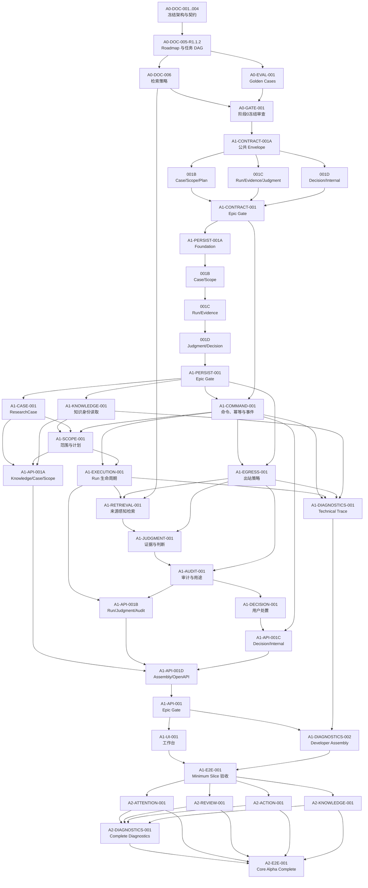

# MetaOS Alpha 任务索引

状态：阶段0任务 DAG 冻结版

任务标识：`A0-DOC-005-R1.1.2`

本文是任务编号、依赖、修改边界和验收入口的权威来源。旧实现中的主权账本、内容工坊、议题编译器、御史台、三部或宰相任务不属于当前冻结路线，不得据此继续排期。

## 1. 执行规则

- 当前仍处于阶段0；阶段0 Gate 未通过前禁止业务实现、迁移、依赖升级和运行态数据改造。
- 一个任务只解决一个主要问题，最多修改一个业务能力模块、一个测试目录和一份直接相关文档。
- 公共 Schema、迁移、根配置和 `AGENTS.md` 不得由并行任务同时修改。
- 任务完成不等于对象可用；只有满足所属阶段退出条件并通过 Golden Cases，能力才可对用户标记为已交付。
- 现有代码与冻结文档不一致是阶段0允许状态；进入实现后，代码必须向冻结契约收敛，不得反向恢复旧对象。
- 阶段1只允许修正冻结文档中的拼写、字段遗漏、引用错误和无法实现的机械矛盾。新增对象、改变状态机、放宽审计门禁、改变用户确认或阶段边界时，任务必须暂停，建立 ADR，并重新执行 A0-GATE-001。
- Feature Flag 由 A1-COMMAND-001 维护注册表、默认值和审计事实；A1-API-001 Epic 负责暴露只读能力状态。Flag 不得改写领域历史，Core Alpha Complete 四项能力必须拥有独立开关。

状态值：`completed / in_progress / pending / blocked / superseded`。

## 2. 任务依赖图

## 3. 阶段0任务

### A0-DOC-001..004：冻结架构与目标契约

- 状态：`completed`。
- 价值：统一业务价值、技术承载、领域语义和 HTTP/Application Command 契约。
- 依赖：仓库审计与用户产品决策。
- 允许修改范围：各任务对应的单一权威文档。
- 禁止修改范围：代码、迁移、配置、测试和运行态数据。
- 输入：现有仓库、真实 RAG 失败案例和用户反馈。
- 输出：`BUSINESS_ARCHITECTURE.md`、`TECHNICAL_ARCHITECTURE.md`、`DOMAIN_MODEL.md`、`API_CONTRACTS.md` 冻结稿。
- 接口：文档间所有权与引用关系。
- 验收标准：对象、状态、版本、证据、审计、处置和 API 无双重权威。
- 测试命令：各文档任务记录的 `git diff --check`、残留词和人工一致性检查。
- 回滚方式：逐提交回退对应文档修订。
- 文档更新：任务本身即文档更新。

### A0-DOC-005-R1.1.2：同步 Roadmap 与任务索引

- 状态：`completed`。
- 价值：删除旧实施路线，建立从阶段0到 Core Alpha Complete 的唯一任务 DAG。
- 依赖：A0-DOC-001..004。
- 允许修改范围：`docs/ROADMAP.md`、`docs/TASK_INDEX.md`。
- 禁止修改范围：其他文档、代码、测试、迁移、配置和 `library/`。
- 输入：四份冻结架构文档。
- 输出：分层路线图、任务依赖图与可执行任务说明。
- 接口：任务 ID、depends_on、阶段进入/退出条件。
- 验收标准：不再把旧对象和旧 API 作为目标任务；Minimum Slice 依赖无环且每项任务字段完整。
- 测试命令：`git diff --check -- docs/ROADMAP.md docs/TASK_INDEX.md`；旧对象残留检查；Mermaid 人工检查。
- 回滚方式：回退本任务提交。
- 文档更新：本任务修改的两份文档。

### A0-DOC-006：冻结来源感知检索策略

- 状态：`completed`。
- 价值：把“从哪里找、怎样找、何时停止、如何打包证据”变成可评测策略。
- 依赖：A0-DOC-005-R1.1.2。
- 允许修改范围：新增 `docs/RAG_RETRIEVAL_STRATEGY.md`。
- 禁止修改范围：检索代码、索引、Embedding、Chroma、数据库和运行态数据。
- 输入：KnowledgeScope、ResearchPlan、五种 research mode、现有检索能力与真实失败案例。
- 输出：有/无显式来源流程、短资料候选扫描、来源配额、反证、稳定排序、Token/Chunk 双预算和失败分类。
- 接口：Retrieval Router、Capability Provider、Context Packer 的策略输入输出。
- 验收标准：策略可解释 required/excluded、短书公平、比较、枚举、证据复用和降级行为。
- 测试命令：`git diff --check -- docs/RAG_RETRIEVAL_STRATEGY.md`；术语与架构交叉检查。
- 回滚方式：删除新增文档。
- 文档更新：新增检索策略权威文档。

### A0-EVAL-001：Core Alpha Golden Cases 与指标

- 状态：`completed`。
- 价值：在实现前固定真实失败案例、分层断言和发布质量门。
- 依赖：A0-DOC-005-R1.1.2；可与 A0-DOC-006 并行，但最终需同步检索指标。
- 允许修改范围：新增 `docs/CORE_ALPHA_EVALUATION.md`。
- 禁止修改范围：测试代码、fixture 数据、模型、索引和业务实现。
- 输入：业务架构冻结验收场景、API Outcome、检索失败案例。
- 输出：每个案例的输入、显式约束、预期来源、禁止来源、研究模式、证据要求、必须/禁止结果、fixture 规范和指标口径；不创建实际 fixture 数据。
- 接口：后续自动化 fixture 实现与评测 runner 的文档契约。
- 验收标准：覆盖单来源、比较、枚举、别名、排除、无证据、反证、重复块、审计、用途越级和结果漂移。
- 测试命令：`git diff --check -- docs/CORE_ALPHA_EVALUATION.md`；案例 ID 唯一性检查。
- 回滚方式：删除新增文档。
- 文档更新：新增评测权威文档。

### A0-GATE-001：阶段0冻结审查

- 状态：`pending`。
- 价值：确认文档能够作为实现稳定上游。
- 依赖：A0-DOC-005-R1.1.2、A0-DOC-006、A0-EVAL-001。
- 允许修改范围：在 `docs/ROADMAP.md` 第 2.1 节追加 Gate Record，并更新 `docs/TASK_INDEX.md` 任务状态。
- 禁止修改范围：架构内容、代码、迁移、配置和运行态数据。
- 输入：全部阶段0权威文档及 Git 状态。
- 输出：包含审查日期、上游版本、结论、未决风险和授权任务的 Gate Record，以及阶段0退出状态。
- 接口：无运行时接口。
- 验收标准：文档引用有效、术语一致、任务 DAG 无环、Golden Cases 有明确质量门，用户明确批准进入阶段1。
- 测试命令：文档链接检查、`git diff --check`、阶段0文件存在性检查。
- 回滚方式：恢复 gate 前状态，保持阶段1未授权。
- 文档更新：Roadmap 与任务索引状态。

## 4. Minimum Slice 实现任务

以下任务全部为 `pending`，只有 A0-GATE-001 完成后才能启动。

Contract 子任务 B/C/D 可以并行，但只能修改各自模块、测试和独立 errata，不得修改共享导出文件或冻结 API 文档；统一导出和 API 机械勘误由 Contract Epic Gate 单点完成。Persistence 子任务因共享迁移链必须按 A -> B -> C -> D 串行执行。API 子任务可以分别实现 router，但公共 app 接线只由专门的 assembly 子任务修改。

### A1-CONTRACT-001：Schema 映射 Epic Gate

- 价值：确认四组 Pydantic 映射共同覆盖 Minimum Slice 冻结契约。
- 依赖：A1-CONTRACT-001A、A1-CONTRACT-001B、A1-CONTRACT-001C、A1-CONTRACT-001D。
- 允许修改范围：contracts 公共导出文件、`test/test_core_alpha_contract_exports.py`、`docs/API_CONTRACTS.md` 机械勘误和本 Epic 状态。
- 禁止修改范围：子模块 Schema 语义、业务代码、API、数据库和冻结语义。
- 输入：四个子任务的测试、JSON Schema 导出和各自 errata 清单。
- 输出：公共导出、统一 API 机械勘误和 Schema 映射 Gate 结论。
- 接口：统一 contracts 包导出清单。
- 验收标准：无重复类型、循环导入、字段漂移或额外字段放行。
- 测试命令：四个 contract 子任务测试、`python -m pytest test/test_core_alpha_contract_exports.py` 与 JSON Schema 快照检查。
- 回滚方式：保持 Gate 未完成并退回失败子任务。
- 文档更新：Epic Gate 单点合并 errata；语义变化必须走 ADR 与阶段0 Gate。

### A1-CONTRACT-001A：公共值对象与 Envelope

- 价值：先冻结所有模块共享的基础 JSON/Python 类型。
- 依赖：A0-GATE-001。
- 允许修改范围：Core Alpha contracts 公共模块、`test/test_core_alpha_contract_common.py`、`docs/errata/A1-CONTRACT-001A.md`。
- 禁止修改范围：领域资源 Schema、数据库、路由和业务实现。
- 输入：OpenCodeValue、ResourceReference、CommandContext、Error、Consistency、分页和幂等契约。
- 输出：公共值对象、请求/响应 Envelope、JSON Schema 与独立 errata 清单。
- 接口：contracts 公共导入路径。
- 验收标准：严格额外字段、UTC、Hash、cursor、revision 与多聚合 consistency 校验通过。
- 测试命令：`python -m pytest test/test_core_alpha_contract_common.py`。
- 回滚方式：删除公共 contracts 模块和测试。
- 文档更新：只写本任务 errata，不直接修改冻结 API 契约。

### A1-CONTRACT-001B：Case、Scope 与 Plan Schema

- 价值：把问题、来源、范围与研究计划变成可执行契约。
- 依赖：A1-CONTRACT-001A。
- 允许修改范围：contracts 的 Case/Scope/Plan 模块、`test/test_core_alpha_contract_scope.py`、`docs/errata/A1-CONTRACT-001B.md`。
- 禁止修改范围：Run、Judgment、数据库、路由和业务实现。
- 输入：ResearchCase、Question、SourceResolution、KnowledgeScope、ResearchPlan 领域定义。
- 输出：对应 request/response Schema 与独立 errata 清单。
- 接口：Case/Scope/Plan contracts 导出。
- 验收标准：双 ID、SourceBinding 一致性、条件必填与版本字段测试通过。
- 测试命令：`python -m pytest test/test_core_alpha_contract_scope.py`。
- 回滚方式：删除该 contracts 子模块和测试。
- 文档更新：只写本任务 errata，不直接修改冻结 API 契约。

### A1-CONTRACT-001C：Run、Evidence 与 Judgment Schema

- 价值：冻结执行、证据、理由链、Claim、判断和审计表示。
- 依赖：A1-CONTRACT-001A。
- 允许修改范围：contracts 的 execution/judgment 模块、`test/test_core_alpha_contract_judgment.py`、`docs/errata/A1-CONTRACT-001C.md`。
- 禁止修改范围：Decision、数据库、路由和业务实现。
- 输入：Run、Evidence、Judgment、Audit、DecisionFitness 领域定义。
- 输出：对应 request/response Schema、判别联合 Rationale 与独立 errata 清单。
- 接口：execution/judgment contracts 导出。
- 验收标准：状态维度分离、Outcome 条件、EvidenceUse 和 Rationale profile 测试通过。
- 测试命令：`python -m pytest test/test_core_alpha_contract_judgment.py`。
- 回滚方式：删除该 contracts 子模块和测试。
- 文档更新：只写本任务 errata，不直接修改冻结 API 契约。

### A1-CONTRACT-001D：Decision 与 Internal Command Schema

- 价值：冻结用户处置、内部候选提交与命令结果边界。
- 依赖：A1-CONTRACT-001A。
- 允许修改范围：contracts 的 decision/internal 模块、`test/test_core_alpha_contract_decision.py`、`docs/errata/A1-CONTRACT-001D.md`。
- 禁止修改范围：Action、知识贡献、数据库、路由和业务实现。
- 输入：Disposition、Internal Command、Idempotency 与 Outcome 契约。
- 输出：Decision request/response、Internal command Schema 与独立 errata 清单。
- 接口：decision/internal contracts 导出。
- 验收标准：用户决定、证据状态、命令上下文和 Payload 不混用。
- 测试命令：`python -m pytest test/test_core_alpha_contract_decision.py`。
- 回滚方式：删除该 contracts 子模块和测试。
- 文档更新：只写本任务 errata，不直接修改冻结 API 契约。

### A1-PERSIST-001：Persistence Epic Gate

- 价值：确认四个持久化切片共同满足聚合事务与版本不变量。
- 依赖：A1-PERSIST-001A、A1-PERSIST-001B、A1-PERSIST-001C、A1-PERSIST-001D。
- 允许修改范围：仅更新 `docs/TASK_INDEX.md` 中本 Epic 状态。
- 禁止修改范围：Repository、迁移、业务代码和冻结语义。
- 输入：四个持久化子任务的迁移、测试和回滚记录。
- 输出：Persistence Gate 结论。
- 接口：Repository Port 完整清单。
- 验收标准：事务边界、外键、revision、不可变记录和 current pointer 一致。
- 测试命令：全部 persistence 子任务测试与迁移往返检查。
- 回滚方式：保持 Gate 未完成并退回失败子任务。
- 文档更新：仅任务状态。

### A1-PERSIST-001A：Persistence Foundation

- 价值：建立 SQLite 短事务、迁移基线和 Repository 公共机制。
- 依赖：A1-CONTRACT-001。
- 允许修改范围：Core Alpha persistence foundation、一个迁移、`test/test_core_alpha_persistence_foundation.py`、技术架构机械勘误。
- 禁止修改范围：具体聚合 Repository、API、Worker 和旧数据迁移。
- 输入：通用 ID、revision、版本、事件和事务契约。
- 输出：连接/事务管理、迁移、Repository base、compare-and-swap，以及 Idempotency、TraceEvent、Outbox、Tombstone、LifecycleGeneration 和通用 projection checkpoint 持久化。
- 接口：UnitOfWork、Repository 基础 Port、IdempotencyStore、EventStore、OutboxRepository、LifecycleRepository 与 ProjectionCheckpointRepository。
- 验收标准：WAL、短事务、并发冲突、至少一次派发、删除防复活、checkpoint 并发和迁移回滚测试通过。
- 测试命令：`python -m pytest test/test_core_alpha_persistence_foundation.py`。
- 回滚方式：回退 foundation、测试和本任务迁移。
- 文档更新：仅技术架构机械勘误。

### A1-PERSIST-001B：Case 与 Scope Repository

- 价值：持久化 Case 聚合中的问题、解析、范围和计划版本。
- 依赖：A1-PERSIST-001A、A1-CONTRACT-001B。
- 允许修改范围：Case/Scope Repository、一个迁移、`test/test_core_alpha_case_scope_repository.py`、技术架构机械勘误。
- 禁止修改范围：Run、Judgment、API 和业务 Handler。
- 输入：Case/Scope/Plan Schema 与聚合边界。
- 输出：Case/Scope Repository 实现。
- 接口：create/get/current/list/compare-and-swap。
- 验收标准：版本原子切换、current pointer 和不可变问题/解析记录测试通过。
- 测试命令：`python -m pytest test/test_core_alpha_case_scope_repository.py`。
- 回滚方式：回退 Repository、测试和本任务迁移。
- 文档更新：仅技术架构机械勘误。

### A1-PERSIST-001C：Run 与 Evidence Repository

- 价值：持久化执行、检查点、Outcome、Trace 和证据使用关系。
- 依赖：A1-PERSIST-001B、A1-CONTRACT-001C。
- 允许修改范围：Run/Evidence Repository、一个迁移、`test/test_core_alpha_run_evidence_repository.py`、技术架构机械勘误。
- 禁止修改范围：Judgment、Decision、API 和业务 Handler。
- 输入：Run/Evidence Schema 与聚合边界。
- 输出：Run/Evidence Repository，以及 RunExecutionSpec、ExecutionCheckpoint 和 ResearchTrace projection watermark 持久化。
- 接口：Run append、Outcome commit、ExecutionSpec/Checkpoint、Trace watermark、Evidence revision 与 use 查询。
- 验收标准：终态 Outcome 原子性、ExecutionSpec 不可变、Checkpoint 幂等、Trace 水位和 Evidence use 快照测试通过。
- 测试命令：`python -m pytest test/test_core_alpha_run_evidence_repository.py`。
- 回滚方式：回退 Repository、测试和本任务迁移。
- 文档更新：仅技术架构机械勘误。

### A1-PERSIST-001D：Judgment 与 Decision Repository

- 价值：持久化判断版本、审计、用途、Proposal 与用户处置。
- 依赖：A1-PERSIST-001C、A1-CONTRACT-001C、A1-CONTRACT-001D。
- 允许修改范围：Judgment/Decision Repository、一个迁移、`test/test_core_alpha_judgment_decision_repository.py`、技术架构机械勘误。
- 禁止修改范围：Run、API 和业务 Handler。
- 输入：Judgment/Decision Schema 与聚合边界。
- 输出：Judgment/Decision Repository 实现。
- 接口：version/current、audit append、fitness、proposal/confirmation 查询。
- 验收标准：版本、审计与用户确认状态不复用；跨聚合事实原子提交。
- 测试命令：`python -m pytest test/test_core_alpha_judgment_decision_repository.py`。
- 回滚方式：回退 Repository、测试和本任务迁移。
- 文档更新：仅技术架构机械勘误。

### A1-COMMAND-001：命令、幂等、事件与 Outbox

- 价值：统一 API 与 Worker 写入路径，防止重复事实和迟到结果复活。
- 依赖：A1-CONTRACT-001、A1-PERSIST-001。
- 允许修改范围：一个 application command 模块、`test/test_core_alpha_commands.py`、`docs/TECHNICAL_ARCHITECTURE.md` 机械勘误。
- 禁止修改范围：业务能力 Handler、公开 API、物理队列拓扑和 UI。
- 输入：CommandContext、consistency envelope、TraceEvent、Tombstone、Outbox 契约，以及 A1-PERSIST-001A 提供的技术 Repository Port。
- 输出：命令分发、基于 Foundation Repository 的幂等/事件/Outbox 编排、并发令牌校验和静态 Feature Flag 注册表；Flag 变更审计复用 EventStore。
- 接口：Application Command Handler、Internal Result Adapter Port 与只读 Capability/Flag Port。
- 验收标准：相同请求重放、Key 冲突、至少一次投递、过期 Worker 结果、删除防复活、默认关闭和 Flag 不改写历史测试通过。
- 测试命令：`python -m pytest test/test_core_alpha_commands.py`。
- 回滚方式：回退命令模块和测试，不删除既有业务数据。
- 文档更新：技术架构实现映射。

### A1-EGRESS-001：出站策略与调用审计

- 价值：确保任何外部 Provider 调用在发送资料前经过可拒绝、可审计的统一策略。
- 依赖：A1-CONTRACT-001、A1-PERSIST-001、A1-COMMAND-001。
- 允许修改范围：一个 Outbound Data Policy 模块、MaterialManifest Repository、一个专属迁移、`test/test_data_egress.py`、`docs/TECHNICAL_ARCHITECTURE.md` 机械勘误。
- 禁止修改范围：具体检索排序、Prompt 业务内容、Provider 凭据、根配置和第三方遥测启用。
- 输入：调用目的、材料引用、敏感级别、KnowledgeScope、Provider 与可信 CommandContext。
- 输出：Provider Invocation Port、fail-closed Egress Policy、MaterialManifest Repository/迁移和脱敏/拒绝结果。
- 接口：LLM、Embedding、Reranker、OCR、Tool 和 Telemetry Adapter 的共享包装 Port。
- 验收标准：未判定材料不得出站；excluded 内容被阻断；Manifest 不保存完整私有正文、Prompt 或凭据；correlation/causation 可追踪。
- 测试命令：`python -m pytest test/test_data_egress.py`。
- 回滚方式：关闭外部 Provider Adapter，并回退 Egress 模块、测试和专属迁移。
- 文档更新：仅技术架构机械勘误。

### A1-KNOWLEDGE-001：Knowledge Catalog 身份读取

- 价值：把现有资料映射为稳定 KnowledgeItem、Version 与 Chunk 身份，为 SourceResolution 提供依据。
- 依赖：A1-PERSIST-001。
- 允许修改范围：`metaos/knowledge` 内一个适配器、`test/test_core_alpha_knowledge_catalog.py`、一份直接相关技术文档。
- 禁止修改范围：重新切块、重算全部 Embedding、删除 Chroma collection、导入流程重构和运行态 `library/`。
- 输入：现有知识元数据、文件、Chunk 和索引记录。
- 输出：只读 Catalog Port、版本不可变校验和定位读取。
- 接口：list/get item、version、chunk、current version。
- 验收标准：版本不可静默替换，Chunk 可回链，现有资料可映射且不改变内容。
- 测试命令：`python -m pytest test/test_core_alpha_knowledge_catalog.py`。
- 回滚方式：删除适配器和测试。
- 文档更新：技术架构或检索策略的实现映射。

### A1-CASE-001：ResearchCase 与 ResearchQuestion

- 价值：建立用户侧长期研究聚合，不再以聊天或单次任务代替研究项目。
- 依赖：A1-PERSIST-001、A1-COMMAND-001。
- 允许修改范围：一个 Case Management 模块、`test/test_research_case.py`、`docs/DOMAIN_MODEL.md` 机械勘误。
- 禁止修改范围：Scope、Run、检索、判断、API 和 UI。
- 输入：创建、追问、归档、重开和派生命令。
- 输出：ResearchCase、ResearchQuestion 与 Case 活动事件。
- 接口：Case command/query handlers。
- 验收标准：派生不移动历史；归档/重开受 revision 控制；问题角色校验通过。
- 测试命令：`python -m pytest test/test_research_case.py`。
- 回滚方式：回退模块和测试。
- 文档更新：仅领域模型机械勘误；语义变更必须走 ADR 与阶段0 Gate。

### A1-SCOPE-001：来源解析、KnowledgeScope 与 ResearchPlan

- 价值：同时解决“从哪里找”和“怎样找”。
- 依赖：A1-CASE-001、A1-KNOWLEDGE-001、A1-COMMAND-001。
- 允许修改范围：一个 Scope Governance 模块、`test/test_scope_governance.py`、`docs/RAG_RETRIEVAL_STRATEGY.md` 机械勘误。
- 禁止修改范围：实际检索、模型生成、Run、API 和 UI。
- 输入：ResearchQuestion、SourceAnchor、Catalog、研究模式和证据要求。
- 输出：SourceResolution、版本化 KnowledgeScope、EvidenceRequirement 和 ResearchPlan。
- 接口：resolve/create/adjust/current handlers。
- 验收标准：required/excluded 互斥、Binding 一致性、歧义不回退、历史版本不可改。
- 测试命令：`python -m pytest test/test_scope_governance.py`。
- 回滚方式：回退模块和测试。
- 文档更新：仅检索策略机械勘误；策略语义变化必须走 ADR 与阶段0 Gate。

### A1-EXECUTION-001：ResearchRun 生命周期

- 价值：让研究执行、重试、取消、失败和结束具有可审计语义。
- 依赖：A1-SCOPE-001、A1-COMMAND-001。
- 允许修改范围：一个 Research Execution 模块、`test/test_research_run.py`、`docs/TECHNICAL_ARCHITECTURE.md` 机械勘误。
- 禁止修改范围：具体检索算法、Claim 生成、审计、公开 API 和 UI。
- 输入：固定 Scope/Plan、execution mode 和 RunExecutionSpec。
- 输出：ResearchRun、Attempt、RetrievalRun 记录、Outcome、Checkpoint 和 Public Trace。
- 接口：start/cancel/submit-result/query handlers。
- 验收标准：终态与唯一 Outcome 原子提交；基础设施重投不创建新 Attempt；零 RetrievalRun 路径合法。
- 测试命令：`python -m pytest test/test_research_run.py`。
- 回滚方式：回退模块和测试。
- 文档更新：仅技术架构机械勘误；边界变化必须走 ADR 与阶段0 Gate。

### A1-RETRIEVAL-001：来源感知检索与证据使用

- 价值：消除 Chunk 数量霸权，并形成可追溯的本次证据使用事实。
- 依赖：A1-EXECUTION-001、A1-EGRESS-001、A0-DOC-006。
- 允许修改范围：一个 Knowledge Access/检索编排模块、`test/test_source_aware_retrieval.py`、`docs/RAG_RETRIEVAL_STRATEGY.md` 机械勘误。
- 禁止修改范围：重切块、全量重建索引、Judgment、Audit、API 和 UI。
- 输入：KnowledgeScope、ResearchPlan、Catalog、现有全文与向量检索 Port。
- 输出：RetrievalRun、候选融合、Context 包、EvidenceUnit 提取和 ResearchEvidenceUse。
- 接口：execute_research_plan 与 reuse_existing_evidence。
- 验收标准：required 独立报告、excluded 零污染、短书公平、稳定排序、双预算和反证召回通过。
- 测试命令：`python -m pytest test/test_source_aware_retrieval.py`。
- 回滚方式：关闭新策略开关并回退模块和测试。
- 文档更新：仅检索策略机械勘误；策略语义变化必须走 ADR 与阶段0 Gate。

### A1-JUDGMENT-001：Evidence、Rationale、Claim 与 JudgmentCard

- 价值：把证据和推理组织为可逐条审计的判断。
- 依赖：A1-RETRIEVAL-001、A1-EGRESS-001。
- 允许修改范围：一个 Judgment 模块、`test/test_judgment_domain.py`、`docs/DOMAIN_MODEL.md` 机械勘误。
- 禁止修改范围：Audit Gate、Decision、Action、API 和 UI。
- 输入：ResearchEvidenceUse、研究模式和结构化模型候选。
- 输出：ClaimEvidenceLink、JudgmentRationale、版本化 Claim 与 JudgmentCard 草稿。
- 接口：SubmitCandidateResultCommand 后的领域转换。
- 验收标准：事实/解释/推断/假设/建议理由链裁剪正确；用户态度不改变证据状态；重复证据不增计。
- 测试命令：`python -m pytest test/test_judgment_domain.py`。
- 回滚方式：回退模块和测试，保留原 Trace。
- 文档更新：仅领域模型机械勘误；语义变更必须走 ADR 与阶段0 Gate。

### A1-AUDIT-001：Audit Pipeline 与 DecisionFitness

- 价值：阻止无证据、来源越界或用途过强的判断被展示为可靠。
- 依赖：A1-JUDGMENT-001、A1-EGRESS-001。
- 允许修改范围：Judgment 模块内审计子模块、`test/test_judgment_audit.py`、`docs/TECHNICAL_ARCHITECTURE.md` 机械勘误。
- 禁止修改范围：Decision、Action、检索策略、API 和 UI。
- 输入：JudgmentCard version、Finding 候选、策略版本和降级能力记录。
- 输出：JudgmentAudit、AuditFinding、WarningAcknowledgement 和 DecisionFitness。
- 接口：deterministic pre-check、semantic audit、decision gate。
- 验收标准：blocking 不可确认放行；warning 确认可追溯；LLM 不得单独决定 `acceptable / provisionally_acceptable` 或生成生效的 DecisionFitness；用途越级被拒绝。
- 测试命令：`python -m pytest test/test_judgment_audit.py`。
- 回滚方式：回退审计子模块和测试，默认保持判断不可采纳。
- 文档更新：仅技术架构机械勘误；边界变化必须走 ADR 与阶段0 Gate。

### A1-DECISION-001：DispositionProposal 与 ResearchDisposition

- 价值：让用户而不是系统决定研究如何结束。
- 依赖：A1-AUDIT-001。
- 允许修改范围：一个 Decision 模块、`test/test_research_disposition.py`、`docs/DOMAIN_MODEL.md` 机械勘误。
- 禁止修改范围：Action、Knowledge Contribution、API 和 UI。
- 输入：可采纳 JudgmentCard、DecisionFitness、有效 warning 确认和用户决定。
- 输出：版本化 DispositionProposal 与不可变 ResearchDisposition。
- 接口：create/accept/adjust/reject handlers。
- 验收标准：未确认不形成处置；blocked/证据不足不伪装处置；条件字段和用途匹配。
- 测试命令：`python -m pytest test/test_research_disposition.py`。
- 回滚方式：回退模块和测试。
- 文档更新：仅领域模型机械勘误；语义变更必须走 ADR 与阶段0 Gate。

### A1-API-001：Minimum Slice API Epic Gate

- 价值：确认三个路由切片加一个 Assembly/OpenAPI 子任务共同实现冻结公开与 Internal API。
- 依赖：A1-API-001A、A1-API-001B、A1-API-001C、A1-API-001D。
- 允许修改范围：仅更新 `docs/TASK_INDEX.md` 中本 Epic 状态。
- 禁止修改范围：路由、领域规则和 API 契约语义。
- 输入：四个 API 子任务的 OpenAPI、契约测试和回滚记录。
- 输出：Minimum Slice API Gate 结论。
- 接口：API_CONTRACTS 第 2、4、6、7 章。
- 验收标准：路由无重复、Envelope 一致、权限边界清晰且 OpenAPI 可生成。
- 测试命令：四个 API 子任务测试与 OpenAPI 快照检查。
- 回滚方式：保持 Gate 未完成并退回失败子任务。
- 文档更新：仅任务状态。

### A1-API-001A：Knowledge、Case 与 Scope API

- 价值：暴露知识身份、研究项目、来源解析、范围和计划入口。
- 依赖：A1-KNOWLEDGE-001、A1-CASE-001、A1-SCOPE-001、A1-CONTRACT-001。
- 允许修改范围：一个 Core Alpha API router 子模块、`test/test_core_alpha_api_scope.py`、`docs/errata/A1-API-001A.md`。
- 禁止修改范围：Run、Judgment、Decision、Developer API 和 UI。
- 输入：对应 Query/Command Handler 与冻结 API Schema。
- 输出：API_CONTRACTS 4.1 至 4.5 路由与独立 errata 清单。
- 接口：Knowledge Catalog、ResearchCase、SourceResolution、KnowledgeScope、ResearchPlan。
- 验收标准：状态码、幂等、version/current、SourceBinding 和读后写契约通过。
- 测试命令：`python -m pytest test/test_core_alpha_api_scope.py`。
- 回滚方式：移除该 router 子模块和测试。
- 文档更新：只写本任务 errata，不直接修改冻结 API 契约。

### A1-API-001B：Run、Evidence、Judgment 与 Audit API

- 价值：暴露研究执行、证据、判断、审计和用途读取/确认入口。
- 依赖：A1-EXECUTION-001、A1-JUDGMENT-001、A1-AUDIT-001、A1-CONTRACT-001。
- 允许修改范围：一个 Core Alpha API router 子模块、`test/test_core_alpha_api_judgment.py`、`docs/errata/A1-API-001B.md`。
- 禁止修改范围：Decision、Developer API、Worker 和 UI。
- 输入：对应 Query/Command Handler 与冻结 API Schema。
- 输出：API_CONTRACTS 4.6、4.7、4.9 路由与独立 errata 清单。
- 接口：ResearchRun、Evidence、Judgment、Audit、Public Trace。
- 验收标准：同步/异步、Outcome、warning、user attitude 和 Public Trace 脱敏契约通过。
- 测试命令：`python -m pytest test/test_core_alpha_api_judgment.py`。
- 回滚方式：移除该 router 子模块和测试。
- 文档更新：只写本任务 errata，不直接修改冻结 API 契约。

### A1-API-001C：Decision 与 Internal API

- 价值：暴露用户处置并接收受信 Worker 候选，不混用普通用户权限。
- 依赖：A1-DECISION-001、A1-COMMAND-001、A1-CONTRACT-001。
- 允许修改范围：一个 Decision/Internal router 子模块、`test/test_core_alpha_api_decision.py`、`docs/errata/A1-API-001C.md`。
- 禁止修改范围：Developer API、Action、知识贡献和 UI。
- 输入：Decision Handler、Internal Result Adapter 与冻结 API Schema。
- 输出：API_CONTRACTS 4.8、6、7 章路由与独立 errata 清单。
- 接口：DispositionProposal、ResearchDisposition、SubmitCandidateResultCommand。
- 验收标准：用户确认、服务身份、幂等重放、并发与受限网络边界测试通过。
- 测试命令：`python -m pytest test/test_core_alpha_api_decision.py`。
- 回滚方式：移除该 router 子模块和测试。
- 文档更新：只写本任务 errata，不直接修改冻结 API 契约。

### A1-API-001D：API Assembly、Feature 状态与 OpenAPI

- 价值：在单一所有者下完成 router 接线和目标 OpenAPI 汇总，避免并行任务修改公共入口。
- 依赖：A1-API-001A、A1-API-001B、A1-API-001C。
- 允许修改范围：FastAPI 公共接线文件、Developer Router 扩展挂载点、`test/test_core_alpha_openapi.py`、`docs/API_CONTRACTS.md` 机械勘误。
- 禁止修改范围：子路由业务逻辑、Developer 具体路由实现、领域规则和 UI。
- 输入：三个已测试 router、三个 API errata 清单与 A1-COMMAND-001 的只读 Capability/Flag Port。
- 输出：统一 `/alpha`、`/internal/alpha` 接线、稳定 Developer Router 扩展挂载点、合并后的 API 机械勘误、只读 Feature 状态和 OpenAPI 文档。
- 接口：API router registry、Developer extension registry、Capability/Flag query 与 OpenAPI schema。
- 验收标准：无重复 route ID；默认关闭策略正确；Developer 扩展可注册但默认不暴露路由；OpenAPI 与冻结路由/Schema 一致。
- 测试命令：`python -m pytest test/test_core_alpha_openapi.py`。
- 回滚方式：移除统一 router 注册，不改子模块。
- 文档更新：单点合并 API 子任务 errata；语义变化必须走 ADR 与阶段0 Gate。

### A1-DIAGNOSTICS-001：技术 Trace 与 Developer API

- 价值：为调试、降级和审计提供受限技术视图，同时保持普通 Trace 脱敏。
- 依赖：A1-COMMAND-001、A1-EXECUTION-001、A1-EGRESS-001、A1-KNOWLEDGE-001。
- 允许修改范围：一个 Diagnostics/Projection 模块、Developer router 注册模块、`test/test_core_alpha_diagnostics.py`、`docs/errata/A1-DIAGNOSTICS-001.md`。
- 禁止修改范围：FastAPI 公共接线文件、新迁移或自建 checkpoint 表、普通产品 API、领域状态、Provider 凭据和完整私有正文保存。
- 输入：TraceEvent、RunExecutionSpec、MaterialManifest、IndexGeneration，以及 A1-PERSIST-001A 的 ProjectionCheckpointRepository。
- 输出：DeveloperResearchTrace、MaterialManifest 查询、IndexGeneration metadata、projection status 与独立 errata 清单。
- 接口：通过 A1-API-001D 的 Developer extension registry 注册 API_CONTRACTS 第 8 章 Minimum Slice 子集；复用 Foundation projection 存储；使用独立 developer access policy。
- 验收标准：普通/Developer Trace 隔离；敏感字段不返回；lag、失败和材料出站可追踪。
- 测试命令：`python -m pytest test/test_core_alpha_diagnostics.py`。
- 回滚方式：移除 Developer router 并关闭 Diagnostics Feature Flag。
- 文档更新：只写本任务 errata，由后续 API Assembly 或专门勘误任务单点合并。

Minimum Slice 不注册 CaseActivityLog 与 `/alpha/developer/research-runs/{id}/budget`；也不得伪造空活动投影或 BudgetSnapshot。二者由 Complete Diagnostics 扩展实现。

### A1-DIAGNOSTICS-002：Developer API Assembly

- 价值：在不让 Diagnostics 修改公共 app 文件的前提下，完成 Developer router 的最终挂载和契约合并。
- 依赖：A1-API-001、A1-DIAGNOSTICS-001。
- 允许修改范围：Developer extension registry 接线、`test/test_core_alpha_developer_openapi.py`、`docs/API_CONTRACTS.md` 机械勘误。
- 禁止修改范围：普通产品路由、Diagnostics 查询逻辑、领域状态和 Complete-only 路由。
- 输入：A1-API-001D 提供的稳定挂载点、Developer router 和 Diagnostics errata。
- 输出：已挂载的 Minimum Slice Developer API、合并后的机械勘误和 Developer OpenAPI。
- 接口：`/alpha/developer` Minimum Slice 子集与独立 developer access policy。
- 验收标准：主应用可发现 Developer router；未授权访问被拒绝；CaseActivityLog 与预算路由未注册；普通 OpenAPI 不泄露内部路由。
- 测试命令：`python -m pytest test/test_core_alpha_developer_openapi.py`。
- 回滚方式：移除 Developer extension 注册，普通 API 与 UI 保持可用。
- 文档更新：单点合并 Diagnostics errata；语义变化必须走 ADR 与阶段0 Gate。

### A1-UI-001：Minimum Slice 认知工作台

- 价值：让用户实际提出问题、治理来源、审阅判断并确认处置。
- 依赖：A1-API-001。
- 允许修改范围：Streamlit 中一个 Core Alpha 工作台页面、一个 UI 测试目录、`docs/BUSINESS_ARCHITECTURE.md` 机械勘误。
- 禁止修改范围：领域、API、检索、旧页面删除和全局视觉重构。
- 输入：Minimum Slice API。
- 输出：工作台、证据/Claim 展示、审计状态、处置确认，以及仅在 Diagnostics Feature Flag 可用时显示的 Developer 跳转。
- 接口：只调用冻结公开 API，不直接访问 Repository。
- 验收标准：桌面与移动关键视口无重叠；草稿/阻断/可采纳区分；excluded/required 可见；确认动作不混用。
- 测试命令：UI 单测、Playwright 关键路径与截图检查。
- 回滚方式：移除新页面入口，保留旧 Streamlit。
- 文档更新：仅业务架构机械勘误；价值或阶段边界变化必须走 ADR 与阶段0 Gate。

### A1-E2E-001：Minimum Slice 发布门

- 价值：证明新闭环比普通 Top-K RAG 更可靠，而不是只完成对象搭建。
- 依赖：A1-UI-001、A1-DIAGNOSTICS-002、A0-EVAL-001。
- 允许修改范围：一个 Core Alpha 端到端测试目录、评测报告、`docs/ROADMAP.md` 状态。
- 禁止修改范围：为通过测试修改业务规则、降低审计标准或改写 fixture 期望。
- 输入：Golden Cases、固定知识 fixture 和运行服务。
- 输出：来源、检索、判断、审计、API 和 UI 回归报告。
- 接口：公开 API 与工作台用户路径。
- 验收标准：ROADMAP 第 3 章退出条件全部满足。
- 测试命令：Minimum Slice 单测、契约测试、Golden Cases runner 与 UI 检查。
- 回滚方式：不发布新入口，保持 Feature Flag 关闭。
- 文档更新：Roadmap 记录验收结果。

## 5. Core Alpha Complete 任务

以下四个 A2 节点是待拆分 Epic Gate，不是单个实现任务。它们在 Task Index 中登记 Contract、Persistence、Domain、Command、API、UI/交互、Feature Flag 和切片 E2E 子任务之前，不得进入 `in_progress`。A2-E2E-001 依赖已经通过的四个 Epic Gate 与 Complete Diagnostics 扩展。

### A2-ATTENTION-001：Attention Epic Gate

- 价值：确认 Triage、注意力待办、软门禁和预算控制形成可关闭纵向切片。
- 依赖：A1-E2E-001，以及后续登记的 Attention 子任务。
- 允许修改范围：在 `docs/TASK_INDEX.md` 登记子任务并更新本 Epic 状态。
- 禁止修改范围：在子任务登记前修改 Schema、迁移、领域、API、UI 或运行配置。
- 输入：ResearchTriage、AttentionBacklog、预算诊断契约和子任务验收记录。
- 输出：Attention Epic Gate 结论。
- 接口：API_CONTRACTS 5.1、5.2，以及 Complete 阶段 Developer budget 扩展。
- 验收标准：子任务覆盖 Contract、Persistence、Domain、Command、API、UI、独立 Feature Flag、预算诊断和切片 E2E；达到上限不丢问题、不自动关 Case。
- 测试命令：登记后的全部 Attention 子任务测试与 Feature Flag 关闭回归。
- 回滚方式：保持 Epic 未完成或关闭 Attention Feature Flag。
- 文档更新：仅任务登记与状态；语义变化必须走 ADR 与阶段0 Gate。

### A2-REVIEW-001：Review Epic Gate

- 价值：确认判断复核和失效传播形成可关闭纵向切片。
- 依赖：A1-E2E-001，以及后续登记的 Review 子任务。
- 允许修改范围：在 `docs/TASK_INDEX.md` 登记子任务并更新本 Epic 状态。
- 禁止修改范围：在子任务登记前修改 Schema、迁移、领域、API、UI 或运行配置。
- 输入：JudgmentReview、ReviewResult、失效传播契约和子任务验收记录。
- 输出：Review Epic Gate 结论。
- 接口：API_CONTRACTS 5.3 与 CompleteJudgmentReviewCommand。
- 验收标准：子任务覆盖 Contract、Persistence、Domain、Command、API、UI、独立 Feature Flag 和切片 E2E；复核不覆盖历史判断或处置。
- 测试命令：登记后的全部 Review 子任务测试与 Feature Flag 关闭回归。
- 回滚方式：保持 Epic 未完成或关闭 Review Feature Flag。
- 文档更新：仅任务登记与状态；语义变化必须走 ADR 与阶段0 Gate。

### A2-ACTION-001：Action Epic Gate

- 价值：确认低风险行动、承诺与复盘形成可关闭纵向切片。
- 依赖：A1-E2E-001，以及后续登记的 Action 子任务。
- 允许修改范围：在 `docs/TASK_INDEX.md` 登记子任务并更新本 Epic 状态。
- 禁止修改范围：在子任务登记前修改 Schema、迁移、领域、API、UI 或运行配置。
- 输入：Action、RiskProfile、DecisionFitness 门禁和子任务验收记录。
- 输出：Action Epic Gate 结论。
- 接口：API_CONTRACTS 5.4。
- 验收标准：子任务覆盖 Contract、Persistence、Domain、Command、API、UI、独立 Feature Flag 和切片 E2E；越级风险被拒绝且 Proposal 不等于 Commitment。
- 测试命令：登记后的全部 Action 子任务测试与 Feature Flag 关闭回归。
- 回滚方式：保持 Epic 未完成或关闭 Action Feature Flag。
- 文档更新：仅任务登记与状态；语义变化必须走 ADR 与阶段0 Gate。

### A2-KNOWLEDGE-001：Knowledge Contribution Epic Gate

- 价值：确认候选、知识笔记和用户观点出口形成可关闭纵向切片。
- 依赖：A1-E2E-001，以及后续登记的 Knowledge Contribution 子任务。
- 允许修改范围：在 `docs/TASK_INDEX.md` 登记子任务并更新本 Epic 状态。
- 禁止修改范围：在子任务登记前修改 Schema、迁移、领域、API、UI 或运行配置。
- 输入：Candidate、KnowledgeAsset、UserNote、证据失效传播和子任务验收记录。
- 输出：Knowledge Contribution Epic Gate 结论。
- 接口：API_CONTRACTS 5.5、5.6。
- 验收标准：子任务覆盖 Contract、Persistence、Domain、Command、API、UI、独立 Feature Flag 和切片 E2E；blocked 不沉淀、调整后重校验且派生知识不循环举证。
- 测试命令：登记后的全部 Knowledge Contribution 子任务测试与 Feature Flag 关闭回归。
- 回滚方式：保持 Epic 未完成或关闭 Knowledge Contribution Feature Flag。
- 文档更新：仅任务登记与状态；语义变化必须走 ADR 与阶段0 Gate。

### A2-DIAGNOSTICS-001：Complete Diagnostics 扩展

- 价值：在 Complete 对象和正式预算存在后，补齐 Case 级活动与预算消费诊断。
- 依赖：A2-ATTENTION-001、A2-REVIEW-001、A2-ACTION-001、A2-KNOWLEDGE-001、A1-DIAGNOSTICS-002。
- 允许修改范围：Diagnostics Complete 扩展、Developer router 注册、`test/test_complete_diagnostics.py`、`docs/errata/A2-DIAGNOSTICS-001.md`。
- 禁止修改范围：普通产品 API、Minimum Slice Trace 语义、领域状态和新的业务对象。
- 输入：Case 范围事件、BudgetSnapshot、BudgetConsumptionRecord 与 Complete Feature 状态。
- 输出：CaseActivityLog、ResearchBudgetStatus 和对应 Developer 路由。
- 接口：API_CONTRACTS 第 8 章 Complete-only 查询。
- 验收标准：关闭 Complete flags 时路由不可用；活动投影不重复事实日志；预算仅来源于正式 Snapshot/ConsumptionRecord。
- 测试命令：`python -m pytest test/test_complete_diagnostics.py`。
- 回滚方式：移除 Complete Developer 扩展注册，不影响 Minimum Slice Diagnostics。
- 文档更新：独立 errata 由 Complete API assembly 单点合并；语义变化必须走 ADR 与阶段0 Gate。

### A2-E2E-001：Core Alpha Complete 发布门

- 价值：确认注意力、复核、行动和知识沉淀均为可关闭增强，而非 Minimum Slice 新依赖。
- 依赖：A2-ATTENTION-001、A2-REVIEW-001、A2-ACTION-001、A2-KNOWLEDGE-001、A2-DIAGNOSTICS-001。
- 允许修改范围：Core Alpha Complete 端到端测试、评测报告、Roadmap 状态。
- 禁止修改范围：Extended Alpha 功能和核心业务不变量。
- 输入：Complete Golden Cases 与四个 Feature Flag 组合。
- 输出：组合降级、用户主权、隐私和闭环验收报告。
- 接口：Core Alpha Complete 公共 API 与 UI。
- 验收标准：任一增强关闭或失败时 Minimum Slice 仍完整运行；Complete 场景全部通过。
- 测试命令：Complete 单测、契约、Golden Cases 与 UI 回归。
- 回滚方式：逐项关闭增强 Feature Flag。
- 文档更新：Roadmap 记录 Complete 结果。

## 6. Extended Alpha 与 Beta Backlog

IntentTrace、CognitiveLens、画像、InformationIntake、三部榜单和 Beta 产品化暂不拆成可执行任务。只有 Core Alpha Complete 通过后，才能依据真实使用证据建立 ADR、对象契约、API 和任务；不得从旧任务索引恢复已废弃对象或接口。
