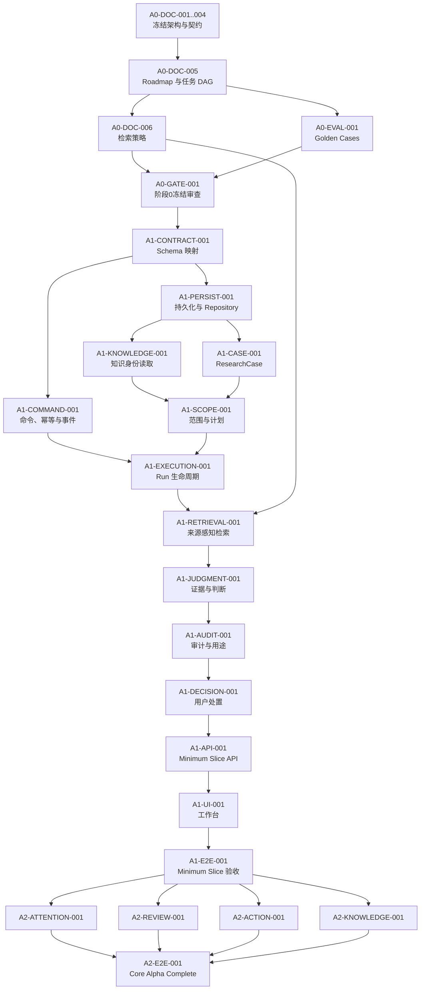

# MetaOS Alpha 任务索引

状态：阶段0任务 DAG 冻结版

任务标识：`A0-DOC-005`

本文是任务编号、依赖、修改边界和验收入口的权威来源。旧实现中的主权账本、内容工坊、议题编译器、御史台、三部或宰相任务不属于当前冻结路线，不得据此继续排期。

## 1. 执行规则

- 当前仍处于阶段0；阶段0 Gate 未通过前禁止业务实现、迁移、依赖升级和运行态数据改造。
- 一个任务只解决一个主要问题，最多修改一个业务能力模块、一个测试目录和一份直接相关文档。
- 公共 Schema、迁移、根配置和 `AGENTS.md` 不得由并行任务同时修改。
- 任务完成不等于对象可用；只有满足所属阶段退出条件并通过 Golden Cases，能力才可对用户标记为已交付。
- 现有代码与冻结文档不一致是阶段0允许状态；进入实现后，代码必须向冻结契约收敛，不得反向恢复旧对象。

状态值：`completed / in_progress / pending / blocked / superseded`。

## 2. 任务依赖图

## 3. 阶段0任务

### A0-DOC-001..004：冻结架构与目标契约

- 状态：`completed`。
- 价值：统一业务价值、技术承载、领域语义和 HTTP/Application Command 契约。
- 依赖：仓库审计与用户产品决策。
- 允许修改范围：各任务对应的单一权威文档。
- 禁止修改范围：代码、迁移、配置、测试和运行态数据。
- 输入：现有仓库、真实 RAG 失败案例和用户反馈。
- 输出：`BUSINESS_ARCHITECTURE.md`、`TECHNICAL_ARCHITECTURE.md`、`DOMAIN_MODEL.md`、`API_CONTRACTS.md` 冻结稿。
- 接口：文档间所有权与引用关系。
- 验收标准：对象、状态、版本、证据、审计、处置和 API 无双重权威。
- 测试命令：各文档任务记录的 `git diff --check`、残留词和人工一致性检查。
- 回滚方式：逐提交回退对应文档修订。
- 文档更新：任务本身即文档更新。

### A0-DOC-005：同步 Roadmap 与任务索引

- 状态：`completed`。
- 价值：删除旧实施路线，建立从阶段0到 Core Alpha Complete 的唯一任务 DAG。
- 依赖：A0-DOC-001..004。
- 允许修改范围：`docs/ROADMAP.md`、`docs/TASK_INDEX.md`。
- 禁止修改范围：其他文档、代码、测试、迁移、配置和 `library/`。
- 输入：四份冻结架构文档。
- 输出：分层路线图、任务依赖图与可执行任务说明。
- 接口：任务 ID、depends_on、阶段进入/退出条件。
- 验收标准：不再把旧对象和旧 API 作为目标任务；Minimum Slice 依赖无环且每项任务字段完整。
- 测试命令：`git diff --check -- docs/ROADMAP.md docs/TASK_INDEX.md`；旧对象残留检查；Mermaid 人工检查。
- 回滚方式：回退本任务提交。
- 文档更新：本任务修改的两份文档。

### A0-DOC-006：冻结来源感知检索策略

- 状态：`pending`。
- 价值：把“从哪里找、怎样找、何时停止、如何打包证据”变成可评测策略。
- 依赖：A0-DOC-005。
- 允许修改范围：新增 `docs/RAG_RETRIEVAL_STRATEGY.md`。
- 禁止修改范围：检索代码、索引、Embedding、Chroma、数据库和运行态数据。
- 输入：KnowledgeScope、ResearchPlan、五种 research mode、现有检索能力与真实失败案例。
- 输出：有/无显式来源流程、短资料候选扫描、来源配额、反证、稳定排序、Token/Chunk 双预算和失败分类。
- 接口：Retrieval Router、Capability Provider、Context Packer 的策略输入输出。
- 验收标准：策略可解释 required/excluded、短书公平、比较、枚举、证据复用和降级行为。
- 测试命令：`git diff --check -- docs/RAG_RETRIEVAL_STRATEGY.md`；术语与架构交叉检查。
- 回滚方式：删除新增文档。
- 文档更新：新增检索策略权威文档。

### A0-EVAL-001：Core Alpha Golden Cases 与指标

- 状态：`pending`。
- 价值：在实现前固定真实失败案例、分层断言和发布质量门。
- 依赖：A0-DOC-005；可与 A0-DOC-006 并行，但最终需同步检索指标。
- 允许修改范围：新增 `docs/CORE_ALPHA_EVALUATION.md`。
- 禁止修改范围：测试代码、fixture 数据、模型、索引和业务实现。
- 输入：业务架构冻结验收场景、API Outcome、检索失败案例。
- 输出：每个案例的输入、显式约束、预期来源、禁止来源、研究模式、证据要求、必须/禁止结果和指标口径。
- 接口：后续自动化 fixture 与评测 runner 的文档契约。
- 验收标准：覆盖单来源、比较、枚举、别名、排除、无证据、反证、重复块、审计、用途越级和结果漂移。
- 测试命令：`git diff --check -- docs/CORE_ALPHA_EVALUATION.md`；案例 ID 唯一性检查。
- 回滚方式：删除新增文档。
- 文档更新：新增评测权威文档。

### A0-GATE-001：阶段0冻结审查

- 状态：`pending`。
- 价值：确认文档能够作为实现稳定上游。
- 依赖：A0-DOC-005、A0-DOC-006、A0-EVAL-001。
- 允许修改范围：仅更新 `docs/ROADMAP.md` 与 `docs/TASK_INDEX.md` 的阶段状态。
- 禁止修改范围：架构内容、代码、迁移、配置和运行态数据。
- 输入：全部阶段0权威文档及 Git 状态。
- 输出：人工审查结论、阶段0退出记录和首个实现任务授权。
- 接口：无运行时接口。
- 验收标准：文档引用有效、术语一致、任务 DAG 无环、Golden Cases 有明确质量门，用户明确批准进入阶段1。
- 测试命令：文档链接检查、`git diff --check`、阶段0文件存在性检查。
- 回滚方式：恢复 gate 前状态，保持阶段1未授权。
- 文档更新：Roadmap 与任务索引状态。

## 4. Minimum Slice 实现任务

以下任务全部为 `pending`，只有 A0-GATE-001 完成后才能启动。

### A1-CONTRACT-001：冻结对象到 Pydantic Schema 映射

- 价值：让领域与 API 契约成为可执行校验，不复用旧对象名称。
- 依赖：A0-GATE-001。
- 允许修改范围：新增一个 Core Alpha contracts 模块、`test/test_core_alpha_contracts.py`、`docs/API_CONTRACTS.md` 的直接勘误。
- 禁止修改范围：数据库、路由、Worker、检索、UI、根配置和旧模块重构。
- 输入：DOMAIN_MODEL R1.2.2 与 API_CONTRACTS R1.2.1。
- 输出：Minimum Slice Pydantic request/response/value-object Schema。
- 接口：稳定 Python 导入路径和 JSON Schema 导出。
- 验收标准：双 ID、条件必填、状态正交、服务端拥有字段和严格额外字段校验通过。
- 测试命令：`python -m pytest test/test_core_alpha_contracts.py`。
- 回滚方式：删除新增 contracts 模块与测试。
- 文档更新：仅记录实现映射勘误，不改变业务语义。

### A1-PERSIST-001：聚合持久化与 Repository Port

- 价值：为权威状态、版本、revision 和 current pointer 提供事务边界。
- 依赖：A1-CONTRACT-001。
- 允许修改范围：一个 Core Alpha persistence 模块、一个迁移、`test/test_core_alpha_repositories.py`、`docs/TECHNICAL_ARCHITECTURE.md` 直接勘误。
- 禁止修改范围：API、检索、Worker、Streamlit、旧表数据迁移和根配置。
- 输入：聚合边界、逻辑持久化集合和 Schema。
- 输出：ResearchCase、ResearchRun、Evidence、Judgment、Decision 的 Repository Port 与 SQLite 实现。
- 接口：create/get/current/list/compare-and-swap；不提供通用 `update_status`。
- 验收标准：短事务、WAL 兼容、revision 冲突、版本原子切换和不可变记录测试通过。
- 测试命令：`python -m pytest test/test_core_alpha_repositories.py`。
- 回滚方式：回退模块、测试和本任务迁移。
- 文档更新：技术架构中的物理映射记录。

### A1-COMMAND-001：命令、幂等、事件与 Outbox

- 价值：统一 API 与 Worker 写入路径，防止重复事实和迟到结果复活。
- 依赖：A1-CONTRACT-001、A1-PERSIST-001。
- 允许修改范围：一个 application command 模块、`test/test_core_alpha_commands.py`、`docs/TECHNICAL_ARCHITECTURE.md` 直接勘误。
- 禁止修改范围：业务能力 Handler、公开 API、物理队列拓扑和 UI。
- 输入：CommandContext、consistency envelope、TraceEvent、Tombstone 与 Outbox 契约。
- 输出：命令分发、幂等存储、事件追加、Outbox 和并发令牌校验。
- 接口：Application Command Handler 与 Internal Result Adapter Port。
- 验收标准：相同请求重放、Key 冲突、至少一次投递、过期 Worker 结果和删除防复活测试通过。
- 测试命令：`python -m pytest test/test_core_alpha_commands.py`。
- 回滚方式：回退命令模块和测试，不删除既有业务数据。
- 文档更新：技术架构实现映射。

### A1-KNOWLEDGE-001：Knowledge Catalog 身份读取

- 价值：把现有资料映射为稳定 KnowledgeItem、Version 与 Chunk 身份，为 SourceResolution 提供依据。
- 依赖：A1-PERSIST-001。
- 允许修改范围：`metaos/knowledge` 内一个适配器、`test/test_core_alpha_knowledge_catalog.py`、一份直接相关技术文档。
- 禁止修改范围：重新切块、重算全部 Embedding、删除 Chroma collection、导入流程重构和运行态 `library/`。
- 输入：现有知识元数据、文件、Chunk 和索引记录。
- 输出：只读 Catalog Port、版本不可变校验和定位读取。
- 接口：list/get item、version、chunk、current version。
- 验收标准：版本不可静默替换，Chunk 可回链，现有资料可映射且不改变内容。
- 测试命令：`python -m pytest test/test_core_alpha_knowledge_catalog.py`。
- 回滚方式：删除适配器和测试。
- 文档更新：技术架构或检索策略的实现映射。

### A1-CASE-001：ResearchCase 与 ResearchQuestion

- 价值：建立用户侧长期研究聚合，不再以聊天或单次任务代替研究项目。
- 依赖：A1-PERSIST-001、A1-COMMAND-001。
- 允许修改范围：一个 Case Management 模块、`test/test_research_case.py`、`docs/DOMAIN_MODEL.md` 直接勘误。
- 禁止修改范围：Scope、Run、检索、判断、API 和 UI。
- 输入：创建、追问、归档、重开和派生命令。
- 输出：ResearchCase、ResearchQuestion 与 Case 活动事件。
- 接口：Case command/query handlers。
- 验收标准：派生不移动历史；归档/重开受 revision 控制；问题角色校验通过。
- 测试命令：`python -m pytest test/test_research_case.py`。
- 回滚方式：回退模块和测试。
- 文档更新：领域模型直接勘误。

### A1-SCOPE-001：来源解析、KnowledgeScope 与 ResearchPlan

- 价值：同时解决“从哪里找”和“怎样找”。
- 依赖：A1-CASE-001、A1-KNOWLEDGE-001。
- 允许修改范围：一个 Scope Governance 模块、`test/test_scope_governance.py`、`docs/RAG_RETRIEVAL_STRATEGY.md` 直接勘误。
- 禁止修改范围：实际检索、模型生成、Run、API 和 UI。
- 输入：ResearchQuestion、SourceAnchor、Catalog、研究模式和证据要求。
- 输出：SourceResolution、版本化 KnowledgeScope、EvidenceRequirement 和 ResearchPlan。
- 接口：resolve/create/adjust/current handlers。
- 验收标准：required/excluded 互斥、Binding 一致性、歧义不回退、历史版本不可改。
- 测试命令：`python -m pytest test/test_scope_governance.py`。
- 回滚方式：回退模块和测试。
- 文档更新：检索策略直接勘误。

### A1-EXECUTION-001：ResearchRun 生命周期

- 价值：让研究执行、重试、取消、失败和结束具有可审计语义。
- 依赖：A1-SCOPE-001、A1-COMMAND-001。
- 允许修改范围：一个 Research Execution 模块、`test/test_research_run.py`、`docs/TECHNICAL_ARCHITECTURE.md` 直接勘误。
- 禁止修改范围：具体检索算法、Claim 生成、审计、公开 API 和 UI。
- 输入：固定 Scope/Plan、execution mode 和 RunExecutionSpec。
- 输出：ResearchRun、Attempt、RetrievalRun 记录、Outcome、Checkpoint 和 Public Trace。
- 接口：start/cancel/submit-result/query handlers。
- 验收标准：终态与唯一 Outcome 原子提交；基础设施重投不创建新 Attempt；零 RetrievalRun 路径合法。
- 测试命令：`python -m pytest test/test_research_run.py`。
- 回滚方式：回退模块和测试。
- 文档更新：技术架构直接勘误。

### A1-RETRIEVAL-001：来源感知检索与证据使用

- 价值：消除 Chunk 数量霸权，并形成可追溯的本次证据使用事实。
- 依赖：A1-EXECUTION-001、A0-DOC-006。
- 允许修改范围：一个 Knowledge Access/检索编排模块、`test/test_source_aware_retrieval.py`、`docs/RAG_RETRIEVAL_STRATEGY.md` 直接勘误。
- 禁止修改范围：重切块、全量重建索引、Judgment、Audit、API 和 UI。
- 输入：KnowledgeScope、ResearchPlan、Catalog、现有全文与向量检索 Port。
- 输出：RetrievalRun、候选融合、Context 包、EvidenceUnit 提取和 ResearchEvidenceUse。
- 接口：execute_research_plan 与 reuse_existing_evidence。
- 验收标准：required 独立报告、excluded 零污染、短书公平、稳定排序、双预算和反证召回通过。
- 测试命令：`python -m pytest test/test_source_aware_retrieval.py`。
- 回滚方式：关闭新策略开关并回退模块和测试。
- 文档更新：检索策略直接勘误。

### A1-JUDGMENT-001：Evidence、Rationale、Claim 与 JudgmentCard

- 价值：把证据和推理组织为可逐条审计的判断。
- 依赖：A1-RETRIEVAL-001。
- 允许修改范围：一个 Judgment 模块、`test/test_judgment_domain.py`、`docs/DOMAIN_MODEL.md` 直接勘误。
- 禁止修改范围：Audit Gate、Decision、Action、API 和 UI。
- 输入：ResearchEvidenceUse、研究模式和结构化模型候选。
- 输出：ClaimEvidenceLink、JudgmentRationale、版本化 Claim 与 JudgmentCard 草稿。
- 接口：SubmitCandidateResultCommand 后的领域转换。
- 验收标准：事实/解释/推断/假设/建议理由链裁剪正确；用户态度不改变证据状态；重复证据不增计。
- 测试命令：`python -m pytest test/test_judgment_domain.py`。
- 回滚方式：回退模块和测试，保留原 Trace。
- 文档更新：领域模型直接勘误。

### A1-AUDIT-001：Audit Pipeline 与 DecisionFitness

- 价值：阻止无证据、来源越界或用途过强的判断被展示为可靠。
- 依赖：A1-JUDGMENT-001。
- 允许修改范围：Judgment 模块内审计子模块、`test/test_judgment_audit.py`、`docs/TECHNICAL_ARCHITECTURE.md` 直接勘误。
- 禁止修改范围：Decision、Action、检索策略、API 和 UI。
- 输入：JudgmentCard version、Finding 候选、策略版本和降级能力记录。
- 输出：JudgmentAudit、AuditFinding、WarningAcknowledgement 和 DecisionFitness。
- 接口：deterministic pre-check、semantic audit、decision gate。
- 验收标准：blocking 不可确认放行；warning 确认可追溯；LLM 不单独决定 ready；用途越级被拒绝。
- 测试命令：`python -m pytest test/test_judgment_audit.py`。
- 回滚方式：回退审计子模块和测试，默认保持判断不可采纳。
- 文档更新：技术架构直接勘误。

### A1-DECISION-001：DispositionProposal 与 ResearchDisposition

- 价值：让用户而不是系统决定研究如何结束。
- 依赖：A1-AUDIT-001。
- 允许修改范围：一个 Decision 模块、`test/test_research_disposition.py`、`docs/DOMAIN_MODEL.md` 直接勘误。
- 禁止修改范围：Action、Knowledge Contribution、API 和 UI。
- 输入：可采纳 JudgmentCard、DecisionFitness、有效 warning 确认和用户决定。
- 输出：版本化 DispositionProposal 与不可变 ResearchDisposition。
- 接口：create/accept/adjust/reject handlers。
- 验收标准：未确认不形成处置；blocked/证据不足不伪装处置；条件字段和用途匹配。
- 测试命令：`python -m pytest test/test_research_disposition.py`。
- 回滚方式：回退模块和测试。
- 文档更新：领域模型直接勘误。

### A1-API-001：Minimum Slice HTTP API

- 价值：按冻结契约暴露完整可靠判断闭环。
- 依赖：A1-DECISION-001、A1-COMMAND-001。
- 允许修改范围：一个 Core Alpha API router、`test/test_core_alpha_api.py`、`docs/API_CONTRACTS.md` 直接勘误。
- 禁止修改范围：领域规则、旧路由删除、Streamlit、Worker 和根配置。
- 输入：Application Command/Query Handlers 与 R1.2.1 API Schema。
- 输出：Minimum Slice `/alpha` 与受限 `/internal/alpha` 路由。
- 接口：API_CONTRACTS 第 2、4、6、7 章。
- 验收标准：状态码、幂等、revision、current、Outcome、权限和 consistency 契约测试通过。
- 测试命令：`python -m pytest test/test_core_alpha_api.py`。
- 回滚方式：移除新 router 接线并回退测试。
- 文档更新：API 契约仅记实现勘误。

### A1-UI-001：Minimum Slice 认知工作台

- 价值：让用户实际提出问题、治理来源、审阅判断并确认处置。
- 依赖：A1-API-001。
- 允许修改范围：Streamlit 中一个 Core Alpha 工作台页面、一个 UI 测试目录、`docs/BUSINESS_ARCHITECTURE.md` 直接勘误。
- 禁止修改范围：领域、API、检索、旧页面删除和全局视觉重构。
- 输入：Minimum Slice API。
- 输出：工作台、证据/Claim 展示、审计状态、处置确认与 Developer 跳转。
- 接口：只调用冻结公开 API，不直接访问 Repository。
- 验收标准：桌面与移动关键视口无重叠；草稿/阻断/可采纳区分；excluded/required 可见；确认动作不混用。
- 测试命令：UI 单测、Playwright 关键路径与截图检查。
- 回滚方式：移除新页面入口，保留旧 Streamlit。
- 文档更新：业务架构直接勘误。

### A1-E2E-001：Minimum Slice 发布门

- 价值：证明新闭环比普通 Top-K RAG 更可靠，而不是只完成对象搭建。
- 依赖：A1-UI-001、A0-EVAL-001。
- 允许修改范围：一个 Core Alpha 端到端测试目录、评测报告、`docs/ROADMAP.md` 状态。
- 禁止修改范围：为通过测试修改业务规则、降低审计标准或改写 fixture 期望。
- 输入：Golden Cases、固定知识 fixture 和运行服务。
- 输出：来源、检索、判断、审计、API 和 UI 回归报告。
- 接口：公开 API 与工作台用户路径。
- 验收标准：ROADMAP 第 3 章退出条件全部满足。
- 测试命令：Minimum Slice 单测、契约测试、Golden Cases runner 与 UI 检查。
- 回滚方式：不发布新入口，保持 Feature Flag 关闭。
- 文档更新：Roadmap 记录验收结果。

## 5. Core Alpha Complete 任务

以下任务只有 A1-E2E-001 完成后才能启动；各任务仍须在开始前拆成不跨业务模块的实现单。

### A2-ATTENTION-001：Triage 与注意力待办

- 价值：约束研究投入而不替用户关闭问题。
- 依赖：A1-E2E-001。
- 允许修改范围：Case Management 的 Triage/Backlog 子模块、对应测试、API 契约直接勘误。
- 禁止修改范围：画像、榜单、行动、知识贡献。
- 输入：ResearchCase、初步来源解析、注意力上限和用户决定。
- 输出：ResearchTriage、AttentionBacklogItem 和软门禁事件。
- 接口：API_CONTRACTS 5.1、5.2。
- 验收标准：达到上限不丢问题、不自动关 Case；覆盖可追溯。
- 测试命令：对应 schema、repository、API 与软门禁测试。
- 回滚方式：关闭注意力门禁 Feature Flag。
- 文档更新：API 或业务架构直接勘误。

### A2-REVIEW-001：JudgmentReview

- 价值：使证据失效和已知系统缺陷能够触发可审计复核。
- 依赖：A1-E2E-001。
- 允许修改范围：Judgment 模块复核子模块、对应测试、领域模型直接勘误。
- 禁止修改范围：自动外部监控、定时提醒、Action 和知识贡献。
- 输入：JudgmentCard version、触发原因和当前证据状态。
- 输出：JudgmentReview、ReviewResult 与重新研究/处置建议。
- 接口：API_CONTRACTS 5.3 与 CompleteJudgmentReviewCommand。
- 验收标准：不覆盖历史判断或处置；改变处置必须二次确认。
- 测试命令：复核领域、并发、API 和失效传播测试。
- 回滚方式：关闭复核入口，保留历史记录。
- 文档更新：领域模型直接勘误。

### A2-ACTION-001：低风险行动与复盘

- 价值：把适用判断转成用户确认的小步行动，并用结果反查前提。
- 依赖：A1-E2E-001。
- 允许修改范围：一个 Action 模块、对应测试、API 契约直接勘误。
- 禁止修改范围：高风险自动执行、外部系统写操作、画像和知识贡献。
- 输入：`proceed_to_action` 处置、DecisionFitness、风险输入和用户决定。
- 输出：ActionProposal、RiskProfile、Commitment、Review。
- 接口：API_CONTRACTS 5.4。
- 验收标准：越级风险被拒绝；Proposal 不等于 Commitment；复盘可触发 Review 建议。
- 测试命令：行动领域、风险、API 和复盘测试。
- 回滚方式：关闭 Action Feature Flag，不影响处置闭环。
- 文档更新：API 契约直接勘误。

### A2-KNOWLEDGE-001：最小知识贡献

- 价值：把可靠判断可选地沉淀为可撤回、可追溯的知识笔记。
- 依赖：A1-E2E-001。
- 允许修改范围：一个 Knowledge Contribution 模块、对应测试、API 契约直接勘误。
- 禁止修改范围：知识图谱、自动合并、原始资料入库和复杂关系编辑器。
- 输入：可采纳 JudgmentCard、EvidenceUnit、用户决定和校验结果。
- 输出：Candidate、KnowledgeAsset 或 UserNote。
- 接口：API_CONTRACTS 5.5、5.6。
- 验收标准：blocked 不沉淀；调整后重校验；派生知识不循环举证；拒绝保持知识体系不变。
- 测试命令：知识贡献领域、API、失效传播和证据去重测试。
- 回滚方式：关闭贡献入口，保留判断与处置。
- 文档更新：API 契约直接勘误。

### A2-E2E-001：Core Alpha Complete 发布门

- 价值：确认注意力、复核、行动和知识沉淀均为可关闭增强，而非 Minimum Slice 新依赖。
- 依赖：A2-ATTENTION-001、A2-REVIEW-001、A2-ACTION-001、A2-KNOWLEDGE-001。
- 允许修改范围：Core Alpha Complete 端到端测试、评测报告、Roadmap 状态。
- 禁止修改范围：Extended Alpha 功能和核心业务不变量。
- 输入：Complete Golden Cases 与四个 Feature Flag 组合。
- 输出：组合降级、用户主权、隐私和闭环验收报告。
- 接口：Core Alpha Complete 公共 API 与 UI。
- 验收标准：任一增强关闭或失败时 Minimum Slice 仍完整运行；Complete 场景全部通过。
- 测试命令：Complete 单测、契约、Golden Cases 与 UI 回归。
- 回滚方式：逐项关闭增强 Feature Flag。
- 文档更新：Roadmap 记录 Complete 结果。

## 6. Extended Alpha 与 Beta Backlog

IntentTrace、CognitiveLens、画像、InformationIntake、三部榜单和 Beta 产品化暂不拆成可执行任务。只有 Core Alpha Complete 通过后，才能依据真实使用证据建立 ADR、对象契约、API 和任务；不得从旧任务索引恢复已废弃对象或接口。
