# MetaOS Alpha 技术架构

状态：Core Alpha 技术架构对齐草案

实现状态：本文档描述目标技术架构，不代表相关能力已经实现

权威范围：模块边界、技术组件、Worker、存储、模型适配、检索访问、Trace、审计、降级与开发者可观测性

文档边界：本文档维护技术承载方式，不定义业务目标、完整领域字段、API 请求响应细节或具体检索算法参数。业务目标以 `docs/BUSINESS_ARCHITECTURE.md` 为准；领域字段和状态以 `docs/DOMAIN_MODEL.md` 为准；API 契约以 `docs/API_CONTRACTS.md` 为准；检索算法和来源治理细节以 `docs/RAG_RETRIEVAL_STRATEGY.md` 为准。

任务标识：`A0-DOC-002-R1`

## 1. 架构定位

MetaOS Alpha 采用模块化单体和独立 Worker。Core Alpha 的技术切入口不是重写现有 RAG，而是在现有知识库、检索、模型网关和 Streamlit 基座上，逐步建立一条可追踪、可审计、可复核的研究执行链。

Core Alpha 技术主线：

```text
Workbench
-> Application Service
-> ResearchCase
-> ResearchTriage
-> SourceResolution
-> KnowledgeScope
-> ResearchPlan
-> ResearchRun
-> ResearchAttempt
-> RetrievalRun
-> EvidenceUnit
-> Claim
-> JudgmentCard
-> Audit
-> DispositionProposal
-> ResearchDisposition
-> JudgmentReview / Action
```

技术架构必须保证：

- 用户显式来源约束进入所有检索、上下文打包、证据链和审计环节。
- ResearchRun、ResearchAttempt、RetrievalRun 和 ResearchTrace 的关系可追溯。
- 每个核心 Claim 都能关联可定位 EvidenceUnit。
- Audit 阻断结果不能被 UI 或 API 显示成可靠判断。
- DispositionProposal 和 ActionProposal 需要用户确认后才成为最终处置或行动承诺。
- JudgmentReview 可以复核历史判断，不与 ActionReview 混用。

## 2. 当前技术基座

当前仓库已经使用：

- Python 3.11。
- FastAPI。
- Pydantic。
- SQLite。
- Redis。
- RQ。
- ChromaDB。
- Ollama `bge-m3`。
- DeepSeek 兼容 Chat API。
- Streamlit。
- PaddleOCR / PyMuPDF。
- pytest / unittest。

当前技术基座继续保留。Phase 0 只做架构文档、契约说明和任务拆分，不做代码重构、迁移、依赖升级或运行态数据改造。

## 3. 总体技术架构图

```mermaid
flowchart TB
    USER["用户"]

    subgraph PRESENTATION["表现层：Streamlit"]
        WORKBENCH["工作台<br/>ResearchCase、范围、判断卡、处置"]
        KNOWLEDGE_UI["知识<br/>作品、版本、结构、引用记录"]
        REVIEW_UI["复盘<br/>JudgmentReview / ActionReview"]
        DEV_UI["开发者<br/>Trace、检索、证据、审计、成本、失败原因"]
    end

    USER --> WORKBENCH
    USER --> KNOWLEDGE_UI
    USER --> REVIEW_UI
    USER --> DEV_UI

    subgraph APPLICATION["应用层：模块化单体"]
        API["FastAPI / Application Service"]
        RESEARCH_APP["Research Application Service<br/>驱动研究生命周期"]
        TRACE_SVC["ResearchTrace Service<br/>不可变事实记录 + 当前状态摘要"]
        FLAG_SVC["策略版本、Prompt 版本与回滚开关"]
    end

    WORKBENCH --> API
    KNOWLEDGE_UI --> API
    REVIEW_UI --> API
    DEV_UI --> API

    API --> RESEARCH_APP
    RESEARCH_APP --> TRACE_SVC
    RESEARCH_APP --> FLAG_SVC

    subgraph CORE_DOMAIN["Core Alpha 领域服务"]
        CASE_SVC["ResearchCase Service"]
        TRIAGE_SVC["ResearchTriage Service"]
        SOURCE_SVC["SourceResolution Service<br/>作品、版本、译本、载体解析"]
        SCOPE_SVC["KnowledgeScope Service"]
        PLAN_SVC["ResearchPlan Service"]
        RUN_SVC["ResearchRun / Attempt Service"]
        EVIDENCE_SVC["Evidence Service<br/>EvidenceUnit 与定位"]
        CLAIM_SVC["Claim Service"]
        JUDGMENT_SVC["JudgmentCard Service<br/>版本化判断卡"]
        AUDIT_SVC["Audit Service<br/>确定性审计 + 语义审计"]
        DISP_SVC["Disposition Service<br/>Proposal 与最终处置"]
        JREVIEW_SVC["JudgmentReview Service"]
        ACTION_SVC["Action Service<br/>Proposal / Commitment / Review"]
    end

    RESEARCH_APP --> CASE_SVC
    CASE_SVC --> TRIAGE_SVC
    TRIAGE_SVC --> SOURCE_SVC
    SOURCE_SVC --> SCOPE_SVC
    SCOPE_SVC --> PLAN_SVC
    PLAN_SVC --> RUN_SVC
    RUN_SVC --> EVIDENCE_SVC
    EVIDENCE_SVC --> CLAIM_SVC
    CLAIM_SVC --> JUDGMENT_SVC
    JUDGMENT_SVC --> AUDIT_SVC
    AUDIT_SVC --> DISP_SVC
    DISP_SVC --> JREVIEW_SVC
    DISP_SVC --> ACTION_SVC
    ACTION_SVC --> JREVIEW_SVC

    subgraph RETRIEVAL["检索与知识访问层"]
        SOURCE_ROUTER["KnowledgeItemProfile Router"]
        VECTOR_SEARCH["向量检索<br/>Chroma"]
        FULLTEXT_SEARCH["全文检索<br/>SQLite FTS5"]
        FUSION["融合与重排<br/>RRF / 规则 / 稳定排序"]
        CONTEXT_PACKER["Context Packer<br/>Chunk 与 Token 预算"]
    end

    RUN_SVC --> SOURCE_ROUTER
    SOURCE_ROUTER --> VECTOR_SEARCH
    SOURCE_ROUTER --> FULLTEXT_SEARCH
    VECTOR_SEARCH --> FUSION
    FULLTEXT_SEARCH --> FUSION
    FUSION --> CONTEXT_PACKER
    CONTEXT_PACKER --> EVIDENCE_SVC

    subgraph REPOSITORIES["Repository 层"]
        KNOWLEDGE_REPO["Knowledge Repository<br/>Item / Version / Profile"]
        CHUNK_REPO["Chunk Repository"]
        TRACE_REPO["Trace Repository"]
        RESEARCH_REPO["Research Repository<br/>Case / Run / Attempt"]
        JUDGMENT_REPO["Judgment Repository<br/>Evidence / Claim / Card / Audit"]
        ACTION_REPO["Disposition / Action / Review Repository"]
        PROFILE_REPO["Intent / Profile Repository"]
    end

    SOURCE_SVC --> KNOWLEDGE_REPO
    SOURCE_ROUTER --> KNOWLEDGE_REPO
    VECTOR_SEARCH --> CHUNK_REPO
    FULLTEXT_SEARCH --> CHUNK_REPO
    TRACE_SVC --> TRACE_REPO
    CASE_SVC --> RESEARCH_REPO
    RUN_SVC --> RESEARCH_REPO
    EVIDENCE_SVC --> JUDGMENT_REPO
    CLAIM_SVC --> JUDGMENT_REPO
    JUDGMENT_SVC --> JUDGMENT_REPO
    AUDIT_SVC --> JUDGMENT_REPO
    DISP_SVC --> ACTION_REPO
    JREVIEW_SVC --> ACTION_REPO
    ACTION_SVC --> ACTION_REPO

    subgraph MODEL["模型适配层"]
        EMBEDDING["Embedding Adapter<br/>Ollama / BGE-M3"]
        LLM["LLM Provider Adapter<br/>DeepSeek"]
        PROMPT["Prompt Registry<br/>版本化 Prompt"]
        STRUCTURED["结构化输出校验<br/>Pydantic / JSON Schema"]
    end

    VECTOR_SEARCH --> EMBEDDING
    TRIAGE_SVC --> LLM
    PLAN_SVC --> LLM
    CLAIM_SVC --> LLM
    JUDGMENT_SVC --> LLM
    AUDIT_SVC --> LLM
    TRIAGE_SVC --> PROMPT
    PLAN_SVC --> PROMPT
    CLAIM_SVC --> PROMPT
    AUDIT_SVC --> PROMPT
    LLM --> STRUCTURED
    STRUCTURED --> TRIAGE_SVC
    STRUCTURED --> PLAN_SVC
    STRUCTURED --> CLAIM_SVC
    STRUCTURED --> AUDIT_SVC

    subgraph INFRA["数据与基础设施"]
        SQLITE["SQLite + WAL<br/>领域对象、元数据、Trace、状态"]
        CHROMA["ChromaDB<br/>向量索引"]
        FTS["SQLite FTS5<br/>全文索引"]
        LIBRARY["library 文件存储<br/>原始资料、解析文本、版本文件"]
        REDIS["Redis"]
        RQ["RQ Workers"]
    end

    KNOWLEDGE_REPO --> SQLITE
    CHUNK_REPO --> SQLITE
    TRACE_REPO --> SQLITE
    RESEARCH_REPO --> SQLITE
    JUDGMENT_REPO --> SQLITE
    ACTION_REPO --> SQLITE
    PROFILE_REPO --> SQLITE
    CHUNK_REPO --> CHROMA
    CHUNK_REPO --> FTS
    KNOWLEDGE_REPO --> LIBRARY
    RESEARCH_APP --> REDIS
    REDIS --> RQ
    RQ --> RUN_SVC
    RQ --> AUDIT_SVC

    subgraph CROSS["横切能力"]
        OBS["日志、指标、Trace、Token、成本、失败原因"]
        FALLBACK["模型、检索、审计降级"]
        IDEMPOTENCY["幂等、重试、Attempt、稳定 Tie-break"]
        SECURITY["资料边界、外部模型材料披露"]
        EVAL["冻结验收场景与回归评测"]
    end

    APPLICATION -. "记录" .-> OBS
    CORE_DOMAIN -. "记录" .-> OBS
    RETRIEVAL -. "记录" .-> OBS
    MODEL -. "记录" .-> OBS
    FLAG_SVC --> FALLBACK
    RUN_SVC --> IDEMPOTENCY
    MODEL --> SECURITY
    EVAL -. "验证" .-> RESEARCH_APP
    EVAL -. "验证" .-> AUDIT_SVC
```



## 4. 模块边界

### 4.1 表现层

Streamlit 在 Core Alpha 中承担个人认知工作台职责。

主视图：

- 工作台：提出问题、管理 ResearchCase、指定范围、查看 JudgmentCard、DispositionProposal、JudgmentReview 和 ActionProposal。
- 知识：查看作品、版本、结构、引用记录和 SourceResolution 结果。
- 复盘：查看 ResearchDisposition、JudgmentReview、ActionReview 和画像更新候选。
- 开发者：查看 ResearchTrace、RetrievalRun、EvidenceUnit、AuditFinding、Token、成本和失败原因。

表现层原则：

- 默认用户界面不暴露底层检索实现细节。
- 开发者层必须能诊断来源解析、检索、上下文打包、模型调用、审计和降级。
- blocked JudgmentCard 不得以可采纳结论样式展示。

### 4.2 应用层

`Research Application Service` 驱动单次研究生命周期，负责调用领域服务和记录 Trace。

应用层不直接实现检索算法、模型 Prompt 或审计规则；它负责：

- 创建或进入 ResearchCase。
- 调用 ResearchTriage。
- 串联 SourceResolution、KnowledgeScope、ResearchPlan、ResearchRun。
- 触发 Evidence、Claim、JudgmentCard、Audit 和 Disposition。
- 管理同步 API 与异步 Worker 的边界。
- 记录 strategy version、prompt version、schema version 和 attempt 信息。

### 4.3 Core Alpha 领域服务

Core Alpha 服务边界：

- `ResearchCase Service`：管理用户侧研究项目、归档、重新打开和派生新 Case。
- `ResearchTriage Service`：给出研究深度、预算和执行策略建议。
- `SourceResolution Service`：解析作品、版本、译本、载体和内容版本。
- `KnowledgeScope Service`：生成 required、primary、comparison、excluded 来源范围。
- `ResearchPlan Service`：根据研究模式生成证据要求和执行计划。
- `ResearchRun / Attempt Service`：创建 ResearchRun，管理 ResearchAttempt 和 RetrievalRun。
- `Evidence Service`：生成 EvidenceUnit 和定位信息。
- `Claim Service`：生成结构化 Claim。
- `JudgmentCard Service`：生成版本化 JudgmentCard。
- `Audit Service`：执行确定性审计和语义审计。
- `Disposition Service`：生成 DispositionProposal，并保存用户确认后的 ResearchDisposition。
- `JudgmentReview Service`：记录判断复核。
- `Action Service`：管理 ActionProposal、ActionCommitment 和 ActionReview。

服务之间通过结构化对象协作，不通过自然语言共享隐式字段。

### 4.4 Extended Alpha 领域服务

Extended Alpha 服务是方向性设计，不与 Core Alpha 使用同一冻结强度：

- `IntentTrace Service`。
- `BookProfile Service`。
- `LensSkill Service`。
- `Cognitive Profile Service`。
- `InformationIntake Service`。
- `Ranking / AttentionJustification Service`。

这些服务不得破坏 Core Alpha 的研究闭环。任何 Extended Alpha 服务失败，都应降级为 Core Alpha 可继续运行。

## 5. ResearchRun、Attempt 与 Trace

技术语义冻结如下：

```text
ResearchCase
-> ResearchRun
-> ResearchAttempt
-> RetrievalRun
```

关系规则：

- 一个 ResearchCase 可以拥有多个 ResearchRun。
- 一个 ResearchRun 表示一次范围、计划和核心目标已确定的研究执行。
- 每个 ResearchRun 对应一个完整 ResearchTrace。
- 一个 ResearchRun 可以发生多个 ResearchAttempt。
- 每个 ResearchAttempt 可以包含一个或多个 RetrievalRun。
- ResearchTrace 汇总记录全部 ResearchAttempt 和 RetrievalRun。
- 失败 ResearchAttempt 不得被后续 ResearchAttempt 覆盖。
- 只有 KnowledgeScope、ResearchPlan 和核心研究目标保持不变时，重试才是同一 ResearchRun 的新 Attempt。
- 范围、研究模式、核心证据要求或研究目标发生实质变化时，必须创建新的 ResearchRun。

JudgmentCard 修订规则：

- 判断表达、证据映射、结论强度或 Claim 分类修订，属于同一 ResearchRun 下的 JudgmentCard 新版本。
- 重新检索、改变 KnowledgeScope、改变研究模式或改变核心证据要求，必须创建新的 ResearchRun、新 ResearchTrace 和新的 JudgmentCard 版本。

ResearchTrace 记录：

- 原始问题、ResearchCase、ResearchTriage。
- SourceResolution 和 KnowledgeScope。
- ResearchPlan、ResearchRun、ResearchAttempt、RetrievalRun。
- 候选来源、候选证据、最终 EvidenceUnit。
- 模型 Provider、Model、Prompt 版本、结构化输出版本。
- JudgmentCard 版本、Audit 结果、Disposition、JudgmentReview 和 ActionReview。
- 失败原因、降级路径和用户覆盖记录。

## 6. 检索与知识访问层

检索层技术目标是让来源范围、证据选择和上下文打包可解释、可追踪、可降级。

检索入口：

- ResearchRun 必须携带 KnowledgeScope 和 ResearchPlan。
- RetrievalRun 必须归属于某个 ResearchAttempt。
- required source 必须独立处理并报告 supporting、contradicting、no_evidence 或 unavailable 等结果。
- excluded source 不得进入检索候选、上下文、工具调用输入、引用、EvidenceUnit 和判断证据链。

检索通道：

- 向量检索：ChromaDB + Embedding Adapter。
- 全文检索：SQLite FTS5。
- 元数据过滤：来源、版本、章节、语言、文件路径等。
- 融合与重排：RRF、规则融合、稳定排序或后续评测驱动的 reranker。
- Context Packer：控制上下文预算、来源覆盖和证据定位。

检索策略细节，例如 Top-K、RRF 参数、来源评分、全书候选扫描、Context Packing 算法和 reranker 选择，不在本文档固定；这些内容以 `docs/RAG_RETRIEVAL_STRATEGY.md` 为准。

## 7. Evidence、Claim、Judgment 与 Audit

### 7.1 EvidenceUnit

EvidenceUnit 是 Claim 可以引用的最小证据单元。

技术要求：

- 能回到 KnowledgeItem、KnowledgeItemVersion、Chunk 和定位信息。
- 能记录证据角色、来源、引用文本或摘要、内容 Hash 和生成它的 RetrievalRun。
- 能区分支持、反证、定义、上下文和背景等业务角色，具体枚举以 `docs/DOMAIN_MODEL.md` 为准。
- 相邻或重叠文本不得被重复计算为多份独立证据。

### 7.2 Claim

Claim 必须结构化输出并通过 Schema 校验。

技术要求：

- 区分认识性质和表达角色。
- 表达证据支持状态、重要性和用户接受状态。
- 可关联 EvidenceUnit、反证 EvidenceUnit 和推理说明。
- blocked Claim 不能被用户接受操作改成系统可靠判断。

### 7.3 JudgmentCard

JudgmentCard 是面向用户的综合出口，但必须版本化。

技术要求：

- 每次修订生成新的 JudgmentCard 版本。
- 旧版本不得被覆盖。
- 版本之间需要可追踪 supersedes / previous 关系，具体字段以 `docs/DOMAIN_MODEL.md` 为准。
- ready、blocked、needs_review 等状态名称由领域模型最终确定。

### 7.4 Audit

Audit 分为确定性审计和语义审计。

确定性审计由代码优先完成：

- 引用是否存在。
- EvidenceUnit 是否可定位。
- required source 是否被独立报告。
- excluded source 是否越界。
- 核心 Claim 是否有关联证据。

语义审计可以由模型辅助：

- 证据是否真正支持 Claim。
- 是否省略关键反证。
- 是否把相关性写成因果。
- 是否把类比写成原文事实。
- 是否过度确定。

审计输出必须结构化。非阻断性警告可由用户知情确认；阻断性问题不能被用户确认成可靠判断。

## 8. Disposition、JudgmentReview 与 Action

Disposition Service 负责生成 DispositionProposal，并保存用户确认或调整后的 ResearchDisposition。

技术规则：

- 未确认 DispositionProposal 不得作为最终 ResearchDisposition。
- proceed_to_action 才能创建 ActionProposal。
- ActionProposal 被用户接受后才形成 ActionCommitment。
- ActionProposal 被用户调整时，应形成新版本 ActionProposal。
- ActionProposal 被拒绝时，应回到处置确认或 explicit_no_action。

JudgmentReview Service 负责记录判断复核：

- 用户主动发起复核。
- 用户重新打开 ResearchCase 时发起复核。
- 系统发现已引用证据删除、定位失效或内容变化时提示复核或失效。
- ActionReview 发现行动前提错误时进入 JudgmentReview。

自动发现新证据影响历史判断、定期复核、外部事件监控和自动提醒属于后续增强能力，不是 Core Alpha 最小技术要求。

## 9. 模型适配层

保留 `metaos.llm_gateway` 作为模型边界，并扩展模型调用记录。

模型适配层需要记录：

- Provider 名称。
- Model 名称。
- Prompt 版本。
- Structured output schema 名称和版本。
- 请求摘要与响应摘要。
- Token 用量、成本和耗时。
- JSON Schema 或 Pydantic 校验错误。
- 是否包含用户画像、私有资料、EvidenceUnit 或上下文片段。

模型输出原则：

- 面向领域对象的模型输出必须先产出结构化 JSON。
- JSON 必须通过 Pydantic 或 JSON Schema 校验。
- 校验失败进入可重试路径。
- 最终失败必须保存失败记录，不得静默返回自由文本。
- 模型参数知识不能成为可采纳核心 Claim 的证据，也不能伪装成允许来源内容。

外部模型边界：

- 外部模型调用必须可在开发者层查看发送材料范围。
- 用户画像默认不应进入外部模型调用，除非用户显式允许或业务契约明确要求。
- 被 excluded 的来源不得进入模型上下文或工具输入。

## 10. 存储架构

Core Alpha 初期继续使用 SQLite，启用 WAL，避免多 Worker 长事务。

当前表族继续保留：

- `jobs`
- `sources`
- `assets`
- `knowledge_items`
- `chunks`

Core Alpha 目标表族：

- 研究：`research_cases`、`research_runs`、`research_attempts`。
- Trace：`research_traces`、`trace_events`、`model_calls`、`retrieval_runs`。
- 来源与范围：`source_resolutions`、`knowledge_scopes`、`research_plans`。
- 证据与判断：`evidence_units`、`claims`、`judgment_cards`、`audit_findings`。
- 处置与复核：`disposition_proposals`、`research_dispositions`、`judgment_reviews`。
- 行动：`action_proposals`、`action_commitments`、`action_reviews`。
- 版本与策略：`schema_versions`、`prompt_versions`、`index_versions`、`strategy_versions`。

字段、状态、索引和迁移顺序以 `docs/DOMAIN_MODEL.md` 和后续任务为准。Phase 0 不创建表、不运行迁移、不改运行态数据。

存储规则：

- ResearchTrace 采用不可变事实记录 + 当前状态摘要。
- 重试产生新的 ResearchAttempt，不覆盖旧失败。
- 后台任务写入应有幂等键。
- 多 Worker 不得同时执行 Schema 迁移。
- 业务删除、归档和复核需要保留足够审计信息，具体策略由领域模型定义。

## 11. Worker 架构

现有队列继续保留：

- `ingest`
- `ocr`
- `index`
- `rag`

Core Alpha 目标 Worker：

- `research`：执行 ResearchRun 和 ResearchAttempt。
- `retrieval`：执行 RetrievalRun、全文检索、向量检索和融合。
- `audit`：执行语义审计、反证检查和修订循环。
- `review`：处理用户触发的 JudgmentReview。

Extended Alpha 后续 Worker：

- `intake`
- `ranking`
- `profile`
- `workshop`

Worker 幂等规则：

- Worker 输入必须包含 job id、ResearchRun id 或 ResearchAttempt id。
- 同一 Attempt 重试不得创建重复业务记录。
- 失败要写入 jobs error、Trace event 和对应业务错误。
- 长任务要写 progress。
- Worker 失败后必须可在开发者层看到失败阶段和降级路径。

## 12. API 架构

FastAPI 继续作为本地 API 边界。Core Alpha API 分组应服务工作台，而不是直接暴露内部算法。

Core Alpha API 分组：

- ResearchCase API。
- ResearchTriage API。
- SourceResolution / KnowledgeScope API。
- ResearchRun API。
- JudgmentCard API。
- Audit API。
- Disposition API。
- JudgmentReview API。
- Action API。
- Developer Trace API。

API 原则：

- 请求和响应契约以 `docs/API_CONTRACTS.md` 为准。
- API 不应让前端绕过 Audit 直接把草稿标为 ready。
- API 不应把未确认 DispositionProposal 当作 ResearchDisposition。
- API 不应把 ActionProposal 当作 ActionCommitment。
- Developer API 可以暴露 Trace、Token、成本和失败原因，普通用户 API 默认隐藏底层实现细节。

## 13. 前端架构

Streamlit 继续作为 Alpha 本地工作台。

Core Alpha 页面建议：

- 工作台：ResearchCase 列表、问题输入、Triage 建议、来源选择、JudgmentCard、DispositionProposal。
- 证据：EvidenceUnit、引用定位、反证、证据缺口。
- 复核：JudgmentReview、失效判断、重新研究入口。
- 行动：ActionProposal、ActionCommitment、ActionReview。
- 开发者：ResearchTrace、ResearchAttempt、RetrievalRun、模型调用、审计结果、失败原因。

前端规则：

- 不做营销落地页。
- 首屏应是可操作工作台。
- blocked JudgmentCard 不得以最终结论样式呈现。
- 用户必须能区分系统建议、用户已确认处置和用户已承诺行动。
- 用户应能查看外部模型发送材料范围。

## 14. 降级与失败类型

Core Alpha 必须区分失败类型，不得统一显示“资料不足”。

建议失败类型：

- source_not_found
- source_ambiguous
- source_version_unavailable
- source_empty
- retrieval_no_candidate
- retrieval_weak_candidate
- required_source_not_covered
- insufficient_evidence
- conflicting_evidence
- context_budget_exceeded
- vector_store_unavailable
- fulltext_unavailable
- model_unavailable
- structured_output_invalid
- audit_blocked
- audit_timeout

降级规则：

- 来源解析失败不得静默回退全库。
- required 来源无证据不得由其他来源代答。
- 向量库不可用时可降级到全文检索，并记录降级。
- 全文检索不可用时可降级到向量检索，并记录降级。
- 模型不可用时保留 EvidenceUnit 和 Trace，不错误显示为可靠判断。
- Audit 超时或阻断时，JudgmentCard 不得显示为 ready。

## 15. 可观测性与质量门

开发者层必须可观察：

- ResearchCase、ResearchRun、ResearchAttempt 和 RetrievalRun id。
- SourceResolution 和 KnowledgeScope。
- 查询变体、候选来源、候选证据、最终 EvidenceUnit。
- Context Packer 输入输出摘要。
- 模型调用、Prompt 版本、Token、成本和结构化校验结果。
- AuditFinding、阻断项和修订循环。
- DispositionProposal、ResearchDisposition、JudgmentReview 和 ActionReview。
- 降级路径和失败原因。

质量门：

- 来源边界违规率目标为 0。
- ready 核心 Claim 证据覆盖率目标为 100%。
- required source 独立检索报告覆盖率目标为 100%。
- 审计阻断误显示率目标为 0。
- 失效判断误显示率目标为 0。
- Golden Cases 审计逃逸率目标为 0。

这些指标的业务定义以 `docs/BUSINESS_ARCHITECTURE.md` 为准；具体评测实现由后续评测文档和测试任务定义。

## 16. 技术后置规则

以下技术只有在评测证明必要时引入：

- PyTorch：本地重排、NER、指代消解或微调。
- LangGraph：研究流程稳定且普通任务编排无法维护后再评估。
- OpenSearch：检索数据规模和并发超过 SQLite / PostgreSQL 能力后再评估。
- Neo4j：关系查询复杂度超过关系库和递归 SQL 能力后再评估。
- SQLAlchemy / Alembic / PostgreSQL：公共 Schema 稳定后再作为迁移任务评估。

Phase 0 不引入新依赖，不改根配置，不改迁移基线，不改运行态 `library/` 数据。
