# MetaOS Alpha 技术架构

状态：Core Alpha 技术架构冻结候选

实现状态：本文档描述目标技术架构，不代表相关能力已经实现

权威范围：模块边界、技术组件、Worker 角色、存储归属、模型适配、出站策略、检索访问、Trace、审计、降级与开发者可观测性

文档边界：本文档维护技术承载方式，不定义业务目标、完整领域字段、API 请求响应细节、最终表结构或具体检索算法参数。业务目标以 `docs/BUSINESS_ARCHITECTURE.md` 为准；领域字段和状态以 `docs/DOMAIN_MODEL.md` 为准；API 契约以 `docs/API_CONTRACTS.md` 为准；检索算法和来源治理细节以 `docs/RAG_RETRIEVAL_STRATEGY.md` 为准。

任务标识：`A0-DOC-002-R2`

## 1. 架构定位

MetaOS Alpha 采用模块化单体和独立 Worker。Core Alpha 的技术切入口不是重写现有 RAG，而是在现有知识库、检索、模型网关和 Streamlit 基座上，建立一条可追踪、可审计、可复核、可处置的研究执行链。

Core Alpha 技术主线：

```text
Workbench
-> API / Worker Adapter
-> Application Command Handler
-> Domain Module
-> Repository / Port
-> ResearchCase
-> ResearchRun
-> ResearchAttempt
-> 0..n RetrievalRun
-> EvidenceUnit
-> Claim
-> JudgmentCard
-> Audit
-> DispositionProposal
-> ResearchDisposition / JudgmentReview / Action
```

技术架构必须保证：

- 用户显式来源约束进入检索、上下文打包、模型输入、证据链和审计环节。
- ResearchRun、ResearchAttempt、RetrievalRun、ResearchTrace 和 CaseActivityLog 的关系可追溯。
- 每个 ready 核心 Claim 都能关联可定位 EvidenceUnit。
- Audit 阻断结果不能被 UI、API 或 Worker 显示成可靠判断。
- 未确认 DispositionProposal 不得成为 ResearchDisposition。
- ActionProposal 不得自动成为 ActionCommitment。
- JudgmentReview 复核判断，ActionReview 复盘行动，两者不混用。
- Extended Alpha 失败不得破坏 Core Alpha 闭环。

## 2. 当前技术基座与运行边界

当前仓库已经使用：

- Python 3.11。
- FastAPI。
- Pydantic。
- SQLite。
- Redis。
- RQ。
- ChromaDB。
- Ollama `bge-m3`。
- DeepSeek 兼容 Chat API。
- Streamlit。
- PaddleOCR / PyMuPDF。
- pytest / unittest。

当前技术基座继续保留。Phase 0 只做架构文档、契约说明和任务拆分，不做代码重构、迁移、依赖升级或运行态数据改造。

Core Alpha 运行边界：

- 本地优先、单节点部署。
- 首要服务单个知识工作者。
- 允许有限后台任务并发。
- 原始资料、SQLite、Chroma、Redis 位于受控本地环境。
- 外部模型调用必须经过显式数据出站策略。
- 不承诺多租户 SaaS、跨节点事务、高可用数据库、大规模并发检索、分布式工作流引擎或自动外部事件监控。

这些边界是继续使用 SQLite、RQ 和模块化单体的前提。若运行规模超出上述假设，再通过评测决定是否引入 PostgreSQL、OpenSearch、LangGraph 或其他基础设施。

## 3. 总体技术架构图

```mermaid
flowchart TB
    USER["用户"]

    subgraph PRESENTATION["表现层：Streamlit"]
        WORKBENCH["工作台<br/>ResearchCase、范围、判断卡、处置"]
        KNOWLEDGE_UI["知识<br/>作品、版本、结构、引用记录"]
        REVIEW_UI["复盘<br/>JudgmentReview / ActionReview"]
        DEV_UI["开发者<br/>Trace、Activity、证据、审计、出站材料、失败原因"]
    end

    USER --> WORKBENCH
    USER --> KNOWLEDGE_UI
    USER --> REVIEW_UI
    USER --> DEV_UI

    subgraph ADAPTERS["入口适配层"]
        API_ADAPTER["FastAPI Adapter"]
        WORKER_ADAPTER["RQ Worker Adapter"]
    end

    WORKBENCH --> API_ADAPTER
    KNOWLEDGE_UI --> API_ADAPTER
    REVIEW_UI --> API_ADAPTER
    DEV_UI --> API_ADAPTER

    subgraph APPLICATION["应用层：统一命令入口"]
        COMMAND["Application Command Handler<br/>鉴权、加载对象、事务、Outbox、返回结果"]
        OUTBOX_DISPATCHER["Outbox Dispatcher<br/>至少一次投递到 Redis / RQ"]
    end

    API_ADAPTER --> COMMAND
    WORKER_ADAPTER --> COMMAND
    COMMAND --> OUTBOX_DISPATCHER

    subgraph DOMAIN["Core Alpha 能力模块"]
        CASE_MGMT["Case Management<br/>Question / ResearchCase / ResearchTriage"]
        SCOPE_GOV["Scope Governance<br/>SourceResolution / KnowledgeScope"]
        EXECUTION["Research Execution<br/>ResearchPlan / Run / Attempt / RetrievalRun"]
        JUDGMENT["Judgment<br/>EvidenceUnit / Claim / JudgmentCard / Audit / JudgmentReview"]
        DECISION["Decision<br/>DispositionProposal / ResearchDisposition"]
        ACTION["Action<br/>ActionProposal / Commitment / ActionReview"]
        KNOWLEDGE_ACCESS["Knowledge Access<br/>检索、版本、引用和上下文访问"]
    end

    COMMAND --> CASE_MGMT
    CASE_MGMT --> SCOPE_GOV
    SCOPE_GOV --> EXECUTION
    EXECUTION --> KNOWLEDGE_ACCESS
    EXECUTION --> JUDGMENT
    JUDGMENT --> DECISION
    DECISION -->|"proceed_to_action"| ACTION
    DECISION -->|"continue_research"| EXECUTION
    ACTION -. "行动前提被质疑" .-> JUDGMENT

    subgraph RETRIEVAL["检索与知识访问层"]
        ROUTER["Retrieval Router<br/>在已确认 KnowledgeScope 内规划检索"]
        VECTOR_SEARCH["向量检索<br/>Chroma"]
        FULLTEXT_SEARCH["全文检索<br/>SQLite FTS5"]
        FUSION["融合与重排<br/>规则 / RRF / 稳定排序"]
        CONTEXT_PACKER["Context Packer<br/>上下文、来源覆盖和证据定位"]
        VALIDITY["Evidence Validity Checker<br/>Hash、定位和反向依赖检查"]
    end

    KNOWLEDGE_ACCESS --> ROUTER
    ROUTER --> VECTOR_SEARCH
    ROUTER --> FULLTEXT_SEARCH
    VECTOR_SEARCH --> FUSION
    FULLTEXT_SEARCH --> FUSION
    FUSION --> CONTEXT_PACKER
    CONTEXT_PACKER --> JUDGMENT
    VALIDITY --> JUDGMENT

    subgraph MODEL["模型与外部适配层"]
        MANIFEST["MaterialManifest<br/>材料清单与策略判定记录"]
        EGRESS["Data Egress Guard<br/>Outbound Data Policy，fail-closed"]
        LLM["LLM Provider Adapter"]
        EMBEDDING["Embedding Adapter"]
        RERANKER["Reranker / Tool / Remote OCR Adapter"]
        STRUCTURED["结构化输出校验<br/>Pydantic / JSON Schema"]
    end

    CASE_MGMT --> MANIFEST
    EXECUTION --> MANIFEST
    JUDGMENT --> MANIFEST
    CONTEXT_PACKER --> MANIFEST
    MANIFEST --> EGRESS
    EGRESS --> LLM
    EGRESS --> EMBEDDING
    EGRESS --> RERANKER
    LLM --> STRUCTURED
    STRUCTURED --> CASE_MGMT
    STRUCTURED --> EXECUTION
    STRUCTURED --> JUDGMENT

    subgraph PORTS["Repository / Port 层"]
        CASE_REPO["Case Repository Port"]
        RESEARCH_REPO["Research Repository Port<br/>Run / Attempt / Plan"]
        TRACE_REPO["Trace & Activity Repository Port<br/>append-only events + projections"]
        KNOWLEDGE_REPO["Knowledge Repository Port<br/>Item / Version / Chunk / Index metadata"]
        JUDGMENT_REPO["Judgment Repository Port<br/>Evidence / Claim / Card / Audit / JudgmentReview"]
        DECISION_REPO["Decision Repository Port<br/>DispositionProposal / ResearchDisposition"]
        ACTION_REPO["Action Repository Port<br/>ActionProposal / Commitment / ActionReview"]
        OUTBOX_REPO["Outbox / Job Repository Port"]
    end

    CASE_MGMT --> CASE_REPO
    EXECUTION --> RESEARCH_REPO
    COMMAND -. "统一追加事件" .-> TRACE_REPO
    KNOWLEDGE_ACCESS --> KNOWLEDGE_REPO
    JUDGMENT --> JUDGMENT_REPO
    DECISION --> DECISION_REPO
    ACTION --> ACTION_REPO
    COMMAND --> OUTBOX_REPO

    subgraph INFRA["数据与基础设施"]
        SQLITE["SQLite + WAL"]
        LIBRARY["library 文件存储"]
        CHROMA["ChromaDB"]
        FTS["SQLite FTS5"]
        REDIS["Redis"]
        RQ["RQ"]
    end

    CASE_REPO --> SQLITE
    RESEARCH_REPO --> SQLITE
    TRACE_REPO --> SQLITE
    KNOWLEDGE_REPO --> SQLITE
    JUDGMENT_REPO --> SQLITE
    DECISION_REPO --> SQLITE
    ACTION_REPO --> SQLITE
    OUTBOX_REPO --> SQLITE
    KNOWLEDGE_REPO --> LIBRARY
    VECTOR_SEARCH --> CHROMA
    FULLTEXT_SEARCH --> FTS
    OUTBOX_DISPATCHER --> REDIS
    REDIS --> RQ
    RQ --> WORKER_ADAPTER

    subgraph EXTENDED["Extended Alpha 可选能力"]
        USER_CONTEXT["UserContextProvider Port<br/>无实现时返回空上下文"]
        INTENT_PROFILE["Intent / Profile / Ranking Modules"]
    end

    INTENT_PROFILE --> USER_CONTEXT
    USER_CONTEXT -. "可选先验" .-> CASE_MGMT

    subgraph CROSS["横切能力"]
        OBS["日志、指标、Trace、Activity、成本、失败原因"]
        FALLBACK["降级路径与能力缺失记录"]
        IDEMPOTENCY["幂等、版本、Tombstone、防复活"]
        EVAL["冻结验收场景与回归评测"]
    end

    COMMAND -.-> OBS
    DOMAIN -.-> OBS
    MODEL -.-> OBS
    COMMAND --> IDEMPOTENCY
    EXECUTION --> FALLBACK
    EVAL -. "验证" .-> COMMAND
    EVAL -. "验证" .-> JUDGMENT
```



## 4. 模块边界

### 4.1 表现层与入口适配层

Streamlit 继续作为 Alpha 本地工作台，FastAPI 继续作为本地 API 边界。

表现层职责：

- 工作台：提出问题、管理 ResearchCase、指定范围、查看 JudgmentCard、DispositionProposal、JudgmentReview 和 ActionProposal。
- 知识：查看作品、版本、结构、引用记录和 SourceResolution 结果。
- 复盘：查看 ResearchDisposition、JudgmentReview、ActionReview 和画像更新候选。
- 开发者：查看 ResearchTrace、CaseActivityLog、RetrievalRun、EvidenceUnit、AuditFinding、MaterialManifest、成本和失败原因。

入口适配层原则：

- Streamlit 和 FastAPI 不直接修改领域状态。
- RQ Worker Adapter 只是异步入口，不拥有独立业务规则。
- API Adapter 和 Worker Adapter 都必须调用同一组 Application Command Handler。
- blocked JudgmentCard 不得以可采纳结论样式展示。

### 4.2 应用层

Application Command Handler 是所有状态变更的统一入口。

它负责：

- 鉴权和本地权限检查。
- 加载领域对象和当前版本。
- 调用领域模块。
- 管理短事务。
- 写入统一追加事件。
- 创建 Outbox / Job 记录。
- 组织 API 或 Worker 结果返回。

它不负责：

- 直接改变业务状态以绕过领域规则。
- 直接执行检索算法、Prompt 细节或审计规则。
- 替代 Domain Module 判断状态转换是否合法。

Domain Module 负责业务不变量和状态转换。Repository / Port 只负责持久化，不应提供可绕过领域规则的通用 `update_status()` 入口。

### 4.3 Core Alpha 能力模块

技术架构按能力模块冻结，而不是按每个业务对象冻结一个 Service。

- Case Management：管理 Question、ResearchCase、ResearchTriage、用户 Triage 决定、Case 归档和派生。
- Scope Governance：管理 SourceResolution、KnowledgeScope、来源版本、显式排除和范围校验。
- Research Execution：管理 ResearchPlan、ResearchRun、ResearchAttempt、RetrievalRun、reuse_existing_evidence 和 ResearchTrace 写入。
- Judgment：管理 EvidenceUnit、Claim、JudgmentCard、Audit、JudgmentReview 和 Evidence Validity Checker。
- Decision：管理 DispositionProposal 和 ResearchDisposition。
- Action：管理 ActionProposal、ActionCommitment 和 ActionReview。
- Knowledge Access：管理 KnowledgeItemVersion、Chunk、全文检索、向量检索、Context Packer 和引用定位访问。

模块内部可以存在多个类或函数，但本文档不承诺每个对象对应一个独立 Service。

### 4.4 Extended Alpha 隔离

Extended Alpha 是方向性设计，不与 Core Alpha 使用同一冻结强度。

技术规则：

- Core Alpha 不直接依赖 Profile Repository。
- Core Alpha 最多依赖可选的 UserContextProvider Port。
- UserContextProvider 没有实现或调用失败时返回空上下文。
- Extended Alpha 模块只能通过公共 Port 影响 Core Alpha，不能反向修改 Core Alpha 内部状态。
- Extended Alpha 失败不得破坏 Core Alpha 的研究闭环。

## 5. ResearchRun、Attempt、RetrievalRun 与复用证据

技术语义冻结如下：

```text
ResearchCase
-> ResearchRun
-> ResearchAttempt
-> 0..n RetrievalRun
```

关系规则：

- 一个 ResearchCase 可以拥有多个 ResearchRun。
- 一个 ResearchRun 表示一次范围、计划和核心目标已确定的研究执行。
- 一个 ResearchRun 可以发生多个 ResearchAttempt。
- 每个 ResearchAttempt 可以包含 `0..n RetrievalRun`。
- 失败 ResearchAttempt 不得被后续 ResearchAttempt 覆盖。
- 只有 KnowledgeScope、ResearchPlan 和核心研究目标保持不变时，重试才是同一 ResearchRun 的新 Attempt。
- 范围、研究模式、核心证据要求或研究目标发生实质变化时，必须创建新的 ResearchRun。

零 RetrievalRun 路径称为 `reuse_existing_evidence`：

- 仍然必须创建或关联 ResearchRun。
- 仍然必须形成 ResearchTrace。
- 不重新创建内容相同的 EvidenceUnit。
- 新 ResearchRun 记录本次使用了哪些已有 EvidenceUnit 和 JudgmentCard 版本。
- 必须重新检查来源版本、定位、Hash 和当前 KnowledgeScope。
- 必须根据当前 Claim 与 JudgmentCard 重新执行必要审计。
- 不得把模型参数知识当作已有证据。
- 不得为了满足结构而伪造无意义 RetrievalRun。

EvidenceUnit 有两类关系：

- 产生关系：说明它最初从哪个 KnowledgeItemVersion、Chunk、RetrievalRun 或人工导入过程产生。
- 使用关系：说明哪些 ResearchRun、Claim 和 JudgmentCard 在什么 KnowledgeScope 下使用了它。

原 EvidenceUnit 有效，不代表它一定支持新的 Claim。复用证据时，当前 Claim 仍需独立接受审计。

## 6. ResearchTrace、CaseActivityLog 与事件

Core Alpha 需要两类查询投影：

- ResearchTrace：Run 级执行因果投影，解释一次 ResearchRun 为什么得到某个结果。
- CaseActivityLog：Case 级长期活动投影，解释一个 ResearchCase 后续发生了什么。

统一事件语义：

```text
Unified append-only event
-> ResearchTrace projection
-> CaseActivityLog projection
```

同一个业务动作只产生一份基础事件，不由两个模块分别写两套事实日志。

事件信封至少需要表达以下语义，具体字段由 `docs/DOMAIN_MODEL.md` 确定：

- event identity。
- event type。
- occurred at。
- actor type。
- correlation identity。
- causation identity。
- research case identity。
- research run identity，可选。
- research attempt identity，可选。
- payload 或 payload reference。

权威关系：

- 领域对象当前状态由领域持久化集合承载，是业务状态查询和状态转换的权威来源。
- 追加事件用于审计、因果追踪和投影构建。
- ResearchTrace 与 CaseActivityLog 是事件查询投影。
- Core Alpha 不依靠事件回放重建全部领域状态，也不承诺完整 Event Sourcing。
- 投影损坏时，应能由事件和领域对象关系重建必要摘要。

ResearchTrace 至少记录：

- 输入快照。
- ResearchPlan、ResearchRun、ResearchAttempt。
- RetrievalRun 或 reuse_existing_evidence。
- 模型调用与 MaterialManifest。
- EvidenceUnit、Claim、JudgmentCard。
- Audit 流水线结果。
- 本次运行形成的 DispositionProposal。
- 降级路径、能力缺失和失败原因。

CaseActivityLog 至少记录：

- Case 创建、归档、重新打开。
- 用户采用或调整 Triage。
- KnowledgeScope 修改。
- 用户确认或调整处置。
- JudgmentReview。
- ActionProposal 接受、拒绝或调整。
- ActionReview。
- 从旧 Case 派生新 Case。
- 证据失效和迟到结果被拒绝。

## 7. 命令、并发、Outbox 与 Worker

### 7.1 命令版本绑定

所有改变用户可见当前状态的命令，必须携带并校验并发令牌、目标版本和其依据的上游版本。具体请求字段由 `docs/API_CONTRACTS.md` 定义。

适用范围：

- 用户采用或调整 Triage。
- 用户修正 KnowledgeScope。
- 用户确认 DispositionProposal。
- 用户接受、拒绝或调整 ActionProposal。
- 用户确认非阻断性审计警告。
- Worker 提交 ResearchAttempt、JudgmentCard 或 Audit 结果。

若版本或状态不匹配，应返回并发冲突或 stale 结果，不得把旧页面上的用户操作应用到最新版本。

Worker 结果提交也必须校验输入版本。若输入已经被新版本取代：

- 不得更新 current projection。
- 可以保留执行结果和 Trace。
- 应将结果标记为 stale 或 superseded 语义。
- 是否允许用户查看，由表现层决定。

### 7.2 Outbox 与至少一次投递

SQLite 到 Redis / RQ 采用至少一次投递语义，不承诺 exactly-once。

一致性路径：

```text
Command Transaction
-> 业务状态变更
-> Trace / Activity Event
-> Outbox Record
-> 提交 SQLite 事务
-> Dispatcher
-> Redis / RQ
-> Worker Adapter
-> Application Command Handler
```

业务状态、事件和 Outbox 记录应在同一个短事务中提交。

规则：

- Outbox 记录可能被重复派发。
- RQ Job 可能被重复投递。
- Worker 必须幂等消费。
- 已完成操作再次到达时，应返回已有结果或 no-op，而不是创建重复对象。
- 派发失败可以重试。
- 成功派发后才能标记 outbox 已处理。
- 无法判断是否成功时，应按可能已投递处理。
- 外部模型、向量检索、OCR 等长调用不得发生在 SQLite 写事务中。
- SQLite WAL 不代表可以长时间并发写入。

### 7.3 队列重投与业务 Attempt

基础设施重投不是新的 ResearchAttempt。

同一 Job 的基础设施重投：

- 继续使用同一个 ResearchAttempt。
- 使用同一个幂等键。
- 不创建重复 EvidenceUnit、Claim 或 JudgmentCard。

业务层决定重新尝试：

- 创建新的 ResearchAttempt。
- 记录 previous attempt 语义。
- 保留旧失败。

Worker 输入应表达：

- job identity。
- operation type。
- aggregate identity。
- attempt identity。
- input version。
- idempotency key。

幂等键至少应由 operation type、aggregate identity、input version 和 attempt identity 构成。

### 7.4 取消、删除与防复活

ResearchCase 被删除、ResearchRun 被取消，或输入版本已被取代后：

- 未开始 Job 应尽可能取消。
- 已运行 Job 可以完成技术执行。
- 迟到结果不得写回当前状态。
- 迟到结果不得重新创建已经物理删除的业务对象。
- 迟到结果不得使已失效 JudgmentCard 再次变为 current。

物理删除、逻辑删除或取消操作必须产生可供并发校验的删除标记、生命周期代数或等价 Tombstone 信息。

迟到 Worker 提交结果时必须校验：

- 对象仍存在。
- 生命周期代数没有变化。
- 当前状态允许提交。
- 输入版本仍有效。

Tombstone 只用于幂等、防复活和必要审计，不得保存完整问题、原文、EvidenceUnit 文本、Prompt 或其他内容型数据。

## 8. 来源版本、证据与有效性检查

KnowledgeItemVersion 一旦成为可寻址、可检索或可引用版本，其内容身份即不可变。

规则：

- OCR 修正、重新解析、文件替换、译本变化或文本校订，必须产生新的 KnowledgeItemVersion 或派生版本。
- 临时解析文件和尚未发布的中间产物可以更新，但不得被 EvidenceUnit、Chunk 或索引作为稳定版本引用。
- Chunk、索引、EvidenceUnit 和内容 Hash 必须能追溯到确定的 KnowledgeItemVersion。
- 原始来源内容不得被原地覆盖后继续沿用旧版本身份。

Evidence Validity Checker 是 Core Alpha 的技术能力，不要求自动扫描全库，但至少支持：

- 打开 JudgmentCard 时校验证据 Hash 和定位。
- KnowledgeItemVersion 被删除或替换时，反查相关 EvidenceUnit。
- EvidenceUnit 失效时，相关 JudgmentCard 被标记为需要复核或不可继续使用。
- 不直接覆盖历史 JudgmentCard。
- 失效事件进入 CaseActivityLog 和开发者诊断。

反向依赖链：

```text
KnowledgeItemVersion
-> EvidenceUnit
-> Claim
-> JudgmentCard version
-> JudgmentReview / validity status
```

具体字段、索引和迁移顺序由 `docs/DOMAIN_MODEL.md` 和后续迁移设计确定。

## 9. 模型适配与数据出站策略

`metaos.llm_gateway` 继续作为模型边界，但外部调用必须经过共享的出站策略。

共享端口：

```text
Outbound Data Policy / Data Egress Guard
```

适用范围：

- LLM Adapter。
- 外部 Embedding Adapter。
- 外部 reranker。
- 远程 OCR 或解析服务。
- Tool Adapter。
- Telemetry Adapter。
- 后续 Agent 工具。

第三方遥测在 Core Alpha 中默认关闭。完全本地运行的模型可以使用不同出站策略，但仍必须执行 KnowledgeScope 校验、excluded source 校验、用途校验和 MaterialManifest 记录。

Data Egress Guard 默认 fail-closed。无法证明材料符合当前出站策略时，不得继续调用外部 Provider。

每次出站调用都必须生成 MaterialManifest。

MaterialManifest 默认保存：

- 数据对象 ID。
- 来源版本 ID。
- EvidenceUnit / Chunk ID。
- Hash。
- 定位。
- 长度。
- 敏感级别。
- Provider。
- Purpose。
- 策略版本。
- 策略判定和原因。
- 是否包含画像字段。

默认不保存：

- 完整原文。
- 完整 Prompt。
- 用户画像全文。
- 认证信息。
- API Key。
- 请求 Header。

只有本地策略允许且确有诊断需要时，才保存长度受限的脱敏预览。

模型输出原则：

- 面向领域对象的模型输出必须先产出结构化 JSON。
- JSON 必须通过 Pydantic 或 JSON Schema 校验。
- 校验失败进入可重试路径。
- 最终失败必须保存失败记录，不得静默返回自由文本。
- 模型参数知识不能成为可采纳核心 Claim 的证据，也不能伪装成允许来源内容。

## 10. 检索与知识访问层

检索层技术目标是让来源范围、证据选择和上下文打包可解释、可追踪、可降级。

Retrieval Router 的职责：

- 接收已经确认的 KnowledgeScope。
- 根据 ResearchPlan 生成来源内检索计划。
- 不改变业务范围。
- 不自行增加 excluded 或未授权来源。
- 记录每个 required source 的独立执行结果。

SourceResolution 决定用户说的是哪个来源；Retrieval Router 决定如何在允许来源内执行检索，两者不得混用。

检索入口：

- ResearchRun 必须携带 KnowledgeScope 和 ResearchPlan。
- RetrievalRun 必须归属于某个 ResearchAttempt。
- required source 必须独立处理并报告 supporting、contradicting、no_evidence 或 unavailable 等业务结果。
- excluded source 不得进入检索候选、上下文、工具调用输入、引用、EvidenceUnit 和判断证据链。

检索通道：

- 向量检索：ChromaDB + Embedding Adapter。
- 全文检索：SQLite FTS5。
- 元数据过滤：来源、版本、章节、语言、文件路径等。
- 融合与重排：RRF、规则融合、稳定排序或后续评测驱动的 reranker。
- Context Packer：控制上下文预算、来源覆盖和证据定位。

具体 Top-K、RRF 参数、来源评分、全书候选扫描、Context Packing 算法和 reranker 选择，不在本文档固定；这些内容以 `docs/RAG_RETRIEVAL_STRATEGY.md` 为准。

## 11. Evidence、Claim、Judgment 与 Audit

### 11.1 EvidenceUnit

EvidenceUnit 是 Claim 可以引用的最小证据单元。

技术要求：

- 能回到 KnowledgeItem、KnowledgeItemVersion、Chunk 和定位信息。
- 能记录证据角色、来源、引用文本或摘要、内容 Hash 和产生关系。
- 能记录被哪些 ResearchRun、Claim 和 JudgmentCard 使用。
- 能区分支持、反证、定义、上下文和背景等业务角色，具体枚举以 `docs/DOMAIN_MODEL.md` 为准。
- 相邻或重叠文本不得被重复计算为多份独立证据。

### 11.2 Claim

Claim 必须结构化输出并通过 Schema 校验。

技术要求：

- 区分认识性质和表达角色。
- 表达证据支持状态、重要性和用户接受状态。
- 可关联 EvidenceUnit、反证 EvidenceUnit 和推理说明。
- blocked Claim 不能被用户接受操作改成系统可靠判断。

### 11.3 JudgmentCard

JudgmentCard 是面向用户的综合出口，但必须版本化。

技术要求：

- 每次修订生成新的 JudgmentCard 版本。
- 旧版本不得被覆盖。
- 版本之间需要可追踪 supersedes / previous 关系，具体字段以 `docs/DOMAIN_MODEL.md` 为准。
- ready、blocked、needs_review 等状态名称由领域模型最终确定。

### 11.4 Audit

Audit 流水线：

```text
Deterministic Pre-check
-> Semantic Audit
-> Deterministic Decision Gate
```

Deterministic Pre-check 在调用语义审计前检查：

- 引用是否存在。
- excluded 来源是否越界。
- required 来源是否覆盖。
- EvidenceUnit 是否可定位。
- 核心 Claim 是否有证据。
- Schema 是否合法。

严重确定性问题可以直接阻断，无需浪费模型调用。

Semantic Audit 可以由模型辅助，输出结构化 Finding：

- 问题类型。
- 影响 Claim。
- 支持理由。
- 建议严重程度。
- 修订建议。

Deterministic Decision Gate 由代码和规则决定：

- 哪些 Finding 是 blocking。
- JudgmentCard 是否可以 ready。
- 是否需要修订。
- 是否达到修订上限。

LLM 可以提出严重程度，但不能单独把 JudgmentCard 标成 ready。架构允许生成模型和审计模型使用不同 Prompt、模型或 Provider，但 Core Alpha 不强制使用两个模型。

非阻断性警告可由用户知情确认；阻断性问题不能被用户确认成可靠判断，也不得进入可靠判断型 `proceed_to_action`。

阻断后，用户操作只表达为拒绝采用该草稿、终止本次研究、延后处理或继续研究。是否需要新的领域状态，由 `docs/DOMAIN_MODEL.md` 决定，本技术文档不提前增加枚举。

## 12. Decision、JudgmentReview 与 Action

Decision 模块负责生成 DispositionProposal，并保存用户确认或调整后的 ResearchDisposition。

技术规则：

- 未确认 DispositionProposal 不得作为最终 ResearchDisposition。
- proceed_to_action 只能在 JudgmentCard 通过阻断门后创建 ActionProposal。
- 阻断性审计问题不得进入 proceed_to_action。
- 非阻断性审计警告可由用户知情确认后继续处置。

Action 模块负责 ActionProposal、ActionCommitment 和 ActionReview：

- ActionProposal 被用户接受后才形成 ActionCommitment。
- ActionProposal 被用户调整时，应形成新版本 ActionProposal。
- ActionProposal 被拒绝时，应回到处置确认或终止本次行动建议。
- ActionReview 发现行动前提错误时进入 JudgmentReview，必要时启动新的 ResearchRun。

Judgment 模块负责 JudgmentReview：

- 用户主动发起复核。
- 用户重新打开 ResearchCase 时发起复核。
- 系统发现已引用证据删除、定位失效或内容变化时提示复核或失效。
- OpenMonitoring、Deferred 到期后，可以由用户恢复研究或发起复核。

自动发现新证据影响历史判断、自动定期复核、外部事件监控和自动提醒属于后续增强能力，不是 Core Alpha 最小技术要求。

## 13. 逻辑持久化集合（非最终 Schema）

本章列出的名称用于说明数据归属，不构成最终表名、字段、基数关系或迁移顺序承诺。最终持久化结构由 `docs/DOMAIN_MODEL.md` 与后续迁移设计确定。

当前持久化基座继续保留：

- `jobs`。
- `sources`。
- `assets`。
- `knowledge_items`。
- `chunks`。

Core Alpha 逻辑持久化集合：

- Case：ResearchCase、Question、Triage decision。
- Research：ResearchPlan、ResearchRun、ResearchAttempt、RetrievalRun。
- Trace / Activity：append-only events、ResearchTrace projection、CaseActivityLog projection、model call summary、MaterialManifest。
- Source / Scope：SourceResolution、KnowledgeScope、KnowledgeItemVersion、Chunk / index metadata。
- Judgment：EvidenceUnit、Claim、JudgmentCard、AuditFinding、JudgmentReview。
- Decision：DispositionProposal、ResearchDisposition。
- Action：ActionProposal、ActionCommitment、ActionReview。
- Outbox / Job：待派发任务、派发状态、幂等键、失败摘要。
- Version / Strategy：schema、prompt、index、strategy、egress policy 等版本记录。

Repository / Port 是领域边界，不等于必须使用不同数据库。底层可以全部落在同一个 SQLite 数据库中。

删除与保留策略：

- 区分用户界面归档、逻辑删除、物理删除、法定或系统必要的最小审计信息、原始资料删除和研究记录删除。
- 删除流程至少需要覆盖 ResearchCase、ResearchRun、Trace / Activity、MaterialManifest、Evidence / Claim / Judgment、JudgmentReview、Disposition、Action 和 Derived Profile Candidate。
- Core Alpha 可以先支持明确的本地物理删除或级联删除，但不能把归档伪装成删除。
- 最小 Tombstone 只用于并发、防复活、幂等和必要审计，不保存内容型数据。

## 14. Worker 角色

现有队列继续保留：

- `ingest`。
- `ocr`。
- `index`。
- `rag`。

Core Alpha 冻结逻辑执行角色，不冻结物理队列拓扑。

Core Alpha 初期可采用一个 research worker 角色编排：

- ResearchAttempt。
- RetrievalRun。
- Claim / Judgment 生成。
- Audit 编排。
- 修订循环。

只有出现以下证据时再拆物理队列：

- Retrieval 需要独立 GPU 或资源配额。
- Audit 耗时明显且需要独立并发。
- 某阶段失败需要独立恢复。
- 单队列造成可测量头阻塞。
- 需要不同超时和优先级。

review 不必先成为独立 Worker。用户发起 JudgmentReview 可以同步创建 Review；只有需要重新研究时，再派发 research 任务。

## 15. API 架构

FastAPI 继续作为本地 API 边界。Core Alpha API 分组应服务工作台，而不是直接暴露内部算法。

API 原则：

- 请求和响应契约以 `docs/API_CONTRACTS.md` 为准。
- API Adapter 必须调用 Application Command Handler。
- API 不应让前端绕过 Audit 直接把草稿标为 ready。
- API 不应把未确认 DispositionProposal 当作 ResearchDisposition。
- API 不应把 ActionProposal 当作 ActionCommitment。
- API 不应允许旧版本用户确认写入当前版本。
- Developer API 可以暴露 Trace、Activity、MaterialManifest、成本和失败原因，普通用户 API 默认隐藏底层实现细节。

## 16. 降级与失败类型

Core Alpha 必须区分失败类型，不得统一显示“资料不足”。失败类型不构成最终 API 错误码契约，具体错误码由 `docs/API_CONTRACTS.md` 和 `docs/DOMAIN_MODEL.md` 维护。

失败概念类别：

- 用户输入和来源解析失败。
- 执行依赖失败。
- 证据和覆盖失败。
- 模型与结构化输出失败。
- 审计失败。
- 并发与版本冲突。
- 任务取消与超时。
- 证据失效。
- 队列派发失败。
- 出站策略拒绝。

降级不等价。降级只表示系统可以继续执行，不表示结果质量与正常模式相同。

降级后的 JudgmentCard 只有在以下条件仍满足时才能 ready：

- required source 独立覆盖。
- 核心 Claim 证据充分。
- 引用可定位。
- Audit 通过。
- 降级没有违反 ResearchPlan 的必要条件。

ResearchTrace 至少记录：

- requested_capabilities。
- available_capabilities。
- missing_capabilities。
- fallback_path。
- quality_impact。

Decision Gate 根据上述信息判断：

- 降级但证据仍足够。
- 降级后只能输出非阻断警告。
- 降级导致无法满足 ResearchPlan，必须 blocked。
- 应转为 insufficient evidence 语义。

## 17. 可观测性、质量门与业务不变量控制

开发者层必须可观察：

- ResearchCase、ResearchRun、ResearchAttempt 和 RetrievalRun id。
- ResearchTrace 和 CaseActivityLog。
- SourceResolution 和 KnowledgeScope。
- 查询变体、候选来源、候选证据、最终 EvidenceUnit。
- Context Packer 输入输出摘要。
- MaterialManifest、出站策略版本、策略判定和拒绝原因。
- 模型调用、Prompt 版本、成本和结构化校验结果。
- AuditFinding、阻断项和修订循环。
- DispositionProposal、ResearchDisposition、JudgmentReview 和 ActionReview。
- 降级路径、能力缺失和失败原因。

质量门：

- 来源边界违规率目标为 0。
- ready 核心 Claim 证据覆盖率目标为 100%。
- required source 独立检索报告覆盖率目标为 100%。
- 审计阻断误显示率目标为 0。
- 失效判断误显示率目标为 0。
- Golden Cases 审计逃逸率目标为 0。

业务不变量与技术控制：

| 业务不变量 | 强制执行点 | 持久化证据 | 失败行为 | 验收方式 |
| --- | --- | --- | --- | --- |
| 显式来源约束优先 | KnowledgeScope 快照、Retrieval Router、Data Egress Guard | RetrievalRun、MaterialManifest、AuditFinding | 阻断检索或模型调用 | 来源约束 Golden Case |
| excluded 来源不得进入上下文或证据链 | 检索前过滤、Context Packer、Data Egress Guard、Deterministic Pre-check | TraceEvent、MaterialManifest、EvidenceUnit 关系 | 阻断调用或 JudgmentCard blocked | excluded 污染测试 |
| 核心 Claim 必须有证据 | Claim-Evidence 关系、Deterministic Decision Gate | Claim、EvidenceUnit、AuditFinding | JudgmentCard blocked | 审计阻断测试 |
| blocked 不得显示为可靠判断 | Domain Module 状态门、API 写保护、UI 展示映射 | AuditFinding、JudgmentCard version、ActivityEvent | 保持草稿或 blocked | UI / API 回归测试 |
| 未确认处置不得成为最终处置 | Application Command Handler、Decision Module、乐观并发控制 | 用户命令事件、DispositionProposal version | concurrency conflict 或保持待确认 | API 契约测试 |
| ActionProposal 不能自动成为 Commitment | Action Module、用户确认命令 | ActionProposal、ActionCommitment、ActivityEvent | 拒绝状态转换 | API / 状态机测试 |
| Worker 不得提交过期结果 | Worker Result Command、输入版本检查、Tombstone | TraceEvent、stale / superseded 标记 | 不更新 current projection | 并发测试 |
| 判断随证据失效而复核 | KnowledgeItemVersion 不可变、Evidence Validity Checker | Evidence dependency、CaseActivityLog | needs_review 或 invalid 语义 | 判断失效测试 |
| 历史执行不得覆盖 | append-only event、版本化 JudgmentCard | TraceEvent、JudgmentCard version | 拒绝覆盖写入 | Repository 测试 |
| Extended Alpha 失败不破坏 Core | 可选 UserContextProvider Port、反向依赖禁止 | 空上下文记录、降级记录 | Core Alpha 继续运行 | 模块依赖测试 |

这些指标的业务定义以 `docs/BUSINESS_ARCHITECTURE.md` 为准；具体评测实现由后续评测文档和测试任务定义。

## 18. 技术后置规则

以下技术只有在评测证明必要时引入：

- PyTorch：本地重排、NER、指代消解或微调。
- LangGraph：研究流程稳定且普通任务编排无法维护后再评估。
- OpenSearch：检索数据规模和并发超过 SQLite / PostgreSQL 能力后再评估。
- Neo4j：关系查询复杂度超过关系库和递归 SQL 能力后再评估。
- SQLAlchemy / Alembic / PostgreSQL：公共 Schema 稳定后再作为迁移任务评估。

Phase 0 不引入新依赖，不改根配置，不改迁移基线，不改运行态 `library/` 数据。
