# MetaOS Alpha 技术架构

状态：Core Alpha 技术架构冻结候选

实现状态：本文档描述目标技术架构，不代表相关能力已经实现

权威范围：模块边界、技术组件、Worker 角色、存储归属、模型适配、出站策略、检索访问、Trace、审计、降级与开发者可观测性

文档边界：本文档维护技术承载方式，不定义业务目标、完整领域字段、API 请求响应细节、最终表结构或具体检索算法参数。业务目标以 `docs/BUSINESS_ARCHITECTURE.md` 为准；领域字段和状态以 `docs/DOMAIN_MODEL.md` 为准；API 契约以 `docs/API_CONTRACTS.md` 为准；检索算法和来源治理细节以 `docs/RAG_RETRIEVAL_STRATEGY.md` 为准。

本文重复出现业务术语时，只用于说明技术职责、强制控制点、数据归属和失败行为，不构成另一套业务定义或状态枚举；跨文档冲突时仍以上述权威文档为准。

任务标识：`A0-DOC-002-R4`

关联业务架构修订：`A0-DOC-001-R7.1`

## 1. 架构定位

MetaOS Alpha 采用模块化单体和独立 Worker。Core Alpha 的技术切入口不是重写现有 RAG，而是在现有知识库、检索、模型网关和 Streamlit 基座上，建立一条可追踪、可审计、可复核、可处置的研究执行链。

Core Alpha 技术主线：

```text
Workbench
-> API / Worker Adapter
-> Application Command Handler
-> Domain Module
-> Repository / Port
-> ResearchCase

Minimum Slice：Full SourceResolution

Core Alpha Complete：
Preliminary Source Anchor Parsing
-> ResearchTriage
-> Full SourceResolution

-> KnowledgeScope（访问政策 + 分析角色）
-> ResearchPlan
-> ResearchRun
-> ResearchAttempt
-> 0..n RetrievalRun
-> EvidenceUnit
-> JudgmentRationale
-> Claim
-> JudgmentCard
-> Audit
-> DecisionFitness
-> DispositionProposal
-> ResearchDisposition / JudgmentReview / Action

每个 ResearchRun
-> ResearchRunOutcome
```

技术架构必须保证：

- 用户显式来源约束进入检索、上下文打包、模型输入、证据链和审计环节。
- ResearchRun、ResearchAttempt、RetrievalRun、ResearchTrace 和 CaseActivityLog 的关系可追溯。
- 每个 ready 核心 Claim 都能关联可定位 EvidenceUnit；推断型和建议型 Claim 还必须具备符合类型的 JudgmentRationale。
- Audit 阻断结果不能被 UI、API 或 Worker 显示成可靠判断。
- 每个结束的 ResearchRun 都形成 ResearchRunOutcome，且不得将运行结果伪装成 ResearchDisposition。
- JudgmentCard 必须携带 DecisionFitness；“可采纳”不得自动放行超出用途范围的处置或行动。
- 未确认 DispositionProposal 不得成为 ResearchDisposition。
- ActionProposal 不得自动成为 ActionCommitment。
- KnowledgeContributionCandidate 与 DispositionProposal 都从已审计 JudgmentCard 分支产生，互不依赖。
- JudgmentReview 复核判断，ActionReview 复盘行动，两者不混用。
- Extended Alpha 失败不得破坏 Core Alpha 闭环。

## 2. 当前技术基座与运行边界

当前仓库已经使用：

- Python 3.11。
- FastAPI。
- Pydantic。
- SQLite。
- Redis。
- RQ。
- ChromaDB。
- Ollama `bge-m3`。
- DeepSeek 兼容 Chat API。
- Streamlit。
- PaddleOCR / PyMuPDF。
- pytest / unittest。

当前技术基座继续保留。Phase 0 只做架构文档、契约说明和任务拆分，不做代码重构、迁移、依赖升级或运行态数据改造。

Core Alpha 运行边界：

- 本地优先、单节点部署。
- 首要服务单个知识工作者。
- 允许有限后台任务并发。
- 原始资料、SQLite、Chroma、Redis 位于受控本地环境。
- 外部模型调用必须经过显式数据出站策略。
- 不承诺多租户 SaaS、跨节点事务、高可用数据库、大规模并发检索、分布式工作流引擎或自动外部事件监控。

这些边界是继续使用 SQLite、RQ 和模块化单体的前提。若运行规模超出上述假设，再通过评测决定是否引入 PostgreSQL、OpenSearch、LangGraph 或其他基础设施。

## 3. 总体技术架构图

```mermaid
flowchart TB
    USER["用户"]

    subgraph PRESENTATION["表现层：Streamlit"]
        WORKBENCH["工作台<br/>ResearchCase、范围、判断卡、处置"]
        KNOWLEDGE_UI["知识<br/>作品、版本、结构、引用记录"]
        REVIEW_UI["复盘<br/>JudgmentReview / ActionReview"]
        DEV_UI["开发者<br/>Trace、Activity、证据、审计、出站材料、失败原因"]
    end

    USER --> WORKBENCH
    USER --> KNOWLEDGE_UI
    USER --> REVIEW_UI
    USER --> DEV_UI

    subgraph ADAPTERS["入口适配层"]
        API_ADAPTER["FastAPI Adapter"]
        WORKER_ADAPTER["RQ Worker Adapter"]
    end

    WORKBENCH --> API_ADAPTER
    KNOWLEDGE_UI --> API_ADAPTER
    REVIEW_UI --> API_ADAPTER
    DEV_UI --> API_ADAPTER

    subgraph APPLICATION["应用层：命令与查询入口"]
        COMMAND["Application Command Handlers<br/>用户命令、事务、事件与 Outbox"]
        RESULT_COMMAND["Candidate Result Command Handler<br/>版本、范围、生命周期与幂等校验"]
        QUERY["Application Query Handler<br/>当前版本、展示策略、权限与脱敏"]
        VIEW_DTO["View DTO Mapper<br/>用户视图 / 开发者视图"]
        OUTBOX_DISPATCHER["Outbox Dispatcher<br/>至少一次投递到 Redis / RQ"]
    end

    API_ADAPTER --> COMMAND
    API_ADAPTER --> QUERY
    API_ADAPTER --> RESULT_COMMAND
    WORKER_ADAPTER --> RESULT_COMMAND
    QUERY --> VIEW_DTO
    VIEW_DTO -. "响应" .-> API_ADAPTER

    subgraph DOMAIN["Core Alpha 能力模块"]
        CASE_MGMT["Case Management<br/>Question / ResearchCase / ResearchTriage"]
        SCOPE_GOV["Scope Governance<br/>Preliminary / Full SourceResolution<br/>二维 KnowledgeScope"]
        EXECUTION["Research Execution<br/>Plan / Run / Attempt / RetrievalRun<br/>ExecutionSpec / Budget / Checkpoint / Outcome"]
        JUDGMENT["Judgment<br/>Evidence / Rationale / Claim / Card<br/>Audit / DecisionFitness / JudgmentReview"]
        DECISION["Decision<br/>DispositionProposal / ResearchDisposition"]
        ACTION["Action<br/>ActionProposal / Commitment / ActionReview"]
        KNOWLEDGE_CONTRIBUTION["Knowledge Contribution<br/>ContributionCandidate / Evidence-backed Note"]
        KNOWLEDGE_ACCESS["Knowledge Access<br/>检索、版本、引用和上下文访问"]
    end

    COMMAND --> CASE_MGMT
    RESULT_COMMAND --> CASE_MGMT
    RESULT_COMMAND --> EXECUTION
    RESULT_COMMAND --> JUDGMENT
    RESULT_COMMAND --> DECISION
    RESULT_COMMAND --> ACTION
    RESULT_COMMAND --> KNOWLEDGE_CONTRIBUTION
    CASE_MGMT -->|"请求初步或完整解析"| SCOPE_GOV
    SCOPE_GOV -. "初步锚点供 Triage" .-> CASE_MGMT
    SCOPE_GOV --> EXECUTION
    EXECUTION --> KNOWLEDGE_ACCESS
    EXECUTION --> JUDGMENT
    JUDGMENT --> DECISION
    JUDGMENT -. "已审计且有沉淀价值" .-> KNOWLEDGE_CONTRIBUTION
    DECISION -->|"proceed_to_action 且用途适配"| ACTION
    DECISION -->|"continue_research"| EXECUTION
    ACTION -. "行动前提被质疑" .-> JUDGMENT

    subgraph RETRIEVAL["检索与知识访问层"]
        ROUTER["Retrieval Router<br/>在已确认 KnowledgeScope 内规划检索"]
        VECTOR_SEARCH["向量检索<br/>Chroma"]
        FULLTEXT_SEARCH["全文检索<br/>SQLite FTS5"]
        FUSION["融合与重排<br/>规则 / RRF / 稳定排序"]
        CONTEXT_PACKER["Context Packer<br/>上下文、来源覆盖和证据定位"]
        INDEX_GENERATION["Index Generation Manager<br/>构建、校验、切换与失效"]
        VALIDITY["Evidence Validity Checker<br/>Hash、定位和反向依赖检查"]
    end

    KNOWLEDGE_ACCESS --> ROUTER
    KNOWLEDGE_ACCESS --> INDEX_GENERATION
    ROUTER --> VECTOR_SEARCH
    ROUTER --> FULLTEXT_SEARCH
    VECTOR_SEARCH --> FUSION
    FULLTEXT_SEARCH --> FUSION
    FUSION --> CONTEXT_PACKER
    CONTEXT_PACKER --> JUDGMENT
    VALIDITY --> JUDGMENT

    subgraph MODEL["模型与外部适配层"]
        MANIFEST["MaterialManifest<br/>材料清单与策略判定记录"]
        EGRESS["Data Egress Guard<br/>Outbound Data Policy，fail-closed"]
        LLM["LLM Provider Adapter"]
        EMBEDDING["Embedding Adapter"]
        RERANKER["Reranker / Tool / Remote OCR Adapter"]
        CAPABILITY["Capability Provider Port<br/>函数 / 模型 / 工作流 / Runtime Skill"]
        STRUCTURED["结构化输出校验<br/>Pydantic / JSON Schema"]
        CANDIDATE["Structured Candidate Result<br/>Schema 合法但尚非领域状态"]
    end

    CASE_MGMT --> MANIFEST
    EXECUTION --> MANIFEST
    JUDGMENT --> MANIFEST
    CONTEXT_PACKER --> MANIFEST
    MANIFEST --> EGRESS
    EGRESS --> LLM
    EGRESS --> EMBEDDING
    EGRESS --> RERANKER
    COMMAND -. "同步调用（写事务外）" .-> CAPABILITY
    WORKER_ADAPTER --> CAPABILITY
    CAPABILITY -. "需要外部调用时生成材料清单" .-> MANIFEST
    LLM --> STRUCTURED
    CAPABILITY --> STRUCTURED
    STRUCTURED --> CANDIDATE
    CANDIDATE -. "同步结果" .-> API_ADAPTER
    CANDIDATE -. "异步结果" .-> WORKER_ADAPTER

    subgraph PORTS["Repository / Port 层"]
        CASE_REPO["Case Repository Port"]
        RESEARCH_REPO["Research Repository Port<br/>Run / Attempt / Plan"]
        TRACE_REPO["Trace & Activity Repository Port<br/>append-only events + projections"]
        KNOWLEDGE_REPO["Knowledge Repository Port<br/>Item / Version / Chunk / Index metadata"]
        JUDGMENT_REPO["Judgment Repository Port<br/>Evidence / Claim / Card / Audit / JudgmentReview"]
        DECISION_REPO["Decision Repository Port<br/>DispositionProposal / ResearchDisposition"]
        ACTION_REPO["Action Repository Port<br/>ActionProposal / Commitment / ActionReview"]
        KNOWLEDGE_CONTRIBUTION_REPO["Knowledge Contribution Repository Port<br/>ContributionCandidate / KnowledgeAsset"]
        READ_MODEL["Read Model / Projection Port<br/>用户视图与开发者诊断视图"]
        OUTBOX_REPO["Outbox / Job Repository Port"]
    end

    CASE_MGMT --> CASE_REPO
    EXECUTION --> RESEARCH_REPO
    COMMAND -. "统一追加事件" .-> TRACE_REPO
    KNOWLEDGE_ACCESS --> KNOWLEDGE_REPO
    JUDGMENT --> JUDGMENT_REPO
    DECISION --> DECISION_REPO
    ACTION --> ACTION_REPO
    KNOWLEDGE_CONTRIBUTION --> KNOWLEDGE_CONTRIBUTION_REPO
    QUERY --> READ_MODEL
    QUERY --> TRACE_REPO
    COMMAND --> OUTBOX_REPO
    OUTBOX_DISPATCHER --> OUTBOX_REPO

    subgraph INFRA["数据与基础设施"]
        SQLITE["SQLite + WAL"]
        LIBRARY["library 文件存储"]
        CHROMA["ChromaDB<br/>可重建派生向量索引"]
        FTS["SQLite FTS5<br/>可重建派生全文索引"]
        REDIS["Redis"]
        RQ["RQ"]
    end

    CASE_REPO --> SQLITE
    RESEARCH_REPO --> SQLITE
    TRACE_REPO --> SQLITE
    KNOWLEDGE_REPO --> SQLITE
    JUDGMENT_REPO --> SQLITE
    DECISION_REPO --> SQLITE
    ACTION_REPO --> SQLITE
    KNOWLEDGE_CONTRIBUTION_REPO --> SQLITE
    READ_MODEL --> SQLITE
    OUTBOX_REPO --> SQLITE
    KNOWLEDGE_REPO --> LIBRARY
    VECTOR_SEARCH --> CHROMA
    FULLTEXT_SEARCH --> FTS
    INDEX_GENERATION --> CHROMA
    INDEX_GENERATION --> FTS
    OUTBOX_DISPATCHER --> REDIS
    REDIS --> RQ
    RQ --> WORKER_ADAPTER

    subgraph EXTENDED["Extended Alpha 可选能力"]
        USER_CONTEXT["UserContextProvider Port<br/>无实现时返回空上下文"]
        INTENT_PROFILE["Intent / Profile / Ranking Modules"]
        LENS["BookProfile / CognitiveLens Module"]
    end

    INTENT_PROFILE --> USER_CONTEXT
    USER_CONTEXT -. "可选先验" .-> CASE_MGMT
    LENS -. "可选认知视角" .-> JUDGMENT

    subgraph CROSS["横切能力"]
        OBS["日志、指标、Trace、Activity、成本、失败原因"]
        FALLBACK["降级路径与能力缺失记录"]
        IDEMPOTENCY["幂等、版本、Tombstone、防复活"]
        EVAL["冻结验收场景与回归评测"]
    end

    COMMAND -.-> OBS
    DOMAIN -.-> OBS
    MODEL -.-> OBS
    COMMAND --> IDEMPOTENCY
    EXECUTION --> FALLBACK
    EVAL -. "验证" .-> COMMAND
    EVAL -. "验证" .-> JUDGMENT
```



## 4. 模块边界

### 4.1 表现层与入口适配层

Streamlit 继续作为 Alpha 本地工作台，FastAPI 继续作为本地 API 边界。

表现层职责：

- 工作台：提出问题、管理 ResearchCase、指定范围、查看 JudgmentCard、DecisionFitness、ResearchRunOutcome、DispositionProposal、JudgmentReview 和 ActionProposal。
- 知识：查看作品、版本、结构、引用记录、SourceResolution 结果、KnowledgeContributionCandidate 和证据支持的知识笔记。
- 复盘：查看 ResearchDisposition、JudgmentReview、ActionReview 和画像更新候选。
- 开发者：查看 ResearchTrace、CaseActivityLog、RetrievalRun、EvidenceUnit、AuditFinding、MaterialManifest、成本和失败原因。

入口适配层原则：

- Streamlit 和 FastAPI 不直接修改领域状态。
- Streamlit 不直接查询 SQLite、Chroma、领域 Repository 或 Event Projection；所有用户与开发者读取都通过 Application Query Handler。
- RQ Worker Adapter 只是异步入口，不拥有独立业务规则。
- API Adapter 将用户写操作路由到 use-case Command Handler，将读取路由到 Query Handler；Worker Adapter 只提交 Candidate Result Command。
- blocked JudgmentCard 不得以可采纳结论样式展示。
- 表现层必须分别展示运行结果、判断用途和用户处置，不能用一个状态标签合并 ResearchRunOutcome、DecisionFitness 与 ResearchDisposition。
- Chroma 和 FTS5 只服务检索，不得作为用户业务状态、当前版本或用户确认的查询源。

### 4.2 应用层

Application Command Handler 是所有状态变更的逻辑统一入口，但不要求实现为单个巨型类。实现应按 use case 拆分，例如创建 Case、启动 Run、提交 Worker 结果、确认处置、接受行动建议或复核判断。

它负责：

- 鉴权和本地权限检查。
- 加载领域对象和当前版本。
- 调用领域模块。
- 管理短事务。
- 写入统一追加事件。
- 创建 Outbox / Job 记录。
- 组织 API 或 Worker 结果返回。

这些 Handler 共享 Transaction Manager、Unit of Work、Event Appender、Outbox Writer、Authorization Context 和 Version Checker，但各自只编排一个明确用例。

它不负责：

- 直接改变业务状态以绕过领域规则。
- 直接执行检索算法、Prompt 细节或审计规则。
- 替代 Domain Module 判断状态转换是否合法。

Domain Module 负责业务不变量和状态转换。Repository / Port 只负责持久化，不应提供可绕过领域规则的通用 `update_status()` 入口。

Candidate Result Command Handler 专门接收已经通过 Pydantic / JSON Schema 校验的模型或 Capability 候选。Schema 合法只证明数据形状正确；Handler 仍需检查输入版本、KnowledgeScope、Run / Attempt 生命周期、EvidenceUnit 范围、幂等键和 Tombstone，再调用 Domain Module 决定是否接纳。

Application Query Handler 负责：

- 选择 JudgmentCard、ResearchRunOutcome、ResearchDisposition 等对象的 current version。
- 合并证据失效、needs_review、blocked、非阻断 warning 和 DecisionFitness 的展示映射。
- 从领域持久化集合或只读投影构建 View DTO，不在 UI 中拼装业务状态。
- 为普通用户和开发者生成不同 DTO；开发者 DTO 可以包含 Trace、Activity、MaterialManifest 和失败诊断，普通用户 DTO 遵守最小披露与脱敏策略。
- 读取失败时返回明确的不可用或投影滞后语义，不回退到 Chroma 推断业务状态。

### 4.3 Core Alpha 能力模块

技术架构按能力模块冻结，而不是按每个业务对象冻结一个 Service。

- Case Management：管理 Question、ResearchCase、ResearchTriage、用户 Triage 决定、Case 归档和派生。
- Scope Governance：管理 Preliminary Source Anchor Parsing、Full SourceResolution、KnowledgeScope 的访问政策与分析角色、来源版本、显式排除和范围校验。
- Research Execution：管理 ResearchPlan、ResearchRun、RunExecutionSpec、ResearchAttempt、RetrievalRun、ResearchBudgetGuard、持久化检查点、ResearchRunOutcome、reuse_existing_evidence 和 ResearchTrace 写入。
- Judgment：管理 EvidenceUnit、JudgmentRationale、Claim、JudgmentCard、Audit、DecisionFitness、JudgmentReview 和 Evidence Validity Checker。
- Decision：管理 DispositionProposal 和 ResearchDisposition。
- Action：管理 ActionProposal、ActionCommitment 和 ActionReview。
- Knowledge Contribution：管理 KnowledgeContributionCandidate、证据支持的最小 KnowledgeAsset 及其确认路径；它是模块化单体内的能力边界，不是独立微服务，也不负责原始知识检索。
- Knowledge Access：管理 KnowledgeItemVersion、Chunk、IndexGeneration、全文检索、向量检索、Context Packer 和引用定位访问；SQLite / library 为权威，Chroma / FTS5 为派生索引。

模块内部可以存在多个类或函数，但本文档不承诺每个对象对应一个独立 Service。

阶段边界：Minimum Slice 只要求 Case Management、Scope Governance、Research Execution、Judgment 和 Decision 的最小纵向链，并通过一次 Full SourceResolution 建立 Scope；Preliminary Parsing、ResearchTriage、在办软门禁、JudgmentReview、Action 和 Knowledge Contribution 属于 Core Alpha Complete。模块可以提前存在接口，但不得成为 Minimum Slice 的运行依赖。

### 4.4 Extended Alpha 隔离

Extended Alpha 是方向性设计，不与 Core Alpha 使用同一冻结强度。

技术规则：

- Core Alpha 不直接依赖 Profile Repository。
- Core Alpha 最多依赖可选的 UserContextProvider Port。
- UserContextProvider 没有实现或调用失败时返回空上下文。
- Extended Alpha 模块只能通过公共 Port 影响 Core Alpha，不能反向修改 Core Alpha 内部状态。
- Extended Alpha 失败不得破坏 Core Alpha 的研究闭环。

BookProfile 与 CognitiveLens 属于 Extended Alpha 可选认知视角。CognitiveLens 是业务层解释框架，不等同于 Runtime Skill，也不拥有执行权限或领域状态。

### 4.5 可替换能力实现边界

检索、比较、反证搜索、Claim 提取、JudgmentRationale 生成和语义审计可以通过普通函数、模型调用、工作流或 Runtime Skill 实现，并统一隐藏在 Capability Provider Port 后。

技术规则：

- 只有需要替换、独立评测、隔离，或涉及概率性 / 外部执行的能力才进入 Capability Provider；领域不变量、状态机、权限检查和确定性 Gate 继续使用普通领域代码。
- Capability Provider 只接收受控输入并返回候选结果，不直接写 Repository，不直接改变领域状态。
- Skill 不拥有 ResearchCase、KnowledgeScope、EvidenceUnit、JudgmentCard、Audit、DecisionFitness 或 ResearchDisposition 的权威状态。
- 候选结果必须经过结构化校验、领域规则和相应 Audit / Decision Gate 后，才能进入权威状态。
- Skill 执行成功只表示程序性步骤完成，不表示 ResearchRun 成功、JudgmentCard 可采纳或可以进入行动。
- 单 Agent、多 Agent、普通函数或人工步骤都必须经过相同 Port 和业务门禁；Agent 角色不是领域对象。
- Skill Registry、发现、安装、依赖、沙箱、权限、版本和兼容性属于 Runtime 与发布治理，不进入 Core Alpha 业务主链；Phase 0 不实现这些能力。

每次调用使用 CapabilityInvocationContext 或等价技术信封，至少携带：

- capability name、implementation version、operation type。
- input / expected output schema version。
- ResearchCase、ResearchRun、ResearchAttempt 和 RunExecutionSpec 引用。
- KnowledgeScope snapshot、allowed / excluded source IDs。
- allowed tools、permitted outbound providers 和 Data Egress Policy version。
- time / token / cost budget、idempotency key、correlation / causation ID 和 trace requirements。

返回 CapabilityCandidateResult，至少表达：

- 技术执行状态、候选 payload 和输出 Schema 版本。
- 实际 implementation version、外部 Provider、资源消费和 idempotency identity。
- fallback path、quality impact、warnings 和 failure category。

这些名称是 Port 契约语义，不提前冻结最终 Pydantic 类名或 API Schema。CandidateResult 必须先进入结构化校验，再经 Candidate Result Command Handler 和 Domain Module；Capability 自身日志不能替代 ResearchTrace 或权威领域状态。

### 4.6 技术阶段矩阵

| 层级 | 发布前置技术能力 |
| --- | --- |
| Minimum Slice 必须 | use-case Command Handlers、Query Handler / View DTO、Domain Module、单阶段 Full SourceResolution、二维 KnowledgeScope、ResearchPlan、ResearchRun / RunExecutionSpec / Attempt、EvidenceUnit、JudgmentRationale、版本化 JudgmentCard、Audit Pipeline、DecisionFitness、ResearchRunOutcome、DispositionProposal / ResearchDisposition、最小 ResearchTrace、输入版本检查、structured candidate validation、单一 research execution path、SQLite 权威校验与派生索引结果过滤 |
| Minimum Slice 条件性 | 仅当使用 RQ 异步执行时，Outbox、幂等 Job、stale result rejection、lifecycle generation / Tombstone、Candidate Result Command 和持久化检查点成为发布前置；完全同步首版可以只保留接口与切换边界 |
| Core Alpha Complete 增加 | Preliminary Source Anchor Parsing、ResearchTriage、ResearchBudgetGuard、AttentionBacklog、JudgmentReview、Action、Knowledge Contribution、Evidence Validity 传播、完整 CaseActivityLog、WarningAcknowledgement、延后 / 观察恢复入口 |
| Extended Alpha 可选 | UserContextProvider、Intent / Profile / Ranking、BookProfile / CognitiveLens；失败时 Core Alpha 仍使用空先验继续运行 |

Outbox、Tombstone、完整 Activity 投影和异步恢复不能因为写入本文档就被视为同步 Minimum Slice 的强制首批实现；是否启用由具体任务的执行模式决定。

## 5. ResearchRun、Attempt、RetrievalRun、RunOutcome 与复用证据

技术语义冻结如下：

```text
ResearchCase
-> ResearchRun
-> immutable RunExecutionSpec
-> ResearchAttempt
-> 0..n RetrievalRun

ResearchRun
-> ResearchRunOutcome
```

关系规则：

- 一个 ResearchCase 可以拥有多个 ResearchRun。
- 一个 ResearchRun 表示一次范围、计划和核心目标已确定的研究执行。
- ResearchRun 启动时必须固化不可变 RunExecutionSpec；ResearchAttempt 只能在该快照允许的执行规范内重试。
- 一个 ResearchRun 可以发生多个 ResearchAttempt。
- 每个 ResearchAttempt 可以包含 `0..n RetrievalRun`。
- 失败 ResearchAttempt 不得被后续 ResearchAttempt 覆盖。
- 只有 KnowledgeScope、ResearchPlan 和核心研究目标保持不变时，重试才是同一 ResearchRun 的新 Attempt。
- 范围、研究模式、核心证据要求或研究目标发生实质变化时，必须创建新的 ResearchRun。
- Prompt、检索策略、Audit Policy、DecisionFitness Policy 或 Capability 实现发生超出 RunExecutionSpec 允许 fallback 的实质变化时，也必须创建新的 ResearchRun。
- 每个结束的 ResearchRun 都必须形成 ResearchRunOutcome；它记录形成判断、证据不足、审计阻断、用户终止、判断前延后或被新 Run 取代等结束语义。
- ResearchRunOutcome 与 ResearchDisposition 分开持久化和投影。前者是执行结果，后者只在满足用途约束的可采纳判断和用户确认后存在。
- Worker 可以提交 RunOutcome 候选，但必须由 Research Execution Domain Module 校验当前版本、生命周期代数和结束条件后写入。

RunExecutionSpec 是技术执行快照，不是新的业务对象。它至少固定：

- KnowledgeScope、Full SourceResolution 和 ResearchPlan 版本。
- Retrieval、Context Packing、Embedding、Reranker 和 Capability Provider 实现版本。
- Prompt、输出 Schema、Audit Policy、DecisionFitness Policy 和 Data Egress Policy 版本。
- 允许的 fallback 链与质量影响规则。
- 运行预算、关键上游版本、创建时间和关联标识。

实际调用的 Provider、模型、fallback 和预算消费继续记录在 ResearchTrace；RunExecutionSpec 记录“允许按什么执行”，Trace 记录“实际如何执行”。两者都不得被后续 Attempt 原地覆盖。

零 RetrievalRun 路径称为 `reuse_existing_evidence`：

- 仍然必须创建或关联 ResearchRun。
- 仍然必须形成 ResearchTrace。
- 不重新创建内容相同的 EvidenceUnit。
- 新 ResearchRun 记录本次使用了哪些已有 EvidenceUnit 和 JudgmentCard 版本。
- 必须重新检查来源版本、定位、Hash 和当前 KnowledgeScope。
- 必须根据当前 Claim 与 JudgmentCard 重新执行必要审计。
- 不得把模型参数知识当作已有证据。
- 不得为了满足结构而伪造无意义 RetrievalRun。

EvidenceUnit 有两类关系：

- 产生关系：说明它最初从哪个 KnowledgeItemVersion、Chunk、RetrievalRun 或人工导入过程产生。
- 使用关系：说明哪些 ResearchRun、Claim 和 JudgmentCard 在什么 KnowledgeScope 下使用了它。

原 EvidenceUnit 有效，不代表它一定支持新的 Claim。复用证据时，当前 Claim 仍需独立接受审计。

## 6. ResearchTrace、CaseActivityLog 与事件

Core Alpha 需要两类查询投影：

- ResearchTrace：Run 级执行因果投影，解释一次 ResearchRun 为什么得到某个结果。
- CaseActivityLog：Case 级长期活动投影，解释一个 ResearchCase 后续发生了什么。

统一事件语义：

```text
Unified append-only event
-> ResearchTrace projection
-> CaseActivityLog projection
```

同一个业务动作只产生一份基础事件，不由两个模块分别写两套事实日志。

事件信封至少需要表达以下语义，具体字段由 `docs/DOMAIN_MODEL.md` 确定：

- event identity。
- event type。
- occurred at。
- actor type。
- correlation identity。
- causation identity。
- research case identity。
- research run identity，可选。
- research attempt identity，可选。
- payload 或 payload reference。

权威关系：

- 领域对象当前状态由领域持久化集合承载，是业务状态查询和状态转换的权威来源。
- 追加事件用于审计、因果追踪和投影构建。
- ResearchTrace 与 CaseActivityLog 是事件查询投影。
- Core Alpha 不依靠事件回放重建全部领域状态，也不承诺完整 Event Sourcing。
- 投影损坏时，应能由事件和领域对象关系重建必要摘要。

ResearchTrace 至少记录：

- 输入快照。
- Preliminary Source Anchor Parsing、Full SourceResolution 和 KnowledgeScope 快照。
- ResearchPlan、ResearchRun、RunExecutionSpec、ResearchAttempt。
- RetrievalRun 或 reuse_existing_evidence。
- 模型调用与 MaterialManifest。
- EvidenceUnit、JudgmentRationale、Claim、JudgmentCard。
- Audit 流水线和 DecisionFitness 结果。
- 本次运行形成的 DispositionProposal。
- ResearchRunOutcome。
- 本次运行生成的 KnowledgeContributionCandidate 引用，可选。
- 降级路径、能力缺失和失败原因。

CaseActivityLog 至少记录：

- Case 创建、归档、重新打开。
- 用户采用或调整 Triage。
- KnowledgeScope 修改。
- 用户确认或调整处置。
- ResearchRunOutcome。
- JudgmentReview。
- ActionProposal 接受、拒绝或调整。
- ActionReview。
- KnowledgeContributionCandidate 的确认、调整、拒绝和 KnowledgeAsset 撤回。
- 从旧 Case 派生新 Case。
- 证据失效和迟到结果被拒绝。

## 7. 命令、并发、Outbox 与 Worker

### 7.1 命令版本绑定

所有改变用户可见当前状态的命令，必须携带并校验并发令牌、目标版本和其依据的上游版本。具体请求字段由 `docs/API_CONTRACTS.md` 定义。

适用范围：

- 用户采用或调整 Triage。
- 用户修正 KnowledgeScope。
- 用户确认 DispositionProposal。
- 用户接受、拒绝或调整 ActionProposal。
- 用户确认非阻断性审计警告。
- 用户确认、调整或拒绝 KnowledgeContributionCandidate。
- Worker 提交 ResearchAttempt、JudgmentRationale、JudgmentCard、Audit、DecisionFitness 或 ResearchRunOutcome 候选结果。

若版本或状态不匹配，应返回并发冲突或 stale 结果，不得把旧页面上的用户操作应用到最新版本。

Worker 结果提交也必须校验输入版本。若输入已经被新版本取代：

- 不得更新 current projection。
- 可以保留执行结果和 Trace。
- 应将结果标记为 stale 或 superseded 语义。
- 是否允许用户查看，由表现层决定。

### 7.2 Outbox 与至少一次投递

SQLite 到 Redis / RQ 采用至少一次投递语义，不承诺 exactly-once。

一致性路径：

```text
Command Transaction
-> 业务状态变更
-> Trace / Activity Event
-> Outbox Record
-> 提交 SQLite 事务
-> Dispatcher
-> Redis / RQ
-> Worker Adapter
-> Candidate Result Command Handler
```

业务状态、事件和 Outbox 记录应在同一个短事务中提交。

Outbox Dispatcher 是独立轮询或唤醒组件，不在 Command Transaction 内被同步调用。它只读取已提交的 Outbox Record、投递消息并更新派发结果；Command Handler 只写 Outbox，不依赖 Redis / RQ 投递成功才能提交业务事务。

规则：

- Outbox 记录可能被重复派发。
- RQ Job 可能被重复投递。
- Worker 必须幂等消费。
- 已完成操作再次到达时，应返回已有结果或 no-op，而不是创建重复对象。
- 派发失败可以重试。
- 成功派发后才能标记 outbox 已处理。
- 无法判断是否成功时，应按可能已投递处理。
- 外部模型、向量检索、OCR 等长调用不得发生在 SQLite 写事务中。
- SQLite WAL 不代表可以长时间并发写入。

### 7.3 队列重投与业务 Attempt

基础设施重投不是新的 ResearchAttempt。

同一 Job 的基础设施重投：

- 继续使用同一个 ResearchAttempt。
- 使用同一个幂等键。
- 不创建重复 EvidenceUnit、Claim 或 JudgmentCard。

业务层决定重新尝试：

- 创建新的 ResearchAttempt。
- 记录 previous attempt 语义。
- 保留旧失败。

Worker 输入应表达：

- job identity。
- operation type。
- aggregate identity。
- attempt identity。
- input version。
- idempotency key。

幂等键至少应由 operation type、aggregate identity、input version 和 attempt identity 构成。

### 7.4 取消、删除与防复活

ResearchCase 被删除、ResearchRun 被取消，或输入版本已被取代后：

- 未开始 Job 应尽可能取消。
- 已运行 Job 可以完成技术执行。
- 迟到结果不得写回当前状态。
- 迟到结果不得重新创建已经物理删除的业务对象。
- 迟到结果不得使已失效 JudgmentCard 再次变为 current。

物理删除、逻辑删除或取消操作必须产生可供并发校验的删除标记、生命周期代数或等价 Tombstone 信息。

迟到 Worker 提交结果时必须校验：

- 对象仍存在。
- 生命周期代数没有变化。
- 当前状态允许提交。
- 输入版本仍有效。

Tombstone 只用于幂等、防复活和必要审计，不得保存完整问题、原文、EvidenceUnit 文本、Prompt 或其他内容型数据。

### 7.5 持久化执行检查点

Worker 可以编排步骤，但不得在进程内存中拥有 ResearchRun 的唯一流程状态。自动执行至少在以下语义检查点持久化状态或追加事件，具体状态名由 `docs/DOMAIN_MODEL.md` 定义：

```text
Run started
-> retrieval completed
-> evidence assembled
-> judgment candidate generated
-> deterministic pre-check completed
-> semantic audit completed
-> decision gate completed
-> outcome committed
```

技术规则：

- 每个步骤由幂等命令推进，只有前置检查点已提交且当前版本仍有效时才能调度下一步。
- Worker 崩溃或进程重启后，从领域状态、事件和 Job 记录恢复，不依赖内存调用栈。
- 已成功的外部调用必须通过幂等键或 Candidate Result 记录识别，避免恢复时重复产生业务对象。
- 等待 Scope 修正、非阻断 warning 确认、DispositionProposal、ActionProposal 或 KnowledgeContributionCandidate 用户处理时，自动编排必须停止。
- 一个 research worker 可以顺序编排多个步骤，但这不构成引入 LangGraph、通用工作流 DSL 或完整 Event Sourcing 的理由。

### 7.6 ResearchBudgetGuard

ResearchBudgetGuard 属于 Core Alpha Complete 的 Research Execution 控制点，由确定性代码执行，不依赖模型自觉遵守。

至少检查：

- RetrievalRun、模型调用、候选池和修订轮次上限。
- token、成本和总运行时间预算。
- required source 尚未完成时的剩余预算分配。
- 每次 Capability 调用前的可用预算，以及调用后的实际消费。

预算耗尽不等于审计通过。BudgetGuard 必须阻止继续自动消费，并提交 ResearchRunOutcome 候选或请求人工介入；具体业务状态和 API 表达由领域模型与 API 契约定义。

## 8. 来源版本、证据与有效性检查

### 8.1 内容与版本权威

KnowledgeItemVersion 一旦成为可寻址、可检索或可引用版本，其内容身份即不可变。

规则：

- OCR 修正、重新解析、文件替换、译本变化或文本校订，必须产生新的 KnowledgeItemVersion 或派生版本。
- 临时解析文件和尚未发布的中间产物可以更新，但不得被 EvidenceUnit、Chunk 或索引作为稳定版本引用。
- Chunk、索引、EvidenceUnit 和内容 Hash 必须能追溯到确定的 KnowledgeItemVersion。
- 原始来源内容不得被原地覆盖后继续沿用旧版本身份。

权威层级：

- `library/` 文件与 SQLite 中的 KnowledgeItemVersion / Chunk 元数据是内容身份、版本状态、删除状态和 Chunk 定义的权威来源。
- Chroma 与 FTS5 是可重建派生索引，不得决定来源版本是否有效、Chunk 是否删除或哪个 JudgmentCard 当前有效。

### 8.2 派生索引代际

向量与全文索引必须通过 IndexGeneration 或等价代际记录与 KnowledgeItemVersion 对齐，不原地覆盖一个无法追溯的“当前集合”。代际至少表达：

- KnowledgeItemVersion、Chunk strategy、Embedding model / dimension 和 index strategy 版本。
- 构建状态、创建时间、ready 时间和 superseded 关系。
- 预期与实际 Chunk / vector 数量、校验摘要和失败原因。

技术状态至少能够区分 pending、building、ready、failed、superseded 和 invalid；具体持久化字段不在本文档冻结。

构建与切换规则：

```text
构建新 generation
-> 校验 Chunk、向量数量与元数据
-> 标记 ready
-> 原子切换 current generation pointer
-> 旧 generation 标记 superseded
-> 延迟清理
```

- 构建失败不得破坏仍可使用的上一 ready generation。
- Retrieval Router 收到 Chroma / FTS5 结果后，必须回到 SQLite 校验 KnowledgeItemVersion、Chunk 删除状态、generation ready 状态、当前 KnowledgeScope、RunExecutionSpec 和 excluded 过滤。
- 来自 superseded、invalid 或与 RunExecutionSpec 不一致 generation 的结果必须丢弃并记录诊断。
- 删除来源或 Chunk 时，SQLite 权威状态先失效；派生索引可以异步清理，但查询侧和 Retrieval Router 必须立即过滤失效结果。

### 8.3 Evidence Validity Checker

Evidence Validity Checker 是 Core Alpha 的技术能力，不要求自动扫描全库，但至少支持：

- 打开 JudgmentCard 时校验证据 Hash 和定位。
- KnowledgeItemVersion 被删除或替换时，反查相关 EvidenceUnit。
- EvidenceUnit 失效时，相关 JudgmentCard 被标记为需要复核或不可继续使用。
- 依赖该 JudgmentCard / EvidenceUnit 的 KnowledgeAsset 必须撤回使用资格或进入复核提示，不得继续显示为证据支持知识。
- 不直接覆盖历史 JudgmentCard。
- 失效事件进入 CaseActivityLog 和开发者诊断。

反向依赖链：

```text
KnowledgeItemVersion
-> EvidenceUnit
-> JudgmentRationale / Claim
-> JudgmentCard version
-> JudgmentReview / KnowledgeAsset / validity status
```

具体字段、索引和迁移顺序由 `docs/DOMAIN_MODEL.md` 和后续迁移设计确定。

## 9. 模型适配与数据出站策略

`metaos.llm_gateway` 继续作为模型边界，但外部调用必须经过共享的出站策略。

共享端口：

```text
Outbound Data Policy / Data Egress Guard
```

适用范围：

- LLM Adapter。
- 外部 Embedding Adapter。
- 外部 reranker。
- 远程 OCR 或解析服务。
- Tool Adapter。
- Telemetry Adapter。
- Runtime Skill 或后续 Agent 工具发起的任何外部子调用。

第三方遥测在 Core Alpha 中默认关闭。完全本地运行的模型可以使用不同出站策略，但仍必须执行 KnowledgeScope 校验、excluded source 校验、用途校验和 MaterialManifest 记录。

Capability Provider 不得因为封装成 Skill、Agent 或工作流而绕过 Data Egress Guard。每个实际外部 Provider 调用都必须独立生成 MaterialManifest，不能只记录外层 Skill 名称。

Data Egress Guard 默认 fail-closed。无法证明材料符合当前出站策略时，不得继续调用外部 Provider。

每次出站调用都必须生成 MaterialManifest。

MaterialManifest 默认保存：

- 数据对象 ID。
- 来源版本 ID。
- EvidenceUnit / Chunk ID。
- Hash。
- 定位。
- 长度。
- 敏感级别。
- Provider。
- Purpose。
- 策略版本。
- 策略判定和原因。
- 是否包含画像字段。

默认不保存：

- 完整原文。
- 完整 Prompt。
- 用户画像全文。
- 认证信息。
- API Key。
- 请求 Header。

只有本地策略允许且确有诊断需要时，才保存长度受限的脱敏预览。

模型输出原则：

- 面向领域对象的模型输出必须先产出结构化 JSON。
- JSON 必须通过 Pydantic 或 JSON Schema 校验。
- 通过 Schema 的输出仍只是 CandidateResult，必须通过 API / Worker Adapter、Candidate Result Command Handler 和 Domain Module 后才能改变领域状态。
- 校验失败进入可重试路径。
- 最终失败必须保存失败记录，不得静默返回自由文本。
- 模型参数知识不能成为可采纳核心 Claim 的证据，也不能伪装成允许来源内容。

## 10. 检索与知识访问层

检索层技术目标是让来源范围、证据选择和上下文打包可解释、可追踪、可降级。

Retrieval Router 的职责：

- 接收已经确认的 KnowledgeScope。
- 分别读取来源访问政策（required / allowed / excluded）和分析角色（primary / comparison / background），不得把二者压缩成单一来源类别。
- 根据 ResearchPlan 生成来源内检索计划。
- 不改变业务范围。
- 不自行增加 excluded 或未授权来源。
- 记录每个 required source 的独立执行结果。

SourceResolution 按交付阶段有两种执行路径：

- Minimum Slice：在一次同步 use-case command 中完成 Full SourceResolution、歧义处理和版本固定，不要求 Preliminary 结果或两套持久化状态。
- Core Alpha Complete：为支持 ResearchTriage，先执行 Preliminary Source Anchor Parsing，再在用户确认研究深度后执行 Full SourceResolution。

Complete 路径中的两个步骤：

- Preliminary Source Anchor Parsing：在 ResearchTriage 前同步识别显式来源数量、明显歧义、版本要求和 excluded 锚点，不执行完整检索。
- Full SourceResolution：在用户采用或调整研究深度后，解析具体 KnowledgeItemVersion，并为 KnowledgeScope 提供稳定引用。

两者属于 Scope Governance 的同一职责，不要求拆成独立服务。SourceResolution 决定用户说的是哪个来源；Retrieval Router 决定如何在允许来源内执行检索，两者不得混用。

KnowledgeScope 技术不变量：

- 每个已解析来源只允许一个访问政策，并可同时拥有一个分析角色。
- required 与 excluded 互斥；primary 不自动等于 required，comparison 可以是 required 或 allowed。
- 未显式列出的来源必须由当前 Scope 的默认访问政策明确处理，不允许 Router 临时猜测。
- primary 决定结果主结构，comparison 用于对照，background 只提供必要背景；角色不能覆盖访问政策。

Research Execution 根据 ResearchPlan 的研究模式选择 Capability Provider，但所有模式共享 EvidenceUnit、JudgmentRationale 和 Audit 契约。`claim_evaluation` 至少需要候选 Claim、前提分解、分别取证、竞争性解释和反证检查，不能退化为一次普通 Top-K 检索；具体算法仍由检索策略文档维护。

检索入口：

- ResearchRun 必须携带 KnowledgeScope 和 ResearchPlan。
- RetrievalRun 必须归属于某个 ResearchAttempt。
- required source 必须独立处理并报告 supporting、contradicting、no_evidence 或 unavailable 等业务结果。
- excluded source 的内容不得进入检索候选、上下文、证据处理输入、引用、EvidenceUnit 和判断证据链；其标识可以作为过滤条件和审计记录进入工具调用。

检索通道：

- 向量检索：ChromaDB + Embedding Adapter。
- 全文检索：SQLite FTS5。
- 元数据过滤：来源、版本、章节、语言、文件路径等。
- 融合与重排：RRF、规则融合、稳定排序或后续评测驱动的 reranker。
- Context Packer：控制上下文预算、来源覆盖和证据定位。

具体 Top-K、RRF 参数、来源评分、全书候选扫描、Context Packing 算法和 reranker 选择，不在本文档固定；这些内容以 `docs/RAG_RETRIEVAL_STRATEGY.md` 为准。

## 11. Evidence、Claim、Judgment 与 Audit

### 11.1 EvidenceUnit

EvidenceUnit 是 Claim 可以引用的最小证据单元。

技术要求：

- 能回到 KnowledgeItem、KnowledgeItemVersion、Chunk 和定位信息。
- 能记录证据角色、来源、引用文本或摘要、内容 Hash 和产生关系。
- 能记录被哪些 ResearchRun、Claim 和 JudgmentCard 使用。
- 能区分支持、反证、定义、上下文和背景等业务角色，具体枚举以 `docs/DOMAIN_MODEL.md` 为准。
- 相邻或重叠文本不得被重复计算为多份独立证据。

### 11.2 Claim

Claim 必须结构化输出并通过 Schema 校验。

技术要求：

- 区分认识性质和表达角色。
- 表达证据支持状态、重要性和用户接受状态。
- 可关联 EvidenceUnit、反证 EvidenceUnit 和 JudgmentRationale。
- blocked Claim 不能被用户接受操作改成系统可靠判断。

### 11.3 JudgmentRationale

JudgmentRationale 是 EvidenceUnit 与 Claim 之间的结构化推理桥梁，可以作为 Claim-Evidence 关系的一部分持久化，不要求独立数据表。

结构化输出按 Claim 类型裁剪：

- 事实型：来源、定位、事实映射和版本限制。
- 解释型：原文、上下文、解释路径和替代解释。
- 推断与假设型：证据前提、推理方式、关键假设、适用边界、反证和失效条件。
- 建议型：判断依据、目标、成本、风险、可逆性和停止条件。

缺少类型所需理由链的核心 Claim 必须在 Deterministic Pre-check 或 Decision Gate 被阻断。置信度字段不能替代 JudgmentRationale。

### 11.4 JudgmentCard

JudgmentCard 是面向用户的综合出口，但必须版本化。

技术要求：

- 每次修订生成新的 JudgmentCard 版本。
- 旧版本不得被覆盖。
- 版本之间需要可追踪 supersedes / previous 关系，具体字段以 `docs/DOMAIN_MODEL.md` 为准。
- ready、blocked、needs_review 等状态名称由领域模型最终确定。

### 11.5 Audit 与 DecisionFitness

Audit 流水线：

```text
Deterministic Pre-check
-> Semantic Audit
-> Deterministic Decision Gate
```

Deterministic Pre-check 在调用语义审计前检查：

- 引用是否存在。
- excluded 来源是否越界。
- required 来源是否覆盖。
- EvidenceUnit 是否可定位。
- 核心 Claim 是否有证据。
- 核心 Claim 是否具有与其类型匹配的 JudgmentRationale。
- Schema 是否合法。

严重确定性问题可以直接阻断，无需浪费模型调用。

Semantic Audit 可以由模型辅助，输出结构化 Finding：

- 问题类型。
- 影响 Claim。
- 支持理由。
- 建议严重程度。
- 修订建议。

Deterministic Decision Gate 由代码和规则决定：

- 哪些 Finding 是 blocking。
- JudgmentCard 是否可以 ready。
- 是否需要修订。
- 是否达到修订上限。
- 当前 JudgmentCard 的 DecisionFitness。

LLM 可以提出严重程度，但不能单独把 JudgmentCard 标成 ready。架构允许生成模型和审计模型使用不同 Prompt、模型或 Provider，但 Core Alpha 不强制使用两个模型。

DecisionFitness 是 JudgmentCard 或 Audit 的结构化业务结果，不要求独立表，但必须与对应 JudgmentCard 版本绑定。它至少表达允许用途、禁止用途、适用条件和触发升级的风险边界。

- 可采纳 JudgmentCard 必须携带 DecisionFitness。
- DecisionFitness 可以允许理解、研究规划、观察、低风险实验或可逆行动，同时明确不足以支持高成本、长期或不可逆行动。
- Decision 和 Action 模块必须在创建 DispositionProposal 或 ActionProposal 时校验 DecisionFitness。
- 请求用途超出边界时，不创建越级 ActionProposal，改为补充研究、专家审核或低风险实验建议。
- DecisionFitness 必须绑定 JudgmentCard version 和 DecisionFitness policy version，不能只绑定 ResearchCase 或 ResearchRun。

非阻断性警告可由用户知情确认；阻断性问题不能被用户确认成可靠判断，也不得进入可靠判断型 `proceed_to_action`。

非阻断警告通过 AuditFinding 与 WarningAcknowledgement（或等价结构）传播：

- AuditFinding 保存原始审计事实、受影响 Claim、finding / policy version 和风险触发条件。
- WarningAcknowledgement 绑定用户、时间、JudgmentCard version 和具体非阻断 Finding；它不能用于确认 blocking Finding。
- DispositionProposal、ActionProposal、KnowledgeContributionCandidate 和 KnowledgeAsset 引用 Finding / Acknowledgement，不只复制一段 warning 文本。
- 下游需要快照时同时保存引用版本和策略版本，确保 JudgmentReview 能判断用户接受的风险条件是否已经发生。

阻断后，用户操作只表达为拒绝采用该草稿、终止本次研究、延后处理或继续研究。是否需要新的领域状态，由 `docs/DOMAIN_MODEL.md` 决定，本技术文档不提前增加枚举。

## 12. Decision、JudgmentReview、Action 与 Knowledge Contribution

Decision 模块负责生成 DispositionProposal，并保存用户确认或调整后的 ResearchDisposition。

技术规则：

- 未确认 DispositionProposal 不得作为最终 ResearchDisposition。
- 只有 JudgmentCard 通过阻断门且 DecisionFitness 支持当前处置用途时，才可生成 DispositionProposal。
- ResearchRunOutcome 可以存在而 ResearchDisposition 不存在；证据不足、审计阻断或用户提前终止时不得强制创建处置。
- proceed_to_action 只有在 DecisionFitness 支持请求的行动强度时才可创建 ActionProposal。
- 阻断性审计问题不得进入 proceed_to_action。
- 非阻断性审计警告可由用户知情确认后继续处置。

Action 模块负责 ActionProposal、ActionCommitment 和 ActionReview：

- ActionProposal 被用户接受后才形成 ActionCommitment。
- ActionProposal 通过 ActionRiskProfile 或等价 DTO 表达成本级别、可逆性、时间承诺、外部影响、最大损失、依赖不确定性和专家审核需求。
- ActionProposal 被用户调整时，应形成新版本，并重新计算 ActionRiskProfile、校验 DecisionFitness 和非阻断 warning acknowledgement；不得沿用调整前的放行结果。
- ActionProposal 被拒绝时，应回到处置确认或终止本次行动建议。
- 高成本、长期、不可逆或具有重大外部影响的请求超出 DecisionFitness 时，Action Module 必须拒绝越级并返回升级研究、专家审核或低风险实验路径。
- ActionReview 发现行动前提错误时进入 JudgmentReview，必要时启动新的 ResearchRun。

Judgment 模块负责 JudgmentReview：

- 用户主动发起复核。
- 用户重新打开 ResearchCase 时发起复核。
- 系统发现已引用证据删除、定位失效或内容变化时提示复核或失效。
- OpenMonitoring、Deferred 到期后，可以由用户恢复研究或发起复核。
- JudgmentReview 形成 ReviewResult；如需保留或改变处置，必须创建新的 DispositionProposal 并重新取得用户确认，不得直接覆盖 ResearchDisposition。

自动发现新证据影响历史判断、自动定期复核、外部事件监控和自动提醒属于后续增强能力，不是 Core Alpha 最小技术要求。

Knowledge Contribution 模块处理已审计判断的可选沉淀出口：

- Judgment 模块在 JudgmentCard 通过阻断门后发布候选事件或调用贡献价值检查 Port；不得通过 Decision 模块串联生成候选。
- Contribution Value Check 对照现有 KnowledgeAsset、修正价值、证据增量和复用价值，决定是否生成 KnowledgeContributionCandidate。
- KnowledgeContributionCandidate 与 DispositionProposal 并行，互不依赖；没有新知识是合法结果。
- 用户确认、调整或拒绝候选必须经过 Application Command Handler。
- 改变 Claim 含义、强度、证据关系或适用范围的调整必须重新校验；失败时由用户选择保存观点、降低强度、继续研究或放弃。
- 最小 KnowledgeAsset 表示证据支持的知识笔记，绑定 JudgmentCard 版本与 EvidenceUnit，不得作为新的独立原始证据。

## 13. 逻辑持久化集合（非最终 Schema）

本章列出的名称用于说明数据归属，不构成最终表名、字段、基数关系或迁移顺序承诺。最终持久化结构由 `docs/DOMAIN_MODEL.md` 与后续迁移设计确定。

当前持久化基座继续保留：

- `jobs`。
- `sources`。
- `assets`。
- `knowledge_items`。
- `chunks`。

Core Alpha 逻辑持久化集合：

- Case：ResearchCase、Question、Triage decision。
- Research：ResearchPlan、ResearchRun、RunExecutionSpec、ResearchAttempt、RetrievalRun、ResearchRunOutcome、预算消费和持久化检查点。
- Trace / Activity：append-only events、ResearchTrace projection、CaseActivityLog projection、model call summary、MaterialManifest。
- Read Model：当前版本指针、用户 View DTO 所需投影、开发者诊断投影和投影更新时间；Read Model 不是领域状态权威来源。
- Source / Scope：Preliminary Source Anchor Parsing 结果、Full SourceResolution、KnowledgeScope 访问政策与分析角色、KnowledgeItemVersion、Chunk metadata、IndexGeneration 和 current generation pointer。
- Judgment：EvidenceUnit、JudgmentRationale、Claim、JudgmentCard、AuditFinding、WarningAcknowledgement、DecisionFitness、JudgmentReview、ReviewResult。
- Decision：DispositionProposal、ResearchDisposition。
- Action：ActionProposal、ActionRiskProfile、ActionCommitment、ActionReview。
- Knowledge Contribution：KnowledgeContributionCandidate、证据支持的最小 KnowledgeAsset 及其 JudgmentCard / EvidenceUnit 依赖。
- Outbox / Job：待派发任务、派发状态、幂等键、失败摘要。
- Version / Strategy：schema、prompt、index、strategy、egress policy 等版本记录。

Repository / Port 是领域边界，不等于必须使用不同数据库。底层可以全部落在同一个 SQLite 数据库中。

### 13.1 权威数据层级

| 数据 | 权威来源 | 派生、缓存或查询视图 |
| --- | --- | --- |
| 原始资料内容与版本状态 | `library/` + SQLite KnowledgeItemVersion 元数据 | OCR / 解析中间产物 |
| Chunk 定义与删除状态 | SQLite Chunk / Version 元数据 | FTS5、Chroma 向量与检索缓存 |
| 当前领域状态 | 领域持久化集合 | UI Read Model / View DTO |
| ResearchRun 执行规范 | immutable RunExecutionSpec | Worker 输入和 Trace 摘要 |
| ResearchRun 结束状态 | ResearchRunOutcome | ResearchTrace / CaseActivityLog 投影 |
| 判断当前版本 | JudgmentCard version + current pointer | 用户展示 DTO |
| 审计与用途结果 | AuditFinding、Gate result、DecisionFitness | 汇总状态和展示标签 |
| 用户确认 | Command Event + 当前领域状态 | CaseActivityLog |
| 执行因果事实 | append-only event | ResearchTrace |
| Case 长期活动 | append-only event | CaseActivityLog |
| 派生索引 | 非权威；由 SQLite / library 重建 | Chroma、FTS5 generation |
| Capability 输出 | CapabilityCandidateResult + Trace | 经 Result Command 与领域校验后才可能形成业务对象 |

Query Handler 可以读取领域集合和投影，但不得以 Read Model、Trace、Chroma 或 Capability 输出反向覆盖权威领域状态。

删除与保留策略：

- 区分用户界面归档、逻辑删除、物理删除、法定或系统必要的最小审计信息、原始资料删除和研究记录删除。
- 删除流程至少需要覆盖 ResearchCase、ResearchRun / Outcome、Trace / Activity、MaterialManifest、Evidence / Rationale / Claim / Judgment、JudgmentReview、Disposition、Action、KnowledgeContributionCandidate、KnowledgeAsset 和 Derived Profile Candidate。
- Core Alpha 可以先支持明确的本地物理删除或级联删除，但不能把归档伪装成删除。
- 最小 Tombstone 只用于并发、防复活、幂等和必要审计，不保存内容型数据。

## 14. Worker 角色

现有队列继续保留：

- `ingest`。
- `ocr`。
- `index`。
- `rag`。

Core Alpha 冻结逻辑执行角色，不冻结物理队列拓扑。

Minimum Slice 可以先采用完全同步 research execution path；此时 research worker 不是首版发布前置。只要启用 RQ 异步执行，Outbox、幂等、stale result rejection、Tombstone、Candidate Result Command 和持久化检查点必须同时启用。

Core Alpha 初期可采用一个 research worker 角色编排：

- ResearchAttempt。
- RetrievalRun。
- Evidence / JudgmentRationale / Claim / Judgment 生成。
- Audit 编排。
- DecisionFitness 候选与 ResearchRunOutcome 候选。
- 修订循环。

Worker 只返回结构化候选和输入版本，不直接把 ResearchRunOutcome、DecisionFitness、JudgmentCard 或 ResearchDisposition 写成当前状态；结果必须经 Worker Adapter 回到 Candidate Result Command Handler 和 Domain Module。

Worker 启动或恢复任务时必须加载 RunExecutionSpec、最后持久化检查点、当前预算消费、输入版本和生命周期代数。每次 Capability 调用前经过 ResearchBudgetGuard；完成一步后先提交幂等结果与检查点，再调度下一步。Worker 进程内存只保存临时执行上下文，不是流程权威。

只有出现以下证据时再拆物理队列：

- Retrieval 需要独立 GPU 或资源配额。
- Audit 耗时明显且需要独立并发。
- 某阶段失败需要独立恢复。
- 单队列造成可测量头阻塞。
- 需要不同超时和优先级。

review 不必先成为独立 Worker。用户发起 JudgmentReview 可以同步创建 Review；只有需要重新研究时，再派发 research 任务。

## 15. API 架构

FastAPI 继续作为本地 API 边界。Core Alpha API 分组应服务工作台，而不是直接暴露内部算法。

API 原则：

- 请求和响应契约以 `docs/API_CONTRACTS.md` 为准。
- API Adapter 必须调用 Application Command Handler。
- 所有查询必须调用 Application Query Handler，并由 View DTO Mapper 输出；API Adapter 不直接读取 Repository、SQLite、Chroma 或 Trace projection。
- API 不应让前端绕过 Audit 直接把草稿标为 ready。
- API 必须分别表达 ResearchRunOutcome、JudgmentCard / DecisionFitness 和 ResearchDisposition，不得用一个通用状态混合运行结果与用户处置。
- API 不应把未确认 DispositionProposal 当作 ResearchDisposition。
- API 不应把 ActionProposal 当作 ActionCommitment。
- API 不应允许创建超出 DecisionFitness 的 ActionProposal；高风险越级请求应返回升级研究、专家审核或低风险实验建议。
- KnowledgeContributionCandidate 的查看、确认、调整和拒绝必须走独立命令，不得借用处置确认接口。
- API 不应允许旧版本用户确认写入当前版本。
- Developer API 可以暴露 Trace、Activity、MaterialManifest、成本和失败原因，普通用户 API 默认隐藏底层实现细节。

## 16. 降级与失败类型

Core Alpha 必须区分失败类型，不得统一显示“资料不足”。失败类型不构成最终 API 错误码契约，具体错误码由 `docs/API_CONTRACTS.md` 和 `docs/DOMAIN_MODEL.md` 维护。

失败概念类别：

- 用户输入和来源解析失败。
- 执行依赖失败。
- 证据和覆盖失败。
- 模型与结构化输出失败。
- 审计失败。
- 判断用途不适配或高风险越级。
- Capability Provider 执行失败或候选校验失败。
- 并发与版本冲突。
- 任务取消与超时。
- 证据失效。
- 队列派发失败。
- 出站策略拒绝。

降级不等价。降级只表示系统可以继续执行，不表示结果质量与正常模式相同。

Capability Provider 返回成功不构成降级完成或业务成功。Research Execution 与 Judgment 模块仍需根据证据充分性、理由链、Audit 和 DecisionFitness 决定 RunOutcome 与后续路径。

降级后的 JudgmentCard 只有在以下条件仍满足时才能 ready：

- required source 独立覆盖。
- 核心 Claim 证据充分。
- 引用可定位。
- Audit 通过。
- 降级没有违反 ResearchPlan 的必要条件。

ResearchTrace 至少记录：

- requested_capabilities。
- available_capabilities。
- missing_capabilities。
- fallback_path。
- quality_impact。

Decision Gate 根据上述信息判断：

- 降级但证据仍足够。
- 降级后只能输出非阻断警告。
- 降级导致无法满足 ResearchPlan，必须 blocked。
- 应转为 insufficient evidence 语义。

## 17. 可观测性、质量门与业务不变量控制

开发者层必须可观察：

- ResearchCase、ResearchRun、ResearchAttempt 和 RetrievalRun id。
- RunExecutionSpec、持久化检查点、ResearchBudgetGuard 上限与消费。
- ResearchTrace 和 CaseActivityLog。
- Query Handler 使用的 current pointer、projection version、DTO policy 和投影滞后。
- Preliminary / Full SourceResolution 和 KnowledgeScope 的访问政策、分析角色。
- IndexGeneration、current generation、构建校验和失效结果过滤。
- 查询变体、候选来源、候选证据、最终 EvidenceUnit。
- Context Packer 输入输出摘要。
- MaterialManifest、出站策略版本、策略判定和拒绝原因。
- 模型调用、Prompt 版本、成本和结构化校验结果。
- JudgmentRationale、AuditFinding、DecisionFitness、阻断项和修订循环。
- WarningAcknowledgement、ActionRiskProfile 和重新用途门禁结果。
- ResearchRunOutcome、DispositionProposal、ResearchDisposition、JudgmentReview 和 ActionReview。
- KnowledgeContributionCandidate、用户处理结果和最小 KnowledgeAsset 依赖。
- CapabilityInvocationContext、Provider 类型、实现版本、CandidateResult、候选输出校验与业务门禁结果；Skill 内部日志不能替代上述业务记录。
- Outbox Record、dispatch attempt、RQ Job 与 Candidate Result Command 的关联。
- 降级路径、能力缺失和失败原因。

质量门：

- 来源边界违规率目标为 0。
- ready 核心 Claim 证据与类型化 JudgmentRationale 覆盖率目标为 100%。
- required source 独立检索报告覆盖率目标为 100%。
- DecisionFitness 越级放行率目标为 0。
- 审计阻断误显示率目标为 0。
- 失效判断误显示率目标为 0。
- Golden Cases 审计逃逸率目标为 0。

业务不变量与技术控制：

| 业务不变量 | 强制执行点 | 持久化证据 | 失败行为 | 验收方式 |
| --- | --- | --- | --- | --- |
| UI 不直接读取或拼装业务状态 | Application Query Handler、Read Model / DTO Mapper、Repository 访问边界 | query log、projection version、DTO policy version | 返回不可用或投影滞后，不回退直查 Chroma | Query Handler 契约与 UI 集成测试 |
| Command 事务不依赖消息投递 | Unit of Work、Outbox Writer、独立 Dispatcher | domain state、event、Outbox Record、dispatch attempt | 事务提交后重试派发 | Outbox 崩溃恢复测试 |
| Schema 合法不等于领域状态合法 | Structured Validation、Candidate Result Handler、Domain Module | CandidateResult、input version、validation event | 拒绝 stale / 越界候选 | Worker Result 契约测试 |
| 显式来源约束优先 | KnowledgeScope 快照、Retrieval Router、Data Egress Guard | RetrievalRun、MaterialManifest、AuditFinding | 阻断检索或模型调用 | 来源约束 Golden Case |
| excluded 来源不得进入上下文或证据链 | 检索前过滤、Context Packer、Data Egress Guard、Deterministic Pre-check | TraceEvent、MaterialManifest、EvidenceUnit 关系 | 阻断调用或 JudgmentCard blocked | excluded 污染测试 |
| 访问政策与分析角色正交 | Scope Governance、Schema 校验、Retrieval Router | KnowledgeScope snapshot、RetrievalRun | 拒绝矛盾 Scope 或阻断执行 | 双来源比较与 Scope 契约测试 |
| 核心 Claim 必须有证据和匹配理由链 | Claim-Evidence-Rationale 关系、Deterministic Decision Gate | Claim、EvidenceUnit、JudgmentRationale、AuditFinding | JudgmentCard blocked | 推断 Claim 理由链测试 |
| blocked 不得显示为可靠判断 | Domain Module 状态门、API 写保护、UI 展示映射 | AuditFinding、JudgmentCard version、ActivityEvent | 保持草稿或 blocked | UI / API 回归测试 |
| 每个结束 Run 必须有 RunOutcome | Research Execution Domain Module、Worker Result Command | ResearchRunOutcome、TraceEvent | 拒绝不完整结束或进入修复队列 | RunOutcome 状态机测试 |
| 可采纳不等于无限用途许可 | DecisionFitness Gate、Decision Module、Action Module | DecisionFitness、DispositionProposal、ActionProposal | 拒绝越级并返回升级路径 | 判断用途越级与高风险升级测试 |
| 未确认处置不得成为最终处置 | Application Command Handler、Decision Module、乐观并发控制 | 用户命令事件、DispositionProposal version | concurrency conflict 或保持待确认 | API 契约测试 |
| ActionProposal 不能自动成为 Commitment | Action Module、用户确认命令 | ActionProposal、ActionCommitment、ActivityEvent | 拒绝状态转换 | API / 状态机测试 |
| 用户调整行动后必须重新评估风险 | ActionRiskProfile、DecisionFitness Gate、版本检查 | ActionProposal version、risk profile、gate result | 拒绝沿用旧放行结果 | Action 调整越级测试 |
| 非阻断警告不得在下游丢失 | AuditFinding、WarningAcknowledgement、下游引用校验 | finding / acknowledgement version、对象引用 | 阻断下游确认或标记缺失风险 | warning 传播契约测试 |
| Skill 不拥有权威业务状态 | Capability Provider Port、Application Command Handler、Repository 写保护 | capability result、validation event、domain command | 丢弃未校验候选或拒绝直接写入 | Capability Port 契约测试 |
| 知识贡献与处置并行且需确认 | Judgment event、Contribution Value Check、Knowledge Contribution Module | KnowledgeContributionCandidate、用户命令事件、KnowledgeAsset dependency | 不创建知识资产或保持待确认 | 知识贡献契约测试 |
| Worker 不得提交过期结果 | Worker Result Command、输入版本检查、Tombstone | TraceEvent、stale / superseded 标记 | 不更新 current projection | 并发测试 |
| Worker 不以内存状态作为流程权威 | 持久化检查点、幂等命令、Job 恢复 | checkpoint、event、job attempt | 从最后提交点恢复或等待用户 | Worker 崩溃恢复测试 |
| Chroma / FTS 不是内容权威 | SQLite 校验、IndexGeneration、current pointer | generation metadata、filter diagnostics | 丢弃失效代际结果 | 索引切换与删除污染测试 |
| 判断随证据失效而复核 | KnowledgeItemVersion 不可变、Evidence Validity Checker | Evidence dependency、CaseActivityLog | needs_review 或 invalid 语义 | 判断失效测试 |
| 历史执行不得覆盖 | append-only event、版本化 JudgmentCard | TraceEvent、JudgmentCard version | 拒绝覆盖写入 | Repository 测试 |
| Extended Alpha 失败不破坏 Core | 可选 UserContextProvider Port、反向依赖禁止 | 空上下文记录、降级记录 | Core Alpha 继续运行 | 模块依赖测试 |

这些指标的业务定义以 `docs/BUSINESS_ARCHITECTURE.md` 为准；具体评测实现由后续评测文档和测试任务定义。

## 18. 技术后置规则

以下技术只有在评测证明必要时引入：

- PyTorch：本地重排、NER、指代消解或微调。
- LangGraph：研究流程稳定且普通任务编排无法维护后再评估。
- Capability Skill Runtime：只有真实案例证明多个程序性能力需要统一发现、隔离、版本和权限管理时再评估；不得以 Skill 数量作为引入理由。
- OpenSearch：检索数据规模和并发超过 SQLite / PostgreSQL 能力后再评估。
- Neo4j：关系查询复杂度超过关系库和递归 SQL 能力后再评估。
- SQLAlchemy / Alembic / PostgreSQL：公共 Schema 稳定后再作为迁移任务评估。

Phase 0 不引入新依赖，不改根配置，不改迁移基线，不改运行态 `library/` 数据。
