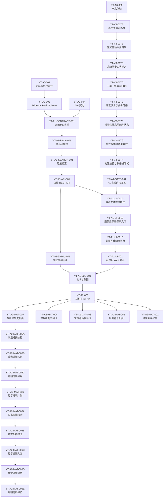

# 盐铁会议历史复原：后续任务拆分

状态：阶段0设计文档
任务标识：`YT-A0-005`
文档性质：本文件定义后续可执行任务，不授权立即进入业务实现。

## 1. 任务契约

- 任务 ID：`YT-A0-005`
- 价值：把盐铁会议作品拆成遵守仓库边界、可并行但不冲突的任务卡。
- 依赖：`YT-A0-001`、`YT-A0-002`、`YT-A0-003`、`YT-A0-004`。
- 允许修改范围：本设计文档。
- 禁止修改范围：业务代码、公共 Schema、迁移、根配置、`AGENTS.md`、运行态 `library/` 数据、向量库和原始大部头史料。
- 输入：史料审计、体验设计、Evidence Pack Schema、API 契约。
- 输出：后续任务 DAG、每个任务的价值、依赖、修改范围、接口、验收、测试和回滚方式。
- 接口：后续实现任务必须引用本文任务 ID，并不得跨越允许修改范围。
- 验收标准：每个任务只解决一个问题；公共 Schema、API、数据、UI、外部接口和测试任务边界清晰。
- 测试命令：`git diff --check -- docs/YANTIE_TASK_BREAKDOWN.md`。
- 回滚方式：删除或回退本文件。
- 文档更新：本文件即该任务的交付物。

## 2. 依赖图

并行规则：

- `YT-A1-ZHIHU-001` 可在 `YT-A1-API-001` 路由骨架稳定后与 `YT-A1-UI-001` 并行。
- 不允许多个任务同时修改 `evidence_pack` Schema 或同一 API 契约。
- 不允许任何任务修改 `AGENTS.md`、根配置、迁移基线或运行态 `library/`。

## 3. 任务卡

### YT-A1-CONTRACT-001：Evidence Pack Schema 实现

- 任务 ID：`YT-A1-CONTRACT-001`
- 价值：把 `YT-A0-003` 的数据契约实现为可校验 Schema，防止证据包漂移。
- 依赖：`YT-A0-003`、`YT-A0-004`。
- 允许修改范围：一个新业务模块 `metaos/yantie/` 中的 Schema 文件；一个测试目录或测试文件；一份直接相关文档勘误。
- 禁止修改范围：现有公共 Schema、迁移、根配置、`library/`、RAG/检索主链、知乎 adapter、UI。
- 输入：`docs/YANTIE_EVIDENCE_PACK_SCHEMA.md`。
- 输出：Pydantic Schema、枚举、校验器和最小示例 fixture。
- 接口：`EvidencePack`、`Source`、`EvidenceUnit`、`Claim`、`Actor`、`Event`、`Relation`、`MapLayer`。
- 验收标准：非法 Claim 缺证据会失败；外部回声不能作为历史证据；blocked 来源不能带可交付摘录。
- 测试命令：`python -m pytest test -k yantie_contract`，以及 `python -m pytest test`。
- 回滚方式：删除新增模块与测试，回退文档勘误。
- 文档更新：只在发现机械矛盾时更新 `docs/YANTIE_EVIDENCE_PACK_SCHEMA.md`。

### YT-A1-PACK-001：精选证据包 MVP

- 任务 ID：`YT-A1-PACK-001`
- 价值：交付一个不含大部头史料和向量库的最小可玩证据包。
- 依赖：`YT-A1-CONTRACT-001`。
- 允许修改范围：`metaos/yantie/` 下一个数据文件或 fixture；一个测试文件；一份来源审计勘误。
- 禁止修改范围：运行态 `library/`、原始 PDF/Markdown、Chroma、公共 Schema、迁移、UI。
- 输入：`YT-A0-001` 允许来源和人工选择的短摘。
- 输出：`evidence_pack.json` MVP，覆盖背景、盐铁辩题、桑弘羊理由、贤良文学反对、权力关系、会议结果。
- 接口：必须通过 `EvidencePack` Schema。
- 验收标准：至少包含 4 类来源、6 个角色、8 个事件、20 条 EvidenceUnit、12 条 Claim、20 条 Relation、3 个地图图层；所有 Claim 可回链证据。
- 测试命令：`python -m pytest test -k yantie_pack`，以及 `python -m pytest test`。
- 回滚方式：删除证据包和测试。
- 文档更新：更新 `docs/YANTIE_SOURCE_AUDIT.md` 的来源清单勘误。

### YT-A1-SEARCH-001：轻量证据检索

- 任务 ID：`YT-A1-SEARCH-001`
- 价值：在不引入 RAG/向量库的前提下支持证据室搜索和筛选。
- 依赖：`YT-A1-PACK-001`。
- 允许修改范围：`metaos/yantie/` 检索模块；一个测试文件；一份相关文档勘误。
- 禁止修改范围：`metaos/search` 通用检索、Chroma、Embedding、RAG、运行态索引、公共 Schema。
- 输入：`EvidencePack.lexical_index` 和 EvidenceUnit 字段。
- 输出：关键词过滤、标签过滤、稳定排序和档案不足返回。
- 接口：`search_evidence(query, filters, limit) -> SearchResultList`。
- 验收标准：固定查询“桑弘羊 财政”“反对 盐铁 官营”“会议 结果”命中预期证据；无证据问题不调用模型补答。
- 测试命令：`python -m pytest test -k yantie_search`，以及 `python -m pytest test`。
- 回滚方式：删除检索模块和测试。
- 文档更新：必要时更新 `docs/YANTIE_API_CONTRACT.md` 的搜索行为勘误。

### YT-A1-API-001：只读 REST API

- 任务 ID：`YT-A1-API-001`
- 价值：为 Web 项目提供稳定的数据读取、搜索和判断卡接口。
- 依赖：`YT-A1-SEARCH-001`。
- 允许修改范围：一个 API adapter 文件或 `metaos/yantie/` API 子模块；一个 API 测试文件；一份 API 文档勘误。
- 禁止修改范围：公共 Core Alpha API 契约、迁移、运行态数据、RAG、知乎 adapter、UI。
- 输入：`docs/YANTIE_API_CONTRACT.md` 和检索服务。
- 输出：`/api/yantie/*` 核心只读路由与本地判断卡创建路由。
- 接口：manifest、theme、sources、actors、events、map-layers、topics、evidence、claims、relations、curated-paths、judgment-cards。
- 验收标准：所有响应可 Schema 校验；搜索无证据返回档案不足；判断卡不会修改证据包。
- 测试命令：`python -m pytest test -k yantie_api`，以及 `python -m pytest test`。
- 回滚方式：删除 adapter 和测试，回退路由注册。
- 文档更新：必要时更新 `docs/YANTIE_API_CONTRACT.md`。

### YT-A1-ZHIHU-001：知乎外部回声 Adapter

- 任务 ID：`YT-A1-ZHIHU-001`
- 价值：接入知乎搜索、全网搜索、热榜和直答，把当代讨论作为体验补充。
- 依赖：`YT-A1-API-001`。
- 允许修改范围：一个知乎 adapter 模块；一个 mock API 测试文件；一份 API 文档勘误。
- 禁止修改范围：历史 EvidenceUnit、证据包、公共 Schema、RAG、运行态 `library/`。
- 输入：知乎开放平台 REST 契约、服务端 Access Secret。
- 输出：`external_echo` 响应 DTO、鉴权头构造、错误映射、降级策略。
- 接口：`zhihu_search`、`global_search`、`hot_list`、`zhida` 的服务端代理。
- 验收标准：未配置密钥时核心体验不失败；外部结果永远标记 `external_echo`；外部结果不能进入 Claim 证据。
- 测试命令：`python -m pytest test -k yantie_zhihu`，以及 `python -m pytest test`。
- 回滚方式：删除 adapter、测试和代理路由。
- 文档更新：必要时更新 `docs/YANTIE_API_CONTRACT.md`。

### YT-A1-UI-001：可试玩 Web 体验

- 任务 ID：`YT-A1-UI-001`
- 价值：把证据包变成可体验的会议现场、地图、权力网和判断卡。
- 依赖：`YT-A1-API-001`；可与 `YT-A1-ZHIHU-001` 并行。
- 允许修改范围：一个前端/展示模块；一个 UI 测试或截图验收文件；一份产品体验文档勘误。
- 禁止修改范围：证据包 Schema、历史证据内容、RAG、运行态数据、迁移、根配置。
- 输入：`docs/YANTIE_PRODUCT_EXPERIENCE.md`、`/api/yantie/*`。
- 输出：首屏会议现场、地图图层、辩题时间线、角色席位、证据室、关系网、判断卡。
- 接口：只调用 `/api/yantie/*` 和可选外部回声接口。
- 验收标准：桌面和移动端主要路径可用；文本不重叠；无知乎密钥时主体验完整；所有历史 Claim 可展开证据。
- 测试命令：`python -m pytest test -k yantie_ui` 或截图检查命令；以及 `python -m pytest test`。
- 回滚方式：删除 UI 模块和测试，回退路由入口。
- 文档更新：必要时更新 `docs/YANTIE_PRODUCT_EXPERIENCE.md`。

### YT-A1-UI-001A：静态主体验纵切片

- 任务 ID：`YT-A1-UI-001A`
- 价值：在进入 A1 后先实现一条最小但完整的盐铁会议主体验路径，验证 `YT-V3-017A..H` 的体验契约能在静态页面中落地，再决定是否扩展完整图谱、透镜、搜索、外部回声或独立前端工程。
- 依赖：`YT-A1-API-001`、`YT-V3-017A`、`YT-V3-017B`、`YT-V3-017C`、`YT-V3-017D`、`YT-V3-017E`、`YT-V3-017F`、`YT-V3-017G`、`YT-V3-017H`；进入本任务前仍必须满足阶段进入条件。
- 允许修改范围：一个静态前端/展示模块，优先为 `docs/yantie/` 下与主体验直接相关的页面、样式、脚本或轻量配置；一个 UI 测试文件或截图验收文件，优先为 `test/test_yantie_ui.py`；一份产品体验文档实现状态勘误，优先为 `docs/YANTIE_PRODUCT_EXPERIENCE.md`。
- 禁止修改范围：证据包 Schema、历史证据内容、API 契约、RAG、向量库、迁移、根配置、依赖升级、运行态 `library/` 数据、完整章节图谱、哲学透镜、当代回声、真实 GIS SDK、用户账户、分享系统。
- 输入：`YT-V3-017A` 主路径、`YT-V3-017D` 一屏三要素、`YT-V3-017E` 阅读与恢复规则、`YT-V3-017F` `ExperienceState`、`YT-V3-017G` 事件效果映射、`YT-V3-017H` 验收清单、可读取的盐铁证据包或 `/api/yantie/*` 只读接口。
- 输出：可在桌面和移动端完成的静态主体验纵切片，覆盖开场压力、第一次取舍、入朝、财政/民生最小冲突、关键证据、判断动摇或坚持、霍光沉默、退朝案牍。
- 接口：用户动作必须通过领域事件更新 `ExperienceState` 或等价状态对象；展示层只消费状态和体验效果；证据只按 ID 引用，不复制或改写 EvidenceUnit 正文；深度探索入口默认隐藏到退朝后。
- 验收标准：主路径 5-8 分钟可完成；首屏 30 秒内有明确主视觉、主问题和主动作；任一场景最多一个主动作；关键证据可打开并回到现场；退朝案牍能显示初判、视角、转折点、证据 ID、最终判断和未解矛盾；移动端无主要文本重叠；静音和减少动态模式可完成主路径。
- 测试命令：`python -m pytest test -k yantie_ui`；若涉及截图验收，执行对应截图检查命令；以及 `git diff --check -- docs/YANTIE_TASK_BREAKDOWN.md`。
- 回滚方式：删除或回退本纵切片修改的静态前端文件、UI 测试和产品体验文档勘误，不回退 `YT-V3-017A..H` 的任务契约。
- 文档更新：本任务卡只是未来 A1 实现任务契约；实际执行时必须在 `docs/YANTIE_PRODUCT_EXPERIENCE.md` 追加实现状态、截图或已知不足。

首个纵切片范围表：

| 场景 | 必须实现 | 暂不实现 |
|------|----------|----------|
| 天下压力显影 | 地图或等价历史空间、压力汇聚、一句旁白、一个主动作 | 完整 GIS、复杂地图编辑 |
| 北边急报 | 边防/府库压力变化、调粮或暂缓取舍 | 多分支战争模拟 |
| 生成视角与入朝 | 根据首次取舍生成进入视角并进入朝堂 | 人格测试式匹配分数 |
| 财政/民生最小冲突 | 桑弘羊理由与贤良文学反驳各一轮 | 六十篇全文展开 |
| 关键证据 | 一条关键证据的摘要或案卷详情，支持回到现场 | 长文全文阅读器 |
| 判断动摇或坚持 | 坚持、修正、保留疑问三类动作 | 复杂评分或阵营系统 |
| 霍光沉默 | 视觉焦点收束、短暂停顿、可继续 | 强制长黑场或不可跳过等待 |
| 退朝案牍 | 判断轨迹、已用证据、未解矛盾和最终反思 | 当代回声自动写入 |

纵切片不做清单：

| 内容 | 原因 | 后续入口 |
|------|------|----------|
| 六十篇争点图谱 | 首次体验会增加认知负荷 | 退朝后深度探索 |
| 哲学透镜全文 | 容易与史实证据混淆 | 退朝后或轻提示 |
| 当代回声 | 会打断历史沉浸，也依赖外部接口 | `YT-A1-ZHIHU-001` 后开放 |
| 搜索与筛选工作台 | 偏研究工具，不属于第一条体验纵切片 | 完整 `YT-A1-UI-001` |
| Vite/TypeScript/React 迁移 | 当前目标是验证静态承载能力 | 达到升级触发条件后另开任务 |

纵切片验收表：

| 维度 | 验收方式 | 最低标准 |
|------|----------|----------|
| 主路径完成 | 人工或 UI 测试 | 从开场到退朝案牍不断线 |
| 状态一致 | 事件日志或状态检查 | 场景、证据、判断轨迹不互相漂移 |
| 历史边界 | 人工检查 | 不改写会议结果，不补写人物心理 |
| 阅读返回 | UI 测试 | 打开关键证据后能回到原场景 |
| 移动端 | 截图检查 | 主动作不被遮挡，文本不重叠 |
| 可访问性 | 人工检查 | 静音和减少动态仍可完成 |

### YT-A1-UI-001B：退朝后深度探索入口

- 任务 ID：`YT-A1-UI-001B`
- 价值：在主体验纵切片完成后，定义退朝案牍之后如何开放图谱、透镜、长文证据、权力关系和当代回声入口，既保留深度探索能力，又不让这些模块提前打断首次 5-8 分钟主线。
- 依赖：`YT-A1-UI-001A`、`YT-V3-017A`、`YT-V3-017B`、`YT-V3-017C`、`YT-V3-017D`、`YT-V3-017E`、`YT-V3-017F`、`YT-V3-017G`、`YT-V3-017H`；当代回声的可用数据依赖 `YT-A1-ZHIHU-001`，但本任务可先定义空状态与降级入口。
- 允许修改范围：一个静态前端/展示模块中与退朝后入口直接相关的页面、样式、脚本或轻量配置；一个 UI 测试文件或截图验收文件；一份产品体验文档实现状态勘误。
- 禁止修改范围：证据包 Schema、历史证据内容、API 契约、RAG、向量库、迁移、根配置、依赖升级、运行态 `library/` 数据、外部回声 adapter、用户账户、分享系统。
- 输入：`YT-A1-UI-001A` 的退朝案牍结果、`YT-V3-017A` 深度探索入口表、`YT-V3-017C` 信息类型展示规则、`YT-V3-017E` 阅读模式规则、`YT-V3-017F` 状态持久化边界、`YT-V3-017H` 交互与视觉验收清单。
- 输出：退朝后深度探索入口契约，覆盖全文争点图谱、哲学透镜、长文证据阅读、权力关系图、第二视角体验和当代回声的开放时机、视觉边界、降级策略和验收方式。
- 接口：深度探索入口必须从 `completion_status=completed` 或用户主动退出主线后开放；所有入口只能读取证据 ID、判断轨迹和只读 API 数据；当代回声必须标记为 `external_echo`，不得自动写入退朝案牍或历史证据链。
- 验收标准：退朝前不默认显示深度探索入口；退朝后入口清晰但不遮挡案牍；每个入口都有“史实证据 / 思想透镜 / 外部回声 / 用户判断”的视觉区分；当代回声不可用时显示降级说明；移动端入口可折叠，主案牍仍优先可读。
- 测试命令：`python -m pytest test -k yantie_ui`；若涉及截图验收，执行对应截图检查命令；以及 `git diff --check -- docs/YANTIE_TASK_BREAKDOWN.md`。
- 回滚方式：删除或回退本任务修改的退朝后入口、UI 测试和产品体验文档勘误，不回退主体验纵切片。
- 文档更新：本任务卡只是未来 A1 实现任务契约；实际执行时必须在 `docs/YANTIE_PRODUCT_EXPERIENCE.md` 追加深度探索入口的实现状态、降级行为和已知不足。

退朝后入口开放表：

| 入口 | 开放时机 | 默认展示 | 必须边界 |
|------|----------|----------|----------|
| 六十篇争点图谱 | 退朝案牍生成后 | “回看全文争点”折叠入口 | 不在主线中展开全文结构 |
| 哲学透镜 | 退朝后或主线轻提示点击后 | “换个角度看”入口 | 标明为解释视角，不是会议事实 |
| 长文证据阅读 | 退朝后或用户主动展开案卷详情 | Evidence Document 阅读模式 | 不复制证据正文进用户状态 |
| 权力关系图 | 霍光沉默后、退朝后开放 | “朝堂权力结构”入口 | 不补写人物心理 |
| 第二视角体验 | 完成一次案牍后 | “从另一席位再入朝”入口 | 不抹除第一次判断轨迹 |
| 当代回声 | 退朝后且外部接口可用时 | “后世与当代讨论”入口 | 标记 `external_echo`，不进入历史证据链 |

深度探索视觉边界表：

| 信息类型 | 推荐视觉 | 允许动作 | 禁止动作 |
|----------|----------|----------|----------|
| 史实证据 | 纸色、来源章、可定位出处 | 查看摘要、出处、关联争点 | 改写原文或作为用户状态保存 |
| 思想透镜 | 冷灰或青色、镜纹 | 查看解释框架和关联主题 | 冒充会议现场证据 |
| 权力关系 | 低饱和关系线、朝堂席位 | 查看人物关系和已证实位置 | 推断人物心理 |
| 外部回声 | 独立延伸区、明显外部标识 | 查看现代讨论摘要或链接 | 自动写入案牍或 Claim |
| 用户判断 | 手写墨迹或朱批 | 编辑个人反思、保留疑问 | 显示为历史结论 |

深度探索降级表：

| 情况 | 降级行为 | 用户提示 |
|------|----------|----------|
| 外部回声接口不可用 | 隐藏实时内容，仅保留入口说明 | “外部回声暂不可用，不影响历史体验” |
| 证据引用缺失 | 不展示对应入口，记录为构建失败项 | 不在运行时静默补内容 |
| 移动端空间不足 | 入口折叠为案牍下方列表 | “继续探索” |
| 用户未完成主线 | 深度入口保持隐藏 | “退朝后开放” |
| 减少动态模式 | 关系图和图谱使用静态展开 | 不使用大幅缩放和闪烁 |

深度探索验收表：

| 维度 | 验收方式 | 最低标准 |
|------|----------|----------|
| 主线隔离 | 人工或 UI 测试 | 退朝前不默认暴露完整图谱、透镜、外部回声 |
| 案牍优先 | 截图检查 | 退朝案牍仍是第一视觉，不被入口列表淹没 |
| 信息边界 | 人工检查 | 史实、透镜、外部回声和用户判断视觉可区分 |
| 降级可用 | UI 测试 | 无外部接口时主体验和退朝案牍不失败 |
| 移动端 | 截图检查 | 入口折叠可用，无文本重叠 |

### YT-A1-UI-001C：主体验截图与移动端验收契约

- 任务 ID：`YT-A1-UI-001C`
- 价值：在完整可试玩 Web 体验前，先冻结主体验纵切片和退朝后入口的截图、移动端、减少动态和降级验收出口，避免后续 UI 实现只满足流程可点通，却在视觉焦点、文本重叠、移动端遮挡或案牍优先级上失控。
- 依赖：`YT-A1-UI-001A`、`YT-A1-UI-001B`、`YT-V3-017D`、`YT-V3-017E`、`YT-V3-017F`、`YT-V3-017G`、`YT-V3-017H`。
- 允许修改范围：一个 UI 截图验收文件或验收报告；一个与截图场景直接相关的静态前端展示模块勘误；一份产品体验文档实现状态勘误。当前阶段0只允许修改 `docs/YANTIE_TASK_BREAKDOWN.md`。
- 禁止修改范围：证据包 Schema、历史证据内容、API 契约、RAG、向量库、迁移、根配置、依赖升级、运行态 `library/` 数据、外部回声 adapter、用户账户、分享系统、完整前端框架迁移。
- 输入：`YT-A1-UI-001A` 的主体验纵切片范围、`YT-A1-UI-001B` 的退朝后入口规则、`YT-V3-017D` 一屏三要素、`YT-V3-017E` 阅读恢复与减少动态规则、`YT-V3-017H` 构建校验与交互视觉验收清单。
- 输出：截图场景矩阵、移动端验收清单、可访问性与降级清单、失败分级规则、后续实现验收清单。
- 接口：后续 UI 实现必须为本任务矩阵中的截图场景提供稳定场景 ID 或等价测试入口；截图检查只能消费 `ExperienceState`、场景配置、证据 ID 和 UI 状态，不得写入历史证据、Claim 或运行态数据。
- 验收标准：桌面和移动端至少覆盖开场地图、第一次取舍、入朝、财政/民生冲突、关键证据、霍光沉默、退朝案牍、退朝后深度入口；移动端主动作不被遮挡；阅读模式可返回现场；减少动态和静音模式可完成主路径；截图检查能区分阻断、主要、次要和人工复核问题。
- 测试命令：`git diff --check -- docs/YANTIE_TASK_BREAKDOWN.md`；后续实现任务应补充 `python -m pytest test -k yantie_ui` 和对应截图检查命令。
- 回滚方式：删除本任务卡和四张验收表，回退依赖图中的 `UI001C` 节点，让 `UI001B` 重新直接指向 `UI001`。
- 文档更新：本任务卡即阶段0交付物；后续真正执行截图验收时，应在 `docs/YANTIE_PRODUCT_EXPERIENCE.md` 或独立验收报告中记录截图、失败项、人工复核结论和已知不足。

截图场景矩阵：

| 场景 | 桌面截图 | 移动端截图 | 必须检查 | 失败级别 |
|------|----------|------------|----------|----------|
| 开场地图与北边压力 | 1440px 宽视口 | 390px 宽竖屏 | 地图是主视觉，旁白和主动作不抢焦点 | 阻断 |
| 第一次取舍 | 1440px 宽视口 | 390px 宽竖屏 | 只出现一个主问题和一个主动作组，不显示图谱、透镜、外部回声 | 阻断 |
| 生成视角与入朝 | 1440px 宽视口 | 390px 宽竖屏 | 身份是叙事入口，不显示人格分数或阵营评分 | 主要 |
| 财政/民生最小冲突 | 1440px 宽视口 | 390px 宽竖屏 | 发言、压力和继续动作不重叠，HUD 不与长文本竞争 | 主要 |
| 关键证据阅读 | 1440px 宽视口 | 390px 宽竖屏 | 证据来源、白话摘要、返回现场动作稳定可见 | 阻断 |
| 判断动摇或坚持 | 1440px 宽视口 | 390px 宽竖屏 | 轨迹反馈不评价用户人格，不改写历史结论 | 主要 |
| 霍光沉默 | 1440px 宽视口 | 390px 宽竖屏 | 视觉焦点收束，减少动态模式不强制长黑场 | 人工复核 |
| 退朝案牍 | 1440px 宽视口 | 390px 宽竖屏 | 初判、转折点、证据 ID、未解矛盾和最终反思可读 | 阻断 |
| 退朝后深度入口 | 1440px 宽视口 | 390px 宽竖屏 | 入口不遮挡案牍，史实、透镜、外部回声、用户判断可区分 | 主要 |

移动端验收清单：

| 项目 | 最低标准 | 禁止情况 |
|------|----------|----------|
| 主动作 | 固定在安全区上方，任一场景只有一个主要动作 | 被底部抽屉、系统手势区或地图标签遮挡 |
| 文本排版 | 主问题、旁白、按钮文案不溢出容器 | 横向滚动、按钮文字截断、正文压住下一段 |
| 阅读模式 | 证据进入全屏或近全屏阅读，底部有“回到现场” | 背景地图继续滚动导致误触 |
| 深度入口 | 退朝后折叠为案牍下方列表或底部入口 | 首次主线中默认展开完整图谱或透镜 |
| 手势 | 手势只能作为增强，不作为唯一入口 | 只靠长按、横滑或隐藏手势完成关键路径 |
| 动效 | 减少动态模式保留内容顺序和状态反馈 | 依赖闪烁、快速缩放或长黑场表达唯一信息 |

可访问性与降级清单：

| 场景 | 必须支持 | 降级方式 |
|------|----------|----------|
| 静音模式 | 不依赖声音理解压力、证据和退朝结果 | 用短句状态、视觉变化和案牍字段替代声音提示 |
| 减少动态 | 不依赖大幅镜头、闪烁、长黑场 | 使用静态关键帧、淡入淡出或直接呈现 |
| 外部回声不可用 | 主体验和退朝案牍不失败 | 显示“外部回声暂不可用”，不写入历史证据链 |
| 证据缺失 | 不在运行时补写内容 | 构建或验收阶段标为阻断失败 |
| 键盘焦点 | 主动作、返回现场、继续探索可聚焦 | 焦点陷入抽屉或全屏证据无法返回 |

失败分级表：

| 等级 | 定义 | 处理 |
|------|------|------|
| 阻断 | 主路径无法完成、历史边界被突破、移动端主动作不可用、关键证据无法返回现场 | 不得进入完整 `YT-A1-UI-001` |
| 主要 | 视觉焦点竞争、案牍被深度入口淹没、文字重叠但仍可绕过、降级说明缺失 | 修复后再验收 |
| 次要 | 动效节奏不够顺、个别间距或对齐不足、不影响理解的轻微样式问题 | 可记录为已知不足 |
| 人工复核 | 沉默、余韵、历史现场感、情绪节奏等难以自动断言的问题 | 必须附截图或复核结论 |

后续实现验收清单：

- UI 实现任务必须为截图矩阵中的每个场景提供稳定进入方式。
- 移动端验收不得只用桌面响应式截图代替，至少覆盖 390px 竖屏。
- 减少动态和静音模式必须在同一主路径中可完成，不得另开简化版流程。
- 退朝后深度入口截图必须证明案牍仍是第一视觉。
- 截图或人工复核报告必须记录失败分级、修复状态和剩余风险。

### YT-A1-E2E-001：验收、截图与参赛包检查

- 任务 ID：`YT-A1-E2E-001`
- 价值：确认作品满足参赛交付、无重型依赖泄漏、证据链可审计。
- 依赖：`YT-A1-UI-001`、`YT-A1-ZHIHU-001`。
- 允许修改范围：一个 E2E/验收测试文件；一份验收报告文档。
- 禁止修改范围：业务实现、Schema、证据包内容、运行态数据、根配置。
- 输入：可运行 Web 项目、证据包、API 和 UI。
- 输出：验收报告、截图、交付清单、风险清单。
- 接口：完整用户路径和参赛包目录。
- 验收标准：不包含原始大部头史料、Chroma、向量、RAG 中间产物；核心体验离线可用；知乎接口失败可降级；截图无明显重叠。
- 测试命令：`python -m pytest test -k yantie_e2e`，以及 `python -m pytest test`。
- 回滚方式：删除验收报告和测试。
- 文档更新：新增或更新验收报告。

### YT-V3-017A：冻结主体验路径

- 任务 ID：`YT-V3-017A`
- 价值：把盐铁会议体验从“功能模块完整”收敛为一条 5-8 分钟可完整经历的主路径，避免首次体验同时暴露地图、图谱、透镜、长证据、当代回声和判断区导致用户迷路。
- 依赖：`YT-A0-002`、`docs/YANTIE_PRODUCT_EXPERIENCE.md` 中 V3.13 的业务闭环与技术架构收敛设计。
- 允许修改范围：`docs/YANTIE_TASK_BREAKDOWN.md`；如发现体验设计机械矛盾，可在后续独立任务中更新 `docs/YANTIE_PRODUCT_EXPERIENCE.md`，但本任务不修改运行代码。
- 禁止修改范围：`docs/yantie/index.html`、`metaos/yantie/web.py`、`metaos/yantie/data/evidence_pack.json`、`docs/yantie/data/evidence_pack.json`、测试文件、公共 Schema、迁移、根配置、运行态 `library/` 数据。
- 输入：`docs/YANTIE_PRODUCT_EXPERIENCE.md`、现有盐铁会议静态页面结构、证据包中已有事件/角色/证据主题。
- 输出：主体验路径表、深度探索入口表、后续静态前端纵切片的实施边界。
- 接口：后续 UI 实现任务必须以 `MainExperiencePath` 为主路径配置来源，以 `DeepExplorationEntry` 为退朝后或主动探索入口清单；不得在首次主路径中默认开放完整章节图谱、哲学透镜、长文证据阅读或当代回声。
- 验收标准：主体验路径控制在 5-8 分钟；每一幕都有主视觉、主问题、主动作；主路径只允许轻量证据提示和一条关键证据深入；深度探索内容默认不打断主线；任务卡满足仓库要求的必填字段。
- 测试命令：`git diff --check -- docs/YANTIE_TASK_BREAKDOWN.md`。
- 回滚方式：删除本任务卡及其两张表，回退依赖图中的 `YT-V3-017A` 节点。
- 文档更新：本任务卡即交付物；后续若进入代码实现，应另开 UI 纵切片任务，并同步更新 `docs/YANTIE_PRODUCT_EXPERIENCE.md` 的实现状态。

主体验路径表：

| 顺序 | 场景名 | 用户情绪 | 主视觉 | 主问题 | 主动作 | 允许证据 | 是否可跳过 |
|------|--------|----------|--------|--------|--------|----------|------------|
| 1 | 天下压力显影 | 好奇、进入 | 汉昭帝时期地图、北边与长安逐渐显影 | 这场会议为什么非开不可？ | 继续看压力汇聚 | 不开放证据，只显示一句背景提示 | 首次不可跳过，二次可跳过 |
| 2 | 北边急报 | 紧张 | 北境烽火、粮道中断、边防压力流向长安 | 边防还要不要继续投入？ | 调粮 / 暂缓 | 可显示边费相关证据印记，不展开长文 | 可跳过动画，不可跳过选择 |
| 3 | 第一次取舍 | 犹豫 | 府库、民户、盐铁资源三者同时压上案前 | 先保国家供给，还是先减轻民间负担？ | 选择一个优先方向 | 不开放章节图谱；只显示选择后果一句话 | 不可跳过 |
| 4 | 生成进入视角 | 代入 | 史官记录用户选择，朝堂席位被点亮 | 用户将从哪个压力进入朝堂？ | 入朝 | 不开放证据 | 可跳过动画，不可跳过视角确认 |
| 5 | 财政先声 | 理解现实 | 桑弘羊一方、府库、均输路线 | 没有财政能力，边防和国家秩序如何维持？ | 听财政理由 | 可打开一条财政/边费竹简摘要 | 可跳过部分动画 |
| 6 | 民生反击 | 共情、动摇 | 民户承压、贤良文学发言、盐铁入市 | 国家筹资的代价由谁承担？ | 听民生反驳 | 可打开一条与民争利证据摘要 | 可跳过部分动画 |
| 7 | 关键证据发现 | 认真阅读 | 史官落下一卷竹简，地图降亮度进入阅读模式 | 哪条史料真正改变了判断？ | 展开竹简 / 保持原判断 | 允许一条关键证据进入案卷详情，不进入全文阅读 | 不可跳过证据选择，可跳过展开动画 |
| 8 | 判断动摇或坚持 | 反思 | 用户初判与当前判断出现轨迹差异 | 看到证据后，是否仍坚持原判断？ | 坚持 / 修正 / 保留疑问 | 只显示已用证据来源，不开放新证据 | 不可跳过 |
| 9 | 霍光沉默 | 压抑、意识到权力边界 | 朝堂暗下、御座或空白权力位置突出 | 争论之外，谁决定什么能改变？ | 等待沉默结束 / 二次体验继续 | 不开放证据、图谱和透镜 | 首次保留停顿，二次可缩短 |
| 10 | 退朝案牍 | 沉思 | 案牍自动书写、盖印、地图拉远 | 这次判断如何形成，还有什么没有解决？ | 查看案牍 | 只列已接触证据和未解矛盾 | 不可跳过案牍生成，可跳过书写动画 |

深度探索入口表：

| 内容 | 主线中如何出现 | 退朝后如何开放 | 默认是否进入主线 |
|------|----------------|------------------|------------------|
| 六十篇争点图谱 | 只以“今日争点”轻提示出现，不展开完整图谱 | 退朝后作为“回看全文争点”入口开放 | 否 |
| 哲学透镜 | 主线中只显示一句“这属于义利/治道视角”的轻提示 | 退朝后按儒家、法家、管子、韩非等透镜分组开放 | 否 |
| 长文证据阅读 | 主线只允许一条关键证据进入案卷详情 | 退朝后进入完整 Evidence Document 阅读模式 | 否 |
| 当代回声 | 主线中不出现 | 退朝后作为“后世与当代讨论”延伸入口，且不自动写入案牍 | 否 |
| 权力关系图 | 霍光沉默阶段只通过视觉暗场表现 | 退朝后开放“朝堂权力结构”图 | 否 |
| 第二视角体验 | 主线结束前不允许切换身份 | 退朝后提示“从另一席位再入朝” | 否 |
| 音乐与环境音控制 | 主线中只保留静音/开启声音 | 设置中开放音乐段落、环境音和减少动态效果 | 是，作为辅助设置 |
| 退朝案牍复盘 | 主线终点自动生成 | 退朝后可展开完整判断轨迹和证据列表 | 是，作为主交付物 |

### YT-V3-017B：定义体验业务对象

- 任务 ID：`YT-V3-017B`
- 价值：把“用户经历一次历史判断”从界面流程上升为稳定业务对象，避免后续前端只围绕按钮、弹窗和页面状态开发，无法追踪用户如何进入朝堂、如何接触证据、如何动摇和如何形成退朝案牍。
- 依赖：`YT-V3-017A`、`docs/YANTIE_PRODUCT_EXPERIENCE.md` 中 V3.13 的业务对象设计。
- 允许修改范围：`docs/YANTIE_TASK_BREAKDOWN.md`；如发现对象字段与体验文档冲突，可在后续独立文档任务中更新 `docs/YANTIE_PRODUCT_EXPERIENCE.md`。
- 禁止修改范围：Pydantic Schema、API 代码、前端代码、证据包、测试文件、公共 Schema、迁移、根配置、运行态 `library/` 数据。
- 输入：`YT-V3-017A` 主体验路径表、`docs/YANTIE_PRODUCT_EXPERIENCE.md` 的 `HistoricalExperience`、`JudgmentTrace`、`SceneDefinition`、`EvidenceEncounter`、`RetirementDossier` 定义。
- 输出：盐铁体验业务对象表、对象关系表、固定历史与可变体验边界清单、后续 Schema/前端实现任务的接口约束。
- 接口：后续实现任务必须以本文的业务对象为概念接口；`HistoricalExperience` 只能引用证据包对象 ID 和本地用户状态，不得复制或改写 EvidenceUnit、Claim、Event 原文；`RetirementDossier` 是用户体验产物，不是历史证据。
- 验收标准：五个对象都有职责、最小字段、生命周期和禁止事项；对象关系能覆盖一次主体验从进入到退朝的完整链路；固定历史与可变体验边界不允许被 UI 实现绕过；任务卡满足仓库要求的必填字段。
- 测试命令：`git diff --check -- docs/YANTIE_TASK_BREAKDOWN.md`。
- 回滚方式：删除本任务卡及其对象表，回退依赖图中的 `YT-V3-017B` 节点。
- 文档更新：本任务卡即交付物；后续若进入实现阶段，应另开 Schema 或前端任务，不得把本文设计视为已经实现的代码契约。

业务对象表：

| 对象 | 职责 | 最小字段 | 生命周期 | 禁止事项 |
|------|------|----------|----------|----------|
| `HistoricalExperience` | 表示用户的一次盐铁会议体验实例 | `experience_id`、`experience_version`、`current_scene_id`、`started_at`、`completed_at`、`initial_choice_id`、`perspective_id`、`completion_status`、`audio_enabled`、`reduced_motion` | `not_started -> active -> completed / abandoned` | 不存储史料全文；不改写会议结果；不承担证据判断 |
| `JudgmentTrace` | 记录用户判断如何变化 | `trace_id`、`experience_id`、`initial_position`、`trace_steps`、`final_position`、`remaining_questions` | 随体验追加，退朝时冻结为案牍输入 | 不把倾向分数伪装成历史结论；不自动生成政治评价 |
| `SceneDefinition` | 定义业务意义上的场景 | `scene_id`、`phase`、`historical_situation`、`core_conflict`、`primary_action`、`allowed_actions`、`evidence_refs`、`history_mutability` | 随体验版本发布，运行时只读 | 不写人物虚构心理；不允许用户改变固定历史 |
| `EvidenceEncounter` | 记录用户如何接触证据 | `encounter_id`、`experience_id`、`evidence_id`、`scene_id`、`encounter_mode`、`depth_level`、`caused_judgment_change` | 用户接触证据时追加 | 不复制 EvidenceUnit 正文；不把哲学透镜标为会议事实 |
| `RetirementDossier` | 退朝后的核心交付物 | `dossier_id`、`experience_id`、`perspective_id`、`initial_position`、`turning_points`、`evidence_used`、`final_position`、`unresolved_conflicts`、`personal_reflection` | 退朝生成，可本地修订个人反思 | 不进入证据包；不替代历史 Claim；不自动纳入当代回声 |

对象关系表：

| 来源对象 | 关系 | 目标对象 | 说明 |
|----------|------|----------|------|
| `HistoricalExperience` | contains | `JudgmentTrace` | 一次体验有一条判断轨迹 |
| `HistoricalExperience` | visits | `SceneDefinition` | 体验按场景顺序推进 |
| `HistoricalExperience` | records | `EvidenceEncounter` | 用户每次接触证据都形成 encounter |
| `JudgmentTrace` | references | `EvidenceEncounter` | 只有接触过的证据才能解释观点变化 |
| `RetirementDossier` | summarizes | `JudgmentTrace` | 案牍从轨迹生成，不凭空总结 |
| `RetirementDossier` | cites | `EvidenceUnit` ID | 只引用证据 ID 和出处，不复制证据包 |
| `SceneDefinition` | references | `EvidenceUnit` ID | 场景只能引用已验证证据 |

固定历史与可变体验边界：

| 类型 | 可做 | 不可做 |
|------|------|--------|
| 固定历史 | 展示会议背景、人物身份、政策结果、史料原文和出处 | 让用户选择改变会议结果；补写未证实发言 |
| 可变体验 | 改变进入视角、镜头顺序、证据发现路径、判断轨迹和个人反思 | 把体验变化写成历史事实 |
| 证据使用 | 引用 EvidenceUnit ID、出处、短摘和白话转述 | 在用户状态中复制或改写证据原文 |
| 思想透镜 | 帮助解释义利、治道、儒法分歧 | 冒充盐铁会议现场证据 |
| 退朝案牍 | 记录用户判断、证据触发点和未解矛盾 | 进入证据包或覆盖 Claim |

### YT-V3-017C：编写固定历史与可变体验边界规则

- 任务 ID：`YT-V3-017C`
- 价值：把“历史不能被用户选择改写、体验可以改变呈现路径”变成后续 UI、Schema 和测试都能执行的边界规则，避免沉浸式交互为了戏剧效果补写史实、混淆哲学透镜与会议证据，或把用户的判断轨迹误当成历史结论。
- 依赖：`YT-V3-017A`、`YT-V3-017B`、`docs/YANTIE_SOURCE_AUDIT.md`、`docs/YANTIE_EVIDENCE_PACK_SCHEMA.md`。
- 允许修改范围：`docs/YANTIE_TASK_BREAKDOWN.md`；如发现来源审计或证据包 Schema 有机械冲突，可在后续独立任务中更新对应文档。
- 禁止修改范围：前端代码、API 代码、Pydantic Schema、证据包内容、测试文件、公共 Schema、迁移、根配置、运行态 `library/` 数据。
- 输入：`YT-V3-017B` 的业务对象表、`docs/YANTIE_EVIDENCE_PACK_SCHEMA.md` 的 EvidenceUnit/Claim/Source 规则、`docs/YANTIE_SOURCE_AUDIT.md` 的来源边界。
- 输出：历史边界规则表、信息类型展示规则表、用户动作许可矩阵、后续实现验收清单。
- 接口：后续 UI 与 Schema 实现任务必须把 `history_boundary` 或等价字段作为场景/动作/证据呈现的设计约束；任何用户动作只能改变 `HistoricalExperience`、`JudgmentTrace`、`EvidenceEncounter`、`RetirementDossier`，不得改变 EvidenceUnit、Claim、Event、Actor 的历史事实字段。
- 验收标准：所有主体验场景都能归入固定历史、可变体验或禁止表达；每类信息都有明确视觉和交互边界；用户动作许可矩阵能覆盖主路径 10 个场景；后续 UI 不得绕过该边界默认开放改写历史的操作。
- 测试命令：`git diff --check -- docs/YANTIE_TASK_BREAKDOWN.md`。
- 回滚方式：删除本任务卡及其四张规则表，回退依赖图中的 `YT-V3-017C` 节点。
- 文档更新：本任务卡即交付物；后续实现阶段如需要字段落地，应另开 Schema 或 UI 任务，不得在本任务中直接实现。

历史边界规则表：

| 边界类型 | 定义 | 来源或归属 | 允许呈现 | 禁止呈现 |
|----------|------|------------|----------|----------|
| 固定历史事实 | 会议时间、人物身份、政策背景、会议结果、史料原文和可定位出处 | `EvidenceUnit`、`Claim`、`Event`、`Actor` | 按证据包展示，可做轻量转述 | 用户选择改变结果；为了戏剧性补写无证据事实 |
| 固定解释边界 | 会议事实、后世评价、思想透镜和策展推断之间的分类边界 | `claim_type`、`evidence_kind`、`value_tags` | 用不同视觉样式区分 | 把哲学透镜显示成会议现场证据 |
| 可变体验路径 | 信息出现顺序、镜头、默认视角、证据发现路径、阅读深度 | `HistoricalExperience`、`SceneDefinition` | 根据用户状态调整节奏和焦点 | 把体验路径变化写成历史变化 |
| 可变用户判断 | 用户初判、动摇、坚持、保留疑问、个人反思 | `JudgmentTrace`、`RetirementDossier` | 作为用户案牍和复盘呈现 | 显示为系统可靠结论或历史 Claim |
| 禁止表达 | 改写会议结果、虚构人物心理、伪造发言、叙事压力冒充统计 | 无合法归属 | 不得出现 | 不得通过文案、动画、数值或案牍暗示 |

信息类型展示规则表：

| 信息类型 | 数据来源 | 推荐视觉 | 交互规则 | 必须提示 |
|----------|----------|----------|----------|----------|
| 史实证据 | `EvidenceUnit.review_status=verified` | 纸色、直角来源章 | 可从证据印记进入竹简摘要或案卷详情 | 出处、定位、证据类型 |
| 策展推断 | `Claim.claim_type=curatorial_inference` | 中性色、虚线边框 | 只能解释关系，不作为独立事实 | 推断依据和不确定性 |
| 思想透镜 | 带 `philosophy_lens` 等标签的 EvidenceUnit/Claim | 冷灰或青色、镜纹 | 退朝后或轻提示出现，不默认打断主线 | “用于理解思想，不是会议事实” |
| 用户判断 | `JudgmentTrace`、`RetirementDossier` | 手写墨迹或朱批 | 可在退朝案牍中编辑个人反思 | “这是你的判断，不是历史结论” |
| 当代回声 | `external_echo` 或后续外部入口 | 独立延伸区样式 | 只在退朝后主动开放 | “不属于历史证据链” |

用户动作许可矩阵：

| 动作 | 是否允许 | 可改变对象 | 不可改变对象 | 备注 |
|------|----------|------------|--------------|------|
| 选择初始取舍 | 允许 | `HistoricalExperience.initial_choice_id`、`perspective_id` | `Event`、`Claim`、会议结果 | 只改变进入视角和默认镜头 |
| 调整判断 | 允许 | `JudgmentTrace.trace_steps`、`final_position` | `Claim.statement`、`EvidenceUnit` | 必须记录触发场景或证据 |
| 展开证据 | 允许 | `EvidenceEncounter.depth_level` | EvidenceUnit 原文和出处 | 不复制或改写证据正文 |
| 查看哲学透镜 | 允许 | `EvidenceEncounter` 或本地阅读状态 | 会议事实分类 | 必须标识为解释视角 |
| 生成退朝案牍 | 允许 | `RetirementDossier` | 证据包、历史 Claim | 只能总结用户轨迹和已接触证据 |
| 改变会议结果 | 禁止 | 无 | 所有历史对象 | UI 不得提供该动作 |
| 补写人物心理 | 禁止 | 无 | Actor、Event、Claim | 只能呈现已证实立场和发言 |
| 将当代回声写入历史证据 | 禁止 | 无 | EvidenceUnit、Claim.evidence_ids | 只能作为延伸讨论 |

后续实现验收清单：

- 主路径 10 个场景均标注 `history_boundary=fixed_fact|curatorial_inference|mutable_experience|user_reflection|forbidden` 中的合法类型。
- 任何用户动作都不得修改 EvidenceUnit、Claim、Event、Actor 的历史事实字段。
- 哲学透镜和当代回声在视觉上与史实证据明显不同。
- 退朝案牍只引用已接触证据 ID、用户轨迹和个人反思，不进入证据包。
- 叙事压力只能显示为体验压力，不得显示为真实财政、人口或军费统计。
- 测试或人工检查应覆盖至少：第一次取舍、关键证据发现、霍光沉默、退朝案牍、当代回声入口。

### YT-V3-017D：设计一屏三要素模板和 HUD 渐进规则

- 任务 ID：`YT-V3-017D`
- 价值：把“每一幕只让用户看一件事、想一个问题、做一个动作”变成后续 UI 可执行的显示规则，避免地图、HUD、人物、证据、图谱、判断区同时争夺注意力。
- 依赖：`YT-V3-017A`、`YT-V3-017B`、`YT-V3-017C`。
- 允许修改范围：`docs/YANTIE_TASK_BREAKDOWN.md`；如发现体验文档中的 HUD 描述与本规则冲突，可在后续独立文档任务中更新 `docs/YANTIE_PRODUCT_EXPERIENCE.md`。
- 禁止修改范围：前端代码、API 代码、Pydantic Schema、证据包、测试文件、公共 Schema、迁移、根配置、运行态 `library/` 数据。
- 输入：`YT-V3-017A` 主体验路径表、`YT-V3-017C` 历史边界规则、`docs/YANTIE_PRODUCT_EXPERIENCE.md` 的一屏三要素和 HUD 渐进设计。
- 输出：一屏三要素模板、主路径场景显示表、HUD 渐进规则表、移动端显示约束。
- 接口：后续 UI 实现任务必须为每个主路径场景配置 `primary_visual`、`primary_question`、`primary_action`、`hud_mode`、`hidden_surfaces`；任一场景不得同时显示完整地图 HUD、章节图谱、哲学透镜、证据长文和判断区。
- 验收标准：主路径 10 个场景均有明确主视觉、主问题、主动作、HUD 模式和隐藏面；同一时刻最多一个主动作；HUD 按叙事渐进出现；移动端任一场景只开放一个主动作且不被浮层遮挡。
- 测试命令：`git diff --check -- docs/YANTIE_TASK_BREAKDOWN.md`。
- 回滚方式：删除本任务卡及其三张规则表，回退依赖图中的 `YT-V3-017D` 节点。
- 文档更新：本任务卡即交付物；后续实现阶段应将这些字段落到场景配置或等价前端状态中。

一屏三要素模板：

| 字段 | 含义 | 规则 |
|------|------|------|
| `primary_visual` | 用户第一眼应该看的对象 | 只能是地图、朝堂、竹简、案牍或单一历史对象之一 |
| `primary_question` | 用户此刻应该思考的问题 | 只写一个问题，不并列多个价值判断 |
| `primary_action` | 用户下一步可执行的主要动作 | 桌面和移动端都必须稳定可见 |
| `hud_mode` | 此刻允许出现的 HUD 类型 | `none`、`world`、`scene`、`user`、`summary` 之一 |
| `hidden_surfaces` | 此刻必须隐藏的旁路入口 | 图谱、透镜、长文证据、当代回声、判断区按场景关闭 |

主路径场景显示表：

| 场景 | primary_visual | primary_question | primary_action | hud_mode | hidden_surfaces |
|------|----------------|------------------|----------------|----------|-----------------|
| 天下压力显影 | 汉昭帝时期地图 | 这场会议为什么非开不可？ | 继续看压力汇聚 | `world` | 图谱、透镜、证据、判断区、当代回声 |
| 北边急报 | 北境烽火与粮道 | 边防还要不要继续投入？ | 调粮 / 暂缓 | `world` | 图谱、透镜、长文证据、判断区 |
| 第一次取舍 | 府库、民户、盐铁资源 | 先保供给，还是先减负？ | 选择优先方向 | `world` | 图谱、透镜、证据长文、当代回声 |
| 生成进入视角 | 朝堂席位点亮 | 你将从哪个压力进入朝堂？ | 入朝 | `user` | 图谱、透镜、证据、当代回声 |
| 财政先声 | 桑弘羊一方和府库 | 没有财政能力，国家如何维持？ | 听财政理由 | `scene` | 图谱、透镜、长文证据、判断区 |
| 民生反击 | 民户承压和贤良文学 | 国家筹资的代价由谁承担？ | 听民生反驳 | `scene` | 图谱、透镜、长文证据、当代回声 |
| 关键证据发现 | 史官竹简 | 哪条史料真正改变了判断？ | 展开竹简 / 保持原判断 | `none` | HUD、图谱、透镜、当代回声 |
| 判断动摇或坚持 | 判断轨迹差异 | 看到证据后是否仍坚持？ | 坚持 / 修正 / 保留疑问 | `user` | 图谱、透镜、新证据、当代回声 |
| 霍光沉默 | 暗下的朝堂与御座 | 争论之外，谁决定什么能改变？ | 等待 / 继续 | `none` | HUD、图谱、透镜、证据、判断区 |
| 退朝案牍 | 案牍书写和地图拉远 | 这次判断如何形成？ | 查看案牍 | `summary` | 当代回声默认隐藏，图谱和透镜折叠为退朝后入口 |

HUD 渐进规则表：

| HUD 模式 | 显示内容 | 出现阶段 | 限制 |
|----------|----------|----------|------|
| `none` | 不显示 HUD | 关键证据、霍光沉默、长阅读 | 用于降低认知负荷 |
| `world` | 始元六年、边防、府库，后续逐步加入民生/商贸 | 序章、北边急报、第一次取舍 | 只显示趋势，不显示伪精确数值 |
| `scene` | 当前争论、发言方、当前压力提示 | 财政先声、民生反击、义利争论 | 不与完整 World HUD 同屏 |
| `user` | 用户视角、初判、当前动摇点 | 视角生成、判断动摇 | 不评价用户人格或给倾向分数 |
| `summary` | 已接触证据、判断变化、未解矛盾 | 退朝案牍 | 只总结体验轨迹，不生成历史结论 |

移动端显示约束：

- 任一场景只显示一个主视觉、一句主问题和一个主动作。
- 主动作固定在安全区上方，不能被抽屉、证据或地图标签遮挡。
- HUD 默认折叠为一句状态提示；只有退朝总结可展开完整轨迹。
- 章节图谱、哲学透镜、当代回声、权力关系图默认不进入移动端主线。
- 证据阅读进入全屏阅读模式，返回按钮文案为“回到现场”。

### YT-V3-017E：补充阅读模式、中途恢复和减少动态效果规则

- 任务 ID：`YT-V3-017E`
- 价值：为主体验增加“可安静阅读、可中断恢复、可减少动态”的体验安全阀，避免长证据阅读打断历史现场，避免用户中途离开后丢失判断轨迹，也避免强制动画、黑场或声音让首次体验变得疲劳。
- 依赖：`YT-V3-017A`、`YT-V3-017B`、`YT-V3-017C`、`YT-V3-017D`。
- 允许修改范围：`docs/YANTIE_TASK_BREAKDOWN.md`；如发现 `docs/YANTIE_PRODUCT_EXPERIENCE.md` 中阅读、恢复或减少动态描述与本规则冲突，可在后续独立文档任务中更新。
- 禁止修改范围：前端代码、API 代码、Pydantic Schema、证据包、测试文件、公共 Schema、迁移、根配置、运行态 `library/` 数据。
- 输入：`YT-V3-017A` 主体验路径表、`YT-V3-017D` 一屏三要素与 HUD 规则、`docs/YANTIE_PRODUCT_EXPERIENCE.md` 中阅读模式、中途恢复和减少动态效果相关设计。
- 输出：阅读模式规则表、中途恢复规则表、减少动态与声音规则表、暂停/跳过规则表、后续实现验收清单。
- 接口：后续 UI 实现任务必须在场景配置或等价前端状态中支持 `reading_mode`、`resume_state`、`reduced_motion`、`audio_state`；本地会话只保存体验 ID、场景 ID、证据 ID、判断轨迹和设置，不得复制 EvidenceUnit 正文或改写证据内容。
- 验收标准：进入阅读模式后能回到原场景和原焦点；中途恢复能区分进行中、已完成、版本不兼容和无记录状态；减少动态模式不强制黑场、不依赖大幅镜头运动、不隐藏内容；移动端主动作和返回动作始终可见；本地状态不复制证据正文。
- 测试命令：`git diff --check -- docs/YANTIE_TASK_BREAKDOWN.md`。
- 回滚方式：删除本任务卡及其四张规则表，回退依赖图中的 `YT-V3-017E` 节点。
- 文档更新：本任务卡即交付物；后续进入代码实现时，应另开静态前端纵切片任务，并同步更新产品体验文档的实现状态。

阅读模式规则表：

| 触发场景 | 布局 | 暂停元素 | 允许动作 | 返回行为 |
|----------|------|----------|----------|----------|
| 主线关键证据案卷详情 | 全屏安静阅读，保留出处、短摘、白话转述和相关性说明 | 地图动画、HUD、环境音、场景推进 | 回到现场、记录动摇、保留疑问 | 回到进入阅读前的场景、焦点和主动作 |
| 退朝后长文证据阅读 | Evidence Document 独立阅读页 | 主线压力 HUD、朝堂动画、自动旁白 | 回到案牍、继续探索、查看关联争点 | 回到退朝案牍或深度探索入口 |
| 哲学透镜阅读 | 与史实证据视觉区分的透镜阅读态 | 主线时间推进、判断按钮、地图热点 | 回到现场、退朝后继续看透镜 | 不写入历史事实，只记录为解释视角接触 |
| 移动端证据阅读 | 全屏文档，底部固定“回到现场” | 背景滚动、复杂手势、非必要动画 | 回到现场、标记疑问 | 回到原场景并恢复主动作可见 |

中途恢复规则表：

| 状态字段或场景 | 记录内容 | 恢复展示 | 规则 |
|----------------|----------|----------|------|
| `experience_id`、`experience_version`、`state_version` | 当前体验与状态版本 | 用于判断是否兼容 | 版本不兼容时提示重新开始，不静默恢复 |
| `scene_id`、`phase`、`perspective_id` | 当前场景、阶段和进入视角 | “上次退在某场景，案卷仍在堂侧” | 进行中体验提供“继续入朝 / 重新开始” |
| `initial_choice_id`、`judgment_trace` | 初始取舍和判断轨迹 | 继续前简短回顾当前判断 | 只保存用户轨迹和证据 ID，不复制证据正文 |
| `visited_evidence_ids` | 已接触证据 ID 列表 | 回到现场后恢复已发现状态 | 证据详情仍从证据包读取 |
| `audio_enabled`、`reduced_motion` | 声音和动态偏好 | 进入前沿用上次设置 | 不因恢复体验自动开启声音或强动画 |
| `completion_status=completed` | 已完成体验 | 展示最近退朝案牍 | 提供重看案牍、深度探索或重新开始 |
| 无本地状态或已放弃 | 无有效记录 | 从序章开始 | 不展示恢复提示 |

减少动态与声音规则表：

| 原体验效果 | 减少动态模式 | 声音规则 | 限制 |
|------------|--------------|----------|------|
| 地图镜头推进、拉远 | 使用淡入淡出或静态关键帧 | 不依赖声音提示方向 | 内容顺序不变 |
| 压力流、运输线、烽火动画 | 改为低频脉冲或静态图例 | 可静音，状态文字仍可理解 | 不用闪烁表达唯一信息 |
| 霍光沉默黑场和停顿 | 不强制长黑场，改为短暂停顿和静态暗场 | 音乐降低但不作为唯一表达 | 首次体验可保留沉默，二次体验可继续 |
| 退朝案牍自动书写和盖印 | 改为短揭示或即时呈现 | 盖印声可关闭 | 不阻止用户阅读和复制个人案牍 |
| 环境音与音乐分段 | 默认尊重 `audio_enabled` | 用户可随时开关并持久保存 | 不自动恢复为有声 |

暂停/跳过规则表：

| 内容类型 | 是否可跳过 | 规则 |
|----------|------------|------|
| 第一次取舍 | 不可跳过 | 这是生成进入视角和判断轨迹的必要输入 |
| 场景动画 | 首次保留，二次可跳过 | 跳过只省略动画，不省略历史信息 |
| 关键证据选择 | 不可跳过 | 可跳过展开动画，但必须完成是否阅读或是否保留判断的动作 |
| 长证据阅读 | 可返回 | 返回时保存阅读入口、已读层级和原场景焦点 |
| 霍光沉默 | 首次短暂停顿，二次可继续 | 减少动态模式不得强制长黑场 |
| 退朝案牍生成 | 不可跳过结果，可跳过书写动画 | 案牍必须生成，动画不应阻塞查看 |

后续实现验收清单：

- 进入 `reading_mode` 后暂停 HUD、地图动画、环境音和自动场景推进。
- 点击“回到现场”后恢复进入阅读前的 `scene_id`、`focusTarget`、`primary_action` 和音画状态。
- 移动端阅读无横向溢出，底部返回动作不被安全区、抽屉或系统手势遮挡。
- 恢复会话只保存 ID、判断轨迹和设置，不保存 EvidenceUnit 正文或完整证据包副本。
- 内容或状态版本不兼容时明确提示重新开始，不能静默进入错误场景。
- 减少动态模式至少覆盖开场地图、关键证据阅读、霍光沉默和退朝案牍四个场景。
- 声音关闭时，所有历史压力、沉默、证据发现和案牍结果仍可通过视觉和文字理解。

### YT-V3-017F：制定模块化静态前端目录和 ExperienceState 字段

- 任务 ID：`YT-V3-017F`
- 价值：把后续静态前端从“单页面脚本堆功能”收束为“配置、状态、交互、呈现分层”的模块化静态应用边界，避免地图、HUD、证据、声音和按钮各自维护当前场景、当前焦点和用户轨迹。
- 依赖：`YT-V3-017A`、`YT-V3-017B`、`YT-V3-017C`、`YT-V3-017D`、`YT-V3-017E`。
- 允许修改范围：`docs/YANTIE_TASK_BREAKDOWN.md`；如发现 `docs/YANTIE_PRODUCT_EXPERIENCE.md` 中技术架构描述与本任务冲突，可在后续独立文档任务中更新。
- 禁止修改范围：前端代码、API 代码、Pydantic Schema、证据包、测试文件、公共 Schema、迁移、依赖配置、根配置、运行态 `library/` 数据。
- 输入：`docs/YANTIE_PRODUCT_EXPERIENCE.md` 中“模块化静态前端目录”“建立单一 ExperienceState”“本地会话恢复”和“Vite/TypeScript 升级触发条件”设计；`YT-V3-017B` 业务对象；`YT-V3-017D`/`YT-V3-017E` 的显示与恢复规则。
- 输出：模块化静态前端目录契约、`ExperienceState` 字段表、状态所有权规则表、状态持久化边界表、Vite/TypeScript 升级触发条件表。
- 接口：后续 UI 实现任务必须以唯一 `ExperienceState` 或等价状态对象驱动地图、HUD、证据、音频、阅读模式、恢复提示和主动作；组件不得各自维护“当前幕数”“当前焦点”“已读证据”或“用户判断轨迹”的独立真相源。
- 验收标准：目录契约能在不引入新框架的情况下拆分 ES Modules；`ExperienceState` 字段覆盖主路径、阅读模式、中途恢复、减少动态和退朝案牍；每个状态字段都有所有者和可读消费者；本地持久化只存 ID、轨迹和设置，不存证据正文；升级触发条件明确，避免过早引入 React/Vite 或状态机库。
- 测试命令：`git diff --check -- docs/YANTIE_TASK_BREAKDOWN.md`。
- 回滚方式：删除本任务卡及其五张规则表，回退依赖图中的 `YT-V3-017F` 节点。
- 文档更新：本任务卡即交付物；后续进入实现阶段时，应另开 ES Modules 纵切片任务，不得在本任务中直接拆分前端代码。

模块化静态前端目录契约：

| 目录 | 职责 | 第一阶段允许内容 | 禁止内容 |
|------|------|------------------|----------|
| `content/` | 静态体验配置和只读内容引用 | `scenes.json`、`map-layers.json`、`evidence-refs.json`、`lenses.json` 的设计目标 | 原始大部头史料、运行时用户状态、密钥 |
| `domain/` | 业务对象与本地轨迹模型 | `experience-session`、`judgment-trace`、`evidence-encounter` 的等价模型 | DOM 操作、动画实现、API 请求细节 |
| `engine/` | 体验调度与状态派生 | `experience-state`、`scene-resolver`、`audio-director`、`cognitive-load-controller` | 直接写 HTML、复制证据正文 |
| `interaction/` | 用户动作入口 | 地图点击、主动作、证据展开、移动端返回、声音开关 | 直接改 DOM；绕过 `ExperienceState` 改业务轨迹 |
| `presentation/` | 界面渲染 | map、scene、hud、evidence、dossier 的视图模块 | 保存业务状态；决定历史边界 |
| `styles/` | 设计令牌、布局、动效与可访问性 | `tokens.css`、`layout.css`、`motion.css`、`accessibility.css` | 存放业务判断或证据数据 |

`ExperienceState` 字段表：

| 字段 | 类型或归属 | 用途 | 持久化规则 |
|------|------------|------|------------|
| `session_id` | 本地体验实例 ID | 区分一次完整体验 | 可持久化 |
| `experience_version`、`content_version`、`state_version` | 版本标识 | 判断恢复兼容性 | 可持久化 |
| `scene_id`、`phase` | 当前场景和阶段 | 驱动状态机与显示层 | 进行中会话可持久化 |
| `emotion`、`focus_target` | 体验派生状态 | 控制镜头、焦点和认知负荷 | 不必长期持久化，可由场景恢复 |
| `perspective_id`、`initial_choice_id` | 用户进入视角与首次取舍 | 生成主路径默认镜头和案牍开头 | 可持久化 |
| `pressure_state` | 叙事压力状态 | 驱动 HUD 和地图压力表现 | 只存派生所需 ID 或轻量数值 |
| `visited_evidence_ids` | 证据 ID 集合 | 恢复已发现证据与案牍引用 | 可持久化，不存证据正文 |
| `judgment_trace` | 用户判断轨迹 | 记录初判、动摇、坚持、疑问 | 可持久化，只引用场景和证据 ID |
| `reading_mode`、`overlay_state` | 阅读和浮层状态 | 控制案卷、透镜、移动端全屏阅读 | 临时状态优先使用 `sessionStorage` |
| `audio_state`、`accessibility_state` | 声音与可访问性设置 | 控制静音、减少动态和阅读偏好 | 可持久化为用户设置 |
| `completion_status` | `not_started|active|completed|abandoned` | 控制恢复提示和退朝后入口 | 可持久化 |

状态所有权规则表：

| 状态类别 | 唯一写入方 | 可读消费者 | 规则 |
|----------|------------|------------|------|
| 场景推进 | Director State Machine 或等价调度器 | 地图、HUD、场景视图、音频 | 组件不能自行增加幕数 |
| 用户动作 | Interaction Layer | Experience Engine、JudgmentTrace | 先产生命名动作或领域事件，再更新状态 |
| 判断轨迹 | Domain/Experience Engine | 案牍、HUD、恢复提示 | 只能追加或标记修正，不覆盖历史轨迹 |
| 证据接触 | EvidenceEncounter 模型 | 阅读模式、案牍、深度探索入口 | 只保存证据 ID 和阅读深度 |
| 音频与可访问性 | 用户设置入口 | 音频、动效、阅读模式 | 用户偏好优先于场景默认配置 |
| 展示派生状态 | Experience Engine | Presentation Layer | 展示层只读派生状态，不写业务对象 |

状态持久化边界表：

| 存储位置 | 可存内容 | 不可存内容 | 使用场景 |
|----------|----------|------------|----------|
| `sessionStorage` | 当前 `scene_id`、临时浮层、阅读入口、短期焦点 | EvidenceUnit 正文、完整证据包、密钥 | 刷新页面后恢复当前场景 |
| `localStorage` | 未完成体验 ID、版本、判断轨迹、已访问证据 ID、声音和减少动态设置 | 原始史料、长文证据、外部回声全文 | 中途离开后继续体验 |
| IndexedDB | 仅在未来需要离线缓存轻量配置时评估 | 未授权文本、向量索引、运行态库数据 | 不是第一阶段默认选项 |
| URL 参数 | 可选只读场景入口或分享 ID | 用户完整判断轨迹、证据正文 | 后续分享或调试时另立任务 |

Vite/TypeScript 升级触发条件表：

| 触发条件 | 是否立即触发 | 说明 |
|----------|--------------|------|
| 场景超过 15 到 20 个 | 否 | 当前先服务冻结主路径 |
| 状态转移超过 30 条 | 否 | 先用小型状态表约束 |
| 前端模块超过 10 个 | 观察 | 超过后再评估 Vite |
| 需要会话恢复与版本迁移 | 观察 | 先定义状态字段，代码实现时再判断 |
| 桌面与移动端呈现逻辑明显分叉 | 观察 | 若分叉扩大，应升级构建工具 |
| 两人以上并行开发前端 | 否 | 当前仍按单任务推进 |
| 需要稳定视觉回归 | 观察 | UI 实现阶段再定 |
| 单页面文件超过 2000 到 3000 行 | 观察 | 先拆 ES Modules，不直接上 React |

后续实现验收清单：

- 静态前端可以在不依赖后端运行态的情况下加载主路径配置和证据引用。
- 地图、HUD、证据、声音、案牍和主动作都从同一个 `ExperienceState` 读取当前场景和焦点。
- 任一组件不得在自身内部维护独立的当前幕、已读证据、用户判断或音频偏好。
- 本地恢复只保存 ID、轨迹和设置，不保存证据正文、原始史料、密钥或运行态 `library/` 数据。
- 未来若引入 Vite、TypeScript、状态机库或 React/Vue，必须满足升级触发条件并另开任务。
- 第一阶段目录拆分不得改变 GitHub Pages/静态页面承载能力。

### YT-V3-017G：定义领域事件与体验效果映射表

- 任务 ID：`YT-V3-017G`
- 价值：把“用户点击后发生什么”从直接操作 UI 改为“先产生领域事件，再由体验引擎派发效果”，让地图、HUD、证据、声音、案牍和判断轨迹遵守同一套因果链，避免后续每个组件各自写动画、改状态和解释历史含义。
- 依赖：`YT-V3-017A`、`YT-V3-017B`、`YT-V3-017C`、`YT-V3-017D`、`YT-V3-017E`、`YT-V3-017F`。
- 允许修改范围：`docs/YANTIE_TASK_BREAKDOWN.md`；如发现 `docs/YANTIE_PRODUCT_EXPERIENCE.md` 中事件命名或效果描述与本任务冲突，可在后续独立文档任务中更新。
- 禁止修改范围：前端代码、API 代码、Pydantic Schema、证据包、测试文件、公共 Schema、迁移、依赖配置、根配置、运行态 `library/` 数据。
- 输入：`docs/YANTIE_PRODUCT_EXPERIENCE.md` 中“事件与视觉效果解耦”设计；`YT-V3-017B` 业务对象；`YT-V3-017C` 历史边界；`YT-V3-017F` 的 `ExperienceState` 字段与状态所有权规则。
- 输出：领域事件目录、体验效果目录、事件到效果映射表、事件处理边界规则、后续实现验收清单。
- 接口：后续 UI 实现任务必须让用户动作先进入 `Interaction Layer` 并产生命名领域事件；`Experience Engine` 根据事件和当前 `ExperienceState` 派发体验效果；`Presentation Layer` 只消费效果和派生状态，不直接改写业务对象。
- 验收标准：主路径关键动作均有领域事件；每个领域事件都有最小载荷和允许更新的状态字段；每个体验效果都标明消费者和可访问性替代；事件不得改写固定历史、EvidenceUnit 正文或 Claim；同一事件可映射多个效果，但效果不得反向决定历史意义。
- 测试命令：`git diff --check -- docs/YANTIE_TASK_BREAKDOWN.md`。
- 回滚方式：删除本任务卡及其四张规则表，回退依赖图中的 `YT-V3-017G` 节点。
- 文档更新：本任务卡即交付物；后续进入实现阶段时，应另开事件路由或 Experience Engine 纵切片任务，不得在本任务中写运行代码。

领域事件目录：

| 事件 | 触发来源 | 最小载荷 | 允许更新状态 | 边界 |
|------|----------|----------|--------------|------|
| `PRESSURE_REVEALED` | 开场或场景推进 | `scene_id`、`pressure_key` | `phase`、`pressure_state`、`focus_target` | 只表达叙事压力，不冒充真实统计 |
| `SUPPLY_ALLOCATED` / `SUPPLY_HELD` | 第一次取舍 | `choice_id`、`scene_id` | `initial_choice_id`、`perspective_id`、`judgment_trace` | 不改变会议结果 |
| `PERSPECTIVE_CONFIRMED` | 入朝前确认 | `perspective_id` | `phase`、`focus_target` | 身份是体验入口，不是用户人格标签 |
| `ARGUMENT_HEARD` | 财政/民生发言推进 | `scene_id`、`actor_id`、`argument_key` | `visited_argument_ids` 或等价派生状态 | 不补写无证据发言 |
| `EVIDENCE_OPENED` | 展开竹简或案卷 | `evidence_id`、`scene_id`、`depth_level` | `visited_evidence_ids`、`overlay_state` | 只引用证据 ID，不复制正文 |
| `READING_MODE_ENTERED` / `READING_MODE_EXITED` | 进入或退出阅读模式 | `evidence_id`、`return_scene_id` | `reading_mode`、`overlay_state`、`focus_target` | 必须可回到现场 |
| `JUDGMENT_REVISED` | 坚持、修正或保留疑问 | `trace_step_id`、`position`、`trigger_ref` | `judgment_trace` | 只记录用户判断，不生成历史 Claim |
| `POWER_SILENCE_REACHED` | 霍光沉默场景 | `scene_id` | `phase`、`emotion`、`focus_target` | 沉默表达权力边界，不虚构心理 |
| `DOSSIER_GENERATED` | 退朝案牍 | `experience_id`、`trace_refs` | `completion_status`、`RetirementDossier` 等价本地产物 | 案牍不进入证据包 |
| `AUDIO_TOGGLED` / `REDUCED_MOTION_CHANGED` | 用户设置 | `enabled` 或 `mode` | `audio_state`、`accessibility_state` | 用户偏好优先于场景默认 |

体验效果目录：

| 效果 | 消费者 | 用途 | 可访问性替代 |
|------|--------|------|--------------|
| `MAP_FOCUS_CHANGED` | 地图视图 | 镜头推进、拉远或聚焦对象 | 减少动态时使用静态关键帧 |
| `PRESSURE_VISUAL_UPDATED` | 地图/HUD | 展示边防、府库、民生等压力变化 | 同步提供文字状态 |
| `NARRATION_SHOWN` | 场景视图 | 给出一句场景解释或过渡 | 文本始终可见，不依赖声音 |
| `HUD_MODE_CHANGED` | HUD 视图 | 控制 `none/world/scene/user/summary` | 移动端可折叠为一句状态 |
| `EVIDENCE_PANEL_OPENED` | 证据视图 | 展开竹简摘要、案卷或文档模式 | 全屏阅读提供固定返回动作 |
| `AUDIO_CUE_PLAYED` | 音频控制 | 播放环境音、转场或盖印声 | 声音关闭时不影响理解 |
| `MOTION_PAUSED` | 地图/场景/音频 | 阅读、沉默或减少动态时暂停复杂效果 | 保留静态画面和文字 |
| `DOSSIER_RENDERED` | 案牍视图 | 呈现判断轨迹和未解矛盾 | 可跳过书写动画直接查看 |

事件到效果映射表：

| 领域事件 | 必须触发的效果 | 可选效果 | 禁止效果 |
|----------|----------------|----------|----------|
| `PRESSURE_REVEALED` | `MAP_FOCUS_CHANGED`、`PRESSURE_VISUAL_UPDATED`、`NARRATION_SHOWN` | `AUDIO_CUE_PLAYED` | 显示伪精确财政/人口数字 |
| `SUPPLY_ALLOCATED` / `SUPPLY_HELD` | `PRESSURE_VISUAL_UPDATED`、`NARRATION_SHOWN` | `MAP_FOCUS_CHANGED`、`AUDIO_CUE_PLAYED` | 改写历史会议结果 |
| `PERSPECTIVE_CONFIRMED` | `HUD_MODE_CHANGED`、`NARRATION_SHOWN` | `MAP_FOCUS_CHANGED` | 给用户人格评分 |
| `ARGUMENT_HEARD` | `NARRATION_SHOWN`、`HUD_MODE_CHANGED` | `PRESSURE_VISUAL_UPDATED` | 补写人物心理 |
| `EVIDENCE_OPENED` | `EVIDENCE_PANEL_OPENED`、`HUD_MODE_CHANGED` | `MOTION_PAUSED`、`AUDIO_CUE_PLAYED` | 复制 EvidenceUnit 正文进用户状态 |
| `READING_MODE_ENTERED` | `MOTION_PAUSED`、`EVIDENCE_PANEL_OPENED` | `HUD_MODE_CHANGED` | 隐藏返回现场动作 |
| `JUDGMENT_REVISED` | `NARRATION_SHOWN`、`HUD_MODE_CHANGED` | `DOSSIER_RENDERED` 的预览状态 | 把用户判断显示为史实 |
| `POWER_SILENCE_REACHED` | `MOTION_PAUSED`、`HUD_MODE_CHANGED`、`NARRATION_SHOWN` | `AUDIO_CUE_PLAYED` | 强制不可跳过长黑场 |
| `DOSSIER_GENERATED` | `DOSSIER_RENDERED`、`HUD_MODE_CHANGED` | `MAP_FOCUS_CHANGED`、`AUDIO_CUE_PLAYED` | 写入证据包或 Claim |
| `AUDIO_TOGGLED` / `REDUCED_MOTION_CHANGED` | `AUDIO_CUE_PLAYED` 或 `MOTION_PAUSED` 的状态更新 | `NARRATION_SHOWN` | 覆盖用户偏好 |

事件处理边界规则：

| 规则 | 说明 |
|------|------|
| 用户动作不直接改 DOM | 点击地图、按钮或竹简后，只能先产生命名事件，再由体验引擎派发效果 |
| 事件只更新允许状态 | 事件只能更新 `ExperienceState`、`JudgmentTrace`、`EvidenceEncounter`、本地案牍等可变对象 |
| 效果不携带历史结论 | 效果只表达呈现方式，不决定“谁对谁错” |
| 固定历史不可被事件改写 | Event、Actor、Claim、EvidenceUnit 的史实字段不因用户动作变化 |
| 减少动态和静音必须被尊重 | 派发效果前必须读取 `audio_state` 与 `accessibility_state` |
| 错误事件必须降级 | 无效证据 ID、非法状态转移或缺少返回场景时，显示可恢复提示，不静默失败 |

后续实现验收清单：

- 主路径 10 个场景的主要动作都能映射到一个命名领域事件。
- 每个领域事件都声明最小载荷、允许更新状态和禁止越界行为。
- `Presentation Layer` 不直接写 `judgment_trace`、`visited_evidence_ids` 或 `completion_status`。
- 关闭声音或开启减少动态后，事件仍产生等价文字和静态视觉反馈。
- 非法事件、重复事件和版本不兼容事件都有可恢复处理规则。
- 事件日志可用于退朝案牍回放，但不复制证据正文。

### YT-V3-017H：设计构建时校验清单和状态机测试清单

- 任务 ID：`YT-V3-017H`
- 价值：把盐铁会议静态体验的质量控制前移到构建和测试阶段，确保场景配置、证据引用、状态转移、历史边界、移动端主动作和退朝案牍字段在进入 UI 实现前已有明确验收护栏。
- 依赖：`YT-V3-017A`、`YT-V3-017B`、`YT-V3-017C`、`YT-V3-017D`、`YT-V3-017E`、`YT-V3-017F`、`YT-V3-017G`。
- 允许修改范围：`docs/YANTIE_TASK_BREAKDOWN.md`；如发现 `docs/YANTIE_PRODUCT_EXPERIENCE.md` 中测试拆分或构建校验描述与本任务冲突，可在后续独立文档任务中更新。
- 禁止修改范围：前端代码、API 代码、Pydantic Schema、证据包、测试文件、公共 Schema、迁移、依赖配置、根配置、运行态 `library/` 数据。
- 输入：`docs/YANTIE_PRODUCT_EXPERIENCE.md` 中“构建时内容校验”和“测试拆分”设计；`YT-V3-017A` 主路径；`YT-V3-017C` 历史边界；`YT-V3-017F` 的 `ExperienceState`；`YT-V3-017G` 的事件与效果映射。
- 输出：构建时内容校验清单、状态机测试清单、交互与视觉验收清单、校验失败处理规则、后续实现验收清单。
- 接口：后续实现任务必须在构建脚本、测试脚本或等价验收流程中覆盖本任务清单；任何场景配置、事件映射或案牍生成逻辑进入代码前，都应能被这些清单人工或自动检查。
- 验收标准：清单能覆盖主路径 10 个场景；能检查证据引用有效性、动作合法性、场景可达性、历史边界、移动端主动作可见性和案牍字段完整性；能区分构建失败、测试失败、警告和人工复核项；不要求本任务实现测试代码。
- 测试命令：`git diff --check -- docs/YANTIE_TASK_BREAKDOWN.md`。
- 回滚方式：删除本任务卡及其四张清单表，回退依赖图中的 `YT-V3-017H` 节点。
- 文档更新：本任务卡即交付物；后续进入实现阶段时，应另开构建校验或状态机测试任务，不得在本任务中新增测试代码。

构建时内容校验清单：

| 校验项 | 目标 | 失败级别 | 说明 |
|--------|------|----------|------|
| 场景 ID 唯一 | `SceneDefinition` 或等价配置没有重复 ID | 构建失败 | 防止状态机跳转歧义 |
| 主路径完整 | 10 个主路径场景均存在且顺序可解析 | 构建失败 | 对应 `YT-V3-017A` 主体验路径 |
| 每幕一屏三要素 | 每个主路径场景都有 `primary_visual`、`primary_question`、`primary_action` | 构建失败 | 对应 `YT-V3-017D` |
| HUD 模式合法 | `hud_mode` 只能取 `none/world/scene/user/summary` | 构建失败 | 防止展示层自由扩展 |
| 证据引用有效 | `evidence_id` 必须存在于证据包或测试 fixture | 构建失败 | 不允许悬空证据 |
| 哲学透镜标记 | 透镜必须标记为解释视角，不得归入会议事实 | 构建失败 | 对应历史边界 |
| 当代回声隔离 | 外部回声不得进入 Claim 证据链 | 构建失败 | 防止现代讨论污染史实 |
| 用户状态不存正文 | 持久化字段不得包含 EvidenceUnit 正文或原始史料 | 构建失败 | 对应 `YT-V3-017E/F` |
| 案牍字段齐全 | 退朝案牍所需的初判、视角、转折点、证据 ID、最终判断和未解矛盾可由轨迹生成 | 构建失败 | 防止结尾空总结 |
| 移动端主动作 | 每个移动端场景有一个稳定主动作且不依赖隐藏手势 | 人工复核 | 可先人工验收，后续视觉测试自动化 |

状态机测试清单：

| 测试项 | 覆盖内容 | 预期结果 |
|--------|----------|----------|
| 起点合法 | `Opening` 或等价初始状态 | 能进入天下压力显影 |
| 主路径可达 | 从开场到退朝案牍的所有状态 | 无不可达场景 |
| 无死循环 | 场景推进、阅读模式、恢复现场、退朝生成 | 不出现必须刷新页面才能继续的状态 |
| 非法动作拒绝 | 在不允许证据、图谱、透镜或当代回声的场景触发动作 | 动作被拒绝并给出可恢复提示 |
| 阅读模式可返回 | `READING_MODE_ENTERED -> READING_MODE_EXITED` | 返回原场景、原焦点和主动作 |
| 减少动态可完成 | 开启 `reduced_motion` 后走完主路径 | 不依赖黑场、大幅镜头或声音 |
| 中途恢复兼容 | 使用 `experience_version/content_version/state_version` | 兼容则恢复，不兼容则提示重开 |
| 退朝不可跳过结果 | 跳过书写动画但不跳过案牍生成 | `completion_status=completed` 且案牍可读 |
| 历史结果不可改写 | 任意用户选择或判断修正 | 不改变 Event、Claim、EvidenceUnit、Actor |

交互与视觉验收清单：

| 验收项 | 桌面端 | 移动端 |
|--------|--------|--------|
| 首屏理解 | 30 秒内看到地图、压力和唯一主动作 | 只显示地图、一句主问题和一个主动作 |
| 证据阅读 | 案卷可打开、关闭并回到现场 | 全屏阅读，无横向溢出，返回按钮固定可见 |
| 霍光沉默 | HUD 隐藏、焦点收束、可继续 | 不强制长黑场，继续动作可达 |
| 退朝案牍 | 判断轨迹、证据 ID、未解矛盾完整 | 内容可读，按钮不被安全区遮挡 |
| 静音体验 | 所有声音提示都有文字或视觉替代 | 不因静音缺失关键信息 |
| 减少动态 | 地图和案牍使用静态或短过渡 | 不闪烁、不大幅位移 |

校验失败处理规则：

| 结果类型 | 含义 | 后续处理 |
|----------|------|----------|
| 构建失败 | 史实边界、证据引用、状态转移或案牍字段缺失 | 不允许进入 UI 实现或发布 |
| 测试失败 | 状态机、交互恢复或阅读模式行为不符合预期 | 修复对应任务后重跑测试 |
| 警告 | 移动端遮挡风险、视觉节奏或动效过重 | 可进入人工复核，但不得忽略 |
| 人工复核 | 视觉焦点、情绪节奏、历史现场感 | 记录复核结论和截图，不作为代码事实 |

后续实现验收清单：

- 构建校验至少覆盖场景、证据、事件、状态转移、历史边界和案牍字段。
- 状态机测试至少覆盖主路径可达、非法动作拒绝、阅读模式返回、中途恢复和退朝生成。
- 交互测试至少覆盖主动作可见、证据可打开关闭、减少动态和静音完成主路径。
- 视觉回归至少覆盖桌面入场、移动端入场、证据全屏、霍光沉默和退朝案牍。
- 所有失败项必须能定位到场景 ID、事件名、证据 ID 或状态字段。
- 阶段 0 结束前，本清单只作为任务契约，不新增测试文件或构建脚本。

### YT-A1-GATE-001：A1 实现门禁复核

- 任务 ID：`YT-A1-GATE-001`
- 价值：在任何前端、API、证据包或测试实现开始前，集中复核阶段0的文档契约是否足以支撑 A1 纵切片，明确当前仍以静态页面承载第一阶段，避免在任务边界未冻结时直接进入代码实现、框架迁移或功能堆叠。
- 依赖：`YT-A0-001..005`、`YT-V3-017A`、`YT-V3-017B`、`YT-V3-017C`、`YT-V3-017D`、`YT-V3-017E`、`YT-V3-017F`、`YT-V3-017G`、`YT-V3-017H`。
- 允许修改范围：`docs/YANTIE_TASK_BREAKDOWN.md`；如人工复核发现产品体验文档中有与门禁冲突的描述，可另开独立文档任务更新 `docs/YANTIE_PRODUCT_EXPERIENCE.md`。
- 禁止修改范围：前端代码、API 代码、Pydantic Schema、证据包、测试文件、公共 Schema、迁移、依赖配置、根配置、运行态 `library/` 数据、部署配置、外部接口 adapter。
- 输入：阶段0全部设计文档、`AGENTS.md` 阶段门禁、`YT-V3-017A..H` 任务契约、`YT-A1-UI-001A/B/C` 的未来实现边界、当前仓库分支状态。
- 输出：A1 门禁复核表、静态页面承载判定表、A1 首批允许任务表、门禁失败处理表。
- 接口：只有门禁复核通过且用户明确授权进入实现阶段后，后续任务才可执行 `YT-A1-UI-001A` 或其他 A1 实现任务；门禁通过不自动授权全量 `YT-A1-UI-001`、框架迁移、证据包扩写或外部接口接入。
- 验收标准：能明确回答“是否可以进入 A1”“第一阶段是否仍由静态页面承载”“首个可执行实现任务是什么”“哪些事项必须继续禁止”；所有通过/失败项都能追溯到任务 ID 或文档章节。
- 测试命令：`git diff --check -- docs/YANTIE_TASK_BREAKDOWN.md`。
- 回滚方式：删除本任务卡及其四张门禁表，回退依赖图中的 `YT-A1-GATE-001` 节点，让 `YT-V3-017H` 重新直接指向 `YT-A1-UI-001A`。
- 文档更新：本任务卡即阶段0交付物；真正执行门禁复核时，可在独立验收报告中记录复核结论和用户授权状态。

A1 门禁复核表：

| 门禁项 | 通过标准 | 不通过时处理 |
|--------|----------|--------------|
| 阶段0文档完整 | `YT-A0-001..005` 和 `YT-V3-017A..H` 均有任务 ID、价值、依赖、范围、接口、验收、测试、回滚和文档更新 | 补齐缺项后再复核 |
| 主体验已冻结 | 主路径、业务对象、历史边界、一屏三要素、阅读恢复、状态、事件和校验均已有契约 | 不得进入 UI 实现 |
| 用户授权明确 | 用户明确允许从阶段0进入 A1 实现 | 继续停留在文档和任务拆分 |
| 静态承载可行 | 第一阶段不依赖后端运行态、RAG、向量库、用户账户或实时生成史实 | 降低范围或另开架构任务 |
| 修改范围可控 | 首个实现任务最多修改一个业务模块、一个测试目录和一份直接相关文档 | 拆分任务后再执行 |
| 回滚路径清晰 | 首个实现任务可删除前端纵切片、测试和文档勘误而不影响阶段0契约 | 补充回滚方案 |

静态页面承载判定表：

| 方向 | 判定 | 说明 |
|------|------|------|
| 5-8 分钟主体验 | 可由静态页面承载 | 使用静态场景配置、证据 ID、浏览器本地状态和 CSS/SVG/Web Audio 即可 |
| 证据摘要和一条关键案卷 | 可由静态页面承载 | 只读加载证据包，不复制原文进用户状态 |
| 退朝案牍 | 可由静态页面承载 | 案牍是本地体验产物，只引用轨迹、场景和证据 ID |
| 退朝后轻量探索入口 | 可由静态页面承载 | 图谱、透镜和关系图以折叠入口或静态视图出现 |
| 多历史题材复用、复杂编辑器、跨设备保存 | 不作为第一阶段承载目标 | 达到触发条件后评估 Vite/TypeScript、后端或独立前端工程 |
| React/Vite/TypeScript 迁移 | 暂不触发 | 先用模块化静态前端和单一状态源验证纵切片 |

A1 首批允许任务表：

| 顺序 | 任务 | 是否可作为首个实现 | 边界 |
|------|------|------------------|------|
| 1 | `YT-A1-UI-001A` 静态主体验纵切片 | 是 | 只做主路径最小可体验，不开放完整深度功能 |
| 2 | `YT-A1-UI-001B` 退朝后深度探索入口 | 否，需在 `UI001A` 后 | 只开放入口和降级，不扩写证据 |
| 3 | `YT-A1-UI-001C` 截图与移动端验收 | 否，需在 `UI001A/B` 有实现后 | 做截图验收或报告，不改变历史数据 |
| 4 | `YT-A1-UI-001` 可试玩 Web 体验 | 否，需完成纵切片和验收 | 不直接跳过 A/B/C 做全量 UI |
| 5 | `YT-A1-ZHIHU-001` 外部回声 | 可并行但不阻塞主体验 | 不进入历史证据链，缺密钥必须降级 |

门禁失败处理表：

| 失败类型 | 例子 | 处理 |
|----------|------|------|
| 文档缺项 | 任务卡缺接口、回滚或测试命令 | 补文档，不写代码 |
| 范围过大 | 同时要改前端、证据包、API 和依赖 | 拆成多个任务 |
| 静态承载不足 | 需要账户、跨设备、多次保存或复杂地图 SDK | 另开架构评估，不进入纵切片 |
| 历史边界不清 | 用户选择可能改写会议结果或史料原文 | 回到 `YT-V3-017C` 修正规则 |
| 用户未授权 | 仍处阶段0或授权不明确 | 停止实现，只保留设计任务 |

## 4. 阶段进入条件

进入 A1 实现前必须满足：

- `YT-A0-001..005` 已完成并通过人工审查。
- `YT-A1-GATE-001` 已完成门禁复核并给出通过结论。
- 用户明确授权进入实现阶段。
- 若需要引用现代研究，已明确只交付摘要/链接或取得授权。
- 若需要知乎接口，已取得 Access Secret，并确认不提交到仓库。

## 5. 交付包检查清单

- 不包含 `library/index/chroma`。
- 不包含原始全书 PDF、OCR Markdown 或未经授权现代文本。
- 不包含 Access Secret、API Key、Cookie 或认证 Header。
- 包含 `evidence_pack.json`、Schema、前端、只读 API 和必要静态资产。
- 包含来源清单、引用说明、不可交付材料清单和已知不足。

## 6. A2 材料补强任务

### YT-A2-000：A2 材料补强门禁

- 任务 ID：`YT-A2-000`
- 价值：A1 已经完成可试玩闭环，A2 开始前必须先冻结材料缺口和进入边界，避免把未经核验的会议纪事、制度背景、后世评说或现代研究直接塞进 evidence pack 或首次主体验。
- 依赖：`YT-A1-E2E-001`、当前 evidence pack、`docs/YANTIE_SOURCE_AUDIT.md`、`AGENTS.md` 的任务契约要求。
- 允许修改范围：`docs/YANTIE_A2_MATERIAL_GAP.md`、`docs/YANTIE_TASK_BREAKDOWN.md`。
- 禁止修改范围：`docs/yantie/index.html`、`metaos/yantie/web.py`、evidence pack、Schema、API、测试文件、迁移、根配置、运行态 `library/` 数据。
- 输入：当前 evidence pack 的来源与 EvidenceUnit 数量、A2 材料缺口判断、A1 主体验边界、现有来源审计文档。
- 输出：A2 材料缺口文档、A2 首批任务卡、主体验与深度探索的材料进入边界。
- 接口：本任务只输出文档契约；后续任何材料入包任务必须引用本门禁，并继续使用现有 Source、EvidenceUnit、Claim 和材料类型边界。
- 验收标准：`docs/YANTIE_A2_MATERIAL_GAP.md` 明确五类材料缺口、优先级和交付边界；本文件登记 `YT-A2-MAT-001..005`；每个任务卡都包含必填字段；未修改代码、UI、证据包或运行态数据。
- 测试命令：`git diff --check -- docs/YANTIE_A2_MATERIAL_GAP.md docs/YANTIE_TASK_BREAKDOWN.md`。
- 回滚方式：删除 `docs/YANTIE_A2_MATERIAL_GAP.md`，移除本节和依赖图中的 A2 节点。
- 文档更新：本任务卡和 `docs/YANTIE_A2_MATERIAL_GAP.md` 即本轮文档交付物。

### YT-A2-MAT-001：《资治通鉴》会议纪事证据补强

- 任务 ID：`YT-A2-MAT-001`
- 价值：《资治通鉴》卷023 已在设计中承担会议纪事补充，但当前 evidence pack 中没有对应 EvidenceUnit；需要补齐编年材料，帮助校验会议起因、争论轮廓和有限结果。
- 依赖：`YT-A2-000`、`docs/YANTIE_SOURCE_AUDIT.md`、现有 evidence pack Schema、可公开访问或本地已授权的《资治通鉴》卷023文本。
- 允许修改范围：evidence pack、与盐铁证据包直接相关的测试文件、`docs/YANTIE_A2_MATERIAL_GAP.md` 或一份直接相关的材料说明文档。
- 禁止修改范围：UI、API、公共 Schema、迁移、根配置、运行态 `library/` 数据、未经授权的整卷原文入库。
- 输入：《资治通鉴》卷023盐铁会议相关条目、当前 source id 规划、会议纪事缺口清单。
- 输出：`src_zizhi_tongjian_023` 对应的候选或正式 EvidenceUnit，覆盖会议起因、双方争点、政策结果和纪事边界；必要时补充 Claim 引用。
- 接口：沿用现有 Source、EvidenceUnit、Claim 结构；材料类型应标记为历史纪事或会议背景，不得标为哲学透镜或当代回声；默认不进入首次主体验，除非后续任务单独验收为主线关键证据。
- 验收标准：新增材料均有卷篇定位、短摘、白话说明、来源链接或本地授权说明、人工核验状态；不复制整卷原文；能解释为什么通鉴材料是后出编年史而非会议原始记录。
- 测试命令：`python -m pytest test -k yantie_pack`；必要时执行 `python -m pytest test`。
- 回滚方式：移除新增的通鉴 source/evidence/claim/test/doc 更新，恢复 evidence pack 到任务前状态。
- 文档更新：更新 `docs/YANTIE_A2_MATERIAL_GAP.md` 中会议纪事状态，并记录是否进入主线候选证据。

### YT-A2-MAT-002：盐铁、均输、平准、酒榷制度背景补强

- 任务 ID：`YT-A2-MAT-002`
- 价值：当前主体验已经呈现财政和民生压力，但《汉书·食货志》《史记·平准书》的制度证据偏薄；需要补足盐铁官营、均输、平准、酒榷、算缗和边费材料，支撑用户理解“为什么非争不可”。
- 依赖：`YT-A2-000`、现有 `src_hanshu_shihuo`、`src_shiji_pingzhun`、来源审计文档、当前 evidence pack Schema。
- 允许修改范围：evidence pack、与盐铁证据包直接相关的测试文件、`docs/YANTIE_A2_MATERIAL_GAP.md` 或一份直接相关的制度材料说明文档。
- 禁止修改范围：UI、API、公共 Schema、迁移、根配置、运行态 `library/` 数据、无来源的财政数字或戏剧化推断。
- 输入：《汉书·食货志》《史记·平准书》中的制度背景材料，当前 A1 主体验中的压力线和证据引用。
- 输出：制度背景 EvidenceUnit 候选或正式入包材料，至少覆盖盐铁、均输、平准、酒榷、算缗、边费和商贾逻辑中的核心项。
- 接口：材料应进入历史制度背景分类；可作为退朝后深度探索，也可在后续任务中被验收为主线轻提示；不得直接改变 A1 的固定历史结果。
- 验收标准：每条材料能区分“制度背景”与“会议现场发言”；来源、卷篇、短摘、白话说明和人工核验状态完整；不把压力值包装成真实统计。
- 测试命令：`python -m pytest test -k yantie_pack`；必要时执行 `python -m pytest test`。
- 回滚方式：移除新增制度 EvidenceUnit、Claim、测试和材料说明，恢复 evidence pack 到任务前状态。
- 文档更新：更新 `docs/YANTIE_A2_MATERIAL_GAP.md` 的制度背景缺口和已补强状态。

### YT-A2-MAT-003：《盐铁论》文本性质与后世评价补强

- 任务 ID：`YT-A2-MAT-003`
- 价值：用户需要知道《盐铁论》不是会议录音，而是桓宽整理后的争论文本；同时应理解贤良文学、制度人物和后世目录学评价的边界，避免把文本立场误读为未央宫现场原声。
- 依赖：`YT-A2-000`、现有《盐铁论》证据、`src_yantielun_siku`、可公开访问或已授权的序跋、目录学与人物背景材料。
- 允许修改范围：evidence pack、与盐铁证据包直接相关的测试文件、`docs/YANTIE_A2_MATERIAL_GAP.md` 或一份直接相关的文本与接受史材料说明文档。
- 禁止修改范围：UI、API、公共 Schema、迁移、根配置、运行态 `library/` 数据、未经授权的现代研究全文、把后世评价当作会议事实。
- 输入：桓宽与《盐铁论》成书性质材料、贤良文学身份说明、孔仅、东郭咸阳、卜式等制度人物背景、后世目录学评价。
- 输出：文本性质、人物背景、后世评价相关 EvidenceUnit 或策展说明，必要时补充 contested_view 或 curatorial_inference 类型的 Claim。
- 接口：会议事实、文本整理、后世评说必须使用不同材料类型和展示边界；后世评说默认只进入退朝后深度探索。
- 验收标准：至少补足文本性质、贤良文学身份、制度人物背景、后世评价中的关键缺口；所有材料都有来源定位和人工核验；不把后世评价写成主线事实。
- 测试命令：`python -m pytest test -k yantie_pack`；必要时执行 `python -m pytest test`。
- 回滚方式：移除新增文本性质、人物背景、后世评价材料及对应测试和文档更新。
- 文档更新：更新 `docs/YANTIE_A2_MATERIAL_GAP.md` 的文本与人物、后世评说状态。

### YT-A2-MAT-004：现代研究书目卡与版权边界

- 任务 ID：`YT-A2-MAT-004`
- 价值：现代研究可以帮助用户理解盐铁会议的研究史和争议定位，但版权和材料性质必须先被明确；本任务只交付书目卡和观点定位，不把现代论文或专著全文塞进证据包。
- 依赖：`YT-A2-000`、来源审计文档、可公开检索的现代研究目录信息、版权边界规则。
- 允许修改范围：`docs/YANTIE_A2_MATERIAL_GAP.md`、可新增一份现代研究书目卡文档、与书目卡校验直接相关的轻量测试或检查脚本。
- 禁止修改范围：UI、API、公共 Schema、evidence pack 正式历史证据、迁移、根配置、运行态 `library/` 数据、现代研究全文或长段摘录。
- 输入：现代研究书目、公开链接、作者和出版信息、核心观点摘要、版权或访问边界。
- 输出：现代研究书目卡，包含标题、作者、出版信息、公开链接、观点定位、版权边界、人工核验状态和是否可进入 evidence pack 的判断。
- 接口：现代研究默认属于退朝后延伸阅读或研究史定位；不得作为会议事实的直接证据；如需进入 evidence pack，必须另开任务并明确材料类型。
- 验收标准：每张书目卡不含全文或长段摘录；观点摘要为原创概括；所有链接和版权边界可复核；外部当代讨论继续标记为 `external_echo`。
- 测试命令：`git diff --check -- docs/YANTIE_A2_MATERIAL_GAP.md docs/YANTIE_A2_MODERN_RESEARCH_INDEX.md`；如新增检查脚本，再执行对应最小测试。
- 回滚方式：删除新增书目卡文档或本任务新增段落，不影响 evidence pack、UI 或运行代码。
- 文档更新：更新 `docs/YANTIE_A2_MATERIAL_GAP.md` 的现代研究与版权边界状态。

### YT-A2-MAT-005：汉初黄老与《黄帝四经》思想史补强

- 任务 ID：`YT-A2-MAT-005`
- 价值：当前思想透镜已有儒家、法家、管子、韩非、礼记和淮南子等材料，但汉初黄老语境不足，容易把盐铁会议简化为儒法二分；本任务先冻结黄老与《黄帝四经》的来源层、候选透镜和进入边界。
- 依赖：`YT-A2-000`、现有 philosophy lens 边界、`docs/YANTIE_A2_MATERIAL_GAP.md`、可公开核验的《汉书·艺文志》著录、马王堆帛书出土信息和现代研究书目。
- 允许修改范围：`docs/YANTIE_A2_MATERIAL_GAP.md`、`docs/YANTIE_TASK_BREAKDOWN.md`、可新增一份黄老材料计划文档、与材料计划校验直接相关的轻量测试。
- 禁止修改范围：UI、API、公共 Schema、evidence pack 正式材料、迁移、根配置、运行态 `library/` 数据、未经核验的《黄帝四经》全文或现代整理本长段摘录。
- 输入：《汉书·艺文志》“黄帝四经四篇”著录、马王堆《老子》乙本卷前古佚书出土信息、《黄帝四经》/《黄帝书》/黄老帛书命名争议、现有盐铁思想透镜缺口。
- 输出：黄老材料计划文档，包含命名边界、来源层、候选思想透镜、推荐标签、入包条件、与现有儒法透镜的关系和后续任务拆分。
- 接口：本任务只交付计划文档；《黄帝四经》默认属于退朝后思想透镜，不作为会议事实证据；后续如需进入 evidence pack，必须另开 `YT-A2-MAT-005B` 并完成版本、版权和短摘核验。
- 验收标准：文档明确《黄帝四经》不支撑 `original_fact` Claim；不声称会议人物直接引用该书；至少列出 5 个候选黄老透镜；每个候选透镜都有材料方向、解释目标、体验作用、推荐标签和入包条件。
- 测试命令：`git diff --check -- docs/YANTIE_A2_MATERIAL_GAP.md docs/YANTIE_TASK_BREAKDOWN.md docs/YANTIE_A2_HUANG_LAO_MATERIAL_PLAN.md test/test_yantie_material_docs.py`；如新增检查脚本，再执行对应最小测试。
- 回滚方式：删除新增黄老材料计划文档，移除本任务对材料缺口、依赖图和测试的更新；不影响 evidence pack、UI 或运行代码。
- 文档更新：更新 `docs/YANTIE_A2_MATERIAL_GAP.md` 的思想史缺口和优先级状态。

### YT-A2-MAT-005A：《黄帝四经》版本、来源、版权和候选短摘核验

- 任务 ID：`YT-A2-MAT-005A`
- 价值：`YT-A2-MAT-005` 已确认《黄帝四经》是汉初黄老思想补强的第一优先级；在正式入 evidence pack 之前，必须先核验版本、来源层、版权边界和候选短摘，避免把现代整理本或未经定位的长段文本误作证据。
- 依赖：`YT-A2-MAT-005`、`docs/YANTIE_A2_HUANG_LAO_MATERIAL_PLAN.md`、可公开核验的《黄帝四经》文本入口、马王堆出土信息、现代研究书目卡边界。
- 允许修改范围：`docs/YANTIE_A2_HUANGDI_SIJING_VERIFICATION.md`、`docs/YANTIE_A2_HUANG_LAO_MATERIAL_PLAN.md`、`docs/YANTIE_A2_MATERIAL_GAP.md`、`docs/YANTIE_TASK_BREAKDOWN.md`、与材料文档校验直接相关的轻量测试。
- 禁止修改范围：UI、API、公共 Schema、evidence pack 正式材料、迁移、根配置、运行态 `library/` 数据、现代整理本全文、现代译文、长段帛书释文、图版或摹本。
- 输入：《黄帝四经》候选篇章、公开文本入口、出土实物信息、现代研究书目、现有 HLS-LENS 候选透镜。
- 输出：《黄帝四经》核验文档，包含来源层、公开入口、候选短摘、版本状态、版权边界、入包判断和 `YT-A2-MAT-005B` 入包条件。
- 接口：本任务只输出候选材料清单；候选短摘不得进入 evidence pack；正式入包必须由 `YT-A2-MAT-005B` 执行，并同步更新双份 evidence pack 和 pack 测试。
- 验收标准：至少列出 5 条候选短摘；每条短摘都包含材料层、对应透镜、推荐标签、版本状态、版权边界和入包判断；文档明确不支撑 `original_fact` Claim；不出现长段摘录或引用块。
- 测试命令：`git diff --check -- docs/YANTIE_A2_HUANGDI_SIJING_VERIFICATION.md docs/YANTIE_A2_HUANG_LAO_MATERIAL_PLAN.md docs/YANTIE_A2_MATERIAL_GAP.md docs/YANTIE_TASK_BREAKDOWN.md test/test_yantie_material_docs.py`；`python -m pytest test/test_yantie_material_docs.py`；必要时执行 `python -m pytest test -k yantie`。
- 回滚方式：删除新增核验文档，移除本任务对黄老计划、材料缺口、任务拆分和测试的更新；不影响 evidence pack、UI 或运行代码。
- 文档更新：更新 `docs/YANTIE_A2_HUANG_LAO_MATERIAL_PLAN.md` 和 `docs/YANTIE_A2_MATERIAL_GAP.md` 的 `YT-A2-MAT-005A` 状态。

### YT-A2-MAT-005B：《黄帝四经》思想透镜入 evidence pack

- 任务 ID：`YT-A2-MAT-005B`
- 价值：`YT-A2-MAT-005A` 已核验候选短摘；本任务将其中 4-6 条正式写入 evidence pack，补足汉初黄老“道法、无为、名实、时令、权力节制”透镜，避免盐铁会议只被读成简单儒法二分。
- 依赖：`YT-A2-MAT-005A`、现有 EvidenceUnit Schema、双份 evidence pack、pack 测试。
- 允许修改范围：`metaos/yantie/data/evidence_pack.json`、`docs/yantie/data/evidence_pack.json`、`test/test_yantie_pack.py`、`docs/YANTIE_A2_HUANGDI_SIJING_VERIFICATION.md`、`docs/YANTIE_A2_HUANG_LAO_MATERIAL_PLAN.md`、`docs/YANTIE_A2_MATERIAL_GAP.md`、`docs/YANTIE_TASK_BREAKDOWN.md`。
- 禁止修改范围：UI、API、公共 Schema、迁移、根配置、运行态 `library/` 数据、现代整理本全文、现代译文、长段帛书释文、图版或摹本。
- 输入：`YT-A2-MAT-005A` 的候选短摘、来源层、推荐标签和入包条件。
- 输出：`src_huangdi_sijing` source、对应 source manifest、4-6 条 verified `philosophy_lens` EvidenceUnit、pack 测试和材料状态更新。
- 接口：黄老材料只进入思想透镜层，不得挂到 `original_fact` Claim；后续 UI 分组和章节点位引用另由 `YT-A2-MAT-005C` 处理。
- 验收标准：双份 evidence pack 同步；新增透镜均有 `philosophy_lens`、`huang_lao`、短摘、白话说明、版权说明和边界说明；source manifest `excerpt_count` 与实际数量一致；没有任何 `original_fact` Claim 仅依赖或引用黄老透镜。
- 测试命令：`git diff --check -- metaos/yantie/data/evidence_pack.json docs/yantie/data/evidence_pack.json test/test_yantie_pack.py docs/YANTIE_A2_HUANGDI_SIJING_VERIFICATION.md docs/YANTIE_A2_HUANG_LAO_MATERIAL_PLAN.md docs/YANTIE_A2_MATERIAL_GAP.md docs/YANTIE_TASK_BREAKDOWN.md`；`python -m pytest test -k yantie_pack`；必要时执行 `python -m pytest test -k yantie`。
- 回滚方式：移除 `src_huangdi_sijing` source、manifest、EvidenceUnit、测试和文档状态更新，恢复双份 evidence pack 到任务前状态。
- 文档更新：更新黄老计划、核验文档和 A2 材料缺口状态。

### YT-A2-MAT-005C：退朝后思想透镜分组入口

- 任务 ID：`YT-A2-MAT-005C`
- 价值：`YT-A2-MAT-005B` 已将《黄帝四经》黄老透镜写入 evidence pack，但用户退朝后仍只能通过六十篇图谱间接看见透镜。本任务将退朝后“换个角度看”整理为儒家、法家、黄老、制度国家四组入口，让新增黄老材料成为可见的解释路径，同时继续避免它进入首次主体验或冒充会议事实。
- 依赖：`YT-A2-MAT-005B`、现有退朝后深度探索入口、`philosophyLensMeta`、证据抽屉和 UI 测试。
- 允许修改范围：`metaos/yantie/web.py`、`docs/yantie/index.html`、`test/test_yantie_ui.py`、`docs/YANTIE_TASK_BREAKDOWN.md`。
- 禁止修改范围：evidence pack、API、公共 Schema、搜索逻辑、后端运行时代码、迁移、根配置、运行态 `library/` 数据、外部当代回声接口。
- 输入：现有 philosophy lens EvidenceUnit、`src_huangdi_sijing` 六条黄老透镜、退朝后深度探索交互边界。
- 输出：退朝后思想透镜分组面板、四组 lens 配置、可打开证据抽屉的透镜按钮、UI 测试和本任务卡。
- 接口：`philosophyLensGroups` 只读前端配置；分组入口仅在退朝后开放；点击透镜仍复用现有 `openEvidence(evidenceId)`；面板必须标明“思想透镜，不是会议事实”。
- 验收标准：退朝后“换个角度看”不再直接打开六十篇图谱，而是显示四组透镜；黄老组包含 6 条《黄帝四经》 EvidenceUnit；每组有说明、边界提示和透镜按钮；按钮能打开现有证据抽屉；首次主体验仍不暴露完整透镜面板。
- 测试命令：`git diff --check -- docs/yantie/index.html test/test_yantie_ui.py docs/YANTIE_TASK_BREAKDOWN.md`；`python -m pytest test/test_yantie_ui.py`；必要时执行 `python -m pytest test -k yantie`。
- 回滚方式：移除 `philosophyLensGroups`、透镜分组面板、相关事件处理和 UI 测试，恢复“换个角度看”直接打开章节图谱的行为。
- 文档更新：本任务卡即本轮文档交付物。

### YT-A2-MAT-006：董仲舒、经学语境与政治正当性材料补强计划

- 任务 ID：`YT-A2-MAT-006`
- 价值：黄老材料补强后，盐铁体验的思想史仍缺少武帝以后经学语境。需要先冻结董仲舒、公羊学、五经博士、武帝文治正当性与财政国家之间的材料边界，避免把盐铁会议误写成董仲舒思想的直接延伸，或用“独尊儒术”口号替代可核验文本。
- 依赖：`YT-A2-MAT-005C`、现有 philosophy lens 边界、`docs/YANTIE_A2_MATERIAL_GAP.md`、可公开核验的《汉书·董仲舒传》《汉书·武帝纪》《汉书·儒林传》《春秋公羊传》《春秋繁露》入口。
- 允许修改范围：`docs/YANTIE_A2_CLASSICS_CONTEXT_PLAN.md`、`docs/YANTIE_A2_MATERIAL_GAP.md`、`docs/YANTIE_TASK_BREAKDOWN.md`、`test/test_yantie_material_docs.py`。
- 禁止修改范围：evidence pack、UI、API、公共 Schema、搜索逻辑、后端运行时代码、迁移、根配置、运行态 `library/` 数据、现代研究全文或长段摘录。
- 输入：当前黄老、儒法、制度国家透镜状态，A2 思想史材料缺口，公开核验入口，董仲舒与经学候选材料。
- 输出：经学语境材料计划文档、6 个候选思想透镜、来源层与进入边界、A2 缺口状态更新、材料文档测试。
- 接口：本任务只交付计划文档；经学材料默认进入退朝后思想透镜或深度探索，不作为盐铁会议事实；正式入 evidence pack 必须另开 `YT-A2-MAT-006A`、`YT-A2-MAT-006B` 或 `YT-A2-MAT-006C`。
- 验收标准：计划文档列明来源层、使用边界、公开入口、6 个候选透镜和后续任务；明确不声称会议人物直接引用董仲舒、《春秋繁露》或《春秋公羊传》；明确本轮不修改 evidence pack、UI、API、Schema 或运行态数据。
- 测试命令：`git diff --check -- docs/YANTIE_A2_CLASSICS_CONTEXT_PLAN.md docs/YANTIE_A2_MATERIAL_GAP.md docs/YANTIE_TASK_BREAKDOWN.md test/test_yantie_material_docs.py`；`python -m pytest test/test_yantie_material_docs.py`；必要时执行 `python -m pytest test -k yantie`。
- 回滚方式：删除 `docs/YANTIE_A2_CLASSICS_CONTEXT_PLAN.md`，移除材料缺口、任务图和测试中对 `YT-A2-MAT-006` 的更新。
- 文档更新：本任务卡、经学语境计划文档和 A2 材料缺口状态。

### YT-A2-MAT-006A：《汉书》经学语境候选短摘核验

- 任务 ID：`YT-A2-MAT-006A`
- 价值：`YT-A2-MAT-006` 已冻结经学语境计划，但正式入包前必须先核验《汉书·董仲舒传》《汉书·武帝纪》《汉书·儒林传》的候选短摘，区分人物背景、文治叙事、官学制度和盐铁会议事实，避免经学材料误入 `original_fact` Claim。
- 依赖：`YT-A2-MAT-006`、可公开核验的《汉书·董仲舒传》《汉书·武帝纪》《汉书·儒林传》入口、现有材料文档测试。
- 允许修改范围：`docs/YANTIE_A2_HANSHU_CLASSICS_VERIFICATION.md`、`docs/YANTIE_A2_CLASSICS_CONTEXT_PLAN.md`、`docs/YANTIE_A2_MATERIAL_GAP.md`、`docs/YANTIE_TASK_BREAKDOWN.md`、`test/test_yantie_material_docs.py`。
- 禁止修改范围：evidence pack、UI、API、公共 Schema、搜索逻辑、后端运行时代码、迁移、根配置、运行态 `library/` 数据、现代研究全文或长段摘录。
- 输入：《汉书·董仲舒传》《汉书·武帝纪》《汉书·儒林传》候选短摘、`CLC-LENS-001..006` 经学透镜计划、A2 材料边界。
- 输出：《汉书》经学语境候选短摘核验文档、12 条候选短摘、对应透镜映射、入包边界说明和材料文档测试。
- 接口：本任务只登记候选短摘；正式写入 evidence pack 必须由 `YT-A2-MAT-006C` 执行；所有候选短摘只能候选为 `philosophy_lens`、`institutional_context` 或 `curatorial_inference`。
- 验收标准：核验文档至少列出 10 条候选短摘；每条短摘都包含材料层、候选短摘、出处、对应透镜、推荐标签、版本状态、版权边界和入包判断；文档明确不支撑 `original_fact` Claim；不出现长段摘录或引用块。
- 测试命令：`git diff --check -- docs/YANTIE_A2_HANSHU_CLASSICS_VERIFICATION.md docs/YANTIE_A2_CLASSICS_CONTEXT_PLAN.md docs/YANTIE_A2_MATERIAL_GAP.md docs/YANTIE_TASK_BREAKDOWN.md test/test_yantie_material_docs.py`；`python -m pytest test/test_yantie_material_docs.py`；必要时执行 `python -m pytest test -k yantie`。
- 回滚方式：删除 `docs/YANTIE_A2_HANSHU_CLASSICS_VERIFICATION.md`，移除本任务对经学计划、材料缺口、任务图和测试的更新；不影响 evidence pack、UI 或运行代码。
- 文档更新：本任务卡、《汉书》候选短摘核验文档、经学语境计划和 A2 材料缺口状态。

### YT-A2-MAT-006B：《春秋繁露》版本性质与候选短摘核验

- 任务 ID：`YT-A2-MAT-006B`
- 价值：`YT-A2-MAT-006A` 已核验《汉书》经学语境材料，但德刑、天人、王道和春秋义法透镜仍需要《春秋繁露》候选材料补足。本任务先冻结传世文本、作者归属和候选短摘边界，避免把《春秋繁露》误作盐铁会议现场证据或董仲舒无争议亲撰文本。
- 依赖：`YT-A2-MAT-006A`、`docs/YANTIE_A2_CLASSICS_CONTEXT_PLAN.md`、可公开核验的《春秋繁露》文本入口、现代研究书目边界。
- 允许修改范围：`docs/YANTIE_A2_CHUNQIU_FANLU_VERIFICATION.md`、`docs/YANTIE_A2_CLASSICS_CONTEXT_PLAN.md`、`docs/YANTIE_A2_MATERIAL_GAP.md`、`docs/YANTIE_TASK_BREAKDOWN.md`、`test/test_yantie_material_docs.py`。
- 禁止修改范围：evidence pack、UI、API、公共 Schema、搜索逻辑、后端运行时代码、迁移、根配置、运行态 `library/` 数据、现代校注本全文、现代译文、论文或专著长段内容。
- 输入：《春秋繁露》候选篇章、`CLC-LENS-001..006` 经学透镜计划、`YT-A2-MAT-006A` 的《汉书》候选短摘、A2 材料边界。
- 输出：《春秋繁露》版本性质与候选短摘核验文档、12 条候选短摘、对应透镜映射、文本风险说明和材料文档测试。
- 接口：本任务只登记候选短摘；正式写入 evidence pack 必须由 `YT-A2-MAT-006C` 执行；所有候选短摘只能候选为 `philosophy_lens`、`classics_context` 或 `curatorial_inference`。
- 验收标准：核验文档至少列出 10 条候选短摘；每条短摘都包含材料层、候选短摘、对应透镜、推荐标签、版本状态、文本性质、版权边界和入包判断；文档明确传世文本和作者归属风险；不支撑 `original_fact` Claim；不出现长段摘录或引用块。
- 测试命令：`git diff --check -- docs/YANTIE_A2_CHUNQIU_FANLU_VERIFICATION.md docs/YANTIE_A2_CLASSICS_CONTEXT_PLAN.md docs/YANTIE_A2_MATERIAL_GAP.md docs/YANTIE_TASK_BREAKDOWN.md test/test_yantie_material_docs.py`；`python -m pytest test/test_yantie_material_docs.py`；必要时执行 `python -m pytest test -k yantie`。
- 回滚方式：删除 `docs/YANTIE_A2_CHUNQIU_FANLU_VERIFICATION.md`，移除本任务对经学计划、材料缺口、任务图和测试的更新；不影响 evidence pack、UI 或运行代码。
- 文档更新：本任务卡、《春秋繁露》候选短摘核验文档、经学语境计划和 A2 材料缺口状态。

### YT-A2-MAT-006C：经学语境思想透镜入 evidence pack

- 任务 ID：`YT-A2-MAT-006C`
- 价值：`YT-A2-MAT-006A` 与 `YT-A2-MAT-006B` 已核验候选短摘；本任务从《汉书》和《春秋繁露》中选择 6 条正式入包，补足经学正当性、德刑、天人、王道与官学制度透镜，同时继续避免它们成为盐铁会议事实证据。
- 依赖：`YT-A2-MAT-006A`、`YT-A2-MAT-006B`、双份 evidence pack、pack 测试、现有 `philosophy_lens` 边界。
- 允许修改范围：`metaos/yantie/data/evidence_pack.json`、`docs/yantie/data/evidence_pack.json`、`test/test_yantie_pack.py`、`docs/YANTIE_A2_CLASSICS_CONTEXT_PLAN.md`、`docs/YANTIE_A2_MATERIAL_GAP.md`、`docs/YANTIE_TASK_BREAKDOWN.md`。
- 禁止修改范围：UI、API、公共 Schema、搜索逻辑、后端运行时代码、迁移、根配置、运行态 `library/` 数据、现代校注本全文、现代译文、论文或专著长段内容。
- 输入：006A/006B 候选短摘、Source/EvidenceUnit Schema、现有 Claim 边界、`philosophy_lens` 测试约束。
- 输出：`src_hanshu_dong_zhongshu`、`src_hanshu_wudi`、`src_hanshu_rulin`、`src_chunqiu_fanlu` source/source manifest，6 条 verified 经学语境透镜 EvidenceUnit，pack 测试和材料状态文档更新。
- 接口：新增材料只进入 `philosophy_lens`、`classics_context`、`institutional_context` 或 `curatorial_inference` 解释层，不得被 `original_fact` Claim 引用；后续 UI 分组与材料导览由 `YT-A2-MAT-006D` 或后续 UI 任务处理。
- 验收标准：双份 evidence pack 同步；新增 6 条均为 verified、direct_text、speech_argument，短摘不超过 12 个汉字，带 `classics_context` 与 `philosophy_lens` 标签；`src_chunqiu_fanlu` evidence 必须带 `received_text_authorship_debated`；没有任何 `original_fact` Claim 引用这些经学透镜。
- 测试命令：`git diff --check -- metaos/yantie/data/evidence_pack.json docs/yantie/data/evidence_pack.json test/test_yantie_pack.py docs/YANTIE_A2_CLASSICS_CONTEXT_PLAN.md docs/YANTIE_A2_MATERIAL_GAP.md docs/YANTIE_TASK_BREAKDOWN.md`；`python -m pytest test -k yantie_pack`；`python -m pytest test/test_yantie_material_docs.py`；必要时执行 `python -m pytest test -k yantie` 和 `python -m pytest test`。
- 回滚方式：移除 4 个新增 source/source manifest、6 条新增 EvidenceUnit、lexical_index 新增引用、pack 测试和文档状态更新，恢复双份 evidence pack 到任务前状态。
- 文档更新：更新经学语境计划、A2 材料缺口和本任务拆分文档，记录 006C 已完成入包但默认仍只进入退朝后思想透镜或深度探索。

### YT-A2-MAT-006D：退朝后经学语境透镜分组入口

- 任务 ID：`YT-A2-MAT-006D`
- 价值：`YT-A2-MAT-006C` 已将经学语境短摘写入 evidence pack；本任务让用户退朝后能从“经学语境”分组看见这些材料，同时保持它们不进入首次主体验或事实证据链。
- 依赖：`YT-A2-MAT-006C`、现有退朝后深度探索入口、`philosophyLensMeta`、`philosophyLensGroups`、证据抽屉和 UI 测试。
- 允许修改范围：`metaos/yantie/web.py`、`docs/yantie/index.html`、`test/test_yantie_ui.py`、`docs/YANTIE_TASK_BREAKDOWN.md`。
- 禁止修改范围：evidence pack、API、公共 Schema、搜索逻辑、后端运行时代码、迁移、根配置、运行态 `library/` 数据、外部当代回声接口。
- 输入：006C 的 6 条经学透镜 EvidenceUnit、现有退朝后思想透镜面板、A2 边界规则。
- 输出：`classics_context` 透镜分组、6 条经学透镜 meta、退朝后边界提示、UI 测试和本任务卡。
- 接口：新增分组仅在退朝后 `openPhilosophyLensExplorer` 中开放；点击透镜继续复用 `openEvidence(evidenceId)`；面板必须标明“思想透镜，不是会议事实”。
- 验收标准：退朝后思想透镜包含 `classics_context` 分组；该组包含 6 条 006C evidence；每条 evidence 有 label/family/note；首次主体验不默认展开透镜面板；证据抽屉仍按 philosophy lens boundary 显示。
- 测试命令：`git diff --check -- metaos/yantie/web.py docs/yantie/index.html test/test_yantie_ui.py docs/YANTIE_TASK_BREAKDOWN.md`；`python -m pytest test/test_yantie_ui.py`；必要时执行 `python -m pytest test -k yantie` 和 `python -m pytest test`。
- 回滚方式：移除 `classics_context` 分组、6 条 lens meta、边界文案、UI 测试和任务卡，恢复 006D 前的思想透镜面板。
- 文档更新：本任务卡即文档交付；材料状态已由 006C 冻结，后续如需主线轻提示另开任务。

### YT-A2-MAT-006E：退朝后 A2 材料导览入口

- 任务 ID：`YT-A2-MAT-006E`
- 价值：A2 已补入会议纪事、制度背景、文本与后世评价、黄老、经学语境和现代研究书目卡；用户退朝后需要一个材料分层导览，知道哪些是历史证据、哪些是思想透镜、哪些只是延伸阅读，而不是在多个入口之间迷路。
- 依赖：`YT-A2-MAT-001` 至 `YT-A2-MAT-006D`、现有退朝后深度探索入口、`postCourtExplorer`、UI 测试。
- 允许修改范围：`metaos/yantie/web.py`、`docs/yantie/index.html`、`test/test_yantie_ui.py`、`docs/YANTIE_TASK_BREAKDOWN.md`。
- 禁止修改范围：evidence pack、API、公共 Schema、搜索逻辑、后端运行时代码、迁移、根配置、运行态 `library/` 数据、现代研究全文、外部当代回声接口。
- 输入：A2 已完成材料状态、现有退朝后深度探索面板、材料边界规则。
- 输出：`materialGuideEntries` 前端只读配置、退朝后“材料导览”入口、材料导览面板、边界提示、UI 测试和本任务卡。
- 接口：材料导览仅在退朝后 `postCourtExplorer` 中开放；它只显示材料层级、状态、默认入口和边界，不打开新证据包写入路径，不修改 `RetirementDossier`，不把思想透镜或现代研究变成会议事实。
- 验收标准：退朝后深度探索包含 `material-guide` 入口；材料导览列出会议纪事、制度背景、文本与后世评价、黄老思想、经学语境、现代研究六类；面板标明 `material_boundary=post_court_only` 与 `writes_to_evidence_pack=false`；首次主体验不默认展开材料导览。
- 测试命令：`git diff --check -- metaos/yantie/web.py docs/yantie/index.html test/test_yantie_ui.py docs/YANTIE_TASK_BREAKDOWN.md`；`python -m pytest test/test_yantie_ui.py`；必要时执行 `python -m pytest test -k yantie` 和 `python -m pytest test`。
- 回滚方式：移除 `materialGuideEntries`、材料导览入口、材料导览面板、相关事件处理、UI 测试和本任务卡，恢复 006E 前退朝后探索入口。
- 文档更新：本任务卡即文档交付；A2 材料状态文档后续可另开文档收口任务同步状态。
