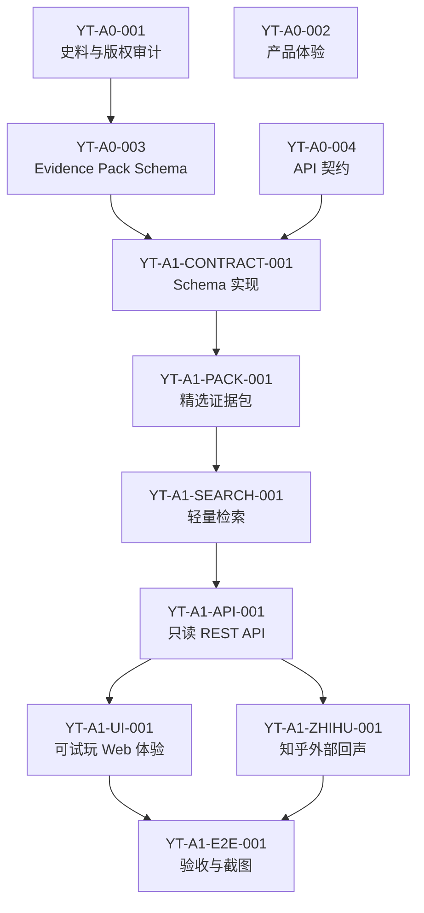

# 盐铁会议历史复原：后续任务拆分

状态：阶段0设计文档
任务标识：`YT-A0-005`
文档性质：本文件定义后续可执行任务，不授权立即进入业务实现。

## 1. 任务契约

- 任务 ID：`YT-A0-005`
- 价值：把盐铁会议作品拆成遵守仓库边界、可并行但不冲突的任务卡。
- 依赖：`YT-A0-001`、`YT-A0-002`、`YT-A0-003`、`YT-A0-004`。
- 允许修改范围：本设计文档。
- 禁止修改范围：业务代码、公共 Schema、迁移、根配置、`AGENTS.md`、运行态 `library/` 数据、向量库和原始大部头史料。
- 输入：史料审计、体验设计、Evidence Pack Schema、API 契约。
- 输出：后续任务 DAG、每个任务的价值、依赖、修改范围、接口、验收、测试和回滚方式。
- 接口：后续实现任务必须引用本文任务 ID，并不得跨越允许修改范围。
- 验收标准：每个任务只解决一个问题；公共 Schema、API、数据、UI、外部接口和测试任务边界清晰。
- 测试命令：`git diff --check -- docs/YANTIE_TASK_BREAKDOWN.md`。
- 回滚方式：删除或回退本文件。
- 文档更新：本文件即该任务的交付物。

## 2. 依赖图

并行规则：

- `YT-A1-ZHIHU-001` 可在 `YT-A1-API-001` 路由骨架稳定后与 `YT-A1-UI-001` 并行。
- 不允许多个任务同时修改 `evidence_pack` Schema 或同一 API 契约。
- 不允许任何任务修改 `AGENTS.md`、根配置、迁移基线或运行态 `library/`。

## 3. 任务卡

### YT-A1-CONTRACT-001：Evidence Pack Schema 实现

- 任务 ID：`YT-A1-CONTRACT-001`
- 价值：把 `YT-A0-003` 的数据契约实现为可校验 Schema，防止证据包漂移。
- 依赖：`YT-A0-003`、`YT-A0-004`。
- 允许修改范围：一个新业务模块 `metaos/yantie/` 中的 Schema 文件；一个测试目录或测试文件；一份直接相关文档勘误。
- 禁止修改范围：现有公共 Schema、迁移、根配置、`library/`、RAG/检索主链、知乎 adapter、UI。
- 输入：`docs/YANTIE_EVIDENCE_PACK_SCHEMA.md`。
- 输出：Pydantic Schema、枚举、校验器和最小示例 fixture。
- 接口：`EvidencePack`、`Source`、`EvidenceUnit`、`Claim`、`Actor`、`Event`、`Relation`、`MapLayer`。
- 验收标准：非法 Claim 缺证据会失败；外部回声不能作为历史证据；blocked 来源不能带可交付摘录。
- 测试命令：`python -m pytest test -k yantie_contract`，以及 `python -m pytest test`。
- 回滚方式：删除新增模块与测试，回退文档勘误。
- 文档更新：只在发现机械矛盾时更新 `docs/YANTIE_EVIDENCE_PACK_SCHEMA.md`。

### YT-A1-PACK-001：精选证据包 MVP

- 任务 ID：`YT-A1-PACK-001`
- 价值：交付一个不含大部头史料和向量库的最小可玩证据包。
- 依赖：`YT-A1-CONTRACT-001`。
- 允许修改范围：`metaos/yantie/` 下一个数据文件或 fixture；一个测试文件；一份来源审计勘误。
- 禁止修改范围：运行态 `library/`、原始 PDF/Markdown、Chroma、公共 Schema、迁移、UI。
- 输入：`YT-A0-001` 允许来源和人工选择的短摘。
- 输出：`evidence_pack.json` MVP，覆盖背景、盐铁辩题、桑弘羊理由、贤良文学反对、权力关系、会议结果。
- 接口：必须通过 `EvidencePack` Schema。
- 验收标准：至少包含 4 类来源、6 个角色、8 个事件、20 条 EvidenceUnit、12 条 Claim、20 条 Relation、3 个地图图层；所有 Claim 可回链证据。
- 测试命令：`python -m pytest test -k yantie_pack`，以及 `python -m pytest test`。
- 回滚方式：删除证据包和测试。
- 文档更新：更新 `docs/YANTIE_SOURCE_AUDIT.md` 的来源清单勘误。

### YT-A1-SEARCH-001：轻量证据检索

- 任务 ID：`YT-A1-SEARCH-001`
- 价值：在不引入 RAG/向量库的前提下支持证据室搜索和筛选。
- 依赖：`YT-A1-PACK-001`。
- 允许修改范围：`metaos/yantie/` 检索模块；一个测试文件；一份相关文档勘误。
- 禁止修改范围：`metaos/search` 通用检索、Chroma、Embedding、RAG、运行态索引、公共 Schema。
- 输入：`EvidencePack.lexical_index` 和 EvidenceUnit 字段。
- 输出：关键词过滤、标签过滤、稳定排序和档案不足返回。
- 接口：`search_evidence(query, filters, limit) -> SearchResultList`。
- 验收标准：固定查询“桑弘羊 财政”“反对 盐铁 官营”“会议 结果”命中预期证据；无证据问题不调用模型补答。
- 测试命令：`python -m pytest test -k yantie_search`，以及 `python -m pytest test`。
- 回滚方式：删除检索模块和测试。
- 文档更新：必要时更新 `docs/YANTIE_API_CONTRACT.md` 的搜索行为勘误。

### YT-A1-API-001：只读 REST API

- 任务 ID：`YT-A1-API-001`
- 价值：为 Web 项目提供稳定的数据读取、搜索和判断卡接口。
- 依赖：`YT-A1-SEARCH-001`。
- 允许修改范围：一个 API adapter 文件或 `metaos/yantie/` API 子模块；一个 API 测试文件；一份 API 文档勘误。
- 禁止修改范围：公共 Core Alpha API 契约、迁移、运行态数据、RAG、知乎 adapter、UI。
- 输入：`docs/YANTIE_API_CONTRACT.md` 和检索服务。
- 输出：`/api/yantie/*` 核心只读路由与本地判断卡创建路由。
- 接口：manifest、theme、sources、actors、events、map-layers、topics、evidence、claims、relations、curated-paths、judgment-cards。
- 验收标准：所有响应可 Schema 校验；搜索无证据返回档案不足；判断卡不会修改证据包。
- 测试命令：`python -m pytest test -k yantie_api`，以及 `python -m pytest test`。
- 回滚方式：删除 adapter 和测试，回退路由注册。
- 文档更新：必要时更新 `docs/YANTIE_API_CONTRACT.md`。

### YT-A1-ZHIHU-001：知乎外部回声 Adapter

- 任务 ID：`YT-A1-ZHIHU-001`
- 价值：接入知乎搜索、全网搜索、热榜和直答，把当代讨论作为体验补充。
- 依赖：`YT-A1-API-001`。
- 允许修改范围：一个知乎 adapter 模块；一个 mock API 测试文件；一份 API 文档勘误。
- 禁止修改范围：历史 EvidenceUnit、证据包、公共 Schema、RAG、运行态 `library/`。
- 输入：知乎开放平台 REST 契约、服务端 Access Secret。
- 输出：`external_echo` 响应 DTO、鉴权头构造、错误映射、降级策略。
- 接口：`zhihu_search`、`global_search`、`hot_list`、`zhida` 的服务端代理。
- 验收标准：未配置密钥时核心体验不失败；外部结果永远标记 `external_echo`；外部结果不能进入 Claim 证据。
- 测试命令：`python -m pytest test -k yantie_zhihu`，以及 `python -m pytest test`。
- 回滚方式：删除 adapter、测试和代理路由。
- 文档更新：必要时更新 `docs/YANTIE_API_CONTRACT.md`。

### YT-A1-UI-001：可试玩 Web 体验

- 任务 ID：`YT-A1-UI-001`
- 价值：把证据包变成可体验的会议现场、地图、权力网和判断卡。
- 依赖：`YT-A1-API-001`；可与 `YT-A1-ZHIHU-001` 并行。
- 允许修改范围：一个前端/展示模块；一个 UI 测试或截图验收文件；一份产品体验文档勘误。
- 禁止修改范围：证据包 Schema、历史证据内容、RAG、运行态数据、迁移、根配置。
- 输入：`docs/YANTIE_PRODUCT_EXPERIENCE.md`、`/api/yantie/*`。
- 输出：首屏会议现场、地图图层、辩题时间线、角色席位、证据室、关系网、判断卡。
- 接口：只调用 `/api/yantie/*` 和可选外部回声接口。
- 验收标准：桌面和移动端主要路径可用；文本不重叠；无知乎密钥时主体验完整；所有历史 Claim 可展开证据。
- 测试命令：`python -m pytest test -k yantie_ui` 或截图检查命令；以及 `python -m pytest test`。
- 回滚方式：删除 UI 模块和测试，回退路由入口。
- 文档更新：必要时更新 `docs/YANTIE_PRODUCT_EXPERIENCE.md`。

### YT-A1-E2E-001：验收、截图与参赛包检查

- 任务 ID：`YT-A1-E2E-001`
- 价值：确认作品满足参赛交付、无重型依赖泄漏、证据链可审计。
- 依赖：`YT-A1-UI-001`、`YT-A1-ZHIHU-001`。
- 允许修改范围：一个 E2E/验收测试文件；一份验收报告文档。
- 禁止修改范围：业务实现、Schema、证据包内容、运行态数据、根配置。
- 输入：可运行 Web 项目、证据包、API 和 UI。
- 输出：验收报告、截图、交付清单、风险清单。
- 接口：完整用户路径和参赛包目录。
- 验收标准：不包含原始大部头史料、Chroma、向量、RAG 中间产物；核心体验离线可用；知乎接口失败可降级；截图无明显重叠。
- 测试命令：`python -m pytest test -k yantie_e2e`，以及 `python -m pytest test`。
- 回滚方式：删除验收报告和测试。
- 文档更新：新增或更新验收报告。

## 4. 阶段进入条件

进入 A1 实现前必须满足：

- `YT-A0-001..005` 已完成并通过人工审查。
- 用户明确授权进入实现阶段。
- 若需要引用现代研究，已明确只交付摘要/链接或取得授权。
- 若需要知乎接口，已取得 Access Secret，并确认不提交到仓库。

## 5. 交付包检查清单

- 不包含 `library/index/chroma`。
- 不包含原始全书 PDF、OCR Markdown 或未经授权现代文本。
- 不包含 Access Secret、API Key、Cookie 或认证 Header。
- 包含 `evidence_pack.json`、Schema、前端、只读 API 和必要静态资产。
- 包含来源清单、引用说明、不可交付材料清单和已知不足。
