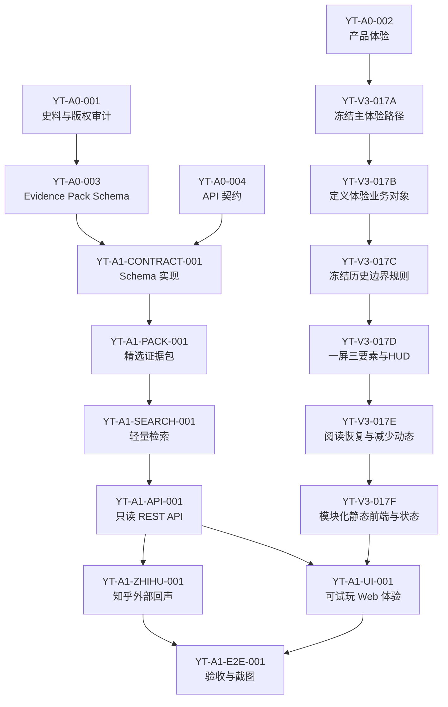

# 盐铁会议历史复原：后续任务拆分

状态：阶段0设计文档
任务标识：`YT-A0-005`
文档性质：本文件定义后续可执行任务，不授权立即进入业务实现。

## 1. 任务契约

- 任务 ID：`YT-A0-005`
- 价值：把盐铁会议作品拆成遵守仓库边界、可并行但不冲突的任务卡。
- 依赖：`YT-A0-001`、`YT-A0-002`、`YT-A0-003`、`YT-A0-004`。
- 允许修改范围：本设计文档。
- 禁止修改范围：业务代码、公共 Schema、迁移、根配置、`AGENTS.md`、运行态 `library/` 数据、向量库和原始大部头史料。
- 输入：史料审计、体验设计、Evidence Pack Schema、API 契约。
- 输出：后续任务 DAG、每个任务的价值、依赖、修改范围、接口、验收、测试和回滚方式。
- 接口：后续实现任务必须引用本文任务 ID，并不得跨越允许修改范围。
- 验收标准：每个任务只解决一个问题；公共 Schema、API、数据、UI、外部接口和测试任务边界清晰。
- 测试命令：`git diff --check -- docs/YANTIE_TASK_BREAKDOWN.md`。
- 回滚方式：删除或回退本文件。
- 文档更新：本文件即该任务的交付物。

## 2. 依赖图

并行规则：

- `YT-A1-ZHIHU-001` 可在 `YT-A1-API-001` 路由骨架稳定后与 `YT-A1-UI-001` 并行。
- 不允许多个任务同时修改 `evidence_pack` Schema 或同一 API 契约。
- 不允许任何任务修改 `AGENTS.md`、根配置、迁移基线或运行态 `library/`。

## 3. 任务卡

### YT-A1-CONTRACT-001：Evidence Pack Schema 实现

- 任务 ID：`YT-A1-CONTRACT-001`
- 价值：把 `YT-A0-003` 的数据契约实现为可校验 Schema，防止证据包漂移。
- 依赖：`YT-A0-003`、`YT-A0-004`。
- 允许修改范围：一个新业务模块 `metaos/yantie/` 中的 Schema 文件；一个测试目录或测试文件；一份直接相关文档勘误。
- 禁止修改范围：现有公共 Schema、迁移、根配置、`library/`、RAG/检索主链、知乎 adapter、UI。
- 输入：`docs/YANTIE_EVIDENCE_PACK_SCHEMA.md`。
- 输出：Pydantic Schema、枚举、校验器和最小示例 fixture。
- 接口：`EvidencePack`、`Source`、`EvidenceUnit`、`Claim`、`Actor`、`Event`、`Relation`、`MapLayer`。
- 验收标准：非法 Claim 缺证据会失败；外部回声不能作为历史证据；blocked 来源不能带可交付摘录。
- 测试命令：`python -m pytest test -k yantie_contract`，以及 `python -m pytest test`。
- 回滚方式：删除新增模块与测试，回退文档勘误。
- 文档更新：只在发现机械矛盾时更新 `docs/YANTIE_EVIDENCE_PACK_SCHEMA.md`。

### YT-A1-PACK-001：精选证据包 MVP

- 任务 ID：`YT-A1-PACK-001`
- 价值：交付一个不含大部头史料和向量库的最小可玩证据包。
- 依赖：`YT-A1-CONTRACT-001`。
- 允许修改范围：`metaos/yantie/` 下一个数据文件或 fixture；一个测试文件；一份来源审计勘误。
- 禁止修改范围：运行态 `library/`、原始 PDF/Markdown、Chroma、公共 Schema、迁移、UI。
- 输入：`YT-A0-001` 允许来源和人工选择的短摘。
- 输出：`evidence_pack.json` MVP，覆盖背景、盐铁辩题、桑弘羊理由、贤良文学反对、权力关系、会议结果。
- 接口：必须通过 `EvidencePack` Schema。
- 验收标准：至少包含 4 类来源、6 个角色、8 个事件、20 条 EvidenceUnit、12 条 Claim、20 条 Relation、3 个地图图层；所有 Claim 可回链证据。
- 测试命令：`python -m pytest test -k yantie_pack`，以及 `python -m pytest test`。
- 回滚方式：删除证据包和测试。
- 文档更新：更新 `docs/YANTIE_SOURCE_AUDIT.md` 的来源清单勘误。

### YT-A1-SEARCH-001：轻量证据检索

- 任务 ID：`YT-A1-SEARCH-001`
- 价值：在不引入 RAG/向量库的前提下支持证据室搜索和筛选。
- 依赖：`YT-A1-PACK-001`。
- 允许修改范围：`metaos/yantie/` 检索模块；一个测试文件；一份相关文档勘误。
- 禁止修改范围：`metaos/search` 通用检索、Chroma、Embedding、RAG、运行态索引、公共 Schema。
- 输入：`EvidencePack.lexical_index` 和 EvidenceUnit 字段。
- 输出：关键词过滤、标签过滤、稳定排序和档案不足返回。
- 接口：`search_evidence(query, filters, limit) -> SearchResultList`。
- 验收标准：固定查询“桑弘羊 财政”“反对 盐铁 官营”“会议 结果”命中预期证据；无证据问题不调用模型补答。
- 测试命令：`python -m pytest test -k yantie_search`，以及 `python -m pytest test`。
- 回滚方式：删除检索模块和测试。
- 文档更新：必要时更新 `docs/YANTIE_API_CONTRACT.md` 的搜索行为勘误。

### YT-A1-API-001：只读 REST API

- 任务 ID：`YT-A1-API-001`
- 价值：为 Web 项目提供稳定的数据读取、搜索和判断卡接口。
- 依赖：`YT-A1-SEARCH-001`。
- 允许修改范围：一个 API adapter 文件或 `metaos/yantie/` API 子模块；一个 API 测试文件；一份 API 文档勘误。
- 禁止修改范围：公共 Core Alpha API 契约、迁移、运行态数据、RAG、知乎 adapter、UI。
- 输入：`docs/YANTIE_API_CONTRACT.md` 和检索服务。
- 输出：`/api/yantie/*` 核心只读路由与本地判断卡创建路由。
- 接口：manifest、theme、sources、actors、events、map-layers、topics、evidence、claims、relations、curated-paths、judgment-cards。
- 验收标准：所有响应可 Schema 校验；搜索无证据返回档案不足；判断卡不会修改证据包。
- 测试命令：`python -m pytest test -k yantie_api`，以及 `python -m pytest test`。
- 回滚方式：删除 adapter 和测试，回退路由注册。
- 文档更新：必要时更新 `docs/YANTIE_API_CONTRACT.md`。

### YT-A1-ZHIHU-001：知乎外部回声 Adapter

- 任务 ID：`YT-A1-ZHIHU-001`
- 价值：接入知乎搜索、全网搜索、热榜和直答，把当代讨论作为体验补充。
- 依赖：`YT-A1-API-001`。
- 允许修改范围：一个知乎 adapter 模块；一个 mock API 测试文件；一份 API 文档勘误。
- 禁止修改范围：历史 EvidenceUnit、证据包、公共 Schema、RAG、运行态 `library/`。
- 输入：知乎开放平台 REST 契约、服务端 Access Secret。
- 输出：`external_echo` 响应 DTO、鉴权头构造、错误映射、降级策略。
- 接口：`zhihu_search`、`global_search`、`hot_list`、`zhida` 的服务端代理。
- 验收标准：未配置密钥时核心体验不失败；外部结果永远标记 `external_echo`；外部结果不能进入 Claim 证据。
- 测试命令：`python -m pytest test -k yantie_zhihu`，以及 `python -m pytest test`。
- 回滚方式：删除 adapter、测试和代理路由。
- 文档更新：必要时更新 `docs/YANTIE_API_CONTRACT.md`。

### YT-A1-UI-001：可试玩 Web 体验

- 任务 ID：`YT-A1-UI-001`
- 价值：把证据包变成可体验的会议现场、地图、权力网和判断卡。
- 依赖：`YT-A1-API-001`；可与 `YT-A1-ZHIHU-001` 并行。
- 允许修改范围：一个前端/展示模块；一个 UI 测试或截图验收文件；一份产品体验文档勘误。
- 禁止修改范围：证据包 Schema、历史证据内容、RAG、运行态数据、迁移、根配置。
- 输入：`docs/YANTIE_PRODUCT_EXPERIENCE.md`、`/api/yantie/*`。
- 输出：首屏会议现场、地图图层、辩题时间线、角色席位、证据室、关系网、判断卡。
- 接口：只调用 `/api/yantie/*` 和可选外部回声接口。
- 验收标准：桌面和移动端主要路径可用；文本不重叠；无知乎密钥时主体验完整；所有历史 Claim 可展开证据。
- 测试命令：`python -m pytest test -k yantie_ui` 或截图检查命令；以及 `python -m pytest test`。
- 回滚方式：删除 UI 模块和测试，回退路由入口。
- 文档更新：必要时更新 `docs/YANTIE_PRODUCT_EXPERIENCE.md`。

### YT-A1-E2E-001：验收、截图与参赛包检查

- 任务 ID：`YT-A1-E2E-001`
- 价值：确认作品满足参赛交付、无重型依赖泄漏、证据链可审计。
- 依赖：`YT-A1-UI-001`、`YT-A1-ZHIHU-001`。
- 允许修改范围：一个 E2E/验收测试文件；一份验收报告文档。
- 禁止修改范围：业务实现、Schema、证据包内容、运行态数据、根配置。
- 输入：可运行 Web 项目、证据包、API 和 UI。
- 输出：验收报告、截图、交付清单、风险清单。
- 接口：完整用户路径和参赛包目录。
- 验收标准：不包含原始大部头史料、Chroma、向量、RAG 中间产物；核心体验离线可用；知乎接口失败可降级；截图无明显重叠。
- 测试命令：`python -m pytest test -k yantie_e2e`，以及 `python -m pytest test`。
- 回滚方式：删除验收报告和测试。
- 文档更新：新增或更新验收报告。

### YT-V3-017A：冻结主体验路径

- 任务 ID：`YT-V3-017A`
- 价值：把盐铁会议体验从“功能模块完整”收敛为一条 5-8 分钟可完整经历的主路径，避免首次体验同时暴露地图、图谱、透镜、长证据、当代回声和判断区导致用户迷路。
- 依赖：`YT-A0-002`、`docs/YANTIE_PRODUCT_EXPERIENCE.md` 中 V3.13 的业务闭环与技术架构收敛设计。
- 允许修改范围：`docs/YANTIE_TASK_BREAKDOWN.md`；如发现体验设计机械矛盾，可在后续独立任务中更新 `docs/YANTIE_PRODUCT_EXPERIENCE.md`，但本任务不修改运行代码。
- 禁止修改范围：`docs/yantie/index.html`、`metaos/yantie/web.py`、`metaos/yantie/data/evidence_pack.json`、`docs/yantie/data/evidence_pack.json`、测试文件、公共 Schema、迁移、根配置、运行态 `library/` 数据。
- 输入：`docs/YANTIE_PRODUCT_EXPERIENCE.md`、现有盐铁会议静态页面结构、证据包中已有事件/角色/证据主题。
- 输出：主体验路径表、深度探索入口表、后续静态前端纵切片的实施边界。
- 接口：后续 UI 实现任务必须以 `MainExperiencePath` 为主路径配置来源，以 `DeepExplorationEntry` 为退朝后或主动探索入口清单；不得在首次主路径中默认开放完整章节图谱、哲学透镜、长文证据阅读或当代回声。
- 验收标准：主体验路径控制在 5-8 分钟；每一幕都有主视觉、主问题、主动作；主路径只允许轻量证据提示和一条关键证据深入；深度探索内容默认不打断主线；任务卡满足仓库要求的必填字段。
- 测试命令：`git diff --check -- docs/YANTIE_TASK_BREAKDOWN.md`。
- 回滚方式：删除本任务卡及其两张表，回退依赖图中的 `YT-V3-017A` 节点。
- 文档更新：本任务卡即交付物；后续若进入代码实现，应另开 UI 纵切片任务，并同步更新 `docs/YANTIE_PRODUCT_EXPERIENCE.md` 的实现状态。

主体验路径表：

| 顺序 | 场景名 | 用户情绪 | 主视觉 | 主问题 | 主动作 | 允许证据 | 是否可跳过 |
|------|--------|----------|--------|--------|--------|----------|------------|
| 1 | 天下压力显影 | 好奇、进入 | 汉昭帝时期地图、北边与长安逐渐显影 | 这场会议为什么非开不可？ | 继续看压力汇聚 | 不开放证据，只显示一句背景提示 | 首次不可跳过，二次可跳过 |
| 2 | 北边急报 | 紧张 | 北境烽火、粮道中断、边防压力流向长安 | 边防还要不要继续投入？ | 调粮 / 暂缓 | 可显示边费相关证据印记，不展开长文 | 可跳过动画，不可跳过选择 |
| 3 | 第一次取舍 | 犹豫 | 府库、民户、盐铁资源三者同时压上案前 | 先保国家供给，还是先减轻民间负担？ | 选择一个优先方向 | 不开放章节图谱；只显示选择后果一句话 | 不可跳过 |
| 4 | 生成进入视角 | 代入 | 史官记录用户选择，朝堂席位被点亮 | 用户将从哪个压力进入朝堂？ | 入朝 | 不开放证据 | 可跳过动画，不可跳过视角确认 |
| 5 | 财政先声 | 理解现实 | 桑弘羊一方、府库、均输路线 | 没有财政能力，边防和国家秩序如何维持？ | 听财政理由 | 可打开一条财政/边费竹简摘要 | 可跳过部分动画 |
| 6 | 民生反击 | 共情、动摇 | 民户承压、贤良文学发言、盐铁入市 | 国家筹资的代价由谁承担？ | 听民生反驳 | 可打开一条与民争利证据摘要 | 可跳过部分动画 |
| 7 | 关键证据发现 | 认真阅读 | 史官落下一卷竹简，地图降亮度进入阅读模式 | 哪条史料真正改变了判断？ | 展开竹简 / 保持原判断 | 允许一条关键证据进入案卷详情，不进入全文阅读 | 不可跳过证据选择，可跳过展开动画 |
| 8 | 判断动摇或坚持 | 反思 | 用户初判与当前判断出现轨迹差异 | 看到证据后，是否仍坚持原判断？ | 坚持 / 修正 / 保留疑问 | 只显示已用证据来源，不开放新证据 | 不可跳过 |
| 9 | 霍光沉默 | 压抑、意识到权力边界 | 朝堂暗下、御座或空白权力位置突出 | 争论之外，谁决定什么能改变？ | 等待沉默结束 / 二次体验继续 | 不开放证据、图谱和透镜 | 首次保留停顿，二次可缩短 |
| 10 | 退朝案牍 | 沉思 | 案牍自动书写、盖印、地图拉远 | 这次判断如何形成，还有什么没有解决？ | 查看案牍 | 只列已接触证据和未解矛盾 | 不可跳过案牍生成，可跳过书写动画 |

深度探索入口表：

| 内容 | 主线中如何出现 | 退朝后如何开放 | 默认是否进入主线 |
|------|----------------|------------------|------------------|
| 六十篇争点图谱 | 只以“今日争点”轻提示出现，不展开完整图谱 | 退朝后作为“回看全文争点”入口开放 | 否 |
| 哲学透镜 | 主线中只显示一句“这属于义利/治道视角”的轻提示 | 退朝后按儒家、法家、管子、韩非等透镜分组开放 | 否 |
| 长文证据阅读 | 主线只允许一条关键证据进入案卷详情 | 退朝后进入完整 Evidence Document 阅读模式 | 否 |
| 当代回声 | 主线中不出现 | 退朝后作为“后世与当代讨论”延伸入口，且不自动写入案牍 | 否 |
| 权力关系图 | 霍光沉默阶段只通过视觉暗场表现 | 退朝后开放“朝堂权力结构”图 | 否 |
| 第二视角体验 | 主线结束前不允许切换身份 | 退朝后提示“从另一席位再入朝” | 否 |
| 音乐与环境音控制 | 主线中只保留静音/开启声音 | 设置中开放音乐段落、环境音和减少动态效果 | 是，作为辅助设置 |
| 退朝案牍复盘 | 主线终点自动生成 | 退朝后可展开完整判断轨迹和证据列表 | 是，作为主交付物 |

### YT-V3-017B：定义体验业务对象

- 任务 ID：`YT-V3-017B`
- 价值：把“用户经历一次历史判断”从界面流程上升为稳定业务对象，避免后续前端只围绕按钮、弹窗和页面状态开发，无法追踪用户如何进入朝堂、如何接触证据、如何动摇和如何形成退朝案牍。
- 依赖：`YT-V3-017A`、`docs/YANTIE_PRODUCT_EXPERIENCE.md` 中 V3.13 的业务对象设计。
- 允许修改范围：`docs/YANTIE_TASK_BREAKDOWN.md`；如发现对象字段与体验文档冲突，可在后续独立文档任务中更新 `docs/YANTIE_PRODUCT_EXPERIENCE.md`。
- 禁止修改范围：Pydantic Schema、API 代码、前端代码、证据包、测试文件、公共 Schema、迁移、根配置、运行态 `library/` 数据。
- 输入：`YT-V3-017A` 主体验路径表、`docs/YANTIE_PRODUCT_EXPERIENCE.md` 的 `HistoricalExperience`、`JudgmentTrace`、`SceneDefinition`、`EvidenceEncounter`、`RetirementDossier` 定义。
- 输出：盐铁体验业务对象表、对象关系表、固定历史与可变体验边界清单、后续 Schema/前端实现任务的接口约束。
- 接口：后续实现任务必须以本文的业务对象为概念接口；`HistoricalExperience` 只能引用证据包对象 ID 和本地用户状态，不得复制或改写 EvidenceUnit、Claim、Event 原文；`RetirementDossier` 是用户体验产物，不是历史证据。
- 验收标准：五个对象都有职责、最小字段、生命周期和禁止事项；对象关系能覆盖一次主体验从进入到退朝的完整链路；固定历史与可变体验边界不允许被 UI 实现绕过；任务卡满足仓库要求的必填字段。
- 测试命令：`git diff --check -- docs/YANTIE_TASK_BREAKDOWN.md`。
- 回滚方式：删除本任务卡及其对象表，回退依赖图中的 `YT-V3-017B` 节点。
- 文档更新：本任务卡即交付物；后续若进入实现阶段，应另开 Schema 或前端任务，不得把本文设计视为已经实现的代码契约。

业务对象表：

| 对象 | 职责 | 最小字段 | 生命周期 | 禁止事项 |
|------|------|----------|----------|----------|
| `HistoricalExperience` | 表示用户的一次盐铁会议体验实例 | `experience_id`、`experience_version`、`current_scene_id`、`started_at`、`completed_at`、`initial_choice_id`、`perspective_id`、`completion_status`、`audio_enabled`、`reduced_motion` | `not_started -> active -> completed / abandoned` | 不存储史料全文；不改写会议结果；不承担证据判断 |
| `JudgmentTrace` | 记录用户判断如何变化 | `trace_id`、`experience_id`、`initial_position`、`trace_steps`、`final_position`、`remaining_questions` | 随体验追加，退朝时冻结为案牍输入 | 不把倾向分数伪装成历史结论；不自动生成政治评价 |
| `SceneDefinition` | 定义业务意义上的场景 | `scene_id`、`phase`、`historical_situation`、`core_conflict`、`primary_action`、`allowed_actions`、`evidence_refs`、`history_mutability` | 随体验版本发布，运行时只读 | 不写人物虚构心理；不允许用户改变固定历史 |
| `EvidenceEncounter` | 记录用户如何接触证据 | `encounter_id`、`experience_id`、`evidence_id`、`scene_id`、`encounter_mode`、`depth_level`、`caused_judgment_change` | 用户接触证据时追加 | 不复制 EvidenceUnit 正文；不把哲学透镜标为会议事实 |
| `RetirementDossier` | 退朝后的核心交付物 | `dossier_id`、`experience_id`、`perspective_id`、`initial_position`、`turning_points`、`evidence_used`、`final_position`、`unresolved_conflicts`、`personal_reflection` | 退朝生成，可本地修订个人反思 | 不进入证据包；不替代历史 Claim；不自动纳入当代回声 |

对象关系表：

| 来源对象 | 关系 | 目标对象 | 说明 |
|----------|------|----------|------|
| `HistoricalExperience` | contains | `JudgmentTrace` | 一次体验有一条判断轨迹 |
| `HistoricalExperience` | visits | `SceneDefinition` | 体验按场景顺序推进 |
| `HistoricalExperience` | records | `EvidenceEncounter` | 用户每次接触证据都形成 encounter |
| `JudgmentTrace` | references | `EvidenceEncounter` | 只有接触过的证据才能解释观点变化 |
| `RetirementDossier` | summarizes | `JudgmentTrace` | 案牍从轨迹生成，不凭空总结 |
| `RetirementDossier` | cites | `EvidenceUnit` ID | 只引用证据 ID 和出处，不复制证据包 |
| `SceneDefinition` | references | `EvidenceUnit` ID | 场景只能引用已验证证据 |

固定历史与可变体验边界：

| 类型 | 可做 | 不可做 |
|------|------|--------|
| 固定历史 | 展示会议背景、人物身份、政策结果、史料原文和出处 | 让用户选择改变会议结果；补写未证实发言 |
| 可变体验 | 改变进入视角、镜头顺序、证据发现路径、判断轨迹和个人反思 | 把体验变化写成历史事实 |
| 证据使用 | 引用 EvidenceUnit ID、出处、短摘和白话转述 | 在用户状态中复制或改写证据原文 |
| 思想透镜 | 帮助解释义利、治道、儒法分歧 | 冒充盐铁会议现场证据 |
| 退朝案牍 | 记录用户判断、证据触发点和未解矛盾 | 进入证据包或覆盖 Claim |

### YT-V3-017C：编写固定历史与可变体验边界规则

- 任务 ID：`YT-V3-017C`
- 价值：把“历史不能被用户选择改写、体验可以改变呈现路径”变成后续 UI、Schema 和测试都能执行的边界规则，避免沉浸式交互为了戏剧效果补写史实、混淆哲学透镜与会议证据，或把用户的判断轨迹误当成历史结论。
- 依赖：`YT-V3-017A`、`YT-V3-017B`、`docs/YANTIE_SOURCE_AUDIT.md`、`docs/YANTIE_EVIDENCE_PACK_SCHEMA.md`。
- 允许修改范围：`docs/YANTIE_TASK_BREAKDOWN.md`；如发现来源审计或证据包 Schema 有机械冲突，可在后续独立任务中更新对应文档。
- 禁止修改范围：前端代码、API 代码、Pydantic Schema、证据包内容、测试文件、公共 Schema、迁移、根配置、运行态 `library/` 数据。
- 输入：`YT-V3-017B` 的业务对象表、`docs/YANTIE_EVIDENCE_PACK_SCHEMA.md` 的 EvidenceUnit/Claim/Source 规则、`docs/YANTIE_SOURCE_AUDIT.md` 的来源边界。
- 输出：历史边界规则表、信息类型展示规则表、用户动作许可矩阵、后续实现验收清单。
- 接口：后续 UI 与 Schema 实现任务必须把 `history_boundary` 或等价字段作为场景/动作/证据呈现的设计约束；任何用户动作只能改变 `HistoricalExperience`、`JudgmentTrace`、`EvidenceEncounter`、`RetirementDossier`，不得改变 EvidenceUnit、Claim、Event、Actor 的历史事实字段。
- 验收标准：所有主体验场景都能归入固定历史、可变体验或禁止表达；每类信息都有明确视觉和交互边界；用户动作许可矩阵能覆盖主路径 10 个场景；后续 UI 不得绕过该边界默认开放改写历史的操作。
- 测试命令：`git diff --check -- docs/YANTIE_TASK_BREAKDOWN.md`。
- 回滚方式：删除本任务卡及其四张规则表，回退依赖图中的 `YT-V3-017C` 节点。
- 文档更新：本任务卡即交付物；后续实现阶段如需要字段落地，应另开 Schema 或 UI 任务，不得在本任务中直接实现。

历史边界规则表：

| 边界类型 | 定义 | 来源或归属 | 允许呈现 | 禁止呈现 |
|----------|------|------------|----------|----------|
| 固定历史事实 | 会议时间、人物身份、政策背景、会议结果、史料原文和可定位出处 | `EvidenceUnit`、`Claim`、`Event`、`Actor` | 按证据包展示，可做轻量转述 | 用户选择改变结果；为了戏剧性补写无证据事实 |
| 固定解释边界 | 会议事实、后世评价、思想透镜和策展推断之间的分类边界 | `claim_type`、`evidence_kind`、`value_tags` | 用不同视觉样式区分 | 把哲学透镜显示成会议现场证据 |
| 可变体验路径 | 信息出现顺序、镜头、默认视角、证据发现路径、阅读深度 | `HistoricalExperience`、`SceneDefinition` | 根据用户状态调整节奏和焦点 | 把体验路径变化写成历史变化 |
| 可变用户判断 | 用户初判、动摇、坚持、保留疑问、个人反思 | `JudgmentTrace`、`RetirementDossier` | 作为用户案牍和复盘呈现 | 显示为系统可靠结论或历史 Claim |
| 禁止表达 | 改写会议结果、虚构人物心理、伪造发言、叙事压力冒充统计 | 无合法归属 | 不得出现 | 不得通过文案、动画、数值或案牍暗示 |

信息类型展示规则表：

| 信息类型 | 数据来源 | 推荐视觉 | 交互规则 | 必须提示 |
|----------|----------|----------|----------|----------|
| 史实证据 | `EvidenceUnit.review_status=verified` | 纸色、直角来源章 | 可从证据印记进入竹简摘要或案卷详情 | 出处、定位、证据类型 |
| 策展推断 | `Claim.claim_type=curatorial_inference` | 中性色、虚线边框 | 只能解释关系，不作为独立事实 | 推断依据和不确定性 |
| 思想透镜 | 带 `philosophy_lens` 等标签的 EvidenceUnit/Claim | 冷灰或青色、镜纹 | 退朝后或轻提示出现，不默认打断主线 | “用于理解思想，不是会议事实” |
| 用户判断 | `JudgmentTrace`、`RetirementDossier` | 手写墨迹或朱批 | 可在退朝案牍中编辑个人反思 | “这是你的判断，不是历史结论” |
| 当代回声 | `external_echo` 或后续外部入口 | 独立延伸区样式 | 只在退朝后主动开放 | “不属于历史证据链” |

用户动作许可矩阵：

| 动作 | 是否允许 | 可改变对象 | 不可改变对象 | 备注 |
|------|----------|------------|--------------|------|
| 选择初始取舍 | 允许 | `HistoricalExperience.initial_choice_id`、`perspective_id` | `Event`、`Claim`、会议结果 | 只改变进入视角和默认镜头 |
| 调整判断 | 允许 | `JudgmentTrace.trace_steps`、`final_position` | `Claim.statement`、`EvidenceUnit` | 必须记录触发场景或证据 |
| 展开证据 | 允许 | `EvidenceEncounter.depth_level` | EvidenceUnit 原文和出处 | 不复制或改写证据正文 |
| 查看哲学透镜 | 允许 | `EvidenceEncounter` 或本地阅读状态 | 会议事实分类 | 必须标识为解释视角 |
| 生成退朝案牍 | 允许 | `RetirementDossier` | 证据包、历史 Claim | 只能总结用户轨迹和已接触证据 |
| 改变会议结果 | 禁止 | 无 | 所有历史对象 | UI 不得提供该动作 |
| 补写人物心理 | 禁止 | 无 | Actor、Event、Claim | 只能呈现已证实立场和发言 |
| 将当代回声写入历史证据 | 禁止 | 无 | EvidenceUnit、Claim.evidence_ids | 只能作为延伸讨论 |

后续实现验收清单：

- 主路径 10 个场景均标注 `history_boundary=fixed_fact|curatorial_inference|mutable_experience|user_reflection|forbidden` 中的合法类型。
- 任何用户动作都不得修改 EvidenceUnit、Claim、Event、Actor 的历史事实字段。
- 哲学透镜和当代回声在视觉上与史实证据明显不同。
- 退朝案牍只引用已接触证据 ID、用户轨迹和个人反思，不进入证据包。
- 叙事压力只能显示为体验压力，不得显示为真实财政、人口或军费统计。
- 测试或人工检查应覆盖至少：第一次取舍、关键证据发现、霍光沉默、退朝案牍、当代回声入口。

### YT-V3-017D：设计一屏三要素模板和 HUD 渐进规则

- 任务 ID：`YT-V3-017D`
- 价值：把“每一幕只让用户看一件事、想一个问题、做一个动作”变成后续 UI 可执行的显示规则，避免地图、HUD、人物、证据、图谱、判断区同时争夺注意力。
- 依赖：`YT-V3-017A`、`YT-V3-017B`、`YT-V3-017C`。
- 允许修改范围：`docs/YANTIE_TASK_BREAKDOWN.md`；如发现体验文档中的 HUD 描述与本规则冲突，可在后续独立文档任务中更新 `docs/YANTIE_PRODUCT_EXPERIENCE.md`。
- 禁止修改范围：前端代码、API 代码、Pydantic Schema、证据包、测试文件、公共 Schema、迁移、根配置、运行态 `library/` 数据。
- 输入：`YT-V3-017A` 主体验路径表、`YT-V3-017C` 历史边界规则、`docs/YANTIE_PRODUCT_EXPERIENCE.md` 的一屏三要素和 HUD 渐进设计。
- 输出：一屏三要素模板、主路径场景显示表、HUD 渐进规则表、移动端显示约束。
- 接口：后续 UI 实现任务必须为每个主路径场景配置 `primary_visual`、`primary_question`、`primary_action`、`hud_mode`、`hidden_surfaces`；任一场景不得同时显示完整地图 HUD、章节图谱、哲学透镜、证据长文和判断区。
- 验收标准：主路径 10 个场景均有明确主视觉、主问题、主动作、HUD 模式和隐藏面；同一时刻最多一个主动作；HUD 按叙事渐进出现；移动端任一场景只开放一个主动作且不被浮层遮挡。
- 测试命令：`git diff --check -- docs/YANTIE_TASK_BREAKDOWN.md`。
- 回滚方式：删除本任务卡及其三张规则表，回退依赖图中的 `YT-V3-017D` 节点。
- 文档更新：本任务卡即交付物；后续实现阶段应将这些字段落到场景配置或等价前端状态中。

一屏三要素模板：

| 字段 | 含义 | 规则 |
|------|------|------|
| `primary_visual` | 用户第一眼应该看的对象 | 只能是地图、朝堂、竹简、案牍或单一历史对象之一 |
| `primary_question` | 用户此刻应该思考的问题 | 只写一个问题，不并列多个价值判断 |
| `primary_action` | 用户下一步可执行的主要动作 | 桌面和移动端都必须稳定可见 |
| `hud_mode` | 此刻允许出现的 HUD 类型 | `none`、`world`、`scene`、`user`、`summary` 之一 |
| `hidden_surfaces` | 此刻必须隐藏的旁路入口 | 图谱、透镜、长文证据、当代回声、判断区按场景关闭 |

主路径场景显示表：

| 场景 | primary_visual | primary_question | primary_action | hud_mode | hidden_surfaces |
|------|----------------|------------------|----------------|----------|-----------------|
| 天下压力显影 | 汉昭帝时期地图 | 这场会议为什么非开不可？ | 继续看压力汇聚 | `world` | 图谱、透镜、证据、判断区、当代回声 |
| 北边急报 | 北境烽火与粮道 | 边防还要不要继续投入？ | 调粮 / 暂缓 | `world` | 图谱、透镜、长文证据、判断区 |
| 第一次取舍 | 府库、民户、盐铁资源 | 先保供给，还是先减负？ | 选择优先方向 | `world` | 图谱、透镜、证据长文、当代回声 |
| 生成进入视角 | 朝堂席位点亮 | 你将从哪个压力进入朝堂？ | 入朝 | `user` | 图谱、透镜、证据、当代回声 |
| 财政先声 | 桑弘羊一方和府库 | 没有财政能力，国家如何维持？ | 听财政理由 | `scene` | 图谱、透镜、长文证据、判断区 |
| 民生反击 | 民户承压和贤良文学 | 国家筹资的代价由谁承担？ | 听民生反驳 | `scene` | 图谱、透镜、长文证据、当代回声 |
| 关键证据发现 | 史官竹简 | 哪条史料真正改变了判断？ | 展开竹简 / 保持原判断 | `none` | HUD、图谱、透镜、当代回声 |
| 判断动摇或坚持 | 判断轨迹差异 | 看到证据后是否仍坚持？ | 坚持 / 修正 / 保留疑问 | `user` | 图谱、透镜、新证据、当代回声 |
| 霍光沉默 | 暗下的朝堂与御座 | 争论之外，谁决定什么能改变？ | 等待 / 继续 | `none` | HUD、图谱、透镜、证据、判断区 |
| 退朝案牍 | 案牍书写和地图拉远 | 这次判断如何形成？ | 查看案牍 | `summary` | 当代回声默认隐藏，图谱和透镜折叠为退朝后入口 |

HUD 渐进规则表：

| HUD 模式 | 显示内容 | 出现阶段 | 限制 |
|----------|----------|----------|------|
| `none` | 不显示 HUD | 关键证据、霍光沉默、长阅读 | 用于降低认知负荷 |
| `world` | 始元六年、边防、府库，后续逐步加入民生/商贸 | 序章、北边急报、第一次取舍 | 只显示趋势，不显示伪精确数值 |
| `scene` | 当前争论、发言方、当前压力提示 | 财政先声、民生反击、义利争论 | 不与完整 World HUD 同屏 |
| `user` | 用户视角、初判、当前动摇点 | 视角生成、判断动摇 | 不评价用户人格或给倾向分数 |
| `summary` | 已接触证据、判断变化、未解矛盾 | 退朝案牍 | 只总结体验轨迹，不生成历史结论 |

移动端显示约束：

- 任一场景只显示一个主视觉、一句主问题和一个主动作。
- 主动作固定在安全区上方，不能被抽屉、证据或地图标签遮挡。
- HUD 默认折叠为一句状态提示；只有退朝总结可展开完整轨迹。
- 章节图谱、哲学透镜、当代回声、权力关系图默认不进入移动端主线。
- 证据阅读进入全屏阅读模式，返回按钮文案为“回到现场”。

### YT-V3-017E：补充阅读模式、中途恢复和减少动态效果规则

- 任务 ID：`YT-V3-017E`
- 价值：为主体验增加“可安静阅读、可中断恢复、可减少动态”的体验安全阀，避免长证据阅读打断历史现场，避免用户中途离开后丢失判断轨迹，也避免强制动画、黑场或声音让首次体验变得疲劳。
- 依赖：`YT-V3-017A`、`YT-V3-017B`、`YT-V3-017C`、`YT-V3-017D`。
- 允许修改范围：`docs/YANTIE_TASK_BREAKDOWN.md`；如发现 `docs/YANTIE_PRODUCT_EXPERIENCE.md` 中阅读、恢复或减少动态描述与本规则冲突，可在后续独立文档任务中更新。
- 禁止修改范围：前端代码、API 代码、Pydantic Schema、证据包、测试文件、公共 Schema、迁移、根配置、运行态 `library/` 数据。
- 输入：`YT-V3-017A` 主体验路径表、`YT-V3-017D` 一屏三要素与 HUD 规则、`docs/YANTIE_PRODUCT_EXPERIENCE.md` 中阅读模式、中途恢复和减少动态效果相关设计。
- 输出：阅读模式规则表、中途恢复规则表、减少动态与声音规则表、暂停/跳过规则表、后续实现验收清单。
- 接口：后续 UI 实现任务必须在场景配置或等价前端状态中支持 `reading_mode`、`resume_state`、`reduced_motion`、`audio_state`；本地会话只保存体验 ID、场景 ID、证据 ID、判断轨迹和设置，不得复制 EvidenceUnit 正文或改写证据内容。
- 验收标准：进入阅读模式后能回到原场景和原焦点；中途恢复能区分进行中、已完成、版本不兼容和无记录状态；减少动态模式不强制黑场、不依赖大幅镜头运动、不隐藏内容；移动端主动作和返回动作始终可见；本地状态不复制证据正文。
- 测试命令：`git diff --check -- docs/YANTIE_TASK_BREAKDOWN.md`。
- 回滚方式：删除本任务卡及其四张规则表，回退依赖图中的 `YT-V3-017E` 节点。
- 文档更新：本任务卡即交付物；后续进入代码实现时，应另开静态前端纵切片任务，并同步更新产品体验文档的实现状态。

阅读模式规则表：

| 触发场景 | 布局 | 暂停元素 | 允许动作 | 返回行为 |
|----------|------|----------|----------|----------|
| 主线关键证据案卷详情 | 全屏安静阅读，保留出处、短摘、白话转述和相关性说明 | 地图动画、HUD、环境音、场景推进 | 回到现场、记录动摇、保留疑问 | 回到进入阅读前的场景、焦点和主动作 |
| 退朝后长文证据阅读 | Evidence Document 独立阅读页 | 主线压力 HUD、朝堂动画、自动旁白 | 回到案牍、继续探索、查看关联争点 | 回到退朝案牍或深度探索入口 |
| 哲学透镜阅读 | 与史实证据视觉区分的透镜阅读态 | 主线时间推进、判断按钮、地图热点 | 回到现场、退朝后继续看透镜 | 不写入历史事实，只记录为解释视角接触 |
| 移动端证据阅读 | 全屏文档，底部固定“回到现场” | 背景滚动、复杂手势、非必要动画 | 回到现场、标记疑问 | 回到原场景并恢复主动作可见 |

中途恢复规则表：

| 状态字段或场景 | 记录内容 | 恢复展示 | 规则 |
|----------------|----------|----------|------|
| `experience_id`、`experience_version`、`state_version` | 当前体验与状态版本 | 用于判断是否兼容 | 版本不兼容时提示重新开始，不静默恢复 |
| `scene_id`、`phase`、`perspective_id` | 当前场景、阶段和进入视角 | “上次退在某场景，案卷仍在堂侧” | 进行中体验提供“继续入朝 / 重新开始” |
| `initial_choice_id`、`judgment_trace` | 初始取舍和判断轨迹 | 继续前简短回顾当前判断 | 只保存用户轨迹和证据 ID，不复制证据正文 |
| `visited_evidence_ids` | 已接触证据 ID 列表 | 回到现场后恢复已发现状态 | 证据详情仍从证据包读取 |
| `audio_enabled`、`reduced_motion` | 声音和动态偏好 | 进入前沿用上次设置 | 不因恢复体验自动开启声音或强动画 |
| `completion_status=completed` | 已完成体验 | 展示最近退朝案牍 | 提供重看案牍、深度探索或重新开始 |
| 无本地状态或已放弃 | 无有效记录 | 从序章开始 | 不展示恢复提示 |

减少动态与声音规则表：

| 原体验效果 | 减少动态模式 | 声音规则 | 限制 |
|------------|--------------|----------|------|
| 地图镜头推进、拉远 | 使用淡入淡出或静态关键帧 | 不依赖声音提示方向 | 内容顺序不变 |
| 压力流、运输线、烽火动画 | 改为低频脉冲或静态图例 | 可静音，状态文字仍可理解 | 不用闪烁表达唯一信息 |
| 霍光沉默黑场和停顿 | 不强制长黑场，改为短暂停顿和静态暗场 | 音乐降低但不作为唯一表达 | 首次体验可保留沉默，二次体验可继续 |
| 退朝案牍自动书写和盖印 | 改为短揭示或即时呈现 | 盖印声可关闭 | 不阻止用户阅读和复制个人案牍 |
| 环境音与音乐分段 | 默认尊重 `audio_enabled` | 用户可随时开关并持久保存 | 不自动恢复为有声 |

暂停/跳过规则表：

| 内容类型 | 是否可跳过 | 规则 |
|----------|------------|------|
| 第一次取舍 | 不可跳过 | 这是生成进入视角和判断轨迹的必要输入 |
| 场景动画 | 首次保留，二次可跳过 | 跳过只省略动画，不省略历史信息 |
| 关键证据选择 | 不可跳过 | 可跳过展开动画，但必须完成是否阅读或是否保留判断的动作 |
| 长证据阅读 | 可返回 | 返回时保存阅读入口、已读层级和原场景焦点 |
| 霍光沉默 | 首次短暂停顿，二次可继续 | 减少动态模式不得强制长黑场 |
| 退朝案牍生成 | 不可跳过结果，可跳过书写动画 | 案牍必须生成，动画不应阻塞查看 |

后续实现验收清单：

- 进入 `reading_mode` 后暂停 HUD、地图动画、环境音和自动场景推进。
- 点击“回到现场”后恢复进入阅读前的 `scene_id`、`focusTarget`、`primary_action` 和音画状态。
- 移动端阅读无横向溢出，底部返回动作不被安全区、抽屉或系统手势遮挡。
- 恢复会话只保存 ID、判断轨迹和设置，不保存 EvidenceUnit 正文或完整证据包副本。
- 内容或状态版本不兼容时明确提示重新开始，不能静默进入错误场景。
- 减少动态模式至少覆盖开场地图、关键证据阅读、霍光沉默和退朝案牍四个场景。
- 声音关闭时，所有历史压力、沉默、证据发现和案牍结果仍可通过视觉和文字理解。

### YT-V3-017F：制定模块化静态前端目录和 ExperienceState 字段

- 任务 ID：`YT-V3-017F`
- 价值：把后续静态前端从“单页面脚本堆功能”收束为“配置、状态、交互、呈现分层”的模块化静态应用边界，避免地图、HUD、证据、声音和按钮各自维护当前场景、当前焦点和用户轨迹。
- 依赖：`YT-V3-017A`、`YT-V3-017B`、`YT-V3-017C`、`YT-V3-017D`、`YT-V3-017E`。
- 允许修改范围：`docs/YANTIE_TASK_BREAKDOWN.md`；如发现 `docs/YANTIE_PRODUCT_EXPERIENCE.md` 中技术架构描述与本任务冲突，可在后续独立文档任务中更新。
- 禁止修改范围：前端代码、API 代码、Pydantic Schema、证据包、测试文件、公共 Schema、迁移、依赖配置、根配置、运行态 `library/` 数据。
- 输入：`docs/YANTIE_PRODUCT_EXPERIENCE.md` 中“模块化静态前端目录”“建立单一 ExperienceState”“本地会话恢复”和“Vite/TypeScript 升级触发条件”设计；`YT-V3-017B` 业务对象；`YT-V3-017D`/`YT-V3-017E` 的显示与恢复规则。
- 输出：模块化静态前端目录契约、`ExperienceState` 字段表、状态所有权规则表、状态持久化边界表、Vite/TypeScript 升级触发条件表。
- 接口：后续 UI 实现任务必须以唯一 `ExperienceState` 或等价状态对象驱动地图、HUD、证据、音频、阅读模式、恢复提示和主动作；组件不得各自维护“当前幕数”“当前焦点”“已读证据”或“用户判断轨迹”的独立真相源。
- 验收标准：目录契约能在不引入新框架的情况下拆分 ES Modules；`ExperienceState` 字段覆盖主路径、阅读模式、中途恢复、减少动态和退朝案牍；每个状态字段都有所有者和可读消费者；本地持久化只存 ID、轨迹和设置，不存证据正文；升级触发条件明确，避免过早引入 React/Vite 或状态机库。
- 测试命令：`git diff --check -- docs/YANTIE_TASK_BREAKDOWN.md`。
- 回滚方式：删除本任务卡及其五张规则表，回退依赖图中的 `YT-V3-017F` 节点。
- 文档更新：本任务卡即交付物；后续进入实现阶段时，应另开 ES Modules 纵切片任务，不得在本任务中直接拆分前端代码。

模块化静态前端目录契约：

| 目录 | 职责 | 第一阶段允许内容 | 禁止内容 |
|------|------|------------------|----------|
| `content/` | 静态体验配置和只读内容引用 | `scenes.json`、`map-layers.json`、`evidence-refs.json`、`lenses.json` 的设计目标 | 原始大部头史料、运行时用户状态、密钥 |
| `domain/` | 业务对象与本地轨迹模型 | `experience-session`、`judgment-trace`、`evidence-encounter` 的等价模型 | DOM 操作、动画实现、API 请求细节 |
| `engine/` | 体验调度与状态派生 | `experience-state`、`scene-resolver`、`audio-director`、`cognitive-load-controller` | 直接写 HTML、复制证据正文 |
| `interaction/` | 用户动作入口 | 地图点击、主动作、证据展开、移动端返回、声音开关 | 直接改 DOM；绕过 `ExperienceState` 改业务轨迹 |
| `presentation/` | 界面渲染 | map、scene、hud、evidence、dossier 的视图模块 | 保存业务状态；决定历史边界 |
| `styles/` | 设计令牌、布局、动效与可访问性 | `tokens.css`、`layout.css`、`motion.css`、`accessibility.css` | 存放业务判断或证据数据 |

`ExperienceState` 字段表：

| 字段 | 类型或归属 | 用途 | 持久化规则 |
|------|------------|------|------------|
| `session_id` | 本地体验实例 ID | 区分一次完整体验 | 可持久化 |
| `experience_version`、`content_version`、`state_version` | 版本标识 | 判断恢复兼容性 | 可持久化 |
| `scene_id`、`phase` | 当前场景和阶段 | 驱动状态机与显示层 | 进行中会话可持久化 |
| `emotion`、`focus_target` | 体验派生状态 | 控制镜头、焦点和认知负荷 | 不必长期持久化，可由场景恢复 |
| `perspective_id`、`initial_choice_id` | 用户进入视角与首次取舍 | 生成主路径默认镜头和案牍开头 | 可持久化 |
| `pressure_state` | 叙事压力状态 | 驱动 HUD 和地图压力表现 | 只存派生所需 ID 或轻量数值 |
| `visited_evidence_ids` | 证据 ID 集合 | 恢复已发现证据与案牍引用 | 可持久化，不存证据正文 |
| `judgment_trace` | 用户判断轨迹 | 记录初判、动摇、坚持、疑问 | 可持久化，只引用场景和证据 ID |
| `reading_mode`、`overlay_state` | 阅读和浮层状态 | 控制案卷、透镜、移动端全屏阅读 | 临时状态优先使用 `sessionStorage` |
| `audio_state`、`accessibility_state` | 声音与可访问性设置 | 控制静音、减少动态和阅读偏好 | 可持久化为用户设置 |
| `completion_status` | `not_started|active|completed|abandoned` | 控制恢复提示和退朝后入口 | 可持久化 |

状态所有权规则表：

| 状态类别 | 唯一写入方 | 可读消费者 | 规则 |
|----------|------------|------------|------|
| 场景推进 | Director State Machine 或等价调度器 | 地图、HUD、场景视图、音频 | 组件不能自行增加幕数 |
| 用户动作 | Interaction Layer | Experience Engine、JudgmentTrace | 先产生命名动作或领域事件，再更新状态 |
| 判断轨迹 | Domain/Experience Engine | 案牍、HUD、恢复提示 | 只能追加或标记修正，不覆盖历史轨迹 |
| 证据接触 | EvidenceEncounter 模型 | 阅读模式、案牍、深度探索入口 | 只保存证据 ID 和阅读深度 |
| 音频与可访问性 | 用户设置入口 | 音频、动效、阅读模式 | 用户偏好优先于场景默认配置 |
| 展示派生状态 | Experience Engine | Presentation Layer | 展示层只读派生状态，不写业务对象 |

状态持久化边界表：

| 存储位置 | 可存内容 | 不可存内容 | 使用场景 |
|----------|----------|------------|----------|
| `sessionStorage` | 当前 `scene_id`、临时浮层、阅读入口、短期焦点 | EvidenceUnit 正文、完整证据包、密钥 | 刷新页面后恢复当前场景 |
| `localStorage` | 未完成体验 ID、版本、判断轨迹、已访问证据 ID、声音和减少动态设置 | 原始史料、长文证据、外部回声全文 | 中途离开后继续体验 |
| IndexedDB | 仅在未来需要离线缓存轻量配置时评估 | 未授权文本、向量索引、运行态库数据 | 不是第一阶段默认选项 |
| URL 参数 | 可选只读场景入口或分享 ID | 用户完整判断轨迹、证据正文 | 后续分享或调试时另立任务 |

Vite/TypeScript 升级触发条件表：

| 触发条件 | 是否立即触发 | 说明 |
|----------|--------------|------|
| 场景超过 15 到 20 个 | 否 | 当前先服务冻结主路径 |
| 状态转移超过 30 条 | 否 | 先用小型状态表约束 |
| 前端模块超过 10 个 | 观察 | 超过后再评估 Vite |
| 需要会话恢复与版本迁移 | 观察 | 先定义状态字段，代码实现时再判断 |
| 桌面与移动端呈现逻辑明显分叉 | 观察 | 若分叉扩大，应升级构建工具 |
| 两人以上并行开发前端 | 否 | 当前仍按单任务推进 |
| 需要稳定视觉回归 | 观察 | UI 实现阶段再定 |
| 单页面文件超过 2000 到 3000 行 | 观察 | 先拆 ES Modules，不直接上 React |

后续实现验收清单：

- 静态前端可以在不依赖后端运行态的情况下加载主路径配置和证据引用。
- 地图、HUD、证据、声音、案牍和主动作都从同一个 `ExperienceState` 读取当前场景和焦点。
- 任一组件不得在自身内部维护独立的当前幕、已读证据、用户判断或音频偏好。
- 本地恢复只保存 ID、轨迹和设置，不保存证据正文、原始史料、密钥或运行态 `library/` 数据。
- 未来若引入 Vite、TypeScript、状态机库或 React/Vue，必须满足升级触发条件并另开任务。
- 第一阶段目录拆分不得改变 GitHub Pages/静态页面承载能力。

## 4. 阶段进入条件

进入 A1 实现前必须满足：

- `YT-A0-001..005` 已完成并通过人工审查。
- 用户明确授权进入实现阶段。
- 若需要引用现代研究，已明确只交付摘要/链接或取得授权。
- 若需要知乎接口，已取得 Access Secret，并确认不提交到仓库。

## 5. 交付包检查清单

- 不包含 `library/index/chroma`。
- 不包含原始全书 PDF、OCR Markdown 或未经授权现代文本。
- 不包含 Access Secret、API Key、Cookie 或认证 Header。
- 包含 `evidence_pack.json`、Schema、前端、只读 API 和必要静态资产。
- 包含来源清单、引用说明、不可交付材料清单和已知不足。
